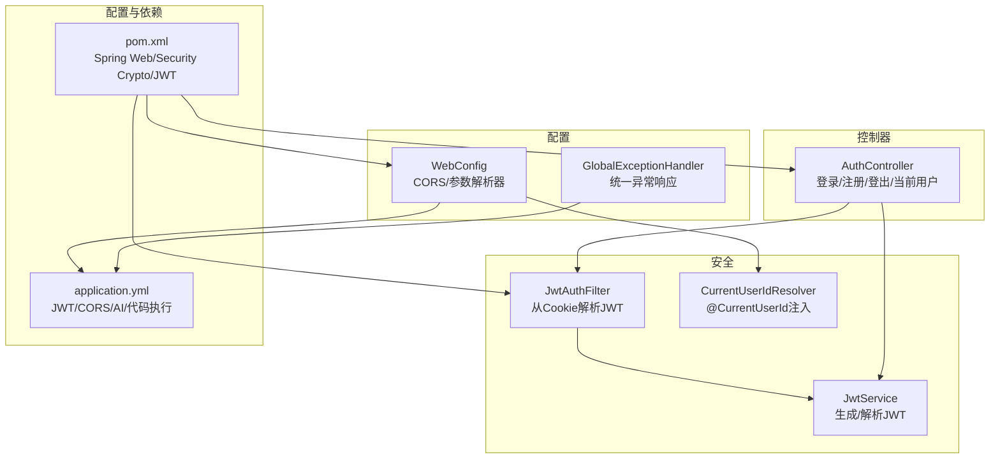
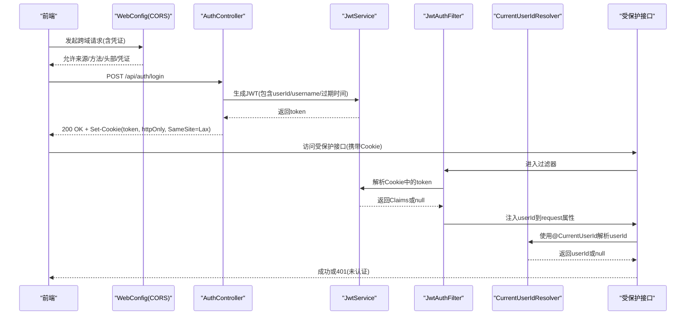
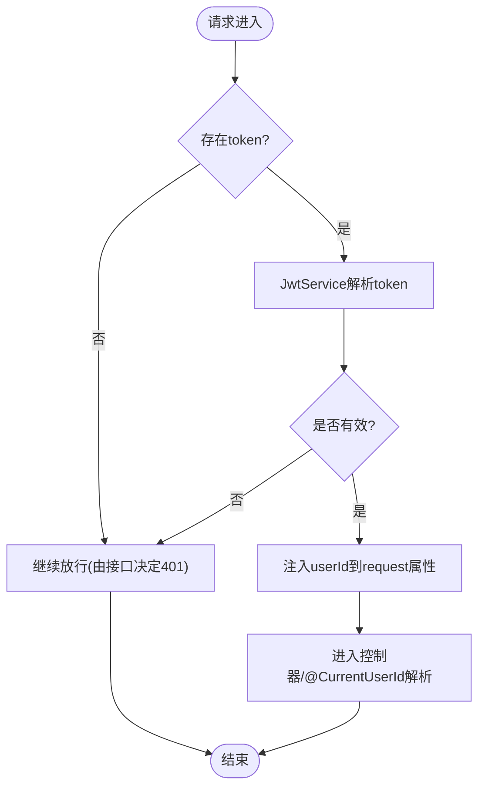
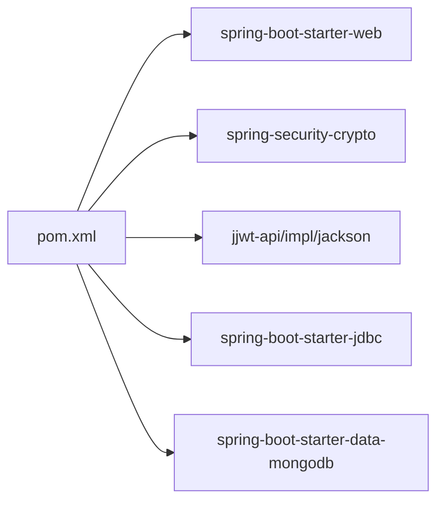

# 安全配置

<cite>
**本文引用的文件**
- [WebConfig.java](file://backend/src/main/java/com/suanfa/config/WebConfig.java)
- [GlobalExceptionHandler.java](file://backend/src/main/java/com/suanfa/config/GlobalExceptionHandler.java)
- [application.yml](file://backend/src/main/resources/application.yml)
- [JwtAuthFilter.java](file://backend/src/main/java/com/suanfa/security/JwtAuthFilter.java)
- [JwtService.java](file://backend/src/main/java/com/suanfa/security/JwtService.java)
- [CurrentUserId.java](file://backend/src/main/java/com/suanfa/security/CurrentUserId.java)
- [CurrentUserIdResolver.java](file://backend/src/main/java/com/suanfa/security/CurrentUserIdResolver.java)
- [AuthController.java](file://backend/src/main/java/com/suanfa/controller/AuthController.java)
- [pom.xml](file://backend/pom.xml)
</cite>

## 目录
1. [简介](#简介)
2. [项目结构](#项目结构)
3. [核心组件](#核心组件)
4. [架构总览](#架构总览)
5. [详细组件分析](#详细组件分析)
6. [依赖分析](#依赖分析)
7. [性能考虑](#性能考虑)
8. [故障排查指南](#故障排查指南)
9. [结论](#结论)
10. [附录](#附录)

## 简介
本文件聚焦后端的安全配置与防护机制，覆盖跨域资源共享（CORS）策略、全局异常处理、认证与授权流程、JWT 密钥与过期时间、会话 Cookie 设置、输入校验与输出编码、生产环境安全建议、性能调优与安全审计要点，以及常见安全问题的排查方法。目标是帮助开发者快速理解并正确配置系统的安全能力，同时提供可操作的排障指引。

## 项目结构
后端采用 Spring Boot 模块化组织：
- 配置层：WebConfig（CORS）、GlobalExceptionHandler（统一异常）
- 安全层：JwtAuthFilter（请求级解析 JWT）、JwtService（签发与解析）、CurrentUserIdResolver（参数注入）
- 控制器层：AuthController（登录/注册/登出/当前用户）
- 应用配置：application.yml（JWT、CORS、AI、代码执行等）
- 依赖管理：pom.xml（Spring Web、JDBC、MongoDB、Security Crypto、JWT）

图表来源
- [WebConfig.java:13-44](file://backend/src/main/java/com/suanfa/config/WebConfig.java#L13-L44)
- [GlobalExceptionHandler.java:21-67](file://backend/src/main/java/com/suanfa/config/GlobalExceptionHandler.java#L21-L67)
- [JwtAuthFilter.java:19-47](file://backend/src/main/java/com/suanfa/security/JwtAuthFilter.java#L19-L47)
- [JwtService.java:15-54](file://backend/src/main/java/com/suanfa/security/JwtService.java#L15-L54)
- [CurrentUserIdResolver.java:12-26](file://backend/src/main/java/com/suanfa/security/CurrentUserIdResolver.java#L12-L26)
- [AuthController.java:16-91](file://backend/src/main/java/com/suanfa/controller/AuthController.java#L16-L91)
- [application.yml:19-49](file://backend/src/main/resources/application.yml#L19-L49)
- [pom.xml:24-78](file://backend/pom.xml#L24-L78)

章节来源
- [WebConfig.java:13-44](file://backend/src/main/java/com/suanfa/config/WebConfig.java#L13-L44)
- [application.yml:19-49](file://backend/src/main/resources/application.yml#L19-L49)

## 核心组件
- CORS 配置（WebConfig）：通过 allowedOriginPatterns 精确控制允许的域名模式；允许 GET/POST/PUT/DELETE/OPTIONS；允许携带凭证；预检缓存时长 3600 秒。开发默认宽松，生产需收紧为显式域名列表。
- 全局异常处理（GlobalExceptionHandler）：将路由级错误（405/404/400）与业务异常统一转为 JSON 响应，避免被兜底 500 吞掉，便于前端定位问题。
- 认证与授权（JwtAuthFilter + JwtService + CurrentUserIdResolver）：从 httpOnly Cookie 中读取 token，解析后注入 userId；受保护接口通过 @CurrentUserId 参数获取用户身份，未认证时返回 401。
- 会话与会话 Cookie（AuthController）：登录成功后写入 httpOnly、SameSite=Lax 的 Cookie；登出清空 Cookie。
- 应用配置（application.yml）：集中管理 JWT 密钥、过期时间、CORS 白名单、AI 与代码执行限流等安全相关参数。

章节来源
- [WebConfig.java:13-44](file://backend/src/main/java/com/suanfa/config/WebConfig.java#L13-L44)
- [GlobalExceptionHandler.java:21-67](file://backend/src/main/java/com/suanfa/config/GlobalExceptionHandler.java#L21-L67)
- [JwtAuthFilter.java:19-47](file://backend/src/main/java/com/suanfa/security/JwtAuthFilter.java#L19-L47)
- [JwtService.java:15-54](file://backend/src/main/java/com/suanfa/security/JwtService.java#L15-L54)
- [CurrentUserIdResolver.java:12-26](file://backend/src/main/java/com/suanfa/security/CurrentUserIdResolver.java#L12-L26)
- [AuthController.java:16-91](file://backend/src/main/java/com/suanfa/controller/AuthController.java#L16-L91)
- [application.yml:19-49](file://backend/src/main/resources/application.yml#L19-L49)

## 架构总览
下图展示一次“登录 → 后续受保护请求”的完整调用链，包括 CORS 放行、JWT 签发与存储、过滤器解析、参数注入与鉴权。

图表来源
- [WebConfig.java:33-44](file://backend/src/main/java/com/suanfa/config/WebConfig.java#L33-L44)
- [AuthController.java:43-51](file://backend/src/main/java/com/suanfa/controller/AuthController.java#L43-L51)
- [JwtService.java:28-36](file://backend/src/main/java/com/suanfa/security/JwtService.java#L28-L36)
- [JwtAuthFilter.java:31-47](file://backend/src/main/java/com/suanfa/security/JwtAuthFilter.java#L31-L47)
- [CurrentUserIdResolver.java:21-26](file://backend/src/main/java/com/suanfa/security/CurrentUserIdResolver.java#L21-L26)

## 详细组件分析

### 跨域资源共享（CORS）配置
- 允许的来源：通过环境变量 suanfa.cors.allowed-origins 传入逗号分隔的域名列表；开发环境默认全开，生产必须替换为显式域名。
- 允许的方法：GET、POST、PUT、DELETE、OPTIONS。
- 允许的头部：全部允许（*）。
- 凭证：允许携带 Cookie/Authorization 等凭证。
- 预检缓存：maxAge=3600 秒，减少浏览器预检次数。
- 路径范围：/api/**。

注意：使用 allowedOriginPatterns 而非 allowedOrigins，以兼容 allowCredentials(true) 与通配行为。

章节来源
- [WebConfig.java:13-44](file://backend/src/main/java/com/suanfa/config/WebConfig.java#L13-L44)
- [application.yml:25-27](file://backend/src/main/resources/application.yml#L25-L27)

### 全局异常处理机制
- 400 非法参数：IllegalArgumentException → 400 + 消息。
- 405 方法不支持：HttpRequestMethodNotSupportedException → 405 + 支持方法提示。
- 404 接口不存在：NoResourceFoundException/NoHandlerFoundException → 404 + 提示。
- 400 请求体/参数解析失败：HttpMessageNotReadableException/MissingServletRequestParameterException → 400 + 简要原因。
- 其他异常：兜底 500 + 类名提示，并记录错误日志。

该机制确保路由级错误不被吞掉，便于前端与运维快速定位。

章节来源
- [GlobalExceptionHandler.java:21-67](file://backend/src/main/java/com/suanfa/config/GlobalExceptionHandler.java#L21-L67)

### 认证与授权流程（JWT + Cookie）
- 登录：验证用户名/密码，签发 JWT，写入 httpOnly Cookie（SameSite=Lax），返回用户信息。
- 受保护接口：JwtAuthFilter 从 Cookie 解析 token，若有效则将 userId 注入 request；@CurrentUserId 解析为 null 表示未认证，接口应返回 401。
- 登出：清空 Cookie。

图表来源
- [JwtAuthFilter.java:31-47](file://backend/src/main/java/com/suanfa/security/JwtAuthFilter.java#L31-L47)
- [JwtService.java:39-54](file://backend/src/main/java/com/suanfa/security/JwtService.java#L39-L54)
- [CurrentUserIdResolver.java:21-26](file://backend/src/main/java/com/suanfa/security/CurrentUserIdResolver.java#L21-L26)
- [AuthController.java:60-71](file://backend/src/main/java/com/suanfa/controller/AuthController.java#L60-L71)

章节来源
- [AuthController.java:28-88](file://backend/src/main/java/com/suanfa/controller/AuthController.java#L28-L88)
- [JwtAuthFilter.java:19-47](file://backend/src/main/java/com/suanfa/security/JwtAuthFilter.java#L19-L47)
- [JwtService.java:15-54](file://backend/src/main/java/com/suanfa/security/JwtService.java#L15-L54)
- [CurrentUserId.java:8-15](file://backend/src/main/java/com/suanfa/security/CurrentUserId.java#L8-L15)
- [CurrentUserIdResolver.java:12-26](file://backend/src/main/java/com/suanfa/security/CurrentUserIdResolver.java#L12-L26)

### 应用配置文件中的安全相关参数
- JWT 密钥与过期时间：suanfa.jwt.secret（生产必须通过环境变量覆盖）、suanfa.jwt.expiry-days（Cookie 有效期天数）。
- CORS 白名单：suanfa.cors.allowed-origins（开发默认宽松，生产改为显式域名）。
- AI 与代码执行限流：suanfa.ai.rate-per-minute、suanfa.code.rate-per-minute 等，用于防刷与资源保护。
- 日志级别：logging.level.root/com.suanfa，便于调试与审计。

章节来源
- [application.yml:19-49](file://backend/src/main/resources/application.yml#L19-L49)
- [application.yml:98-102](file://backend/src/main/resources/application.yml#L98-L102)

### 安全头设置、输入验证、输出编码
- 安全头：当前未启用 Spring Security 或自定义安全头配置；建议在生产网关/反向代理层添加严格的安全头（如 CSP、X-Content-Type-Options、Referrer-Policy、Permissions-Policy 等）。
- 输入验证：当前未引入 Bean Validation；建议在 DTO 上增加注解（如 @NotBlank、@Size、@Pattern）并在 Controller 使用 @Valid 进行校验。
- 输出编码：Jackson 已配置 non_null 字段省略；建议开启 XSS 转义或使用模板引擎自动转义，防止输出注入。

章节来源
- [application.yml:15-16](file://backend/src/main/resources/application.yml#L15-L16)

### 生产环境安全配置建议
- 强制 HTTPS：在反向代理层启用 TLS，并启用 HSTS。
- 收紧 CORS：仅允许实际前端域名，禁止通配符；必要时限制 Referer/Origin。
- 强化 Cookie：保持 httpOnly、SameSite=Lax（或 Strict），必要时启用 Secure；合理设置 Max-Age。
- 密钥管理：JWT secret 必须来自环境变量或密钥管理服务，禁止硬编码。
- 限流与熔断：对登录、注册、AI 对话、代码执行等敏感接口实施速率限制与熔断降级。
- 审计与监控：集中日志（JSON 格式）、关键操作审计、告警阈值与慢查询监控。
- 最小权限：数据库账号、第三方服务凭据按最小权限原则分配。

[本节为通用建议，不直接引用具体文件]

### 性能调优与安全审计配置
- CORS 预检缓存：maxAge=3600 已降低预检开销；生产可根据域名数量评估是否需要更大值。
- JWT 解析：仅在需要时解析，避免重复计算；可在网关层做一次性校验。
- 日志级别：生产建议 root=info，com.suanfa=warn 或 info；敏感信息脱敏。
- 审计：记录登录/登出、配置变更、AI 调用、代码执行等关键事件，保留必要上下文（IP、UA、耗时）。

章节来源
- [WebConfig.java:33-44](file://backend/src/main/java/com/suanfa/config/WebConfig.java#L33-L44)
- [application.yml:98-102](file://backend/src/main/resources/application.yml#L98-L102)

## 依赖分析
- Spring Web：提供 MVC、CORS、异常处理等基础能力。
- Spring Security Crypto：用于密码哈希（BCrypt）。
- JWT（jjwt）：用于令牌签发与解析。
- JDBC/MongoDB：数据存储（与安全性间接相关，如连接串、认证）。

图表来源
- [pom.xml:24-78](file://backend/pom.xml#L24-L78)

章节来源
- [pom.xml:24-78](file://backend/pom.xml#L24-L78)

## 性能考虑
- CORS 预检：合理使用 maxAge，避免频繁 OPTIONS 请求。
- JWT 解析：尽量在过滤器中单次解析并复用；避免在热点路径重复签名校验。
- 限流：对登录、注册、AI 对话、代码执行等接口实施每分钟/每秒限制，防止滥用。
- 超时：对外部依赖（AI 中转站、数据库）设置合理超时，避免线程阻塞。
- 日志：生产关闭 debug 级别，减少 I/O 开销。

[本节为通用指导，不直接引用具体文件]

## 故障排查指南
- 跨域失败（CORS）
  - 现象：浏览器报跨域错误或预检失败。
  - 排查：检查 suanfa.cors.allowed-origins 是否包含前端域名；确认 allowCredentials=true 且使用了 allowedOriginPatterns；核对请求方法与头部是否在允许范围内。
  - 参考：[WebConfig.java:33-44](file://backend/src/main/java/com/suanfa/config/WebConfig.java#L33-L44)、[application.yml:25-27](file://backend/src/main/resources/application.yml#L25-L27)

- 登录成功但后续请求 401
  - 现象：登录后访问受保护接口返回未登录。
  - 排查：确认 Cookie 是否被正确设置（httpOnly、SameSite、Path）；浏览器是否携带 Cookie；JwtAuthFilter 是否正确解析；@CurrentUserId 是否为 null。
  - 参考：[AuthController.java:73-88](file://backend/src/main/java/com/suanfa/controller/AuthController.java#L73-L88)、[JwtAuthFilter.java:31-47](file://backend/src/main/java/com/suanfa/security/JwtAuthFilter.java#L31-L47)、[CurrentUserIdResolver.java:21-26](file://backend/src/main/java/com/suanfa/security/CurrentUserIdResolver.java#L21-L26)

- 接口 405/404/400
  - 现象：方法不对、接口不存在、请求体解析失败。
  - 排查：查看 GlobalExceptionHandler 的日志与返回消息；核对前端请求路径与方法；检查请求体结构与必填参数。
  - 参考：[GlobalExceptionHandler.java:31-51](file://backend/src/main/java/com/suanfa/config/GlobalExceptionHandler.java#L31-L51)

- JWT 无效或过期
  - 现象：解析失败或返回 null。
  - 排查：检查 suanfa.jwt.secret 是否与签发一致；确认 expiry-days 设置；核对客户端是否发送了正确的 Cookie。
  - 参考：[JwtService.java:21-36](file://backend/src/main/java/com/suanfa/security/JwtService.java#L21-L36)、[application.yml:19-24](file://backend/src/main/resources/application.yml#L19-L24)

- 登录/注册失败
  - 现象：用户名已存在、用户名或密码错误。
  - 排查：查看 AuthController 返回码与消息；检查 AuthService 实现（不在本文档范围内）。
  - 参考：[AuthController.java:28-51](file://backend/src/main/java/com/suanfa/controller/AuthController.java#L28-L51)

章节来源
- [WebConfig.java:33-44](file://backend/src/main/java/com/suanfa/config/WebConfig.java#L33-L44)
- [GlobalExceptionHandler.java:31-58](file://backend/src/main/java/com/suanfa/config/GlobalExceptionHandler.java#L31-L58)
- [JwtAuthFilter.java:31-47](file://backend/src/main/java/com/suanfa/security/JwtAuthFilter.java#L31-L47)
- [JwtService.java:21-54](file://backend/src/main/java/com/suanfa/security/JwtService.java#L21-L54)
- [AuthController.java:28-88](file://backend/src/main/java/com/suanfa/controller/AuthController.java#L28-L88)

## 结论
本项目实现了基于 JWT + httpOnly Cookie 的无状态认证，并通过 WebConfig 配置了灵活的 CORS 策略；GlobalExceptionHandler 提供了统一、友好的错误响应。应用配置集中在 application.yml，便于环境与参数化管理。生产环境建议结合反向代理加固安全头、收紧 CORS、强化密钥管理与限流策略，并完善审计与监控。

[本节为总结性内容，不直接引用具体文件]

## 附录
- 关键配置项速查
  - suanfa.jwt.secret：JWT 签名密钥（生产必须环境变量覆盖）
  - suanfa.jwt.expiry-days：Cookie 有效期（天）
  - suanfa.cors.allowed-origins：允许的源（开发默认宽松，生产改为显式域名）
  - suanfa.ai.rate-per-minute：AI 助教每分钟请求上限
  - suanfa.code.compile-timeout-seconds / run-timeout-seconds：代码执行超时
  - logging.level.*：日志级别

章节来源
- [application.yml:19-49](file://backend/src/main/resources/application.yml#L19-L49)
- [application.yml:98-102](file://backend/src/main/resources/application.yml#L98-L102)