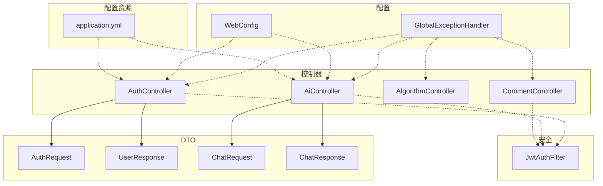
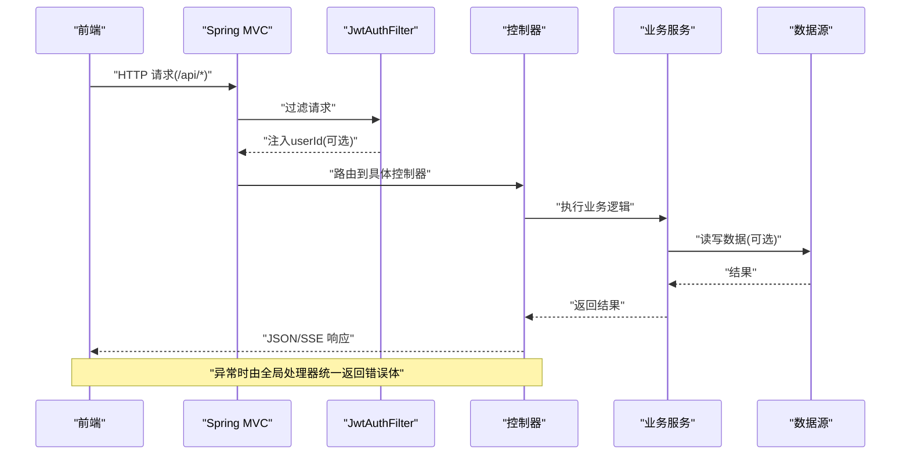
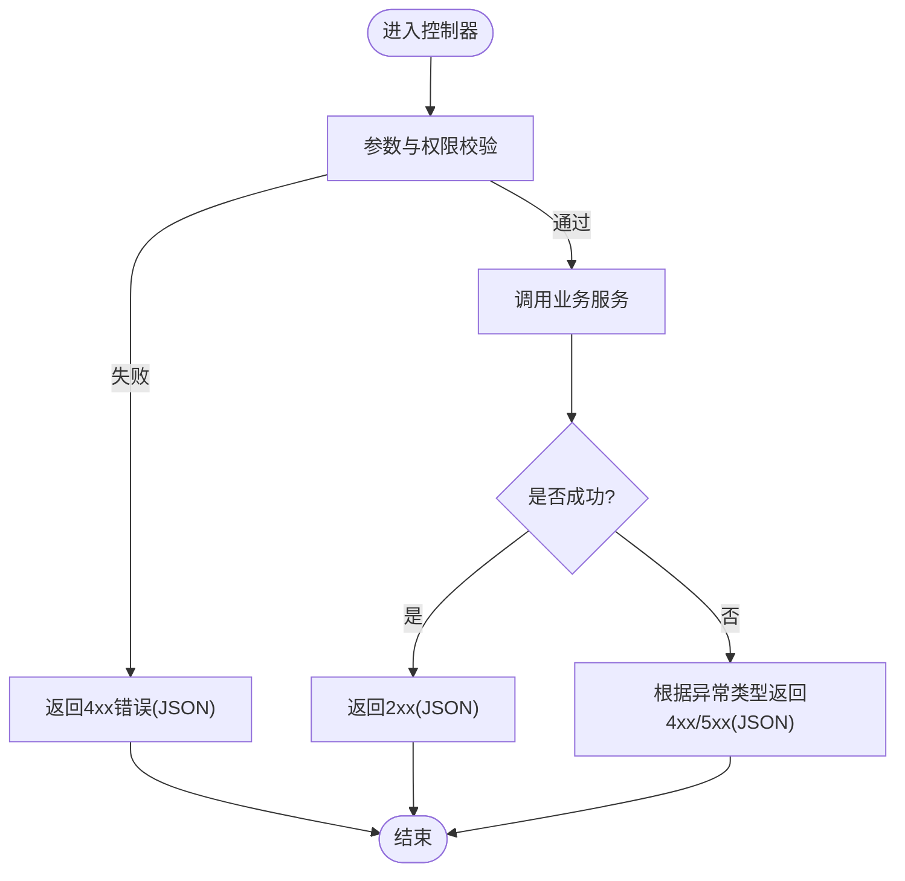
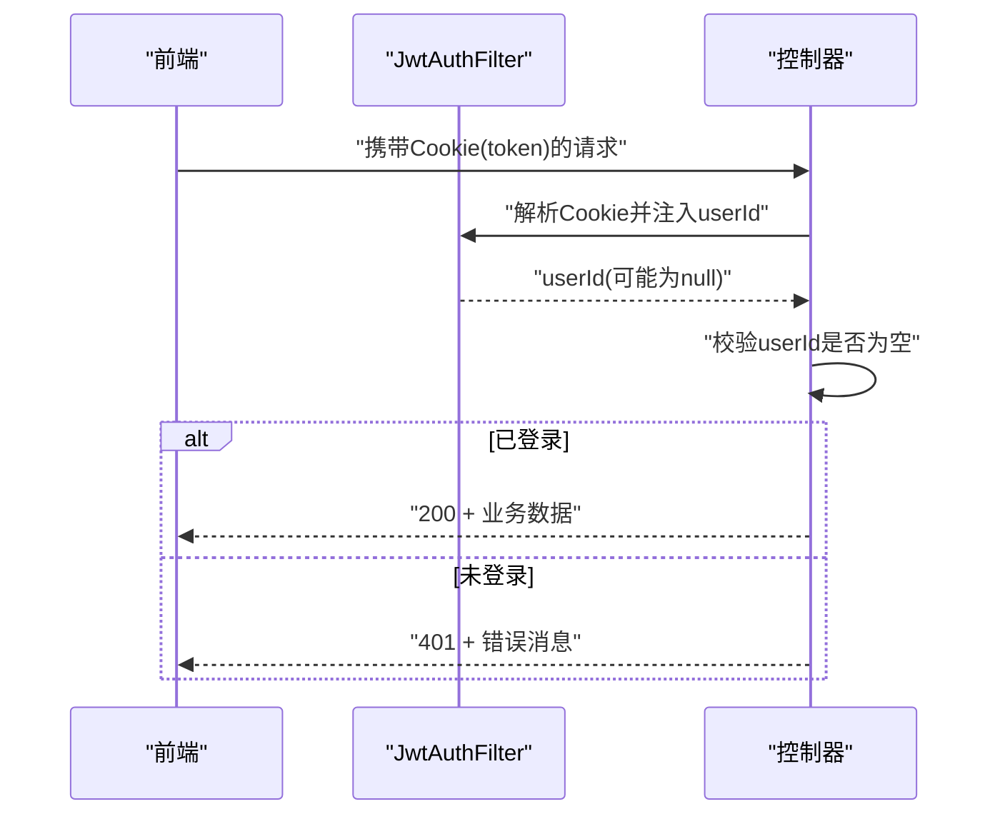
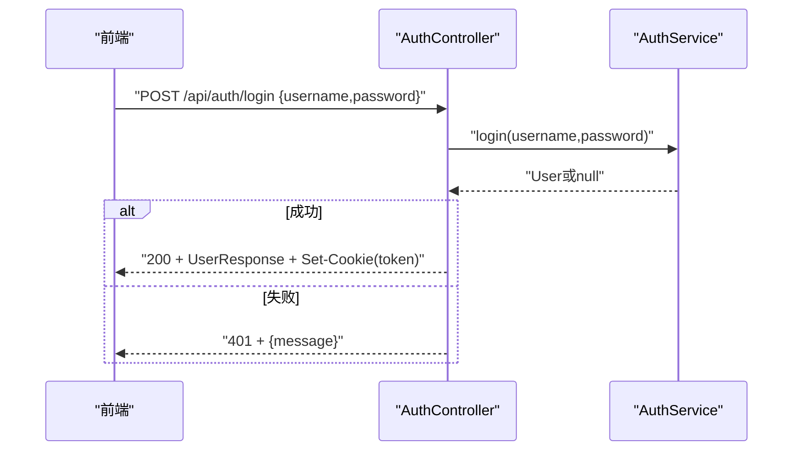
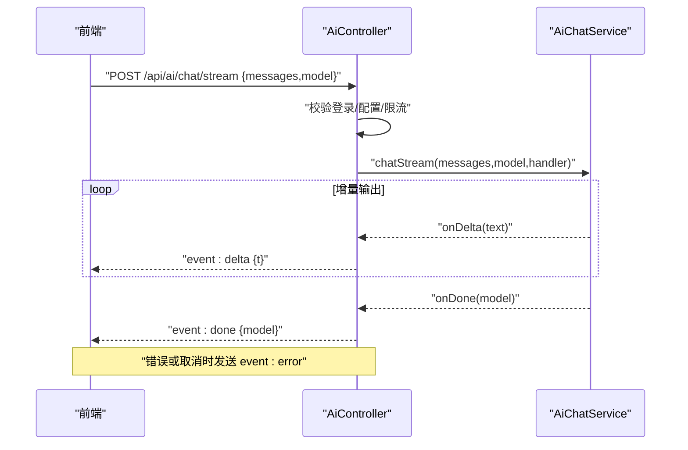
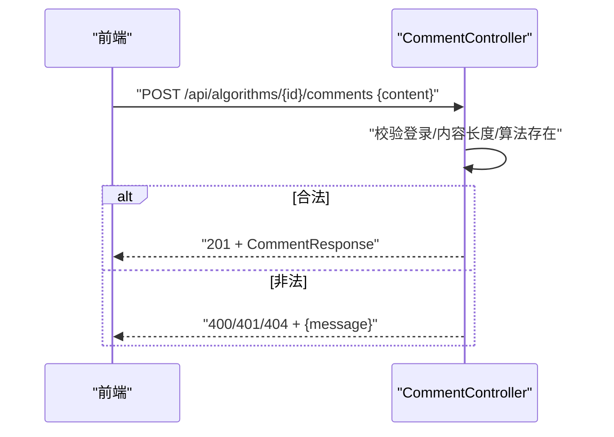
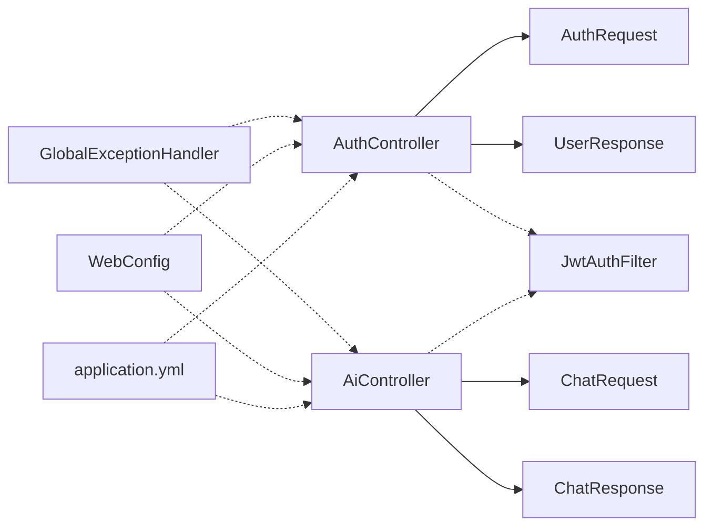

# API设计规范

<cite>
**本文引用的文件**
- [GlobalExceptionHandler.java](file://backend/src/main/java/com/suanfa/config/GlobalExceptionHandler.java)
- [WebConfig.java](file://backend/src/main/java/com/suanfa/config/WebConfig.java)
- [JwtAuthFilter.java](file://backend/src/main/java/com/suanfa/security/JwtAuthFilter.java)
- [AuthController.java](file://backend/src/main/java/com/suanfa/controller/AuthController.java)
- [AiController.java](file://backend/src/main/java/com/suanfa/controller/AiController.java)
- [AlgorithmController.java](file://backend/src/main/java/com/suanfa/controller/AlgorithmController.java)
- [CommentController.java](file://backend/src/main/java/com/suanfa/controller/CommentController.java)
- [AuthRequest.java](file://backend/src/main/java/com/suanfa/dto/AuthRequest.java)
- [UserResponse.java](file://backend/src/main/java/com/suanfa/dto/UserResponse.java)
- [ChatRequest.java](file://backend/src/main/java/com/suanfa/dto/ChatRequest.java)
- [ChatResponse.java](file://backend/src/main/java/com/suanfa/dto/ChatResponse.java)
- [application.yml](file://backend/src/main/resources/application.yml)
</cite>

## 目录
1. [简介](#简介)
2. [项目结构](#项目结构)
3. [核心组件](#核心组件)
4. [架构总览](#架构总览)
5. [详细组件分析](#详细组件分析)
6. [依赖关系分析](#依赖关系分析)
7. [性能考虑](#性能考虑)
8. [故障排查指南](#故障排查指南)
9. [结论](#结论)
10. [附录](#附录)

## 简介
本规范面向前后端协作，统一RESTful接口设计、错误处理、认证鉴权、数据格式与版本策略，确保API稳定、可维护、可扩展。本文基于后端实现提炼出通用约定，并给出认证、AI对话、用户/资源管理等典型场景的示例与最佳实践。

## 项目结构
后端采用Spring MVC分层：
- 控制器层：按领域划分（认证、AI、算法、评论等）
- DTO层：请求/响应对象
- 安全层：JWT过滤器与参数解析
- 配置层：全局异常、CORS、应用配置
- 资源层：数据库初始化与外部服务配置

图示来源
- [AuthController.java:1-94](file://backend/src/main/java/com/suanfa/controller/AuthController.java#L1-L94)
- [AiController.java:1-375](file://backend/src/main/java/com/suanfa/controller/AiController.java#L1-L375)
- [AlgorithmController.java:1-32](file://backend/src/main/java/com/suanfa/controller/AlgorithmController.java#L1-L32)
- [CommentController.java:1-96](file://backend/src/main/java/com/suanfa/controller/CommentController.java#L1-L96)
- [JwtAuthFilter.java:1-49](file://backend/src/main/java/com/suanfa/security/JwtAuthFilter.java#L1-L49)
- [GlobalExceptionHandler.java:1-69](file://backend/src/main/java/com/suanfa/config/GlobalExceptionHandler.java#L1-L69)
- [WebConfig.java:1-46](file://backend/src/main/java/com/suanfa/config/WebConfig.java#L1-L46)
- [application.yml:1-102](file://backend/src/main/resources/application.yml#L1-L102)

章节来源
- [AuthController.java:1-94](file://backend/src/main/java/com/suanfa/controller/AuthController.java#L1-L94)
- [AiController.java:1-375](file://backend/src/main/java/com/suanfa/controller/AiController.java#L1-L375)
- [GlobalExceptionHandler.java:1-69](file://backend/src/main/java/com/suanfa/config/GlobalExceptionHandler.java#L1-L69)
- [WebConfig.java:1-46](file://backend/src/main/java/com/suanfa/config/WebConfig.java#L1-L46)
- [application.yml:1-102](file://backend/src/main/resources/application.yml#L1-L102)

## 核心组件
- 统一错误处理：通过全局异常处理器将各类异常转换为统一的JSON错误体，保证前端一致的错误处理体验。
- 认证鉴权：基于httpOnly Cookie的JWT，过滤器解析后注入当前用户ID，控制器按需校验。
- CORS跨域：为/api/**开放必要的跨域能力，支持凭证模式。
- AI流式对话：SSE事件流，包含meta/delta/reasoning/done/error事件，配合限流与降级策略。
- 资源管理：算法列表/详情、评论CRUD等基础资源接口。

章节来源
- [GlobalExceptionHandler.java:1-69](file://backend/src/main/java/com/suanfa/config/GlobalExceptionHandler.java#L1-L69)
- [JwtAuthFilter.java:1-49](file://backend/src/main/java/com/suanfa/security/JwtAuthFilter.java#L1-L49)
- [WebConfig.java:1-46](file://backend/src/main/java/com/suanfa/config/WebConfig.java#L1-L46)
- [AiController.java:1-375](file://backend/src/main/java/com/suanfa/controller/AiController.java#L1-L375)

## 架构总览
整体调用链：浏览器发起HTTP请求 → Spring MVC路由到控制器 → 安全过滤器解析JWT → 业务逻辑 → 返回JSON或SSE事件流；异常由全局处理器统一收敛。

图示来源
- [JwtAuthFilter.java:1-49](file://backend/src/main/java/com/suanfa/security/JwtAuthFilter.java#L1-L49)
- [GlobalExceptionHandler.java:1-69](file://backend/src/main/java/com/suanfa/config/GlobalExceptionHandler.java#L1-L69)
- [AuthController.java:1-94](file://backend/src/main/java/com/suanfa/controller/AuthController.java#L1-L94)
- [AiController.java:1-375](file://backend/src/main/java/com/suanfa/controller/AiController.java#L1-L375)

## 详细组件分析

### RESTful接口设计原则
- URL路径命名
  - 使用小写、短横线分隔的资源名词复数形式，如 /api/algorithms、/api/comments
  - 层级清晰：资源与子资源用路径表达，如 /api/algorithms/{id}/comments
- HTTP方法约定
  - GET：读取资源
  - POST：创建资源或触发动作（如登录、聊天）
  - PUT/PATCH：更新资源（本项目以PUT为主）
  - DELETE：删除资源
- 状态码标准
  - 2xx：成功（200 OK、201 Created、204 No Content）
  - 4xx：客户端错误（400 Bad Request、401 Unauthorized、403 Forbidden、404 Not Found、405 Method Not Allowed、429 Too Many Requests）
  - 5xx：服务端错误（500 Internal Server Error、502 Bad Gateway、503 Service Unavailable）
- 分页与查询
  - 查询参数使用小写下划线或驼峰均可，建议统一为小写下划线：page、size、sort、filter
  - 列表接口默认返回数组；分页响应建议包含 data、total、page、size 字段（本项目部分接口直接返回列表，后续可按需扩展）
- 版本管理
  - 建议在URL中引入版本前缀：/api/v1/...，便于向后兼容与灰度发布
  - 头部也可携带 X-API-Version，但URL更直观且易缓存

章节来源
- [AlgorithmController.java:1-32](file://backend/src/main/java/com/suanfa/controller/AlgorithmController.java#L1-L32)
- [CommentController.java:1-96](file://backend/src/main/java/com/suanfa/controller/CommentController.java#L1-L96)
- [GlobalExceptionHandler.java:1-69](file://backend/src/main/java/com/suanfa/config/GlobalExceptionHandler.java#L1-L69)

### 请求与响应格式规范
- JSON数据结构
  - 请求体使用驼峰命名，如 username、password、messages、model
  - 响应体尽量精简，仅返回必要字段；复杂对象拆分为DTO
- 字段命名约定
  - 时间字段统一为 createdAt、updatedAt（字符串ISO格式或时间戳，建议ISO）
  - 标识符统一为 id、algorithmId、userId 等
- 分页参数定义
  - page：页码（从1开始）
  - size：每页条数
  - sort：排序字段与方向，如 field:asc|desc
  - filter：结构化过滤条件，如 {category:"sorting"}
- 统一错误响应
  - 推荐结构：{ code, message, details }
  - 本项目全局异常返回 { message }；业务控制器也返回 { message } 的结构，建议逐步统一到统一结构

章节来源
- [AuthRequest.java:1-6](file://backend/src/main/java/com/suanfa/dto/AuthRequest.java#L1-L6)
- [UserResponse.java:1-6](file://backend/src/main/java/com/suanfa/dto/UserResponse.java#L1-L6)
- [ChatRequest.java:1-16](file://backend/src/main/java/com/suanfa/dto/ChatRequest.java#L1-L16)
- [ChatResponse.java:1-10](file://backend/src/main/java/com/suanfa/dto/ChatResponse.java#L1-L10)
- [GlobalExceptionHandler.java:1-69](file://backend/src/main/java/com/suanfa/config/GlobalExceptionHandler.java#L1-L69)

### 错误处理规范
- 全局异常处理器负责捕获常见异常并返回统一JSON错误体，保持前端一致的错误展示逻辑
- 控制器内对业务校验失败进行显式返回（如未登录、参数非法、权限不足），避免被兜底500吞掉
- 对于第三方服务异常（如上游AI不可用），返回明确的状态码与友好提示，便于前端降级

图示来源
- [GlobalExceptionHandler.java:1-69](file://backend/src/main/java/com/suanfa/config/GlobalExceptionHandler.java#L1-L69)
- [AuthController.java:1-94](file://backend/src/main/java/com/suanfa/controller/AuthController.java#L1-L94)
- [AiController.java:1-375](file://backend/src/main/java/com/suanfa/controller/AiController.java#L1-L375)

章节来源
- [GlobalExceptionHandler.java:1-69](file://backend/src/main/java/com/suanfa/config/GlobalExceptionHandler.java#L1-L69)
- [AuthController.java:1-94](file://backend/src/main/java/com/suanfa/controller/AuthController.java#L1-L94)
- [AiController.java:1-375](file://backend/src/main/java/com/suanfa/controller/AiController.java#L1-L375)

### 认证与鉴权
- 认证方式：登录成功后设置httpOnly Cookie（token），后续请求自动携带
- 鉴权流程：过滤器解析Cookie中的JWT，注入userId；受保护接口在控制器层检查userId是否为空，为空则返回401
- 跨域：允许带凭据的跨域访问，开发环境默认宽松，生产环境应限制白名单

图示来源
- [JwtAuthFilter.java:1-49](file://backend/src/main/java/com/suanfa/security/JwtAuthFilter.java#L1-L49)
- [AuthController.java:1-94](file://backend/src/main/java/com/suanfa/controller/AuthController.java#L1-L94)
- [WebConfig.java:1-46](file://backend/src/main/java/com/suanfa/config/WebConfig.java#L1-L46)

章节来源
- [JwtAuthFilter.java:1-49](file://backend/src/main/java/com/suanfa/security/JwtAuthFilter.java#L1-L49)
- [AuthController.java:1-94](file://backend/src/main/java/com/suanfa/controller/AuthController.java#L1-L94)
- [WebConfig.java:1-46](file://backend/src/main/java/com/suanfa/config/WebConfig.java#L1-L46)

### 认证API示例（注册/登录/登出/当前用户）
- 注册：POST /api/auth/register，请求体包含用户名与密码；成功返回用户信息并设置Cookie
- 登录：POST /api/auth/login，验证通过后设置Cookie并返回用户信息
- 登出：POST /api/auth/logout，清除Cookie
- 当前用户：GET /api/auth/me，需要有效Cookie；无则返回401

图示来源
- [AuthController.java:1-94](file://backend/src/main/java/com/suanfa/controller/AuthController.java#L1-L94)
- [AuthRequest.java:1-6](file://backend/src/main/java/com/suanfa/dto/AuthRequest.java#L1-L6)
- [UserResponse.java:1-6](file://backend/src/main/java/com/suanfa/dto/UserResponse.java#L1-L6)

章节来源
- [AuthController.java:1-94](file://backend/src/main/java/com/suanfa/controller/AuthController.java#L1-L94)

### AI对话API示例（一次性/流式）
- 一次性对话：POST /api/ai/chat，返回回复、模型名与引用
- 流式对话：POST /api/ai/chat/stream，SSE事件流：meta → delta* → done | error
- 模型与状态：GET /api/ai/status、GET /api/ai/models、管理员专用 /api/ai/upstream-models

图示来源
- [AiController.java:1-375](file://backend/src/main/java/com/suanfa/controller/AiController.java#L1-L375)
- [ChatRequest.java:1-16](file://backend/src/main/java/com/suanfa/dto/ChatRequest.java#L1-L16)
- [ChatResponse.java:1-10](file://backend/src/main/java/com/suanfa/dto/ChatResponse.java#L1-L10)

章节来源
- [AiController.java:1-375](file://backend/src/main/java/com/suanfa/controller/AiController.java#L1-L375)

### 用户管理与资源API示例（算法/评论）
- 算法列表：GET /api/algorithms?category=...
- 算法详情：GET /api/algorithms/{id}
- 评论列表：GET /api/algorithms/{algorithmId}/comments
- 发表评论：POST /api/algorithms/{algorithmId}/comments（需登录）
- 删除评论：DELETE /api/comments/{id}（仅本人可删）

图示来源
- [CommentController.java:1-96](file://backend/src/main/java/com/suanfa/controller/CommentController.java#L1-L96)
- [AlgorithmController.java:1-32](file://backend/src/main/java/com/suanfa/controller/AlgorithmController.java#L1-L32)

章节来源
- [CommentController.java:1-96](file://backend/src/main/java/com/suanfa/controller/CommentController.java#L1-L96)
- [AlgorithmController.java:1-32](file://backend/src/main/java/com/suanfa/controller/AlgorithmController.java#L1-L32)

## 依赖关系分析
- 控制器依赖DTO与安全注解；安全过滤器注入当前用户ID；全局异常处理器统一收敛异常；CORS配置影响跨域行为
- 配置项集中在application.yml，包括JWT、CORS、AI中转站、限流等

图示来源
- [AuthController.java:1-94](file://backend/src/main/java/com/suanfa/controller/AuthController.java#L1-L94)
- [AiController.java:1-375](file://backend/src/main/java/com/suanfa/controller/AiController.java#L1-L375)
- [JwtAuthFilter.java:1-49](file://backend/src/main/java/com/suanfa/security/JwtAuthFilter.java#L1-L49)
- [GlobalExceptionHandler.java:1-69](file://backend/src/main/java/com/suanfa/config/GlobalExceptionHandler.java#L1-L69)
- [WebConfig.java:1-46](file://backend/src/main/java/com/suanfa/config/WebConfig.java#L1-L46)
- [application.yml:1-102](file://backend/src/main/resources/application.yml#L1-L102)

章节来源
- [application.yml:1-102](file://backend/src/main/resources/application.yml#L1-L102)

## 性能考虑
- 流式对话线程池：SSE长时间占用线程，使用有界线程池与直连队列，满负载直接拒绝而非排队，避免雪崩
- 限流：AI与代码执行均提供每分钟限流，防止滥用
- 超时与降级：AI请求设置超时与温度等参数；上游不可用时返回503，前端可降级本地答疑
- CORS与缓存：SSE禁用代理缓冲与缓存头，确保实时性

章节来源
- [AiController.java:1-375](file://backend/src/main/java/com/suanfa/controller/AiController.java#L1-L375)
- [application.yml:1-102](file://backend/src/main/resources/application.yml#L1-L102)

## 故障排查指南
- 405方法不支持：检查请求方法与路径是否匹配
- 404接口不存在：确认后端版本与前端路径一致
- 400请求体解析失败：检查JSON结构与必填字段
- 401未登录：确认Cookie token是否存在且有效
- 429请求过多：降低频率或等待限流窗口
- 502/503上游异常：检查AI中转站配置与可用性

章节来源
- [GlobalExceptionHandler.java:1-69](file://backend/src/main/java/com/suanfa/config/GlobalExceptionHandler.java#L1-L69)
- [AiController.java:1-375](file://backend/src/main/java/com/suanfa/controller/AiController.java#L1-L375)

## 结论
本规范基于现有后端实现总结了RESTful设计、错误处理、认证鉴权、数据格式与版本策略，并结合AI流式对话、资源管理等场景给出示例与最佳实践。建议在前端侧统一封装请求、错误处理与SSE消费逻辑，遵循本规范以保证交互一致性与可维护性。

## 附录
- 安全建议
  - 生产环境务必覆盖JWT密钥与CORS白名单
  - 敏感操作增加二次确认与速率限制
  - 使用HTTPS传输，启用HttpOnly与SameSite Cookie属性
- 版本管理建议
  - URL前缀 /api/v1/ 作为主版本入口
  - 废弃接口保留过渡期并记录弃用公告
- 前后端最佳实践
  - 统一错误体结构，前端集中处理错误提示
  - 列表接口支持分页与排序；大对象按需加载
  - SSE连接建立后处理断线重连与优雅关闭