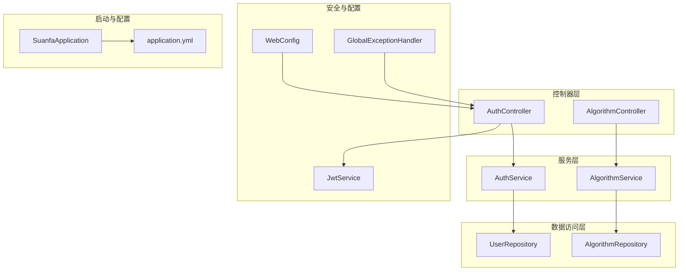
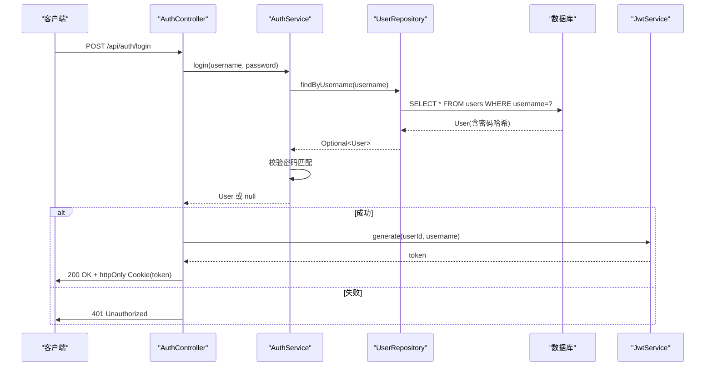
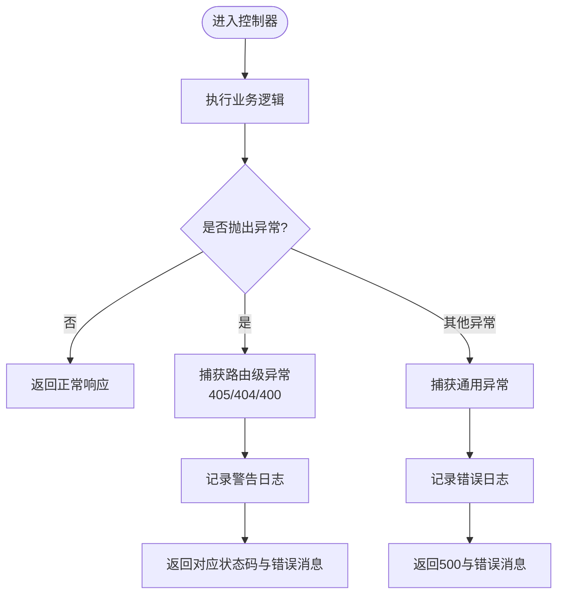
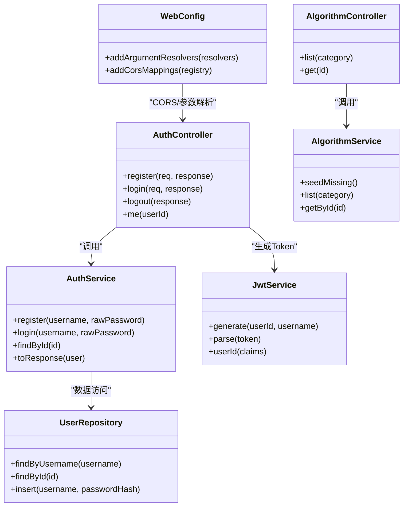

# Java编码规范

<cite>
**本文引用的文件**
- [GlobalExceptionHandler.java](file://backend/src/main/java/com/suanfa/config/GlobalExceptionHandler.java)
- [WebConfig.java](file://backend/src/main/java/com/suanfa/config/WebConfig.java)
- [SuanfaApplication.java](file://backend/src/main/java/com/suanfa/SuanfaApplication.java)
- [AuthController.java](file://backend/src/main/java/com/suanfa/controller/AuthController.java)
- [AlgorithmController.java](file://backend/src/main/java/com/suanfa/controller/AlgorithmController.java)
- [AuthService.java](file://backend/src/main/java/com/suanfa/service/AuthService.java)
- [AlgorithmService.java](file://backend/src/main/java/com/suanfa/service/AlgorithmService.java)
- [UserRepository.java](file://backend/src/main/java/com/suanfa/repository/UserRepository.java)
- [JwtService.java](file://backend/src/main/java/com/suanfa/security/JwtService.java)
- [User.java](file://backend/src/main/java/com/suanfa/entity/User.java)
- [Algorithm.java](file://backend/src/main/java/com/suanfa/entity/Algorithm.java)
- [AuthRequest.java](file://backend/src/main/java/com/suanfa/dto/AuthRequest.java)
- [UserResponse.java](file://backend/src/main/java/com/suanfa/dto/UserResponse.java)
- [application.yml](file://backend/src/main/resources/application.yml)
</cite>

## 目录
1. [简介](#简介)
2. [项目结构](#项目结构)
3. [核心组件](#核心组件)
4. [架构总览](#架构总览)
5. [详细组件分析](#详细组件分析)
6. [依赖关系分析](#依赖关系分析)
7. [性能与可维护性建议](#性能与可维护性建议)
8. [故障排查指南](#故障排查指南)
9. [结论](#结论)
10. [附录：命名与注释规范速查](#附录：命名与注释规范速查)

## 简介
本规范基于当前后端代码库的实际实现，总结并统一Java编码约定，覆盖类与方法命名、变量命名、注释规范、异常处理模式、Spring Boot最佳实践（依赖注入、参数校验、事务管理）、以及包结构与组织原则。目标是让团队在Controller、Service、Repository等分层中保持一致风格，提升可读性与可维护性。

## 项目结构
本项目采用典型的Spring Boot分层结构：
- controller：HTTP接口层，负责接收请求、组装响应、调用服务层。
- service：业务逻辑层，封装领域规则、编排多个Repository或外部服务。
- repository：数据访问层，封装数据库操作（JdbcTemplate）。
- entity/dto：实体与数据传输对象，使用record简化不可变数据模型。
- security：安全相关能力（JWT签发与解析、过滤器、用户上下文解析）。
- config：应用配置（CORS、全局异常、初始化等）。
- resources：配置文件与种子数据。

**图表来源**
- [AuthController.java:1-94](file://backend/src/main/java/com/suanfa/controller/AuthController.java#L1-L94)
- [AlgorithmController.java:1-32](file://backend/src/main/java/com/suanfa/controller/AlgorithmController.java#L1-L32)
- [AuthService.java:1-53](file://backend/src/main/java/com/suanfa/service/AuthService.java#L1-L53)
- [AlgorithmService.java:1-64](file://backend/src/main/java/com/suanfa/service/AlgorithmService.java#L1-L64)
- [UserRepository.java:1-54](file://backend/src/main/java/com/suanfa/repository/UserRepository.java#L1-L54)
- [JwtService.java:1-56](file://backend/src/main/java/com/suanfa/security/JwtService.java#L1-L56)
- [WebConfig.java:1-46](file://backend/src/main/java/com/suanfa/config/WebConfig.java#L1-L46)
- [GlobalExceptionHandler.java:1-69](file://backend/src/main/java/com/suanfa/config/GlobalExceptionHandler.java#L1-L69)
- [SuanfaApplication.java:1-22](file://backend/src/main/java/com/suanfa/SuanfaApplication.java#L1-L22)
- [application.yml:1-102](file://backend/src/main/resources/application.yml#L1-L102)

**章节来源**
- [SuanfaApplication.java:10-20](file://backend/src/main/java/com/suanfa/SuanfaApplication.java#L10-L20)
- [application.yml:1-102](file://backend/src/main/resources/application.yml#L1-L102)

## 核心组件
- 全局异常处理器：统一错误响应格式与日志记录，避免路由级异常被吞掉。
- 认证控制器与服务：注册、登录、登出、获取当前用户；JWT通过httpOnly Cookie下发。
- 算法元数据控制器与服务：提供算法列表与详情查询，支持按分类过滤。
- 数据访问：使用JdbcTemplate进行SQL操作，RowMapper映射结果。
- 安全：JWT签发与解析，CORS跨域配置，自定义参数解析器注入当前用户ID。

**章节来源**
- [GlobalExceptionHandler.java:14-69](file://backend/src/main/java/com/suanfa/config/GlobalExceptionHandler.java#L14-L69)
- [AuthController.java:15-94](file://backend/src/main/java/com/suanfa/controller/AuthController.java#L15-L94)
- [AuthService.java:10-53](file://backend/src/main/java/com/suanfa/service/AuthService.java#L10-L53)
- [AlgorithmController.java:10-32](file://backend/src/main/java/com/suanfa/controller/AlgorithmController.java#L10-L32)
- [AlgorithmService.java:13-64](file://backend/src/main/java/com/suanfa/service/AlgorithmService.java#L13-L64)
- [UserRepository.java:15-54](file://backend/src/main/java/com/suanfa/repository/UserRepository.java#L15-L54)
- [JwtService.java:14-56](file://backend/src/main/java/com/suanfa/security/JwtService.java#L14-L56)
- [WebConfig.java:13-46](file://backend/src/main/java/com/suanfa/config/WebConfig.java#L13-L46)

## 架构总览
下图展示一次“登录”请求从客户端到数据库的完整调用链，包括JWT下发与Cookie设置。

**图表来源**
- [AuthController.java:43-52](file://backend/src/main/java/com/suanfa/controller/AuthController.java#L43-L52)
- [AuthService.java:35-43](file://backend/src/main/java/com/suanfa/service/AuthService.java#L35-L43)
- [UserRepository.java:30-33](file://backend/src/main/java/com/suanfa/repository/UserRepository.java#L30-L33)
- [JwtService.java:28-37](file://backend/src/main/java/com/suanfa/security/JwtService.java#L28-L37)

## 详细组件分析

### 命名规范
- 类命名
  - 控制器：以Controller结尾，如AuthController、AlgorithmController。
  - 服务：以Service结尾，如AuthService、AlgorithmService。
  - 仓库：以Repository结尾，如UserRepository、AlgorithmRepository。
  - 实体与DTO：使用简洁名词，优先使用record表达不可变数据结构，如User、Algorithm、AuthRequest、UserResponse。
  - 安全组件：以Service或Filter结尾，如JwtService、JwtAuthFilter。
  - 配置：以Config或Properties结尾，如WebConfig、AiProperties。
- 方法命名
  - 动词+名词模式，清晰表达意图，如register、login、findById、list、getById、insertIfAbsent。
  - 布尔判断方法以is/has开头（如有），如isBlank()来自标准库。
- 变量命名
  - 字段与局部变量使用小驼峰，如username、passwordHash、allowedOrigins。
  - 常量使用全大写下划线分隔（项目中未见显式常量定义，遵循此约定即可）。
- 包命名
  - 按功能分层：controller、service、repository、entity、dto、security、config。
  - 包名与模块名一致：com.suanfa.*。

**章节来源**
- [AuthController.java:15-18](file://backend/src/main/java/com/suanfa/controller/AuthController.java#L15-L18)
- [AlgorithmController.java:10-13](file://backend/src/main/java/com/suanfa/controller/AlgorithmController.java#L10-L13)
- [AuthService.java:10-12](file://backend/src/main/java/com/suanfa/service/AuthService.java#L10-L12)
- [AlgorithmService.java:13-15](file://backend/src/main/java/com/suanfa/service/AlgorithmService.java#L13-L15)
- [UserRepository.java:15-16](file://backend/src/main/java/com/suanfa/repository/UserRepository.java#L15-L16)
- [User.java:3-5](file://backend/src/main/java/com/suanfa/entity/User.java#L3-L5)
- [Algorithm.java:3-15](file://backend/src/main/java/com/suanfa/entity/Algorithm.java#L3-L15)
- [AuthRequest.java:3-5](file://backend/src/main/java/com/suanfa/dto/AuthRequest.java#L3-L5)
- [UserResponse.java:3-5](file://backend/src/main/java/com/suanfa/dto/UserResponse.java#L3-L5)
- [JwtService.java:14-16](file://backend/src/main/java/com/suanfa/security/JwtService.java#L14-L16)
- [WebConfig.java:13-14](file://backend/src/main/java/com/suanfa/config/WebConfig.java#L13-L14)

### 注释规范
- 类注释
  - 说明类的职责与边界，例如“认证接口：注册/登录/登出/当前用户”、“用户注册/登录校验”、“算法元数据服务”。
- 方法注释
  - 描述方法行为、入参含义、返回值语义，必要时标注幂等性或副作用，如“幂等种子导入：补齐缺失算法”。
- 行内注释
  - 解释复杂逻辑或关键决策点，如CORS配置中允许credentials与通配符共存的原因。
- 文档化异常
  - 对可能抛出的异常进行说明，或在控制器/服务中明确返回状态码与错误信息。

**章节来源**
- [AuthController.java:15-16](file://backend/src/main/java/com/suanfa/controller/AuthController.java#L15-L16)
- [AuthService.java:10-11](file://backend/src/main/java/com/suanfa/service/AuthService.java#L10-L11)
- [AlgorithmService.java:25-30](file://backend/src/main/java/com/suanfa/service/AlgorithmService.java#L25-L30)
- [WebConfig.java:33-43](file://backend/src/main/java/com/suanfa/config/WebConfig.java#L33-L43)

### 异常处理模式
- 统一错误响应体：通过@RestControllerAdvice集中捕获异常，返回统一的JSON结构（包含message字段）。
- 路由级异常保留原状态码：如405、404、400不降级为500，便于前端区分错误类型。
- 日志记录：warn用于可预期的客户端错误，error用于服务器内部异常并附带堆栈。
- 错误消息精简：对多行异常消息截取首行，避免泄露敏感信息。

**图表来源**
- [GlobalExceptionHandler.java:26-58](file://backend/src/main/java/com/suanfa/config/GlobalExceptionHandler.java#L26-L58)

**章节来源**
- [GlobalExceptionHandler.java:14-69](file://backend/src/main/java/com/suanfa/config/GlobalExceptionHandler.java#L14-L69)

### Spring Boot最佳实践
- 依赖注入
  - 使用构造器注入，保证不可变性与易测试性，如Controller、Service、Repository均通过构造函数注入依赖。
- 参数验证
  - 在Service层进行基础校验（非空、长度限制），非法输入抛出IllegalArgumentException，由全局异常处理器转为400响应。
  - 对于更复杂的校验，可扩展@Valid/@Validated与自定义校验注解。
- 事务管理
  - 当前仓库层未显式声明事务，建议在涉及多表写入的服务层使用@Transactional确保一致性。
- 配置管理
  - 使用application.yml集中管理端口、数据源、Jackson、CORS、JWT密钥与过期时间、AI与代码执行等配置项。
- CORS与安全
  - WebConfig中配置允许的Origin Patterns与Credentials，开发环境默认全开，生产环境收紧为显式域名。
  - JWT通过httpOnly Cookie下发，增强安全性。

**章节来源**
- [AuthController.java:20-26](file://backend/src/main/java/com/suanfa/controller/AuthController.java#L20-L26)
- [AuthService.java:17-20](file://backend/src/main/java/com/suanfa/service/AuthService.java#L17-L20)
- [AuthService.java:22-33](file://backend/src/main/java/com/suanfa/service/AuthService.java#L22-L33)
- [GlobalExceptionHandler.java:26-58](file://backend/src/main/java/com/suanfa/config/GlobalExceptionHandler.java#L26-L58)
- [application.yml:4-16](file://backend/src/main/resources/application.yml#L4-L16)
- [application.yml:19-27](file://backend/src/main/resources/application.yml#L19-L27)
- [WebConfig.java:33-43](file://backend/src/main/java/com/suanfa/config/WebConfig.java#L33-L43)
- [AuthController.java:73-88](file://backend/src/main/java/com/suanfa/controller/AuthController.java#L73-L88)

### 代码结构组织原则
- 分层清晰：controller仅做请求转发与响应组装，service承载业务规则，repository专注数据访问。
- 数据模型分离：entity表示持久化模型，dto用于接口传输，避免将内部字段暴露给外部。
- 安全与配置解耦：安全能力集中在security包，配置集中在config包与application.yml。
- 资源与脚本分离：resources存放配置与种子数据，scripts存放辅助脚本。

**章节来源**
- [AuthController.java:1-94](file://backend/src/main/java/com/suanfa/controller/AuthController.java#L1-L94)
- [AuthService.java:1-53](file://backend/src/main/java/com/suanfa/service/AuthService.java#L1-L53)
- [UserRepository.java:1-54](file://backend/src/main/java/com/suanfa/repository/UserRepository.java#L1-L54)
- [JwtService.java:1-56](file://backend/src/main/java/com/suanfa/security/JwtService.java#L1-L56)
- [WebConfig.java:1-46](file://backend/src/main/java/com/suanfa/config/WebConfig.java#L1-L46)
- [application.yml:1-102](file://backend/src/main/resources/application.yml#L1-L102)

## 依赖关系分析
- 控制器依赖服务：AuthController依赖AuthService与JwtService；AlgorithmController依赖AlgorithmService。
- 服务依赖仓库：AuthService依赖UserRepository；AlgorithmService依赖AlgorithmRepository。
- 安全组件：JwtService提供JWT生成与解析；WebConfig注入当前用户ID解析器。
- 配置：application.yml提供数据源、Jackson、CORS、JWT等配置。

**图表来源**
- [AuthController.java:20-26](file://backend/src/main/java/com/suanfa/controller/AuthController.java#L20-L26)
- [AuthService.java:14-20](file://backend/src/main/java/com/suanfa/service/AuthService.java#L14-L20)
- [AlgorithmController.java:15-19](file://backend/src/main/java/com/suanfa/controller/AlgorithmController.java#L15-L19)
- [AlgorithmService.java:17-23](file://backend/src/main/java/com/suanfa/service/AlgorithmService.java#L17-L23)
- [UserRepository.java:18-28](file://backend/src/main/java/com/suanfa/repository/UserRepository.java#L18-L28)
- [JwtService.java:18-26](file://backend/src/main/java/com/suanfa/security/JwtService.java#L18-L26)
- [WebConfig.java:16-26](file://backend/src/main/java/com/suanfa/config/WebConfig.java#L16-L26)

**章节来源**
- [AuthController.java:1-94](file://backend/src/main/java/com/suanfa/controller/AuthController.java#L1-L94)
- [AuthService.java:1-53](file://backend/src/main/java/com/suanfa/service/AuthService.java#L1-L53)
- [AlgorithmController.java:1-32](file://backend/src/main/java/com/suanfa/controller/AlgorithmController.java#L1-L32)
- [AlgorithmService.java:1-64](file://backend/src/main/java/com/suanfa/service/AlgorithmService.java#L1-L64)
- [UserRepository.java:1-54](file://backend/src/main/java/com/suanfa/repository/UserRepository.java#L1-L54)
- [JwtService.java:1-56](file://backend/src/main/java/com/suanfa/security/JwtService.java#L1-L56)
- [WebConfig.java:1-46](file://backend/src/main/java/com/suanfa/config/WebConfig.java#L1-L46)

## 性能与可维护性建议
- 数据库访问
  - 合理使用索引（如users.username），避免全表扫描。
  - 批量操作时考虑分批提交，减少单次事务大小。
- 缓存
  - 对热点数据（如算法清单）可引入本地缓存或Redis缓存，降低数据库压力。
- 日志
  - 控制日志级别，生产环境避免输出敏感信息；对关键路径增加结构化日志。
- 配置
  - 敏感配置（如JWT密钥）通过环境变量注入，避免硬编码。
- 扩展性
  - 服务层抽象接口，便于替换实现（如不同数据库或外部服务）。

[本节为通用建议，无需特定文件引用]

## 故障排查指南
- 404/405/400错误
  - 检查请求方法与路径是否正确，确认后端已暴露对应接口。
  - 查看全局异常处理器的日志输出，定位具体原因。
- 401未授权
  - 检查Cookie中是否包含有效token，确认token未过期且签名正确。
- 500服务器错误
  - 查看全局异常处理器的error日志，定位异常堆栈与触发位置。
- CORS问题
  - 确认前端Origin在allowed-origins列表中，开发与生产环境分别调整策略。

**章节来源**
- [GlobalExceptionHandler.java:31-58](file://backend/src/main/java/com/suanfa/config/GlobalExceptionHandler.java#L31-L58)
- [WebConfig.java:33-43](file://backend/src/main/java/com/suanfa/config/WebConfig.java#L33-L43)
- [application.yml:19-27](file://backend/src/main/resources/application.yml#L19-L27)

## 结论
本规范基于实际代码提炼了命名、注释、异常处理、Spring Boot最佳实践与包结构组织原则。遵循这些约定有助于提升团队协作效率与代码质量。建议在后续迭代中持续完善校验、事务与缓存策略，并加强日志与监控。

[本节为总结性内容，无需特定文件引用]

## 附录：命名与注释规范速查
- 类命名：Controller、Service、Repository、Entity、Dto、Security、Config。
- 方法命名：动词+名词，如register、login、findById、list、getById。
- 变量命名：小驼峰，如username、passwordHash、allowedOrigins。
- 注释：类与方法说明职责与行为；行内注释解释关键逻辑；文档化异常与副作用。
- 异常：统一响应体，保留路由级状态码，warn/error分级记录日志。
- 最佳实践：构造器注入、Service层参数校验、@Transactional管理事务、application.yml集中配置、CORS与安全策略。

[本节为速查表，无需特定文件引用]