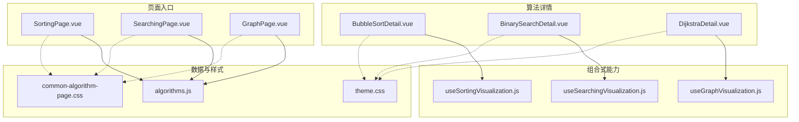
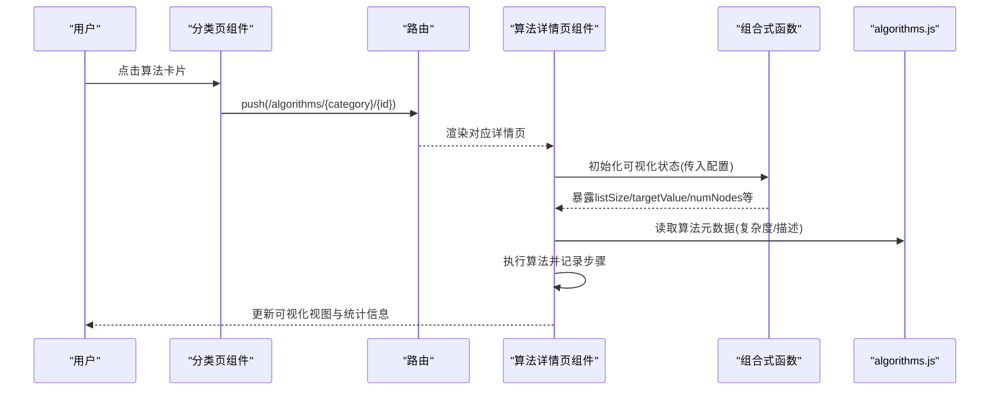
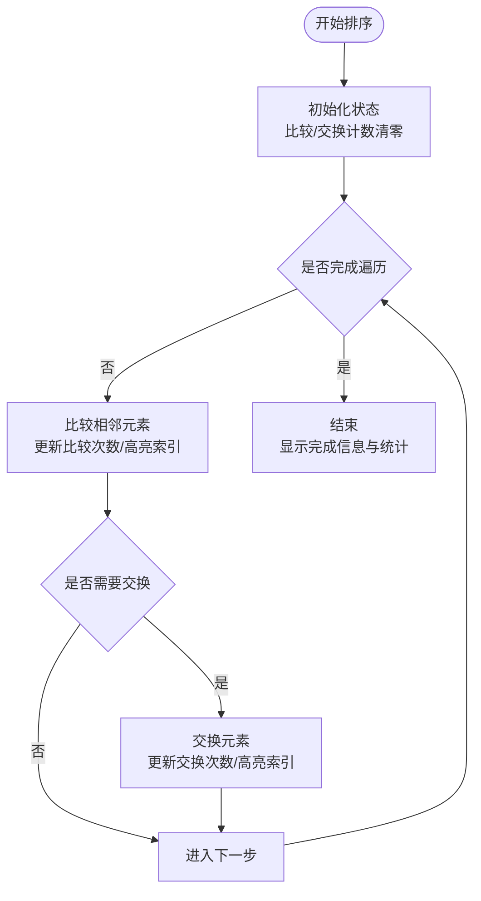
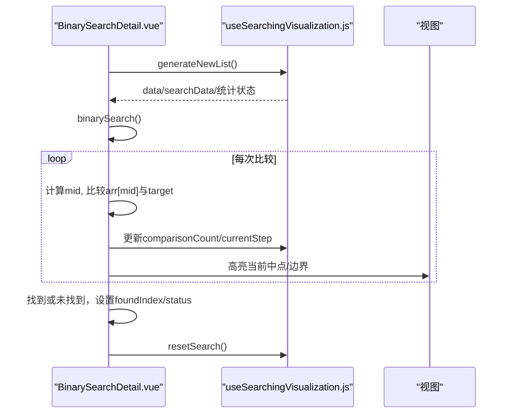
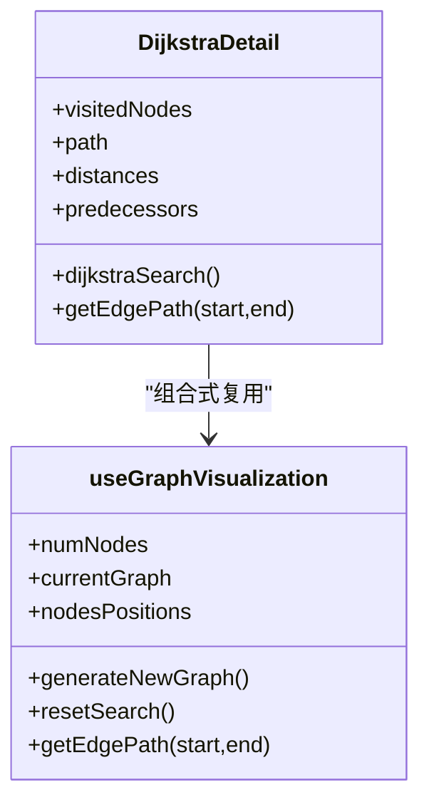
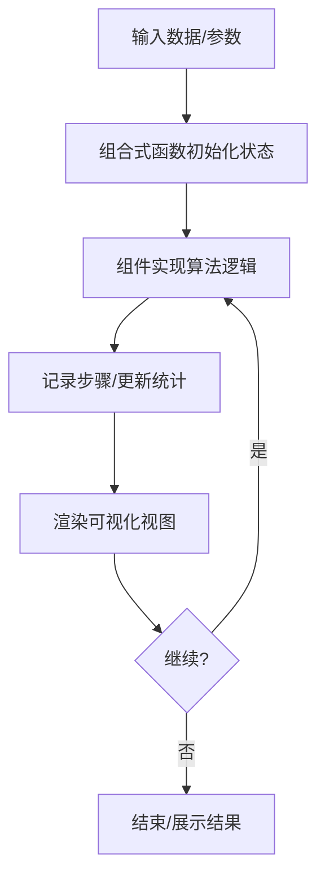
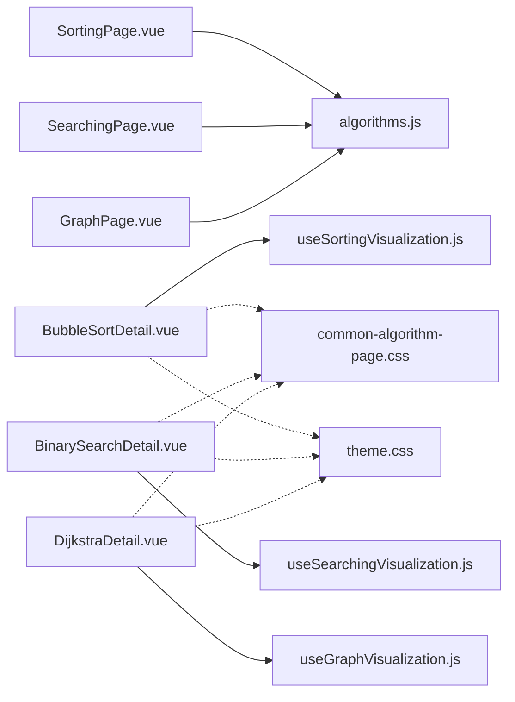

# Vue组件规范

<cite>
**本文引用的文件**
- [SortingPage.vue](file://suanfa_vue/src/components/algorithms/sorting_algorithms/SortingPage.vue)
- [SearchingPage.vue](file://suanfa_vue/src/components/algorithms/searching_algorithms/SearchingPage.vue)
- [GraphPage.vue](file://suanfa_vue/src/components/algorithms/graph_algorithms/GraphPage.vue)
- [BubbleSortDetail.vue](file://suanfa_vue/src/components/algorithms/sorting_algorithms/BubbleSortDetail.vue)
- [BinarySearchDetail.vue](file://suanfa_vue/src/components/algorithms/searching_algorithms/BinarySearchDetail.vue)
- [DijkstraDetail.vue](file://suanfa_vue/src/components/algorithms/graph_algorithms/DijkstraDetail.vue)
- [useSortingVisualization.js](file://suanfa_vue/src/composables/useSortingVisualization.js)
- [useSearchingVisualization.js](file://suanfa_vue/src/composables/useSearchingVisualization.js)
- [useGraphVisualization.js](file://suanfa_vue/src/composables/useGraphVisualization.js)
- [algorithms.js](file://suanfa_vue/src/data/algorithms.js)
- [theme.css](file://suanfa_vue/src/styles/theme.css)
- [common-algorithm-page.css](file://suanfa_vue/src/components/algorithms/sorting_algorithms/common-algorithm-page.css)
- [bubble-sort-detail.css](file://suanfa_vue/src/components/algorithms/sorting_algorithms/bubble-sort-detail.css)
</cite>

## 目录
1. [引言](#引言)
2. [项目结构](#项目结构)
3. [核心组件](#核心组件)
4. [架构总览](#架构总览)
5. [详细组件分析](#详细组件分析)
6. [依赖关系分析](#依赖关系分析)
7. [性能考量](#性能考量)
8. [故障排查指南](#故障排查指南)
9. [结论](#结论)
10. [附录](#附录)

## 引言
本规范面向算法可视化前端工程，基于现有Vue代码库总结出一套可复用的组件编码规范。重点覆盖：
- 单文件组件（SFC）组织方式与模板、脚本、样式分离原则
- Props定义规范（类型声明、默认值、验证规则）
- 事件处理规范（自定义事件命名与触发时机）
- 样式组织规范（CSS模块化、主题变量、响应式）
- 算法可视化组件编写模式（排序、搜索、图算法）
- 组件复用模式与组合式API最佳实践

## 项目结构
本项目采用“按功能域+共享能力”的目录划分：
- 页面级分类入口：sorting/searching/graph三大类页面，负责数据筛选与路由跳转
- 算法详情页：每个算法一个Detail组件，封装具体算法实现与可视化交互
- 组合式函数：useSortingVisualization、useSearchingVisualization、useGraphVisualization，抽取通用可视化调度逻辑
- 数据层：algorithms.js作为单一数据源，提供算法元数据与派生列表
- 样式层：全局主题变量 + 公共页面样式 + 组件级样式

图表来源
- [SortingPage.vue:1-97](file://suanfa_vue/src/components/algorithms/sorting_algorithms/SortingPage.vue#L1-L97)
- [SearchingPage.vue:1-89](file://suanfa_vue/src/components/algorithms/searching_algorithms/SearchingPage.vue#L1-L89)
- [GraphPage.vue:1-92](file://suanfa_vue/src/components/algorithms/graph_algorithms/GraphPage.vue#L1-L92)
- [BubbleSortDetail.vue:1-243](file://suanfa_vue/src/components/algorithms/sorting_algorithms/BubbleSortDetail.vue#L1-L243)
- [BinarySearchDetail.vue:1-281](file://suanfa_vue/src/components/algorithms/searching_algorithms/BinarySearchDetail.vue#L1-L281)
- [DijkstraDetail.vue:1-482](file://suanfa_vue/src/components/algorithms/graph_algorithms/DijkstraDetail.vue#L1-L482)
- [useSortingVisualization.js:1-111](file://suanfa_vue/src/composables/useSortingVisualization.js#L1-L111)
- [useSearchingVisualization.js:1-119](file://suanfa_vue/src/composables/useSearchingVisualization.js#L1-L119)
- [useGraphVisualization.js:1-148](file://suanfa_vue/src/composables/useGraphVisualization.js#L1-L148)
- [algorithms.js:1-800](file://suanfa_vue/src/data/algorithms.js#L1-L800)
- [theme.css:1-136](file://suanfa_vue/src/styles/theme.css#L1-L136)
- [common-algorithm-page.css:1-173](file://suanfa_vue/src/components/algorithms/sorting_algorithms/common-algorithm-page.css#L1-L173)

章节来源
- [SortingPage.vue:1-97](file://suanfa_vue/src/components/algorithms/sorting_algorithms/SortingPage.vue#L1-L97)
- [SearchingPage.vue:1-89](file://suanfa_vue/src/components/algorithms/searching_algorithms/SearchingPage.vue#L1-L89)
- [GraphPage.vue:1-92](file://suanfa_vue/src/components/algorithms/graph_algorithms/GraphPage.vue#L1-L92)
- [algorithms.js:777-800](file://suanfa_vue/src/data/algorithms.js#L777-L800)
- [common-algorithm-page.css:1-173](file://suanfa_vue/src/components/algorithms/sorting_algorithms/common-algorithm-page.css#L1-L173)
- [theme.css:1-136](file://suanfa_vue/src/styles/theme.css#L1-L136)

## 核心组件
- 分类页组件（SortingPage/SearchingPage/GraphPage）
  - 职责：展示算法卡片、分类筛选、点击跳转至对应详情页
  - 数据源：统一从 algorithms.js 导入并过滤
  - 路由：通过vue-router跳转到 /algorithms/{category}/{id}
- 算法详情页组件（以冒泡排序、二分查找、Dijkstra为例）
  - 职责：实现具体算法、驱动可视化步骤、维护统计状态、渲染SVG/数组/柱状图
  - 复用：通过组合式函数管理通用状态与流程控制
- 组合式函数
  - useSortingVisualization：排序类可视化通用状态（列表大小、随机数据、重置、统计）
  - useSearchingVisualization：搜索类可视化通用状态（列表大小、目标值、重置、统计）
  - useGraphVisualization：图类可视化通用状态（节点数、图生成、布局、重置、统计）

章节来源
- [BubbleSortDetail.vue:1-243](file://suanfa_vue/src/components/algorithms/sorting_algorithms/BubbleSortDetail.vue#L1-L243)
- [BinarySearchDetail.vue:1-281](file://suanfa_vue/src/components/algorithms/searching_algorithms/BinarySearchDetail.vue#L1-L281)
- [DijkstraDetail.vue:1-482](file://suanfa_vue/src/components/algorithms/graph_algorithms/DijkstraDetail.vue#L1-L482)
- [useSortingVisualization.js:1-111](file://suanfa_vue/src/composables/useSortingVisualization.js#L1-L111)
- [useSearchingVisualization.js:1-119](file://suanfa_vue/src/composables/useSearchingVisualization.js#L1-L119)
- [useGraphVisualization.js:1-148](file://suanfa_vue/src/composables/useGraphVisualization.js#L1-L148)

## 架构总览
下图展示了从分类页到详情页再到组合式函数的调用链与数据流。

图表来源
- [SortingPage.vue:1-97](file://suanfa_vue/src/components/algorithms/sorting_algorithms/SortingPage.vue#L1-L97)
- [SearchingPage.vue:1-89](file://suanfa_vue/src/components/algorithms/searching_algorithms/SearchingPage.vue#L1-L89)
- [GraphPage.vue:1-92](file://suanfa_vue/src/components/algorithms/graph_algorithms/GraphPage.vue#L1-L92)
- [BubbleSortDetail.vue:1-243](file://suanfa_vue/src/components/algorithms/sorting_algorithms/BubbleSortDetail.vue#L1-L243)
- [BinarySearchDetail.vue:1-281](file://suanfa_vue/src/components/algorithms/searching_algorithms/BinarySearchDetail.vue#L1-L281)
- [DijkstraDetail.vue:1-482](file://suanfa_vue/src/components/algorithms/graph_algorithms/DijkstraDetail.vue#L1-L482)
- [useSortingVisualization.js:1-111](file://suanfa_vue/src/composables/useSortingVisualization.js#L1-L111)
- [useSearchingVisualization.js:1-119](file://suanfa_vue/src/composables/useSearchingVisualization.js#L1-L119)
- [useGraphVisualization.js:1-148](file://suanfa_vue/src/composables/useGraphVisualization.js#L1-L148)
- [algorithms.js:1-800](file://suanfa_vue/src/data/algorithms.js#L1-L800)

## 详细组件分析

### 组件A：排序算法可视化（以冒泡排序为例）
- 组件职责
  - 使用组合式函数管理通用状态（列表大小、随机数据、统计）
  - 实现冒泡排序算法，逐步推进动画并记录步骤
  - 渲染柱状图、控制面板、步骤历史
- 关键模式
  - 通过defineEmits声明close事件，用于关闭详情弹窗
  - 将算法专属逻辑与通用可视化逻辑解耦
  - 使用nextTick确保DOM更新后再进行下一步动画

图表来源
- [BubbleSortDetail.vue:24-91](file://suanfa_vue/src/components/algorithms/sorting_algorithms/BubbleSortDetail.vue#L24-L91)
- [useSortingVisualization.js:57-101](file://suanfa_vue/src/composables/useSortingVisualization.js#L57-L101)

章节来源
- [BubbleSortDetail.vue:1-243](file://suanfa_vue/src/components/algorithms/sorting_algorithms/BubbleSortDetail.vue#L1-L243)
- [useSortingVisualization.js:1-111](file://suanfa_vue/src/composables/useSortingVisualization.js#L1-L111)

### 组件B：搜索算法可视化（以二分查找为例）
- 组件职责
  - 使用组合式函数管理通用状态（列表大小、目标值、重置）
  - 实现二分查找算法，逐步推进动画并记录步骤
  - 渲染数组元素、边界高亮、步骤历史
- 关键模式
  - 通过onReset钩子注入算法专属状态重置逻辑
  - 使用searchSteps记录每一步操作细节，便于回放与教学

图表来源
- [BinarySearchDetail.vue:44-114](file://suanfa_vue/src/components/algorithms/searching_algorithms/BinarySearchDetail.vue#L44-L114)
- [useSearchingVisualization.js:72-108](file://suanfa_vue/src/composables/useSearchingVisualization.js#L72-L108)

章节来源
- [BinarySearchDetail.vue:1-281](file://suanfa_vue/src/components/algorithms/searching_algorithms/BinarySearchDetail.vue#L1-L281)
- [useSearchingVisualization.js:1-119](file://suanfa_vue/src/composables/useSearchingVisualization.js#L1-L119)

### 组件C：图算法可视化（以Dijkstra为例）
- 组件职责
  - 使用组合式函数管理图结构、节点位置、边路径计算
  - 实现Dijkstra最短路径算法，逐步推进动画并记录步骤
  - 渲染SVG图、节点距离标签、路径高亮
- 关键模式
  - 通过generateGraph回调注入图生成逻辑
  - 通过onReset钩子注入算法专属状态重置逻辑
  - 使用getEdgePath计算带箭头的边路径，支持权重标注

图表来源
- [DijkstraDetail.vue:147-275](file://suanfa_vue/src/components/algorithms/graph_algorithms/DijkstraDetail.vue#L147-L275)
- [useGraphVisualization.js:16-148](file://suanfa_vue/src/composables/useGraphVisualization.js#L16-L148)

章节来源
- [DijkstraDetail.vue:1-482](file://suanfa_vue/src/components/algorithms/graph_algorithms/DijkstraDetail.vue#L1-L482)
- [useGraphVisualization.js:1-148](file://suanfa_vue/src/composables/useGraphVisualization.js#L1-L148)

### 概念总览：算法可视化组件通用模式
- 输入：列表/图数据、参数（如目标值、起始/目标节点）
- 处理：组合式函数管理通用状态；组件实现算法逻辑并推进步骤
- 输出：可视化视图（柱状图/数组/SVG）、统计信息（比较次数、步数）、步骤历史
- 控制：生成新数据、重置、调整动画速度

[无图表来源，因为该图为概念性流程图]

## 依赖关系分析
- 页面组件依赖数据源algorithms.js，按category/subCategory/stability等字段进行筛选
- 详情页组件依赖对应组合式函数，获得通用状态与工具方法
- 组合式函数内部依赖Vue响应式API（ref/watch/nextTick）
- 样式依赖全局主题变量与公共页面样式，保证一致性与可维护性

图表来源
- [SortingPage.vue:1-97](file://suanfa_vue/src/components/algorithms/sorting_algorithms/SortingPage.vue#L1-L97)
- [SearchingPage.vue:1-89](file://suanfa_vue/src/components/algorithms/searching_algorithms/SearchingPage.vue#L1-L89)
- [GraphPage.vue:1-92](file://suanfa_vue/src/components/algorithms/graph_algorithms/GraphPage.vue#L1-L92)
- [BubbleSortDetail.vue:1-243](file://suanfa_vue/src/components/algorithms/sorting_algorithms/BubbleSortDetail.vue#L1-L243)
- [BinarySearchDetail.vue:1-281](file://suanfa_vue/src/components/algorithms/searching_algorithms/BinarySearchDetail.vue#L1-L281)
- [DijkstraDetail.vue:1-482](file://suanfa_vue/src/components/algorithms/graph_algorithms/DijkstraDetail.vue#L1-L482)
- [useSortingVisualization.js:1-111](file://suanfa_vue/src/composables/useSortingVisualization.js#L1-L111)
- [useSearchingVisualization.js:1-119](file://suanfa_vue/src/composables/useSearchingVisualization.js#L1-L119)
- [useGraphVisualization.js:1-148](file://suanfa_vue/src/composables/useGraphVisualization.js#L1-L148)
- [algorithms.js:1-800](file://suanfa_vue/src/data/algorithms.js#L1-L800)
- [common-algorithm-page.css:1-173](file://suanfa_vue/src/components/algorithms/sorting_algorithms/common-algorithm-page.css#L1-L173)
- [theme.css:1-136](file://suanfa_vue/src/styles/theme.css#L1-L136)

章节来源
- [algorithms.js:777-800](file://suanfa_vue/src/data/algorithms.js#L777-L800)
- [common-algorithm-page.css:1-173](file://suanfa_vue/src/components/algorithms/sorting_algorithms/common-algorithm-page.css#L1-L173)
- [theme.css:1-136](file://suanfa_vue/src/styles/theme.css#L1-L136)

## 性能考量
- 避免在动画循环中进行大量DOM操作：通过组合式函数集中管理状态，减少重复计算
- 合理使用nextTick确保DOM更新后再进行下一步动画，避免闪烁或状态不一致
- 列表/图规模控制：通过min/max限制列表大小或节点数量，防止渲染卡顿
- 样式优化：使用CSS变量与公共样式，减少重复定义，提升主题切换性能

[本节为通用指导，无需特定文件来源]

## 故障排查指南
- 常见问题
  - 生成新列表/图失败：检查输入参数类型与范围，查看errorMessage与currentStepDetails
  - 动画不生效：确认animationSpeed与isSearching状态是否正确设置
  - 步骤历史为空：检查是否在算法开始前清空了steps数组，以及是否在每步正确push
- 定位方法
  - 查看控制台日志与错误信息
  - 检查组合式函数返回的状态与方法是否被正确使用
  - 核对algorithms.js中的算法元数据是否与详情页一致

章节来源
- [useSortingVisualization.js:57-77](file://suanfa_vue/src/composables/useSortingVisualization.js#L57-L77)
- [useSearchingVisualization.js:72-92](file://suanfa_vue/src/composables/useSearchingVisualization.js#L72-L92)
- [useGraphVisualization.js:104-125](file://suanfa_vue/src/composables/useGraphVisualization.js#L104-L125)

## 结论
本规范基于现有代码库总结了Vue组件在算法可视化场景下的最佳实践：
- 使用组合式函数抽象通用逻辑，提升复用性与可维护性
- 通过单一数据源统一管理算法元数据，确保前后端一致性
- 采用CSS模块化与主题变量，实现一致的视觉体验与易扩展的主题系统
- 明确Props与事件规范，增强组件间通信的可读性与稳定性

[本节为总结性内容，无需特定文件来源]

## 附录

### 组件文件结构规范
- 单文件组件（SFC）组织方式
  - script：使用<script setup>语法，引入组合式函数与数据源
  - template：清晰分层，包含标题、控制面板、可视化区域、步骤历史
  - style：使用<style scoped>，引入公共样式与组件级样式
- 模板、脚本、样式分离原则
  - 模板仅负责结构与绑定，不包含复杂逻辑
  - 脚本聚焦业务逻辑与状态管理
  - 样式通过CSS变量与公共样式保持一致性

章节来源
- [BubbleSortDetail.vue:159-163](file://suanfa_vue/src/components/algorithms/sorting_algorithms/BubbleSortDetail.vue#L159-L163)
- [BubbleSortDetail.vue:165-243](file://suanfa_vue/src/components/algorithms/sorting_algorithms/BubbleSortDetail.vue#L165-L243)
- [common-algorithm-page.css:1-173](file://suanfa_vue/src/components/algorithms/sorting_algorithms/common-algorithm-page.css#L1-L173)

### Props定义规范
- 类型声明：使用TypeScript或JSDoc注释明确Props类型
- 默认值设置：为可选Props提供合理默认值，避免未定义错误
- 验证规则：对数值型Props进行范围校验，对枚举型Props进行合法性检查

[本节为通用指导，无需特定文件来源]

### 事件处理规范
- 自定义事件命名：使用动词短语，如close、submit、update
- 触发时机：在用户操作完成后触发，如点击按钮、表单提交
- 事件传递：通过defineEmits声明事件，并在父组件中监听处理

章节来源
- [BubbleSortDetail.vue:5-21](file://suanfa_vue/src/components/algorithms/sorting_algorithms/BubbleSortDetail.vue#L5-L21)
- [BinarySearchDetail.vue:5-33](file://suanfa_vue/src/components/algorithms/searching_algorithms/BinarySearchDetail.vue#L5-L33)
- [DijkstraDetail.vue:5-97](file://suanfa_vue/src/components/algorithms/graph_algorithms/DijkstraDetail.vue#L5-L97)

### 样式组织规范
- CSS模块化：按功能域拆分样式文件，避免全局污染
- 主题变量使用：通过CSS变量统一管理颜色、字体、间距等设计令牌
- 响应式设计：使用flexbox/grid布局，适配不同屏幕尺寸

章节来源
- [theme.css:1-136](file://suanfa_vue/src/styles/theme.css#L1-L136)
- [common-algorithm-page.css:1-173](file://suanfa_vue/src/components/algorithms/sorting_algorithms/common-algorithm-page.css#L1-L173)
- [bubble-sort-detail.css:1-9](file://suanfa_vue/src/components/algorithms/sorting_algorithms/bubble-sort-detail.css#L1-L9)

### 算法可视化组件编写模式
- 排序算法组件
  - 使用useSortingVisualization管理通用状态
  - 实现具体排序算法，逐步推进动画
  - 渲染柱状图与统计信息
- 搜索算法组件
  - 使用useSearchingVisualization管理通用状态
  - 实现具体搜索算法，记录比较与移动步骤
  - 渲染数组元素与边界高亮
- 图算法组件
  - 使用useGraphVisualization管理图结构与布局
  - 实现具体图算法，记录访问与更新步骤
  - 渲染SVG图与路径高亮

章节来源
- [useSortingVisualization.js:1-111](file://suanfa_vue/src/composables/useSortingVisualization.js#L1-L111)
- [useSearchingVisualization.js:1-119](file://suanfa_vue/src/composables/useSearchingVisualization.js#L1-L119)
- [useGraphVisualization.js:1-148](file://suanfa_vue/src/composables/useGraphVisualization.js#L1-L148)
- [BubbleSortDetail.vue:1-243](file://suanfa_vue/src/components/algorithms/sorting_algorithms/BubbleSortDetail.vue#L1-L243)
- [BinarySearchDetail.vue:1-281](file://suanfa_vue/src/components/algorithms/searching_algorithms/BinarySearchDetail.vue#L1-L281)
- [DijkstraDetail.vue:1-482](file://suanfa_vue/src/components/algorithms/graph_algorithms/DijkstraDetail.vue#L1-L482)

### 组件复用模式与组合式API最佳实践
- 复用模式
  - 通过组合式函数抽象通用逻辑，如状态管理、数据生成、重置流程
  - 通过回调注入算法专属逻辑，如generateRandomData、generateGraph、onReset
- 最佳实践
  - 保持组合式函数纯函数化，避免副作用
  - 使用watch监听输入变化，自动更新状态
  - 提供清晰的返回值接口，便于组件消费

章节来源
- [useSortingVisualization.js:8-26](file://suanfa_vue/src/composables/useSortingVisualization.js#L8-L26)
- [useSearchingVisualization.js:8-32](file://suanfa_vue/src/composables/useSearchingVisualization.js#L8-L32)
- [useGraphVisualization.js:8-21](file://suanfa_vue/src/composables/useGraphVisualization.js#L8-L21)