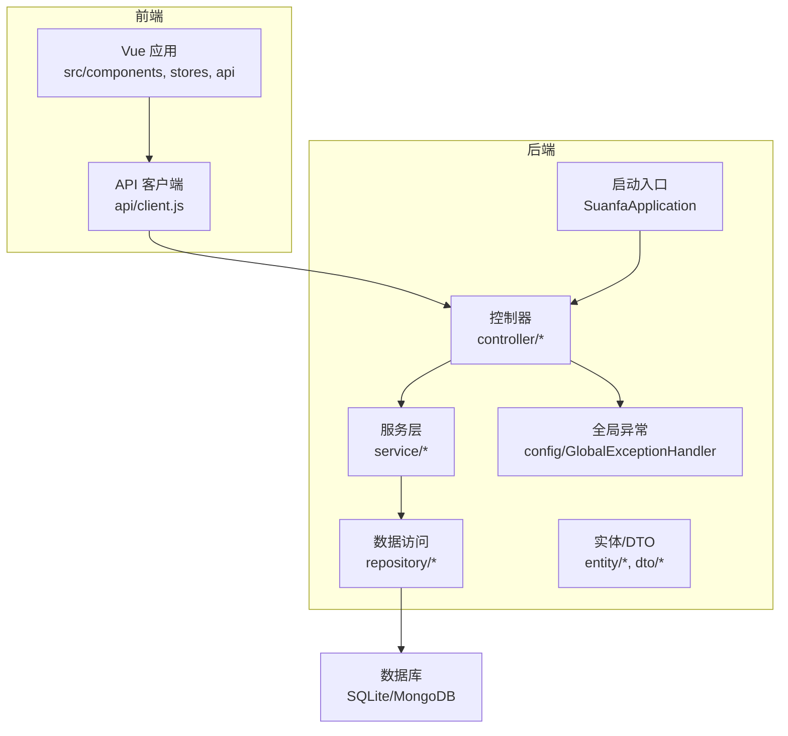
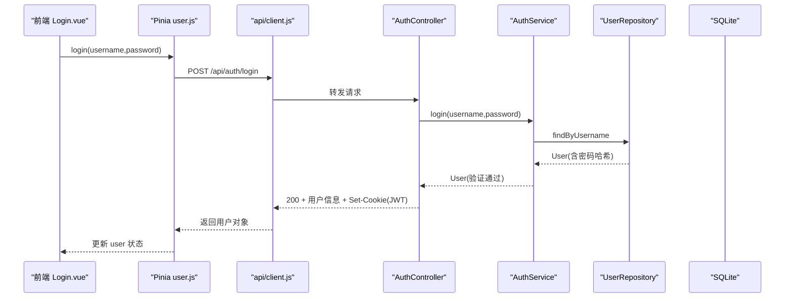
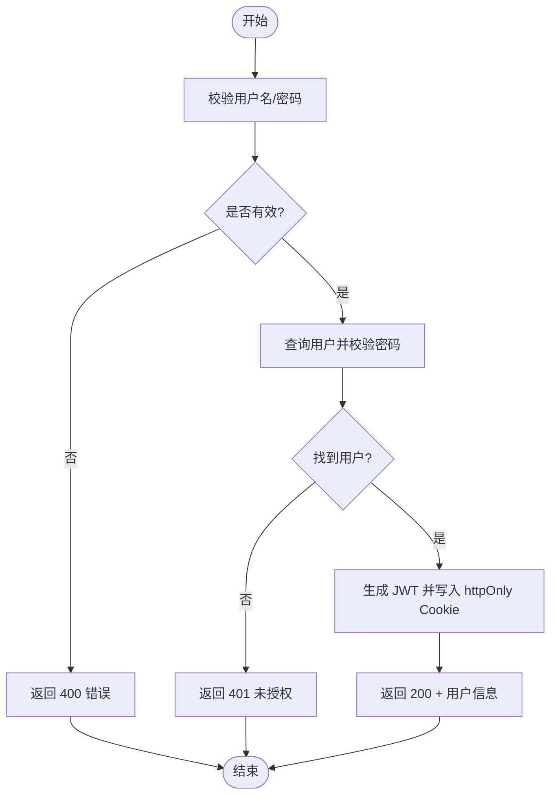
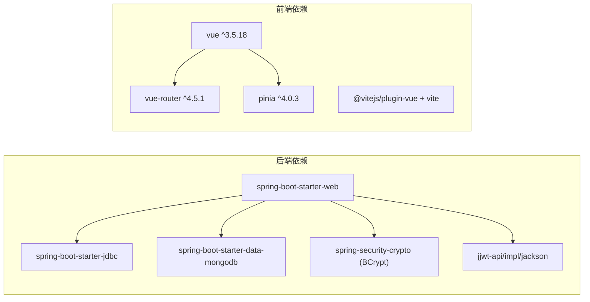

# 代码规范

<cite>
**本文引用的文件**
- [SuanfaApplication.java](file://backend/src/main/java/com/suanfa/SuanfaApplication.java)
- [GlobalExceptionHandler.java](file://backend/src/main/java/com/suanfa/config/GlobalExceptionHandler.java)
- [AuthController.java](file://backend/src/main/java/com/suanfa/controller/AuthController.java)
- [AlgorithmController.java](file://backend/src/main/java/com/suanfa/controller/AlgorithmController.java)
- [AuthService.java](file://backend/src/main/java/com/suanfa/service/AuthService.java)
- [User.java](file://backend/src/main/java/com/suanfa/entity/User.java)
- [application.yml](file://backend/src/main/resources/application.yml)
- [pom.xml](file://backend/pom.xml)
- [client.js](file://suanfa_vue/src/api/client.js)
- [Login.vue](file://suanfa_vue/src/components/common/Login.vue)
- [user.js](file://suanfa_vue/src/stores/user.js)
- [SortingPage.vue](file://suanfa_vue/src/components/algorithms/sorting_algorithms/SortingPage.vue)
- [package.json](file://suanfa_vue/package.json)
</cite>

## 目录
1. [引言](#引言)
2. [项目结构](#项目结构)
3. [核心组件](#核心组件)
4. [架构总览](#架构总览)
5. [详细组件分析](#详细组件分析)
6. [依赖分析](#依赖分析)
7. [性能考虑](#性能考虑)
8. [故障排查指南](#故障排查指南)
9. [结论](#结论)
10. [附录](#附录)

## 引言
本规范面向团队在 Java 后端与 Vue 前端的统一编码标准，目标是确保代码风格一致、可维护性强、接口契约清晰。文档覆盖：
- Java 编码规范：类/方法/变量命名、注释、异常处理模式、安全与配置约定
- Vue 组件规范：组件结构、Props、事件、样式组织、状态管理
- API 设计规范：RESTful 设计、请求响应格式、错误码定义
- 工具链与 IDE 建议：构建脚本、检查与格式化、本地开发流程

## 项目结构
后端采用 Spring Boot 分层结构（controller/service/repository/entity/dto），前端基于 Vue 3 + Vite + Pinia，前后端通过 REST API 通信，认证使用 JWT 并存储在 httpOnly Cookie。

图表来源
- [SuanfaApplication.java:10-20](file://backend/src/main/java/com/suanfa/SuanfaApplication.java#L10-L20)
- [AuthController.java:15-30](file://backend/src/main/java/com/suanfa/controller/AuthController.java#L15-L30)
- [AlgorithmController.java:10-30](file://backend/src/main/java/com/suanfa/controller/AlgorithmController.java#L10-L30)
- [GlobalExceptionHandler.java:21-67](file://backend/src/main/java/com/suanfa/config/GlobalExceptionHandler.java#L21-L67)

章节来源
- [SuanfaApplication.java:10-20](file://backend/src/main/java/com/suanfa/SuanfaApplication.java#L10-L20)
- [application.yml:1-17](file://backend/src/main/resources/application.yml#L1-L17)
- [package.json:1-23](file://suanfa_vue/package.json#L1-L23)

## 核心组件
- 启动与初始化：Spring Boot 启动时创建 SQLite data 目录，加载配置与路由
- 认证与安全：JWT 签发与校验，httpOnly Cookie 存储；密码 BCrypt 加密
- 全局异常：统一 JSON 错误体，保留 HTTP 状态码
- 算法与内容：提供算法元数据与详情内容的查询接口
- 前端 API 客户端：封装 fetch，支持后端不可用时的本地降级策略
- 用户状态：Pinia store 管理登录态与会话恢复

章节来源
- [SuanfaApplication.java:13-20](file://backend/src/main/java/com/suanfa/SuanfaApplication.java#L13-L20)
- [AuthService.java:22-51](file://backend/src/main/java/com/suanfa/service/AuthService.java#L22-L51)
- [GlobalExceptionHandler.java:26-67](file://backend/src/main/java/com/suanfa/config/GlobalExceptionHandler.java#L26-L67)
- [client.js:30-43](file://suanfa_vue/src/api/client.js#L30-L43)
- [user.js:14-33](file://suanfa_vue/src/stores/user.js#L14-L33)

## 架构总览
下图展示一次“登录”的端到端调用序列，包括 Cookie 设置与前端状态更新。

图表来源
- [AuthController.java:43-52](file://backend/src/main/java/com/suanfa/controller/AuthController.java#L43-L52)
- [AuthService.java:35-43](file://backend/src/main/java/com/suanfa/service/AuthService.java#L35-L43)
- [client.js:118-123](file://suanfa_vue/src/api/client.js#L118-L123)
- [user.js:24-26](file://suanfa_vue/src/stores/user.js#L24-L26)

## 详细组件分析

### Java 编码规范
- 包与类组织
  - controller：HTTP 接口，仅做参数绑定与响应包装
  - service：业务逻辑，包含校验、转换、事务边界
  - repository：数据访问，封装 SQL/NoSQL 操作
  - entity/dto：数据传输模型，避免将内部实体直接暴露给外部
- 命名约定
  - 类名：大驼峰，名词或动名词组合（如 AuthService）
  - 方法名：小驼峰，动词开头（如 register、login、findById）
  - 变量名：小驼峰，语义明确（如 username、passwordHash）
  - 常量：全大写加下划线（如 NEGATIVE_PROBE_TTL）
- 注释规范
  - 类与方法使用 Javadoc 说明职责、入参出参、异常
  - 复杂逻辑行内注释解释“为什么”，而非“做了什么”
- 异常处理模式
  - 业务校验失败抛出 IllegalArgumentException，由全局异常处理器统一转为 400
  - 路由级异常（404/405）保持原状态码，便于前端区分
  - 兜底捕获 Exception 记录日志并返回 500
- 安全与配置
  - 密码使用 BCrypt 加密，不对外暴露
  - JWT 通过 httpOnly Cookie 传递，避免 XSS 窃取
  - 敏感配置（密钥、跨域、AI 配置）通过 application.yml 与环境变量注入

章节来源
- [AuthService.java:22-51](file://backend/src/main/java/com/suanfa/service/AuthService.java#L22-L51)
- [GlobalExceptionHandler.java:26-67](file://backend/src/main/java/com/suanfa/config/GlobalExceptionHandler.java#L26-L67)
- [AuthController.java:73-88](file://backend/src/main/java/com/suanfa/controller/AuthController.java#L73-L88)
- [application.yml:18-50](file://backend/src/main/resources/application.yml#L18-L50)

### Vue 组件规范
- 组件结构
  - 使用 <script setup> 语法，逻辑与模板分离
  - 单一职责：页面级组件负责布局与导航，子组件专注具体功能
- Props 与事件
  - 通过 props 传入数据，通过 emits 触发事件（示例中可见通过 router 跳转与状态更新）
- 样式组织
  - 使用 scoped CSS 隔离样式，公共样式抽取到独立文件并通过 @import 引用
- 状态管理
  - 使用 Pinia 管理跨组件状态（如用户登录态），store 中封装异步 actions
- 网络请求
  - 统一通过 api/client.js 发起请求，具备后端不可用时的本地降级能力

章节来源
- [Login.vue:1-45](file://suanfa_vue/src/components/common/Login.vue#L1-L45)
- [SortingPage.vue:1-43](file://suanfa_vue/src/components/algorithms/sorting_algorithms/SortingPage.vue#L1-L43)
- [user.js:1-36](file://suanfa_vue/src/stores/user.js#L1-L36)
- [client.js:111-131](file://suanfa_vue/src/api/client.js#L111-L131)

### API 设计规范
- RESTful 设计
  - 资源路径使用复数名词，如 /api/algorithms、/api/auth
  - 使用标准 HTTP 方法：GET/POST/PUT/DELETE
  - 路径参数与查询参数清晰分离（如 /algorithms/{id}、?category=...）
- 请求/响应格式
  - Content-Type: application/json
  - 成功响应：2xx + JSON 主体
  - 失败响应：4xx/5xx + { message } 的统一错误体
- 错误码定义
  - 400：参数校验失败（如非法输入）
  - 401：未认证或 token 无效
  - 403：无权限
  - 404：资源不存在
  - 405：方法不允许
  - 429：限流
  - 500：服务器内部错误
- 认证与会话
  - 登录成功后服务端设置 httpOnly Cookie（JWT），后续请求自动携带
  - 未登录访问受保护接口返回 401

章节来源
- [AuthController.java:28-71](file://backend/src/main/java/com/suanfa/controller/AuthController.java#L28-L71)
- [AlgorithmController.java:21-30](file://backend/src/main/java/com/suanfa/controller/AlgorithmController.java#L21-L30)
- [GlobalExceptionHandler.java:26-67](file://backend/src/main/java/com/suanfa/config/GlobalExceptionHandler.java#L26-L67)
- [client.js:30-43](file://suanfa_vue/src/api/client.js#L30-L43)

### 关键流程图：登录与鉴权

图表来源
- [AuthService.java:22-43](file://backend/src/main/java/com/suanfa/service/AuthService.java#L22-L43)
- [AuthController.java:28-52](file://backend/src/main/java/com/suanfa/controller/AuthController.java#L28-L52)

## 依赖分析
后端依赖 Spring Boot Web、JDBC、MongoDB、BCrypt、JWT；前端依赖 Vue、Vite、Pinia、Vue Router。

图表来源
- [pom.xml:24-77](file://backend/pom.xml#L24-L77)
- [package.json:11-21](file://suanfa_vue/package.json#L11-L21)

章节来源
- [pom.xml:24-77](file://backend/pom.xml#L24-L77)
- [package.json:11-21](file://suanfa_vue/package.json#L11-L21)

## 性能考虑
- 后端
  - 使用轻量 SQLite 减少部署复杂度；对热点查询增加索引
  - 合理设置超时与限流（如 AI 与代码执行模块）
  - Jackson 默认排除 null 字段，减小响应体积
- 前端
  - API 客户端具备后端可用性探测与降级缓存，降低无效重试
  - 列表页按需渲染与分页，避免一次性加载大量数据
  - 使用 scoped CSS 与模块化样式，减少重排重绘

章节来源
- [application.yml:92-96](file://backend/src/main/resources/application.yml#L92-L96)
- [application.yml:15-17](file://backend/src/main/resources/application.yml#L15-L17)
- [client.js:12-28](file://suanfa_vue/src/api/client.js#L12-L28)

## 故障排查指南
- 常见错误定位
  - 405 方法不允许：检查前端请求方法与后端映射是否一致
  - 404 接口不存在：确认路由版本兼容性与路径拼写
  - 400 请求体解析失败：核对 JSON 字段与类型
  - 401/403：检查 Cookie 是否携带、token 是否过期或权限不足
  - 500 服务器内部错误：查看后端日志，定位异常堆栈
- 调试建议
  - 开启 debug 日志级别，关注 com.suanfa 包日志
  - 使用浏览器开发者工具查看 Network 面板的请求/响应头
  - 对于 AI/代码执行等外部依赖，先测试连通性再排查业务逻辑

章节来源
- [GlobalExceptionHandler.java:31-58](file://backend/src/main/java/com/suanfa/config/GlobalExceptionHandler.java#L31-L58)
- [application.yml:98-102](file://backend/src/main/resources/application.yml#L98-L102)

## 结论
本规范明确了前后端在命名、结构、异常、API 等方面的统一标准，结合全局异常处理、JWT 安全与会话管理、以及前端的健壮降级策略，可有效提升团队协作效率与系统可维护性。建议在 CI 中集成静态检查与格式化，持续保障代码质量。

## 附录

### 最佳实践清单
- Java
  - 使用 record 表达不可变 DTO/Entity，减少样板代码
  - 所有外部输入进行校验，失败抛 IllegalArgumentException
  - 统一异常响应体 ErrorBody，避免散落的错误格式
  - 敏感配置通过环境变量注入，不在代码中硬编码
- Vue
  - 组件职责单一，复用通用逻辑至 composables/store
  - 网络请求集中管理，统一错误处理与降级策略
  - 样式使用 scoped，公共样式抽取为模块
- API
  - 遵循 RESTful 约定，使用标准状态码
  - 错误响应包含可读 message，便于前端提示
  - 认证相关接口统一返回 httpOnly Cookie

### IDE 与工具链建议
- Java
  - 使用 Maven 管理依赖，IDE 启用 Lombok/Record 支持
  - 配置 Spotless/Checkstyle 进行格式化与规则检查
  - 使用 SonarQube 进行代码质量扫描
- Vue
  - 使用 ESLint + Prettier 统一风格
  - 使用 Vite 插件优化构建与热更新
  - 使用 Vitest 进行单元测试

章节来源
- [pom.xml:80-87](file://backend/pom.xml#L80-L87)
- [package.json:6-10](file://suanfa_vue/package.json#L6-L10)