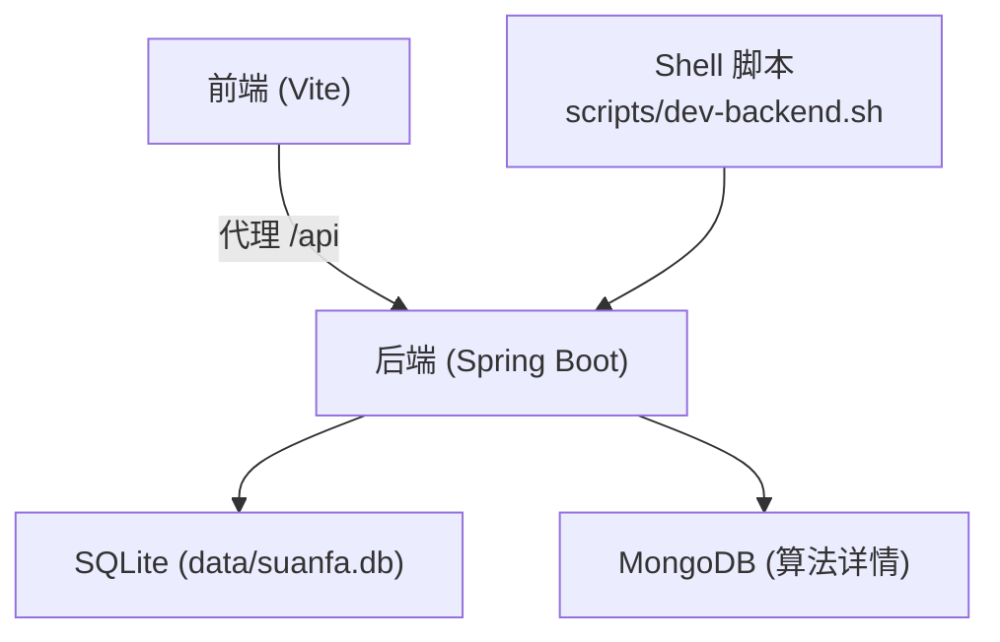
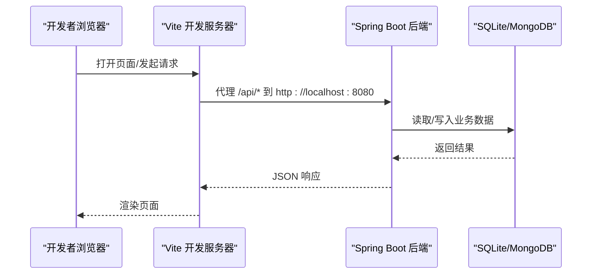
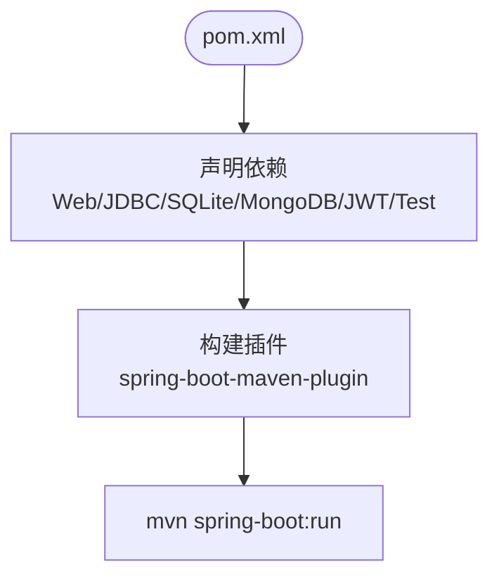
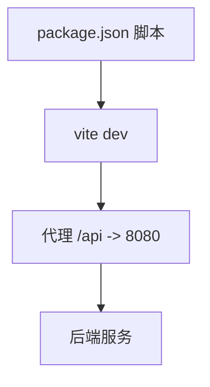
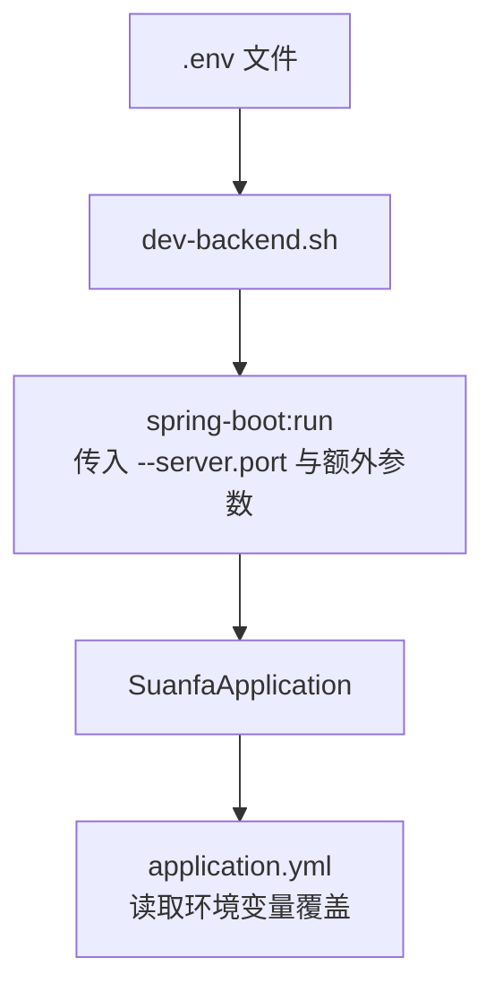
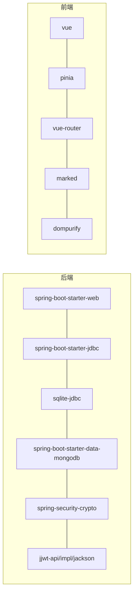

# 开发工具配置

<cite>
**本文引用的文件**
- [backend/pom.xml](file://backend/pom.xml)
- [backend/src/main/resources/application.yml](file://backend/src/main/resources/application.yml)
- [scripts/dev-backend.sh](file://scripts/dev-backend.sh)
- [suanfa_vue/package.json](file://suanfa_vue/package.json)
- [suanfa_vue/vite.config.js](file://suanfa_vue/vite.config.js)
- [.gitignore](file://.gitignore)
</cite>

## 目录
1. [简介](#简介)
2. [项目结构](#项目结构)
3. [核心组件](#核心组件)
4. [架构总览](#架构总览)
5. [详细组件分析](#详细组件分析)
6. [依赖关系分析](#依赖关系分析)
7. [性能考虑](#性能考虑)
8. [故障排查指南](#故障排查指南)
9. [结论](#结论)
10. [附录](#附录)

## 简介
本指南面向算法可视化学习平台的开发者，提供从本地开发到团队协作的完整工具链与规范说明。内容涵盖：
- IDE 配置建议（IntelliJ IDEA、VS Code）
- 代码格式化与检查
- 调试环境设置
- Git 工作流规范（分支策略、提交信息、代码审查）
- 构建工具配置（Maven、Node/Vite、环境变量）
- 配置文件示例与最佳实践
- 项目初始化步骤与团队协作流程

## 项目结构
本项目采用前后端分离的多模块结构：
- 后端：Spring Boot + JDBC/SQLite + MongoDB，使用 Maven 管理依赖与构建
- 前端：Vue 3 + Vite，通过 Vite 代理在开发时转发 /api 请求至后端
- 脚本：提供一键启动后端的 Shell 脚本，自动加载 .env 并轮询健康检查
- 根级忽略规则：统一排除敏感与生成文件

图表来源
- [suanfa_vue/vite.config.js:10-20](file://suanfa_vue/vite.config.js#L10-L20)
- [backend/src/main/resources/application.yml:4-16](file://backend/src/main/resources/application.yml#L4-L16)
- [scripts/dev-backend.sh:15-33](file://scripts/dev-backend.sh#L15-L33)

章节来源
- [backend/pom.xml:1-89](file://backend/pom.xml#L1-L89)
- [backend/src/main/resources/application.yml:1-102](file://backend/src/main/resources/application.yml#L1-L102)
- [suanfa_vue/package.json:1-23](file://suanfa_vue/package.json#L1-L23)
- [suanfa_vue/vite.config.js:1-22](file://suanfa_vue/vite.config.js#L1-L22)
- [scripts/dev-backend.sh:1-46](file://scripts/dev-backend.sh#L1-L46)
- [.gitignore](file://.gitignore)

## 核心组件
- 后端服务：基于 Spring Boot 3.2，使用 JDBC 访问 SQLite，并通过 Spring Data MongoDB 存取文档数据；内置 JWT 安全能力；提供 AI 助教与代码执行等扩展能力。
- 前端应用：Vue 3 + Vite，开发服务器开启 host 监听与 /api 代理，便于联调。
- 构建与运行：Maven 负责后端打包运行；Vite 负责前端构建与预览；Shell 脚本封装后端启动与环境变量注入。

章节来源
- [backend/pom.xml:24-78](file://backend/pom.xml#L24-L78)
- [backend/src/main/resources/application.yml:18-97](file://backend/src/main/resources/application.yml#L18-L97)
- [suanfa_vue/package.json:6-21](file://suanfa_vue/package.json#L6-L21)
- [suanfa_vue/vite.config.js:10-20](file://suanfa_vue/vite.config.js#L10-L20)
- [scripts/dev-backend.sh:15-33](file://scripts/dev-backend.sh#L15-L33)

## 架构总览
下图展示开发期前后端交互与关键依赖：

图表来源
- [suanfa_vue/vite.config.js:10-20](file://suanfa_vue/vite.config.js#L10-L20)
- [backend/src/main/resources/application.yml:4-16](file://backend/src/main/resources/application.yml#L4-L16)

## 详细组件分析

### 后端构建与依赖（Maven）
- Java 版本与父工程：继承 Spring Boot 父 POM，指定 Java 17。
- 核心依赖：Web、JDBC、SQLite 驱动、MongoDB、Spring Security Crypto、JWT 三件套、测试依赖。
- 构建插件：spring-boot-maven-plugin 用于打包与运行。

图表来源
- [backend/pom.xml:20-87](file://backend/pom.xml#L20-L87)

章节来源
- [backend/pom.xml:1-89](file://backend/pom.xml#L1-L89)

### 前端构建与开发（Vite）
- 包管理与脚本：定义 dev/build/preview 脚本，依赖 Vue 3、Pinia、Router、Markdown 解析与安全过滤库。
- 开发服务器：启用 host 监听所有网卡，并将 /api 请求代理到后端 8080 端口，简化跨域与联调。

图表来源
- [suanfa_vue/package.json:6-21](file://suanfa_vue/package.json#L6-L21)
- [suanfa_vue/vite.config.js:10-20](file://suanfa_vue/vite.config.js#L10-L20)

章节来源
- [suanfa_vue/package.json:1-23](file://suanfa_vue/package.json#L1-L23)
- [suanfa_vue/vite.config.js:1-22](file://suanfa_vue/vite.config.js#L1-L22)

### 环境变量与运行时配置
- 后端配置：application.yml 集中定义数据库、MongoDB、Jackson、AI 助教、代码执行等配置项，敏感值通过环境变量覆盖。
- 启动脚本：dev-backend.sh 自动加载 backend/.env，启动 Spring Boot 并以 nohup 后台运行，轮询 /api/ai/status 判断就绪。

图表来源
- [scripts/dev-backend.sh:15-33](file://scripts/dev-backend.sh#L15-L33)
- [backend/src/main/resources/application.yml:18-97](file://backend/src/main/resources/application.yml#L18-L97)

章节来源
- [backend/src/main/resources/application.yml:1-102](file://backend/src/main/resources/application.yml#L1-L102)
- [scripts/dev-backend.sh:1-46](file://scripts/dev-backend.sh#L1-L46)

### 调试与运行建议
- 后端调试：
  - 使用 scripts/dev-backend.sh 启动，日志输出到 /tmp/suanfa-backend-<port>.log。
  - 可通过命令行参数覆盖端口或注入其他 Spring 属性。
  - 健康检查接口 /api/ai/status 可用于快速验证服务就绪。
- 前端调试：
  - 运行 npm run dev，浏览器访问 Vite 默认端口，/api 请求将被代理到后端。
  - 如需外部设备联调，确保 Vite host 为 true 且防火墙放行。

章节来源
- [scripts/dev-backend.sh:24-45](file://scripts/dev-backend.sh#L24-L45)
- [suanfa_vue/vite.config.js:10-20](file://suanfa_vue/vite.config.js#L10-L20)

## 依赖关系分析
- 后端依赖：Spring Web、JDBC、SQLite、MongoDB、Security Crypto、JWT、Test。
- 前端依赖：Vue、Pinia、Router、Markdown 解析与安全过滤。
- 构建依赖：Maven（后端）、Vite（前端）。

图表来源
- [backend/pom.xml:24-78](file://backend/pom.xml#L24-L78)
- [suanfa_vue/package.json:11-21](file://suanfa_vue/package.json#L11-L21)

章节来源
- [backend/pom.xml:24-78](file://backend/pom.xml#L24-L78)
- [suanfa_vue/package.json:11-21](file://suanfa_vue/package.json#L11-L21)

## 性能考虑
- 数据库连接：SQLite 适合轻量场景，注意并发写入限制；生产可切换为更合适的 RDBMS。
- MongoDB：用于文档型数据（如算法详情），需关注索引与查询优化。
- 超时与限流：AI 助教与代码执行均支持超时与速率限制，避免资源耗尽。
- 前端代理：开发期代理会增加一次网络跳转，生产应通过反向代理或同域部署减少开销。

[本节为通用指导，不直接分析具体文件]

## 故障排查指南
- 后端无法启动：
  - 检查 backend/.env 是否存在以及 AI 中转站 token 是否配置正确。
  - 查看 /tmp/suanfa-backend-<port>.log 获取启动错误堆栈。
  - 确认 application.yml 中数据库与 MongoDB 地址可达。
- 前端无法调用后端：
  - 确认 Vite 已代理 /api 到 http://localhost:8080。
  - 检查后端是否已在 8080 端口运行并可访问 /api/ai/status。
- 常见环境问题：
  - 端口冲突：通过 --port 参数修改后端端口。
  - 网络不可达：确保 MongoDB 与 SQLite 路径可用。

章节来源
- [scripts/dev-backend.sh:15-45](file://scripts/dev-backend.sh#L15-L45)
- [backend/src/main/resources/application.yml:4-16](file://backend/src/main/resources/application.yml#L4-L16)
- [suanfa_vue/vite.config.js:10-20](file://suanfa_vue/vite.config.js#L10-L20)

## 结论
本指南围绕项目的实际配置与脚本，提供了从 IDE、构建、调试到协作的全链路建议。遵循本文档的环境与流程，可显著提升本地开发与团队协作效率。

[本节为总结性内容，不直接分析具体文件]

## 附录

### IDE 配置建议
- IntelliJ IDEA（后端）
  - 安装 Lombok（若后续引入）、Spring Assistant、Maven 插件。
  - 导入 backend 作为 Maven 项目，启用自动导入与注解处理。
  - 运行配置：使用 Maven 目标 spring-boot:run，或通过 scripts/dev-backend.sh 启动。
  - 调试：添加 Remote Debug 或直接在 IDE 运行主类 SuanfaApplication。
- VS Code（前端）
  - 推荐插件：Vue Language Features、ESLint、Prettier、Volar。
  - 格式化：将 Prettier 设为默认格式化器，保存时格式化。
  - 调试：使用 Chrome 调试器或 VS Code 内置 Node 调试。

[本节为通用指导，不直接分析具体文件]

### 代码格式化与检查
- 前端（Vite + Vue）
  - 建议在 suanfa_vue 根目录添加 ESLint 与 Prettier 配置，并在 package.json 中添加 lint/format 脚本。
  - 编辑器集成：保存时自动格式化，提交前执行 lint。
- 后端（Java）
  - 建议使用 Spotless 或 Checkstyle 进行格式与风格检查，集成到 Maven 生命周期。
  - 统一缩进、import 顺序与命名规范。

[本节为通用指导，不直接分析具体文件]

### Git 工作流规范
- 分支策略
  - main：稳定发布分支，仅接受合并请求。
  - develop：日常开发主干。
  - feature/*：功能分支，完成后合并回 develop。
  - hotfix/*：紧急修复分支，直接从 main 拉取，修复后合并回 main 与 develop。
- 提交信息规范
  - 类型：feat、fix、docs、style、refactor、test、chore。
  - 格式：<type>(scope): <subject>，必要时附加 body 与 footer。
- 代码审查流程
  - 所有变更需通过 Pull Request 审查，至少一名 reviewer 批准后方可合并。
  - CI 通过后才能合并，禁止强制推送覆盖历史。

[本节为通用指导，不直接分析具体文件]

### 构建工具与环境变量
- Maven（后端）
  - 依赖与插件定义见 pom.xml。
  - 运行：mvn spring-boot:run 或通过脚本启动。
- Node/Vite（前端）
  - 脚本：npm run dev/build/preview。
  - 代理：/api 转发到后端 8080。
- 环境变量
  - 后端：application.yml 中的敏感项通过环境变量覆盖（如 AI_BASE_URL、AI_API_KEY 等）。
  - 启动脚本：scripts/dev-backend.sh 自动加载 backend/.env 并注入进程环境。

章节来源
- [backend/pom.xml:20-87](file://backend/pom.xml#L20-L87)
- [backend/src/main/resources/application.yml:18-97](file://backend/src/main/resources/application.yml#L18-L97)
- [scripts/dev-backend.sh:15-33](file://scripts/dev-backend.sh#L15-L33)
- [suanfa_vue/package.json:6-21](file://suanfa_vue/package.json#L6-L21)
- [suanfa_vue/vite.config.js:10-20](file://suanfa_vue/vite.config.js#L10-L20)

### 配置文件示例（参考路径）
- 后端配置：application.yml（数据库、MongoDB、AI、代码执行、日志级别）
- 前端代理：vite.config.js（/api 代理到后端）
- 启动脚本：scripts/dev-backend.sh（加载 .env、后台运行、健康检查）
- 忽略规则：.gitignore（排除敏感与生成文件）

章节来源
- [backend/src/main/resources/application.yml:1-102](file://backend/src/main/resources/application.yml#L1-L102)
- [suanfa_vue/vite.config.js:10-20](file://suanfa_vue/vite.config.js#L10-L20)
- [scripts/dev-backend.sh:15-45](file://scripts/dev-backend.sh#L15-L45)
- [.gitignore](file://.gitignore)

### 项目初始化步骤
- 前置要求
  - JDK 17+、Maven、Node.js 18+、SQLite（内嵌无需额外安装）、MongoDB（可选，用于算法详情）。
- 后端初始化
  - 进入 backend 目录，执行 mvn clean install 以下载依赖。
  - 复制 backend/.env.example 为 backend/.env，填写必要的环境变量（如 AI_API_KEY）。
  - 运行 scripts/dev-backend.sh 启动后端，观察日志直至服务就绪。
- 前端初始化
  - 进入 suanfa_vue 目录，执行 npm install 安装依赖。
  - 运行 npm run dev，浏览器访问 Vite 开发服务器。
- 验证联调
  - 前端页面调用 /api 接口，确认被代理到后端并返回预期结果。

章节来源
- [backend/pom.xml:20-87](file://backend/pom.xml#L20-L87)
- [backend/src/main/resources/application.yml:4-16](file://backend/src/main/resources/application.yml#L4-L16)
- [scripts/dev-backend.sh:15-45](file://scripts/dev-backend.sh#L15-L45)
- [suanfa_vue/package.json:6-21](file://suanfa_vue/package.json#L6-L21)
- [suanfa_vue/vite.config.js:10-20](file://suanfa_vue/vite.config.js#L10-L20)

### 团队协作最佳实践
- 统一编码规范：通过 ESLint/Prettier/Spotless 等工具固化风格。
- 自动化质量门禁：在 CI 中执行 lint、单元测试与构建，失败则阻止合并。
- 分支保护：main 分支禁止直接推送，必须通过 PR 合并。
- 文档同步：变更影响 API 或配置时，更新相关文档与注释。
- 环境与密钥：严禁提交敏感信息，使用环境变量或密钥管理服务。

[本节为通用指导，不直接分析具体文件]