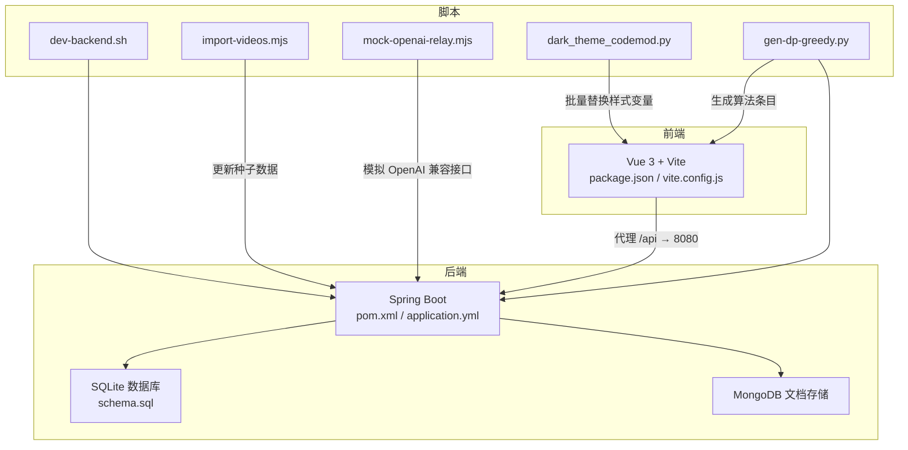
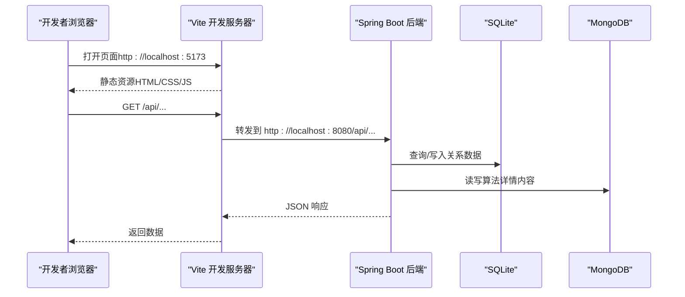
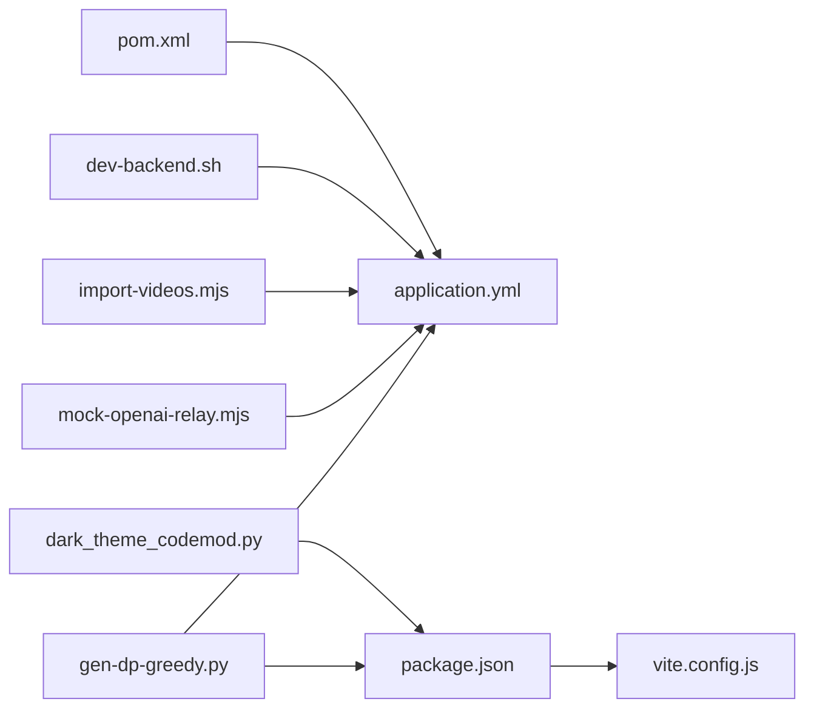

# 开发工具

<cite>
**本文引用的文件**
- [backend/pom.xml](file://backend/pom.xml)
- [backend/src/main/resources/application.yml](file://backend/src/main/resources/application.yml)
- [backend/src/main/resources/schema.sql](file://backend/src/main/resources/schema.sql)
- [suanfa_vue/package.json](file://suanfa_vue/package.json)
- [suanfa_vue/vite.config.js](file://suanfa_vue/vite.config.js)
- [scripts/dev-backend.sh](file://scripts/dev-backend.sh)
- [scripts/import-videos.mjs](file://scripts/import-videos.mjs)
- [scripts/mock-openai-relay.mjs](file://scripts/mock-openai-relay.mjs)
- [scripts/dark_theme_codemod.py](file://scripts/dark_theme_codemod.py)
- [scripts/gen-dp-greedy.py](file://scripts/gen-dp-greedy.py)
</cite>

## 目录
1. [简介](#简介)
2. [项目结构](#项目结构)
3. [核心组件](#核心组件)
4. [架构总览](#架构总览)
5. [详细组件分析](#详细组件分析)
6. [依赖分析](#依赖分析)
7. [性能考虑](#性能考虑)
8. [故障排查指南](#故障排查指南)
9. [结论](#结论)
10. [附录](#附录)

## 简介
本文件面向开发者，提供高效、可复用的开发工具链与配置建议，覆盖 IDE 设置、代码格式化、构建与脚本、开发服务器、常用工具推荐以及自动化脚本使用。目标是提升本地联调效率、统一团队规范、降低出错成本并提高代码质量。

## 项目结构
本项目为前后端分离：
- 后端：Spring Boot + JDBC/SQLite + MongoDB（算法详情内容），通过 Maven 管理依赖与构建。
- 前端：Vue 3 + Vite，提供算法可视化与学习页面，通过 NPM/Vite 脚本进行开发与构建。
- 脚本：提供后端一键启动、数据导入、Mock 服务、批量样式替换等自动化能力。

**图表来源**
- [suanfa_vue/package.json:1-23](file://suanfa_vue/package.json#L1-L23)
- [suanfa_vue/vite.config.js:1-22](file://suanfa_vue/vite.config.js#L1-L22)
- [backend/pom.xml:1-89](file://backend/pom.xml#L1-L89)
- [backend/src/main/resources/application.yml:1-102](file://backend/src/main/resources/application.yml#L1-L102)
- [backend/src/main/resources/schema.sql:1-77](file://backend/src/main/resources/schema.sql#L1-L77)
- [scripts/dev-backend.sh:1-46](file://scripts/dev-backend.sh#L1-L46)
- [scripts/import-videos.mjs:1-29](file://scripts/import-videos.mjs#L1-L29)
- [scripts/mock-openai-relay.mjs:1-58](file://scripts/mock-openai-relay.mjs#L1-L58)
- [scripts/dark_theme_codemod.py:1-207](file://scripts/dark_theme_codemod.py#L1-L207)
- [scripts/gen-dp-greedy.py:1-1319](file://scripts/gen-dp-greedy.py#L1-L1319)

**章节来源**
- [backend/pom.xml:1-89](file://backend/pom.xml#L1-L89)
- [backend/src/main/resources/application.yml:1-102](file://backend/src/main/resources/application.yml#L1-L102)
- [backend/src/main/resources/schema.sql:1-77](file://backend/src/main/resources/schema.sql#L1-L77)
- [suanfa_vue/package.json:1-23](file://suanfa_vue/package.json#L1-L23)
- [suanfa_vue/vite.config.js:1-22](file://suanfa_vue/vite.config.js#L1-L22)
- [scripts/dev-backend.sh:1-46](file://scripts/dev-backend.sh#L1-L46)
- [scripts/import-videos.mjs:1-29](file://scripts/import-videos.mjs#L1-L29)
- [scripts/mock-openai-relay.mjs:1-58](file://scripts/mock-openai-relay.mjs#L1-L58)
- [scripts/dark_theme_codemod.py:1-207](file://scripts/dark_theme_codemod.py#L1-L207)
- [scripts/gen-dp-greedy.py:1-1319](file://scripts/gen-dp-greedy.py#L1-L1319)

## 核心组件
- 后端构建与依赖：Maven + Spring Boot Starter Web/JDBC/MongoDB/JWT；应用端口、数据库连接、Jackson 序列化、日志级别等由 application.yml 管理。
- 前端构建与开发：Vite + Vue 插件；NPM scripts 提供 dev/build/preview；vite.config.js 配置了外部访问与 /api 代理到后端 8080。
- 开发服务器：Vite 开发服务器支持热重载；后端通过脚本自动加载 .env 环境变量并启动，同时提供健康检查。
- 数据层：SQLite 用于关系型表（用户、进度、笔记、评论、训练记录等）；MongoDB 用于算法详情内容。
- 自动化脚本：后端一键启动、视频数据导入、OpenAI 兼容 Mock 服务、样式主题批量替换、算法条目生成器。

**章节来源**
- [backend/pom.xml:24-86](file://backend/pom.xml#L24-L86)
- [backend/src/main/resources/application.yml:1-102](file://backend/src/main/resources/application.yml#L1-L102)
- [backend/src/main/resources/schema.sql:1-77](file://backend/src/main/resources/schema.sql#L1-L77)
- [suanfa_vue/package.json:6-21](file://suanfa_vue/package.json#L6-L21)
- [suanfa_vue/vite.config.js:5-21](file://suanfa_vue/vite.config.js#L5-L21)
- [scripts/dev-backend.sh:1-46](file://scripts/dev-backend.sh#L1-L46)
- [scripts/import-videos.mjs:1-29](file://scripts/import-videos.mjs#L1-L29)
- [scripts/mock-openai-relay.mjs:1-58](file://scripts/mock-openai-relay.mjs#L1-L58)
- [scripts/dark_theme_codemod.py:1-207](file://scripts/dark_theme_codemod.py#L1-L207)
- [scripts/gen-dp-greedy.py:1-1319](file://scripts/gen-dp-greedy.py#L1-L1319)

## 架构总览
下图展示了开发环境中的请求流转：前端通过 Vite 开发服务器发起请求，/api 路径被代理到后端 8080；后端读取 SQLite 与 MongoDB 数据，并通过 JWT 鉴权保护资源。

**图表来源**
- [suanfa_vue/vite.config.js:10-20](file://suanfa_vue/vite.config.js#L10-L20)
- [backend/src/main/resources/application.yml:1-16](file://backend/src/main/resources/application.yml#L1-L16)
- [backend/src/main/resources/schema.sql:1-77](file://backend/src/main/resources/schema.sql#L1-L77)

## 详细组件分析

### IDE 与编辑器配置建议
- VS Code
  - 插件建议：Vue Language Features（或官方 Vue 扩展）、ESLint、Prettier、Tailwind CSS IntelliSense（如使用）、GitLens、Error Lens、DotENV（便于编辑 .env）。
  - 工作区设置：启用保存时格式化；将 Prettier 作为默认格式化器；对 .vue/.js/.css 开启 ESLint 校验；忽略 node_modules 与 dist。
  - 调试：为 Node 脚本添加 launch 配置（如 mock-openai-relay.mjs），便于断点调试。
- IntelliJ IDEA
  - 插件建议：Vue.js、Database Tools and SQL、Maven、REST Client、JSON Schema Detection。
  - 运行配置：创建 Spring Boot 运行配置，指定 application.yml 与环境变量；为 Node 脚本创建运行配置以调试 mock 服务。
  - 代码风格：统一缩进、行尾、引号规则；启用 Save Actions 在保存时格式化。

[本节为通用建议，不直接分析具体文件]

### 代码格式化与质量检查
- 前端
  - 使用 Prettier + ESLint 统一格式与规范；在 package.json 中定义 lint/format 脚本；配合 Husky 在提交前执行。
  - 针对 Vue 单文件组件，确保模板、脚本、样式分别格式化。
- 后端
  - 使用 Spotless + Checkstyle 或 Google Java Format 统一 Java 代码风格；在 Maven 插件中集成。
  - 使用 SonarQube 或 GitHub/GitLab CI 做质量门禁。
- 脚本
  - 对 Python 脚本使用 Black 或 Ruff 格式化；对 JS/TS 使用 ESLint/Prettier。

[本节为通用建议，不直接分析具体文件]

### 构建工具与依赖管理
- Maven（后端）
  - 父工程：spring-boot-starter-parent 3.2.0；Java 版本 17。
  - 关键依赖：Web、JDBC、SQLite、MongoDB、JWT、Security Crypto、Test。
  - 构建插件：spring-boot-maven-plugin 打包与运行。
- Vite（前端）
  - 脚本：dev/build/preview；插件 @vitejs/plugin-vue；依赖 Vue 3、Pinia、Router、Markdown/DOMPurify。
  - 构建产物：按需拆分 chunk，懒加载粒度合理。

**章节来源**
- [backend/pom.xml:7-22](file://backend/pom.xml#L7-L22)
- [backend/pom.xml:24-86](file://backend/pom.xml#L24-L86)
- [suanfa_vue/package.json:6-21](file://suanfa_vue/package.json#L6-L21)

### 开发服务器与代理配置
- Vite 开发服务器
  - host: true 允许局域网访问；/api 代理到 http://localhost:8080，changeOrigin 开启以解决跨域。
  - 热重载：修改 .vue/.js/.css 即时生效，无需刷新。
- 后端开发启动
  - 脚本 dev-backend.sh 自动加载 backend/.env 环境变量，停止旧进程后后台启动 spring-boot:run，监听指定端口，轮询 /api/ai/status 确认就绪。
  - 日志输出至 /tmp/suanfa-backend-{port}.log，便于定位问题。

**章节来源**
- [suanfa_vue/vite.config.js:10-20](file://suanfa_vue/vite.config.js#L10-L20)
- [scripts/dev-backend.sh:1-46](file://scripts/dev-backend.sh#L1-L46)

### 环境变量与配置管理
- 后端 application.yml
  - 服务端口、SQLite 路径、MongoDB URI、SQL 初始化模式、Jackson 非空序列化、日志级别。
  - 自定义 suanfa.* 配置：JWT 密钥与过期、CORS 白名单、AI 中转站 base-url/token/model、超时与限流、知识库开关、管理员用户名白名单、providers-json 多中转站配置、代码执行超时与限流。
- 环境变量
  - 通过 .env 注入 AI_*、CODE_* 等键值；脚本 dev-backend.sh 自动加载并在运行时生效。
- 前端
  - Vite 代理仅用于开发阶段；生产环境应通过反向代理或域名策略处理跨域。

**章节来源**
- [backend/src/main/resources/application.yml:1-102](file://backend/src/main/resources/application.yml#L1-L102)
- [scripts/dev-backend.sh:15-22](file://scripts/dev-backend.sh#L15-L22)

### 数据库与数据初始化
- SQLite
  - schema.sql 定义了 algorithms、users、progress、notes、comments、app_settings、training 等表及索引。
  - 应用启动时根据 sql.init.mode=always 与 schema-locations 自动初始化。
- MongoDB
  - 用于算法详情内容（文档型数据），URI 在 application.yml 中配置。
- 数据导入
  - import-videos.mjs 读取 bilibili 视频映射，填充 seed/algorithms-content.json，并生成 MongoDB 更新脚本。

**章节来源**
- [backend/src/main/resources/schema.sql:1-77](file://backend/src/main/resources/schema.sql#L1-L77)
- [backend/src/main/resources/application.yml:8-16](file://backend/src/main/resources/application.yml#L8-L16)
- [scripts/import-videos.mjs:1-29](file://scripts/import-videos.mjs#L1-L29)

### 常用工具推荐
- API 测试：Postman、Insomnia、Thunder Client（VS Code）、HTTPie。
- 数据库管理：DBeaver、DataGrip、SQLite Expert、MongoDB Compass。
- 代码质量：SonarQube、CodeClimate、GitHub/GitLab CI 质量门禁。
- 文档与协作：Swagger/OpenAPI（可扩展）、Notion/语雀、Confluence。
- 监控与日志：ELK、Prometheus+Grafana、Sentry（前端错误上报）。

[本节为通用建议，不直接分析具体文件]

### 自动化脚本与最佳实践
- 后端一键启动
  - dev-backend.sh：加载 .env、停旧进程、后台启动、健康检查、打印就绪状态与 AI 配置摘要。
  - 建议：将敏感信息放入 .env；CI 中通过环境变量注入；日志集中收集。
- 数据导入导出
  - import-videos.mjs：批量填充视频链接，生成 MongoDB 更新脚本，便于在生产库执行。
  - 建议：导入前备份；校验 id 匹配；失败重试与幂等设计。
- Mock 服务
  - mock-openai-relay.mjs：最小 OpenAI 兼容上游，提供 /v1/models 与 /v1/chat/completions（含 SSE 流式与非流式），便于联调与错误场景验证。
  - 建议：在 CI 中启动 Mock 服务进行端到端测试；覆盖 404/429 等异常分支。
- 批量样式替换
  - dark_theme_codemod.py：将硬编码颜色替换为主题变量，保持深色主题一致性。
  - 建议：在提交前运行；保留 diff 以便审查；逐步迁移避免一次性大改。
- 算法条目生成
  - gen-dp-greedy.py：生成动态规划/贪心算法条目，同步更新前端数据与后端种子文件，保证前后端一致。
  - 建议：新增算法时优先维护该脚本；使用 id 去重；定期回归校验。

**章节来源**
- [scripts/dev-backend.sh:1-46](file://scripts/dev-backend.sh#L1-L46)
- [scripts/import-videos.mjs:1-29](file://scripts/import-videos.mjs#L1-L29)
- [scripts/mock-openai-relay.mjs:1-58](file://scripts/mock-openai-relay.mjs#L1-L58)
- [scripts/dark_theme_codemod.py:1-207](file://scripts/dark_theme_codemod.py#L1-L207)
- [scripts/gen-dp-greedy.py:1-1319](file://scripts/gen-dp-greedy.py#L1-L1319)

## 依赖分析
- 后端依赖
  - Spring Boot Web、JDBC、SQLite、MongoDB、JWT、Security Crypto、Test。
  - 构建插件：spring-boot-maven-plugin。
- 前端依赖
  - Vue 3、Pinia、Router、marked、DOMPurify；开发依赖 Vite 与 Vue 插件。
- 脚本依赖
  - Node.js 原生模块（fs、http）；Python 标准库（os、re、json、pathlib）。

**图表来源**
- [backend/pom.xml:24-86](file://backend/pom.xml#L24-L86)
- [backend/src/main/resources/application.yml:1-102](file://backend/src/main/resources/application.yml#L1-L102)
- [suanfa_vue/package.json:6-21](file://suanfa_vue/package.json#L6-L21)
- [suanfa_vue/vite.config.js:5-21](file://suanfa_vue/vite.config.js#L5-L21)
- [scripts/dev-backend.sh:1-46](file://scripts/dev-backend.sh#L1-L46)
- [scripts/import-videos.mjs:1-29](file://scripts/import-videos.mjs#L1-L29)
- [scripts/mock-openai-relay.mjs:1-58](file://scripts/mock-openai-relay.mjs#L1-L58)
- [scripts/dark_theme_codemod.py:1-207](file://scripts/dark_theme_codemod.py#L1-L207)
- [scripts/gen-dp-greedy.py:1-1319](file://scripts/gen-dp-greedy.py#L1-L1319)

**章节来源**
- [backend/pom.xml:24-86](file://backend/pom.xml#L24-L86)
- [suanfa_vue/package.json:6-21](file://suanfa_vue/package.json#L6-L21)

## 性能考虑
- 前端构建
  - 按需引入与懒加载已启用；减少大体积依赖（如 xlsx 已移除）；CSS 与 JS 分块合理。
  - 建议：开启 Gzip/Brotli；CDN 缓存静态资源；图片与媒体资源压缩。
- 后端性能
  - SQLite 适合轻量场景；MongoDB 用于文档型内容；注意连接池与超时配置。
  - 建议：对热点接口加缓存（如 Redis）；限制 AI 调用频率与超时；合理使用索引。
- 脚本性能
  - 批量替换与数据导入应增量执行；避免全量重写；加入幂等与回滚机制。

[本节为通用建议，不直接分析具体文件]

## 故障排查指南
- 后端启动失败
  - 检查 .env 是否加载成功；查看 /tmp/suanfa-backend-{port}.log；确认端口占用与防火墙。
  - 若 AI 相关接口不可用，检查 AI_BASE_URL/AI_API_KEY/AI_MODEL 等环境变量。
- 前端代理无效
  - 确认 vite.config.js 的 server.proxy 配置；检查后端是否监听 8080；浏览器控制台查看网络请求。
- 数据库初始化问题
  - 确认 schema.sql 路径与 sql.init.mode；检查 SQLite 文件权限与路径；MongoDB 连接字符串是否正确。
- 数据导入失败
  - 检查输入 JSON 结构与 id 映射；确认目标集合存在；查看生成的更新脚本语法。
- Mock 服务异常
  - 检查路由与模型名；确认流式与非流式响应格式；捕获 404/429 等错误分支。

**章节来源**
- [scripts/dev-backend.sh:24-45](file://scripts/dev-backend.sh#L24-L45)
- [backend/src/main/resources/application.yml:1-16](file://backend/src/main/resources/application.yml#L1-L16)
- [backend/src/main/resources/schema.sql:1-77](file://backend/src/main/resources/schema.sql#L1-L77)
- [scripts/import-videos.mjs:1-29](file://scripts/import-videos.mjs#L1-L29)
- [scripts/mock-openai-relay.mjs:1-58](file://scripts/mock-openai-relay.mjs#L1-L58)

## 结论
通过统一的 IDE 配置、严格的代码规范、合理的构建与脚本体系，以及完善的开发服务器与数据管理流程，可以显著提升团队协作效率与代码质量。建议将上述配置纳入团队规范，并在 CI 中固化质量门禁与自动化任务。

## 附录
- 快速开始
  - 前端：安装依赖后运行 dev 脚本；访问 http://localhost:5173。
  - 后端：准备 .env 后运行 dev-backend.sh；访问 http://localhost:8080。
  - 联调：Vite 将 /api 代理到后端；可在浏览器网络面板观察请求。
- 常用命令
  - 前端：npm run dev / build / preview。
  - 后端：scripts/dev-backend.sh [--port 8080]。
  - 数据：scripts/import-videos.mjs；scripts/mock-openai-relay.mjs。
  - 样式：scripts/dark_theme_codemod.py；scripts/gen-dp-greedy.py。

[本节为操作指引，不直接分析具体文件]