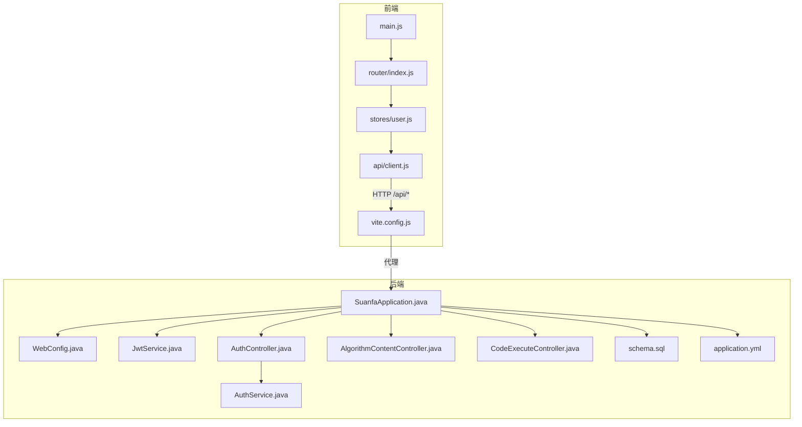
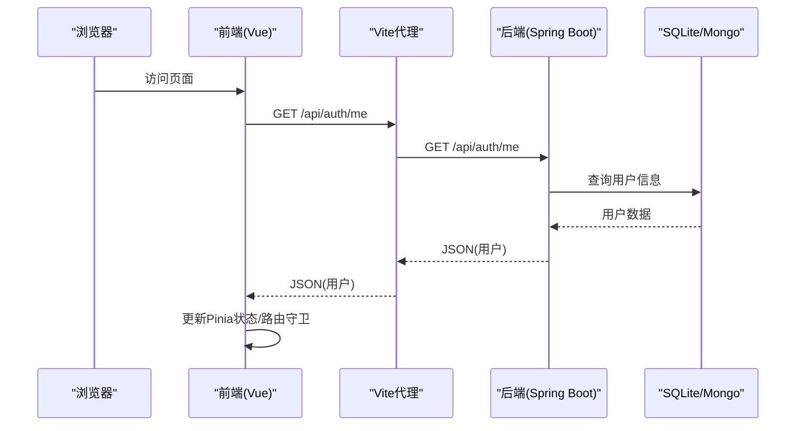
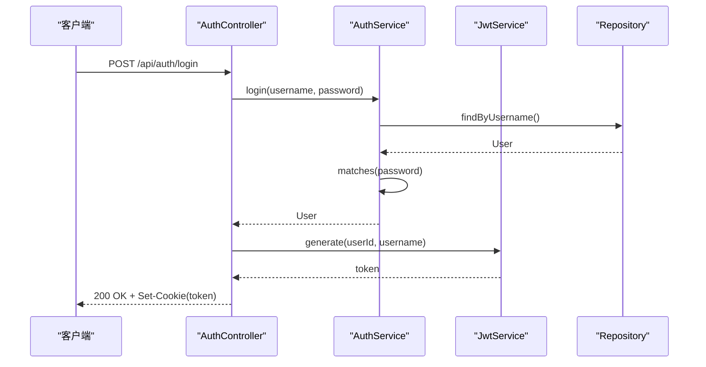
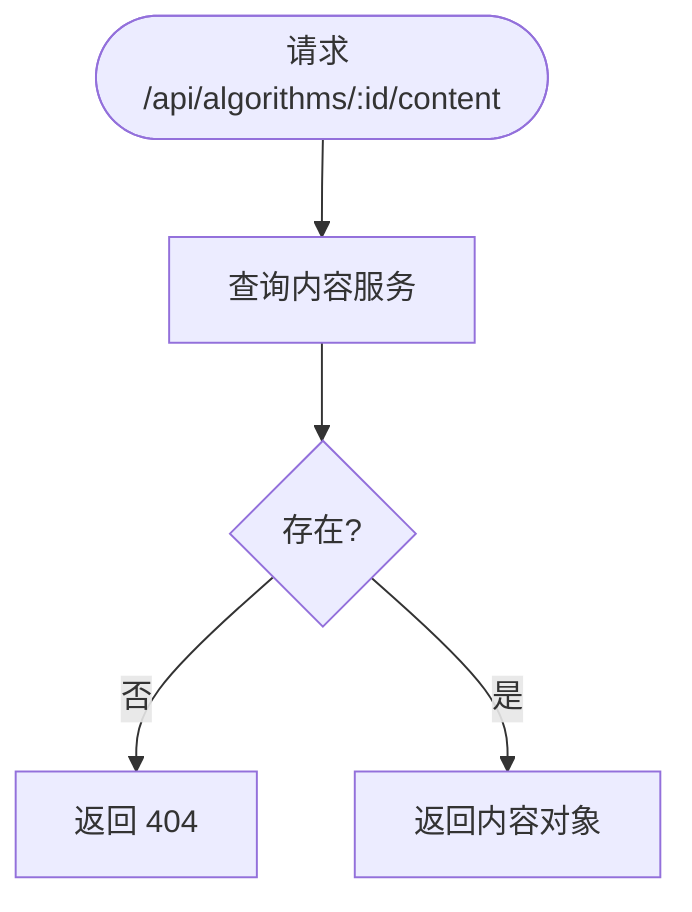
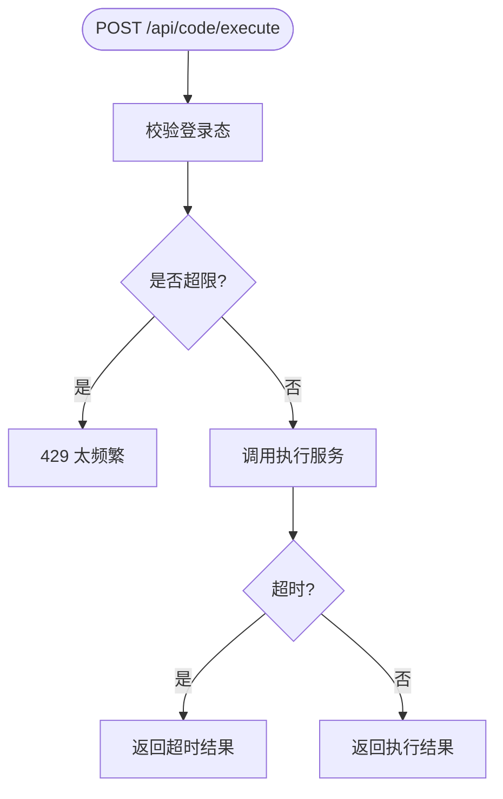
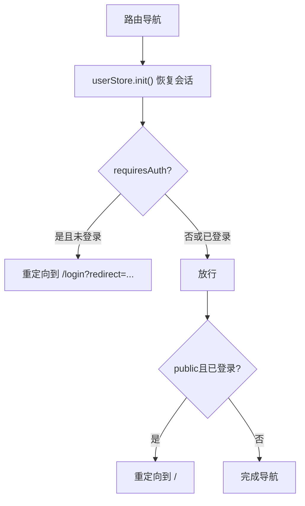
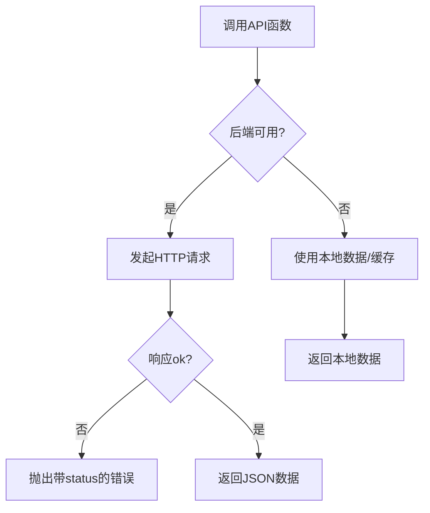
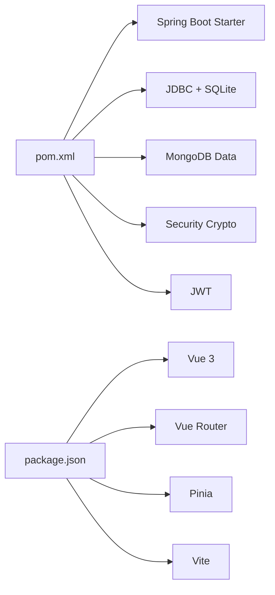

# 开发指南

<cite>
**本文引用的文件**
- [backend/pom.xml](file://backend/pom.xml)
- [backend/src/main/resources/application.yml](file://backend/src/main/resources/application.yml)
- [backend/src/main/java/com/suanfa/SuanfaApplication.java](file://backend/src/main/java/com/suanfa/SuanfaApplication.java)
- [backend/src/main/java/com/suanfa/config/WebConfig.java](file://backend/src/main/java/com/suanfa/config/WebConfig.java)
- [backend/src/main/java/com/suanfa/security/JwtService.java](file://backend/src/main/java/com/suanfa/security/JwtService.java)
- [backend/src/main/java/com/suanfa/controller/AuthController.java](file://backend/src/main/java/com/suanfa/controller/AuthController.java)
- [backend/src/main/java/com/suanfa/service/AuthService.java](file://backend/src/main/java/com/suanfa/service/AuthService.java)
- [backend/src/main/resources/schema.sql](file://backend/src/main/resources/schema.sql)
- [backend/src/main/java/com/suanfa/controller/AlgorithmContentController.java](file://backend/src/main/java/com/suanfa/controller/AlgorithmContentController.java)
- [backend/src/main/java/com/suanfa/controller/CodeExecuteController.java](file://backend/src/main/java/com/suanfa/controller/CodeExecuteController.java)
- [suanfa_vue/package.json](file://suanfa_vue/package.json)
- [suanfa_vue/vite.config.js](file://suanfa_vue/vite.config.js)
- [suanfa_vue/src/main.js](file://suanfa_vue/src/main.js)
- [suanfa_vue/src/router/index.js](file://suanfa_vue/src/router/index.js)
- [suanfa_vue/src/stores/user.js](file://suanfa_vue/src/stores/user.js)
- [suanfa_vue/src/components/common/Login.vue](file://suanfa_vue/src/components/common/Login.vue)
- [suanfa_vue/src/api/client.js](file://suanfa_vue/src/api/client.js)
</cite>

## 目录
1. [简介](#简介)
2. [项目结构](#项目结构)
3. [核心组件](#核心组件)
4. [架构总览](#架构总览)
5. [详细组件分析](#详细组件分析)
6. [依赖关系分析](#依赖关系分析)
7. [性能与可观测性](#性能与可观测性)
8. [调试与联调指南](#调试与联调指南)
9. [测试策略与实践](#测试策略与实践)
10. [版本控制与协作规范](#版本控制与协作规范)
11. [代码规范与约定](#代码规范与约定)
12. [常见问题与排障](#常见问题与排障)
13. [结论](#结论)

## 简介
本指南面向贡献者，提供从环境搭建、前后端联调到提交与审查的标准化流程；明确 Java/Vue/API 规范；给出调试、测试、性能优化建议与最佳实践，确保团队协作一致性与代码质量。

## 项目结构
- 后端：Spring Boot（Java 17），SQLite 持久化用户/进度/笔记/评论/训练记录，MongoDB 存储算法详情内容；JWT 认证；SSE 流式 AI 聊天；代码执行沙箱接口。
- 前端：Vue 3 + Vite + Pinia + Vue Router；通过 Vite 代理将 /api 转发到后端；具备“后端优先、离线降级”的 API 客户端。

**图表来源**
- [suanfa_vue/src/main.js:1-12](file://suanfa_vue/src/main.js#L1-L12)
- [suanfa_vue/src/router/index.js:1-124](file://suanfa_vue/src/router/index.js#L1-L124)
- [suanfa_vue/src/stores/user.js:1-36](file://suanfa_vue/src/stores/user.js#L1-L36)
- [suanfa_vue/src/api/client.js:1-725](file://suanfa_vue/src/api/client.js#L1-L725)
- [suanfa_vue/vite.config.js:1-22](file://suanfa_vue/vite.config.js#L1-L22)
- [backend/src/main/java/com/suanfa/SuanfaApplication.java:1-22](file://backend/src/main/java/com/suanfa/SuanfaApplication.java#L1-L22)
- [backend/src/main/java/com/suanfa/config/WebConfig.java:1-46](file://backend/src/main/java/com/suanfa/config/WebConfig.java#L1-L46)
- [backend/src/main/java/com/suanfa/security/JwtService.java:1-56](file://backend/src/main/java/com/suanfa/security/JwtService.java#L1-L56)
- [backend/src/main/java/com/suanfa/controller/AuthController.java:1-94](file://backend/src/main/java/com/suanfa/controller/AuthController.java#L1-L94)
- [backend/src/main/java/com/suanfa/service/AuthService.java:1-53](file://backend/src/main/java/com/suanfa/service/AuthService.java#L1-L53)
- [backend/src/main/resources/schema.sql:1-77](file://backend/src/main/resources/schema.sql#L1-L77)
- [backend/src/main/resources/application.yml:1-102](file://backend/src/main/resources/application.yml#L1-L102)

**章节来源**
- [backend/pom.xml:1-89](file://backend/pom.xml#L1-L89)
- [backend/src/main/resources/application.yml:1-102](file://backend/src/main/resources/application.yml#L1-L102)
- [suanfa_vue/package.json:1-23](file://suanfa_vue/package.json#L1-L23)
- [suanfa_vue/vite.config.js:1-22](file://suanfa_vue/vite.config.js#L1-L22)

## 核心组件
- 应用入口与配置
  - 启动类负责创建数据目录并启动 Spring Boot。
  - Web 配置启用 CORS、自定义参数解析器（当前用户 ID）。
  - 应用配置集中管理端口、数据库、Mongo、AI、限流等。
- 安全与认证
  - JWT 签发/解析服务；登录/注册/登出控制器；Cookie 设置 SameSite/Lax。
  - 密码使用 BCrypt 加密。
- 业务控制器
  - 算法详情内容只读接口。
  - 代码执行接口（需登录、限流）。
- 前端
  - 路由守卫基于 Pinia 状态恢复会话，按 meta 控制鉴权。
  - API 客户端统一封装请求、错误处理、后端可用性探测与离线降级。

**章节来源**
- [backend/src/main/java/com/suanfa/SuanfaApplication.java:1-22](file://backend/src/main/java/com/suanfa/SuanfaApplication.java#L1-L22)
- [backend/src/main/java/com/suanfa/config/WebConfig.java:1-46](file://backend/src/main/java/com/suanfa/config/WebConfig.java#L1-L46)
- [backend/src/main/resources/application.yml:1-102](file://backend/src/main/resources/application.yml#L1-L102)
- [backend/src/main/java/com/suanfa/security/JwtService.java:1-56](file://backend/src/main/java/com/suanfa/security/JwtService.java#L1-L56)
- [backend/src/main/java/com/suanfa/controller/AuthController.java:1-94](file://backend/src/main/java/com/suanfa/controller/AuthController.java#L1-L94)
- [backend/src/main/java/com/suanfa/service/AuthService.java:1-53](file://backend/src/main/java/com/suanfa/service/AuthService.java#L1-L53)
- [backend/src/main/java/com/suanfa/controller/AlgorithmContentController.java:1-27](file://backend/src/main/java/com/suanfa/controller/AlgorithmContentController.java#L1-L27)
- [backend/src/main/java/com/suanfa/controller/CodeExecuteController.java:1-40](file://backend/src/main/java/com/suanfa/controller/CodeExecuteController.java#L1-L40)
- [suanfa_vue/src/router/index.js:1-124](file://suanfa_vue/src/router/index.js#L1-L124)
- [suanfa_vue/src/stores/user.js:1-36](file://suanfa_vue/src/stores/user.js#L1-L36)
- [suanfa_vue/src/api/client.js:1-725](file://suanfa_vue/src/api/client.js#L1-L725)

## 架构总览
系统采用前后端分离架构：
- 前端通过 Vite 开发服务器代理 /api 到后端，生产部署时由网关/Nginx 反向代理。
- 后端以 RESTful 暴露能力，支持 SSE 流式响应（AI 聊天）。
- 数据层：SQLite 用于结构化数据，MongoDB 用于文档型内容。

**图表来源**
- [suanfa_vue/vite.config.js:10-20](file://suanfa_vue/vite.config.js#L10-L20)
- [backend/src/main/java/com/suanfa/controller/AuthController.java:60-71](file://backend/src/main/java/com/suanfa/controller/AuthController.java#L60-L71)
- [backend/src/main/resources/application.yml:4-16](file://backend/src/main/resources/application.yml#L4-L16)

## 详细组件分析

### 认证与安全
- 登录/注册/登出/当前用户
  - 登录成功返回用户信息并通过 httpOnly Cookie 下发 JWT。
  - 未登录或无效 token 返回 401。
- JWT 服务
  - HS256 签名，subject=userId，包含 username claim，过期时间可配置。
- 密码安全
  - 使用 BCrypt 进行哈希校验。

**图表来源**
- [backend/src/main/java/com/suanfa/controller/AuthController.java:43-52](file://backend/src/main/java/com/suanfa/controller/AuthController.java#L43-L52)
- [backend/src/main/java/com/suanfa/service/AuthService.java:35-43](file://backend/src/main/java/com/suanfa/service/AuthService.java#L35-L43)
- [backend/src/main/java/com/suanfa/security/JwtService.java:28-36](file://backend/src/main/java/com/suanfa/security/JwtService.java#L28-L36)

**章节来源**
- [backend/src/main/java/com/suanfa/controller/AuthController.java:1-94](file://backend/src/main/java/com/suanfa/controller/AuthController.java#L1-L94)
- [backend/src/main/java/com/suanfa/service/AuthService.java:1-53](file://backend/src/main/java/com/suanfa/service/AuthService.java#L1-L53)
- [backend/src/main/java/com/suanfa/security/JwtService.java:1-56](file://backend/src/main/java/com/suanfa/security/JwtService.java#L1-L56)

### 算法详情与内容
- 公开只读接口：GET /api/algorithms/{id}/content
- 数据源：MongoDB 文档（sections/tabs/videos）
- 不存在返回 404

**图表来源**
- [backend/src/main/java/com/suanfa/controller/AlgorithmContentController.java:22-26](file://backend/src/main/java/com/suanfa/controller/AlgorithmContentController.java#L22-L26)

**章节来源**
- [backend/src/main/java/com/suanfa/controller/AlgorithmContentController.java:1-27](file://backend/src/main/java/com/suanfa/controller/AlgorithmContentController.java#L1-L27)

### 代码执行工作台
- 接口
  - GET /api/code/languages：获取可用语言工具链
  - POST /api/code/execute：编译运行代码（需登录、限流）
- 限流：每分钟次数限制，默认 15 次/分钟
- 超时：编译/运行超时秒数可配置

**图表来源**
- [backend/src/main/java/com/suanfa/controller/CodeExecuteController.java:18-40](file://backend/src/main/java/com/suanfa/controller/CodeExecuteController.java#L18-L40)
- [backend/src/main/resources/application.yml:92-96](file://backend/src/main/resources/application.yml#L92-L96)

**章节来源**
- [backend/src/main/java/com/suanfa/controller/CodeExecuteController.java:1-40](file://backend/src/main/java/com/suanfa/controller/CodeExecuteController.java#L1-L40)
- [backend/src/main/resources/application.yml:92-96](file://backend/src/main/resources/application.yml#L92-L96)

### 前端路由与会话恢复
- 路由守卫在每次导航前恢复会话（/auth/me），根据 requiresAuth/public 元信息进行跳转。
- 已登录访问登录页自动重定向首页。

**图表来源**
- [suanfa_vue/src/router/index.js:109-120](file://suanfa_vue/src/router/index.js#L109-L120)
- [suanfa_vue/src/stores/user.js:14-23](file://suanfa_vue/src/stores/user.js#L14-L23)

**章节来源**
- [suanfa_vue/src/router/index.js:1-124](file://suanfa_vue/src/router/index.js#L1-L124)
- [suanfa_vue/src/stores/user.js:1-36](file://suanfa_vue/src/stores/user.js#L1-L36)

### API 客户端与离线降级
- 统一 request 封装：携带 credentials、统一错误体、非 2xx 抛错。
- 后端可用性探测：HEAD /api/algorithms，失败缓存 30 秒。
- 功能降级：无后端时使用本地数据（localStorage 或内存）。

**图表来源**
- [suanfa_vue/src/api/client.js:17-43](file://suanfa_vue/src/api/client.js#L17-L43)
- [suanfa_vue/src/api/client.js:49-105](file://suanfa_vue/src/api/client.js#L49-L105)

**章节来源**
- [suanfa_vue/src/api/client.js:1-725](file://suanfa_vue/src/api/client.js#L1-L725)

## 依赖关系分析
- 后端依赖
  - Spring Boot Web、JDBC、SQLite、MongoDB、Security Crypto、JWT。
  - 启动类确保 data 目录存在；application.yml 配置数据源、Mongo、Jackson、AI、限流等。
- 前端依赖
  - Vue 3、Vue Router、Pinia、Vite、marked、DOMPurify。
  - Vite 配置开启 host 与 /api 代理到 8080。

**图表来源**
- [backend/pom.xml:24-78](file://backend/pom.xml#L24-L78)
- [suanfa_vue/package.json:11-21](file://suanfa_vue/package.json#L11-L21)

**章节来源**
- [backend/pom.xml:1-89](file://backend/pom.xml#L1-L89)
- [suanfa_vue/package.json:1-23](file://suanfa_vue/package.json#L1-L23)

## 性能与可观测性
- 后端
  - 使用 Jackson 非空序列化减少负载。
  - 日志级别：根 info，com.suanfa debug，便于定位问题。
  - AI 聊天使用 SSE 流式输出，降低首屏等待。
  - 代码执行与 AI 均有限流保护。
- 前端
  - 后端不可用时的离线降级，提升可用性。
  - 路由懒加载组件，减小初始包体积。
  - 使用 Vite 热更新加速开发。

[本节为通用指导，不直接分析具体文件]

## 调试与联调指南
- 启动后端
  - 确保 data 目录存在（启动类会自动创建）。
  - 检查 application.yml 中 SQLite 路径、Mongo URI、AI 配置。
- 启动前端
  - 安装依赖后运行 dev，Vite 监听所有网卡并将 /api 代理到 8080。
- 常见联调问题
  - CORS：确认 allowed-origins 包含前端域名或 *。
  - Cookie：SameSite=Lax，跨域需同源或正确配置。
  - 离线模式：若后端不可用，前端会回退本地数据，注意区分真实错误与降级行为。
  - AI 聊天：未配置 API Key 时返回 503，前端自动降级本地答疑。

**章节来源**
- [backend/src/main/java/com/suanfa/SuanfaApplication.java:13-19](file://backend/src/main/java/com/suanfa/SuanfaApplication.java#L13-L19)
- [backend/src/main/resources/application.yml:4-16](file://backend/src/main/resources/application.yml#L4-L16)
- [backend/src/main/resources/application.yml:18-49](file://backend/src/main/resources/application.yml#L18-L49)
- [backend/src/main/java/com/suanfa/config/WebConfig.java:33-44](file://backend/src/main/java/com/suanfa/config/WebConfig.java#L33-L44)
- [suanfa_vue/vite.config.js:10-20](file://suanfa_vue/vite.config.js#L10-L20)
- [suanfa_vue/src/api/client.js:17-28](file://suanfa_vue/src/api/client.js#L17-L28)

## 测试策略与实践
- 后端
  - 单元测试：针对 AuthService、JwtService、CodeExecuteController 的边界条件（限流、超时、非法输入）。
  - 集成测试：启动嵌入式 SQLite，验证 schema.sql 建表与基本 CRUD。
  - 接口测试：对 /api/auth、/api/algorithms、/api/code 做端到端断言。
- 前端
  - 单元测试：Pinia store 的登录/登出流程、路由守卫逻辑。
  - 组件测试：Login.vue 表单校验与交互。
  - E2E：覆盖登录、查看算法详情、训练题单筛选与保存。
- 建议
  - 使用 Mock 外部依赖（如 MongoDB、AI 上游）隔离不稳定因素。
  - 对关键路径（登录、代码执行、AI 聊天）增加契约测试。

[本节为通用指导，不直接分析具体文件]

## 版本控制与协作规范
- 分支策略
  - main：稳定发布分支。
  - develop：集成分支。
  - feature/*：新功能。
  - fix/*：缺陷修复。
  - release/*：发布准备。
- 提交规范
  - 类型：feat/fix/docs/style/refactor/test/chore。
  - 格式：<type>(scope): <subject>
  - 示例：feat(auth): 添加登录重试与错误提示
- 代码审查
  - 至少一名 reviewer 批准后方可合并。
  - 关注：接口变更、安全性、性能、可维护性、测试覆盖。
- 发布
  - 打 tag vX.Y.Z，构建产物归档，更新变更日志。

[本节为通用指导，不直接分析具体文件]

## 代码规范与约定
- Java 编码标准
  - 命名：类名大驼峰，方法/变量小驼峰，常量全大写。
  - 分层：controller -> service -> repository，职责清晰。
  - 异常：统一错误响应体，避免裸异常上抛。
  - 配置：敏感信息通过环境变量注入，不在代码硬编码。
- Vue 组件规范
  - 单文件组件，script setup 风格。
  - 状态管理：复杂状态放入 Pinia store。
  - 样式：scoped 样式，主题变量统一。
  - 路由：按需懒加载，meta 标注权限。
- API 设计规范
  - RESTful 风格，资源名词复数，动词用 HTTP 方法表达。
  - 统一响应：成功返回数据，失败返回 { message }。
  - 鉴权：受保护接口通过 Cookie + JWT 校验。
  - 版本：必要时在 URL 中加入版本号（如 /api/v1/...）。

[本节为通用指导，不直接分析具体文件]

## 常见问题与排障
- 无法登录/401
  - 检查 Cookie 是否被浏览器拦截（SameSite/Lax）、CORS 是否允许凭据。
  - 确认后端 JWT 密钥与过期时间配置正确。
- 前端始终走离线模式
  - 检查 Vite 代理是否生效（/api 是否转发到 8080）。
  - 检查后端 /api/algorithms 是否可达。
- AI 聊天不可用
  - 未配置 API Key 返回 503，前端降级本地答疑。
  - 管理员可通过设置面板测试连接并查看步骤详情。
- 代码执行失败
  - 检查语言工具链是否可用（/api/code/languages）。
  - 关注限流与超时配置。

**章节来源**
- [backend/src/main/java/com/suanfa/controller/AuthController.java:60-71](file://backend/src/main/java/com/suanfa/controller/AuthController.java#L60-L71)
- [backend/src/main/java/com/suanfa/config/WebConfig.java:33-44](file://backend/src/main/java/com/suanfa/config/WebConfig.java#L33-L44)
- [backend/src/main/resources/application.yml:18-49](file://backend/src/main/resources/application.yml#L18-L49)
- [suanfa_vue/vite.config.js:10-20](file://suanfa_vue/vite.config.js#L10-L20)
- [suanfa_vue/src/api/client.js:469-552](file://suanfa_vue/src/api/client.js#L469-L552)
- [backend/src/main/java/com/suanfa/controller/CodeExecuteController.java:18-40](file://backend/src/main/java/com/suanfa/controller/CodeExecuteController.java#L18-L40)

## 结论
本项目采用清晰的层次化后端与模块化前端，配合严格的鉴权、限流与离线降级机制，具备良好的可维护性与可扩展性。遵循本指南的流程与规范，可有效提升团队协作效率与代码质量。建议在迭代中持续完善测试覆盖与监控指标，保障线上稳定性。