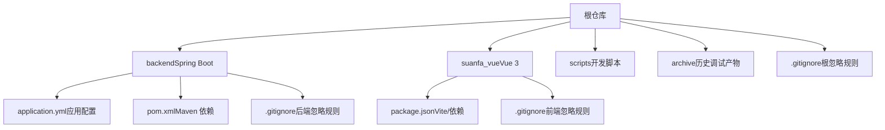
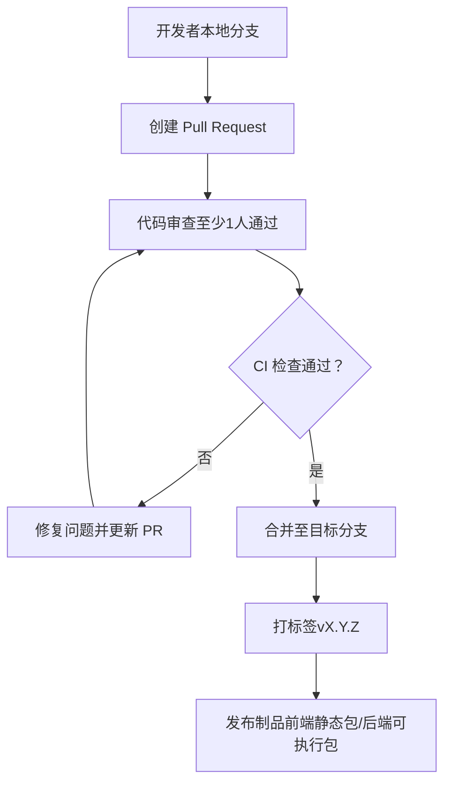
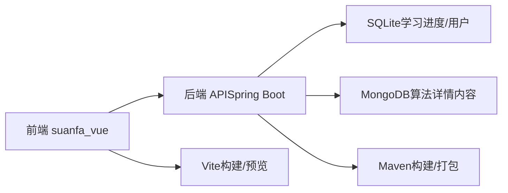

# 版本控制

<cite>
**本文引用的文件**
- [.gitignore](file://.gitignore)
- [backend/.gitignore](file://backend/.gitignore)
- [suanfa_vue/.gitignore](file://suanfa_vue/.gitignore)
- [backend/src/main/resources/application.yml](file://backend/src/main/resources/application.yml)
- [backend/pom.xml](file://backend/pom.xml)
- [suanfa_vue/package.json](file://suanfa_vue/package.json)
- [scripts/dev-backend.sh](file://scripts/dev-backend.sh)
- [architecture-analysis.md](file://architecture-analysis.md)
- [project_plan.md](file://project_plan.md)
</cite>

## 目录
1. [简介](#简介)
2. [项目结构](#项目结构)
3. [核心组件](#核心组件)
4. [架构总览](#架构总览)
5. [详细组件分析](#详细组件分析)
6. [依赖分析](#依赖分析)
7. [性能考虑](#性能考虑)
8. [故障排查指南](#故障排查指南)
9. [结论](#结论)
10. [附录](#附录)

## 简介
本规范面向算法可视化网站（前后端分离：Vue 3 前端 + Spring Boot 后端）的版本控制与协作流程，目标是确保团队协作标准化、代码质量可保障、发布可追溯。内容覆盖分支管理策略、提交信息规范、代码审查流程、Git 工作流最佳实践、配置文件与环境变量管理，以及多环境部署注意事项。

## 项目结构
仓库采用多模块组织：根目录包含文档与脚本；backend 为 Java/Spring Boot 服务；suanfa_vue 为 Vue 3 SPA；archive 为历史调试产物。各子模块拥有独立的忽略规则与构建配置，便于独立开发与并行迭代。

图表来源
- [backend/src/main/resources/application.yml:1-102](file://backend/src/main/resources/application.yml#L1-L102)
- [backend/pom.xml:1-89](file://backend/pom.xml#L1-L89)
- [suanfa_vue/package.json:1-23](file://suanfa_vue/package.json#L1-L23)
- [suanfa_vue/.gitignore:1-25](file://suanfa_vue/.gitignore#L1-L25)
- [backend/.gitignore:1-6](file://backend/.gitignore#L1-L6)
- [.gitignore:1-5](file://.gitignore#L1-L5)

章节来源
- [architecture-analysis.md:19-66](file://architecture-analysis.md#L19-L66)
- [project_plan.md:1-53](file://project_plan.md#L1-L53)

## 核心组件
围绕版本控制的“核心组件”包括：分支模型、提交规范、PR 审查、标签与发布、环境变量与敏感信息管理、冲突与回滚策略。这些规范将贯穿整个开发周期，确保从功能开发到上线的每一步都可追踪、可回滚、可审计。

章节来源
- [architecture-analysis.md:19-66](file://architecture-analysis.md#L19-L66)
- [backend/src/main/resources/application.yml:18-50](file://backend/src/main/resources/application.yml#L18-L50)

## 架构总览
下图展示基于 Git 的协作与发布流水线，涵盖分支保护、提交流程、CI 检查、合并策略与标签发布。

图表来源
- [backend/pom.xml:1-89](file://backend/pom.xml#L1-L89)
- [suanfa_vue/package.json:1-23](file://suanfa_vue/package.json#L1-L23)

## 详细组件分析

### 分支管理策略
- 主分支保护
  - main：仅允许受保护的合并（需通过 CI 与至少一名审查者批准），禁止直接推送。
  - release/*：用于发布候选，仅接受 bug 修复与文档变更。
- 功能分支
  - 命名：feature/<issue-id>-<short-desc>（例如 feature/123-add-login）。
  - 生命周期：从 develop 或 main 切出，完成后发起 PR 合并回目标分支。
- 缺陷修复
  - hotfix/<issue-id>-<short-desc>：直接从 main 切出，修复后合并回 main 与 develop。
- 合并策略
  - 优先使用 squash merge 保持主线整洁；复杂功能可使用 rebase merge 保留历史。
  - 合并前必须通过 CI 检查与代码审查。

章节来源
- [architecture-analysis.md:19-66](file://architecture-analysis.md#L19-L66)

### 提交信息规范
- 类型
  - feat：新功能
  - fix：缺陷修复
  - docs：文档变更
  - refactor：重构（不改变行为）
  - perf：性能优化
  - test：测试相关
  - chore：构建/工具链/依赖更新
- 消息格式
  - <type>(<scope>): <subject>
  - 正文可选：说明动机、影响范围、关联 Issue。
- 关联 Issue
  - 在提交或 PR 描述中引用 Issue 编号（如 Fixes #123），便于自动关联与回溯。

章节来源
- [architecture-analysis.md:33-38](file://architecture-analysis.md#L33-L38)

### 代码审查流程
- PR 模板要点
  - 变更概述：本次改动目的与影响范围。
  - 自测清单：是否通过本地构建、冒烟测试、关键用例验证。
  - 风险点：潜在兼容性问题、性能影响、数据迁移等。
  - 关联项：Issue、设计文档、API 契约。
- 审查要点
  - 正确性：逻辑正确、边界条件处理、错误码与异常路径。
  - 可维护性：命名清晰、职责单一、避免重复代码。
  - 安全性：鉴权、输入校验、敏感信息不入库。
  - 性能：热点路径、N+1 查询、大对象传输。
- 合并要求
  - 至少 1 名审查者通过。
  - CI 全绿（构建、单测、Lint）。
  - 无遗留冲突或已解决冲突并通过二次检查。

章节来源
- [architecture-analysis.md:19-66](file://architecture-analysis.md#L19-L66)

### Git 工作流最佳实践
- 冲突解决
  - 先拉取最新目标分支，再 rebase 或 merge 本地分支；必要时拆分提交以缩小冲突面。
  - 冲突后务必重新运行构建与冒烟测试。
- 回滚操作
  - 优先使用 revert 生成反向提交，保留完整历史；仅在严重污染时使用 reset（谨慎）。
  - 线上紧急修复走 hotfix 分支，合并后打标签并同步至所有相关分支。
- 标签管理
  - 语义化版本 vX.Y.Z（主版本.次版本.修订号）。
  - 发布前打 tag，并在发布说明中记录变更摘要与已知问题。

章节来源
- [architecture-analysis.md:19-66](file://architecture-analysis.md#L19-L66)

### 配置文件管理与多环境
- 环境变量与敏感信息
  - 绝对不要将密钥、令牌、密码等敏感信息提交到仓库。
  - 使用 .env 或平台提供的密钥管理服务注入；确保 .gitignore 排除敏感文件。
- 多环境配置
  - 通过 application.yml 中的占位符与环境变量切换不同环境（开发、测试、生产）。
  - 示例：JWT 密钥、CORS 白名单、AI 中转站地址与 Key、超时与限流参数等。
- 忽略规则
  - 根与子模块 .gitignore 应统一排除构建产物、日志、IDE 配置与本地密钥。

章节来源
- [backend/src/main/resources/application.yml:18-50](file://backend/src/main/resources/application.yml#L18-L50)
- [backend/.gitignore:1-6](file://backend/.gitignore#L1-L6)
- [suanfa_vue/.gitignore:1-25](file://suanfa_vue/.gitignore#L1-L25)
- [.gitignore:1-5](file://.gitignore#L1-L5)

## 依赖分析
- 后端依赖
  - Spring Boot Web、JDBC、SQLite、MongoDB、Spring Security Crypto、JWT。
  - 构建插件：spring-boot-maven-plugin。
- 前端依赖
  - Vue 3、Vue Router、Pinia、Vite、DOMPurify、Marked。
- 构建与脚本
  - 后端启动脚本 scripts/dev-backend.sh 用于快速启动后端服务。

图表来源
- [backend/pom.xml:24-78](file://backend/pom.xml#L24-L78)
- [suanfa_vue/package.json:11-21](file://suanfa_vue/package.json#L11-L21)
- [scripts/dev-backend.sh](file://scripts/dev-backend.sh)

章节来源
- [backend/pom.xml:1-89](file://backend/pom.xml#L1-L89)
- [suanfa_vue/package.json:1-23](file://suanfa_vue/package.json#L1-L23)

## 性能考虑
- 构建产物体积
  - 前端构建产物需关注 JS/CSS 大小与 chunk 数量，避免引入不必要的大依赖。
- 运行时性能
  - 后端接口注意鉴权开销、数据库查询效率、外部服务超时与熔断。
- 缓存与降级
  - 对频繁读取的数据（如算法元数据）提供缓存或本地兜底，提升可用性。

[本节为通用指导，不直接分析具体文件]

## 故障排查指南
- 常见问题定位
  - 构建失败：检查依赖版本、Node/Java 版本、环境变量是否正确注入。
  - 登录/鉴权失败：确认 JWT 密钥、Cookie SameSite、CORS 配置与前端携带凭证。
  - AI 助教不可用：检查中转站地址、Key、模型列表与熔断状态；未配置时前端应降级。
- 日志与监控
  - 后端日志级别可在 application.yml 中调整；生产建议关闭 debug。
  - 前端可通过浏览器控制台与网络面板排查请求与错误。
- 回滚与恢复
  - 使用 revert 回滚错误提交；必要时回退标签并重新发布。

章节来源
- [backend/src/main/resources/application.yml:98-102](file://backend/src/main/resources/application.yml#L98-L102)
- [architecture-analysis.md:364-407](file://architecture-analysis.md#L364-L407)

## 结论
通过统一的分支模型、提交规范、审查流程与标签发布机制，结合严格的环境变量与敏感信息管理，本项目能够在保证代码质量的同时实现高效协作与稳定发布。建议在团队内推广本规范，并结合 CI/CD 自动化检查与门禁，持续改进工程效能。

## 附录
- 参考文档
  - 架构分析报告：阐述前后端演进路线与技术决策。
  - 项目规划：明确阶段目标与交付物。
- 实用清单
  - 发布前检查：CI 全绿、审查通过、标签已打、变更说明已更新。
  - 安全核对：无敏感信息入库、密钥由环境变量注入、CORS/JWT 配置符合预期。

章节来源
- [architecture-analysis.md:1-419](file://architecture-analysis.md#L1-L419)
- [project_plan.md:1-53](file://project_plan.md#L1-L53)