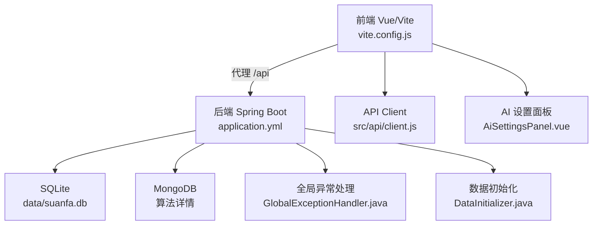
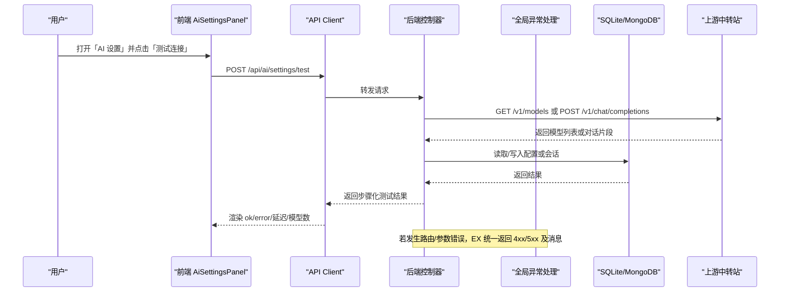
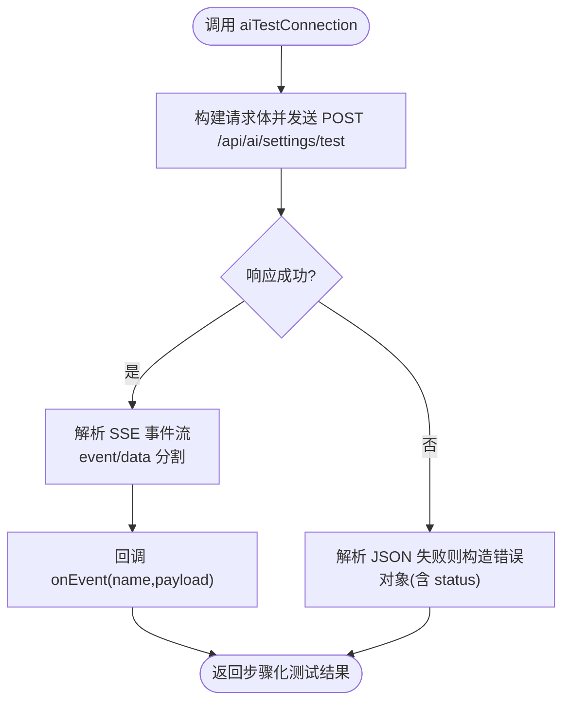
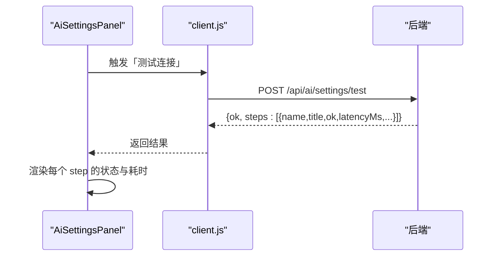
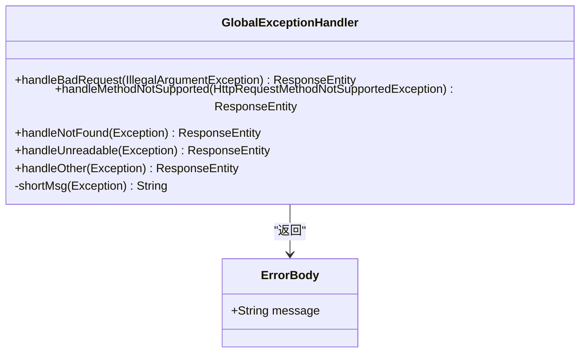
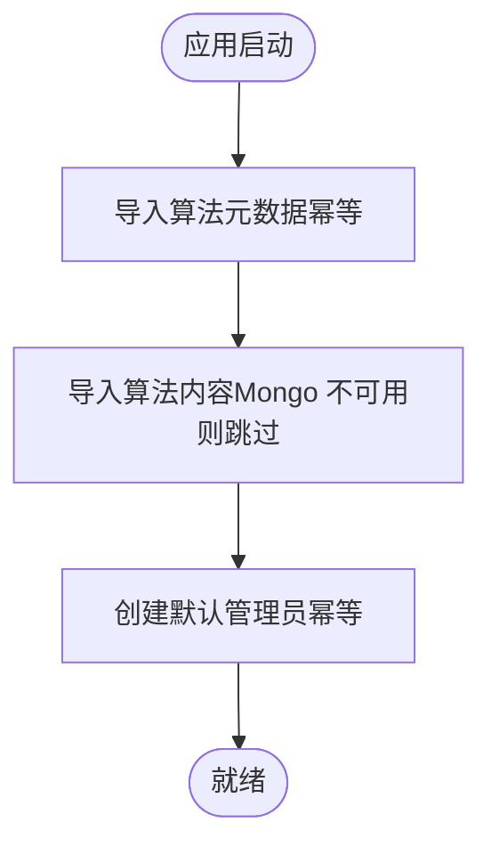
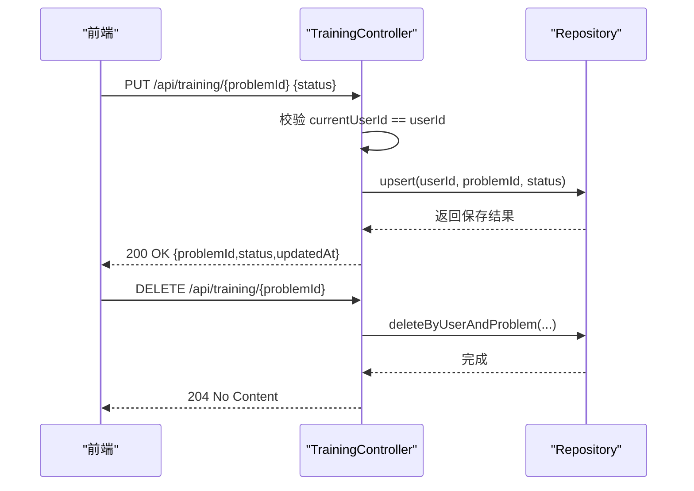
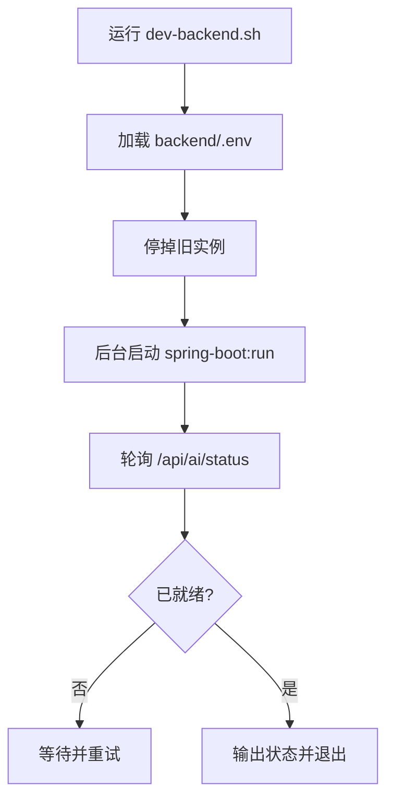
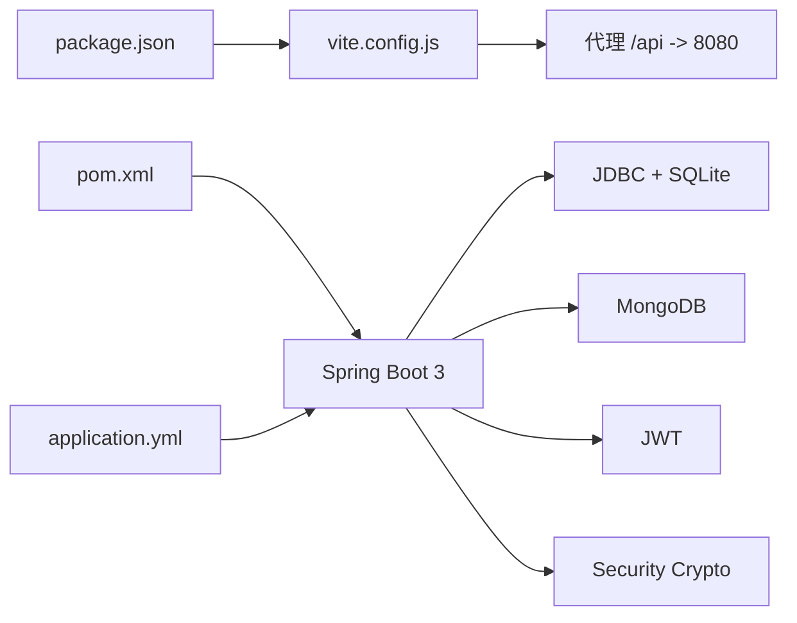

# 调试与测试

<cite>
**本文引用的文件**
- [backend/pom.xml](file://backend/pom.xml)
- [backend/src/main/resources/application.yml](file://backend/src/main/resources/application.yml)
- [backend/src/main/java/com/suanfa/config/GlobalExceptionHandler.java](file://backend/src/main/java/com/suanfa/config/GlobalExceptionHandler.java)
- [backend/src/main/java/com/suanfa/config/DataInitializer.java](file://backend/src/main/java/com/suanfa/config/DataInitializer.java)
- [backend/src/main/java/com/suanfa/controller/TrainingController.java](file://backend/src/main/java/com/suanfa/controller/TrainingController.java)
- [scripts/dev-backend.sh](file://scripts/dev-backend.sh)
- [scripts/mock-openai-relay.mjs](file://scripts/mock-openai-relay.mjs)
- [suanfa_vue/package.json](file://suanfa_vue/package.json)
- [suanfa_vue/vite.config.js](file://suanfa_vue/vite.config.js)
- [suanfa_vue/src/api/client.js](file://suanfa_vue/src/api/client.js)
- [suanfa_vue/src/components/common/AiSettingsPanel.vue](file://suanfa_vue/src/components/common/AiSettingsPanel.vue)
- [archive/final-binary-search-test.js](file://archive/final-binary-search-test.js)
</cite>

## 目录
1. [简介](#简介)
2. [项目结构](#项目结构)
3. [核心组件](#核心组件)
4. [架构总览](#架构总览)
5. [详细组件分析](#详细组件分析)
6. [依赖关系分析](#依赖关系分析)
7. [性能考虑](#性能考虑)
8. [故障排查指南](#故障排查指南)
9. [结论](#结论)
10. [附录](#附录)

## 简介
本指南面向算法学习平台的前后端开发与维护，提供系统化的调试与测试方法。内容涵盖：
- 前后端调试技巧：日志分析、断点调试、网络请求调试
- 问题定位方法：性能分析、内存泄漏检测、数据库查询优化
- 测试策略：单元测试、集成测试、端到端测试
- 测试规范：数据准备、Mock 策略、覆盖率要求
- 开发工具配置：IDE 调试、热重载、自动化脚本
目标是提升代码质量与系统稳定性，降低联调与排障成本。

## 项目结构
本项目采用前后端分离架构：
- 前端：Vue 3 + Vite，通过 Vite 代理将 /api 转发到 Spring Boot 后端进行联调
- 后端：Spring Boot 3（Java 17），使用 SQLite 存储结构化数据，MongoDB 存储算法详情文档；内置全局异常处理、启动时数据初始化
- 脚本：提供后端一键启动与 OpenAI 兼容的 Mock 服务，便于本地联调

**图表来源**
- [suanfa_vue/vite.config.js:10-20](file://suanfa_vue/vite.config.js#L10-L20)
- [backend/src/main/resources/application.yml:4-16](file://backend/src/main/resources/application.yml#L4-L16)
- [backend/src/main/java/com/suanfa/config/GlobalExceptionHandler.java:21-68](file://backend/src/main/java/com/suanfa/config/GlobalExceptionHandler.java#L21-L68)
- [backend/src/main/java/com/suanfa/config/DataInitializer.java:13-66](file://backend/src/main/java/com/suanfa/config/DataInitializer.java#L13-L66)

**章节来源**
- [suanfa_vue/vite.config.js:10-20](file://suanfa_vue/vite.config.js#L10-L20)
- [backend/src/main/resources/application.yml:4-16](file://backend/src/main/resources/application.yml#L4-L16)

## 核心组件
- 前端 API 客户端：统一封装 HTTP 请求、SSE 解析、错误处理，支撑 AI 聊天与连接测试
- AI 设置面板：管理员可配置第三方中转站，支持“测试连接”并展示步骤级结果与延迟
- 后端全局异常处理：统一返回 JSON 错误体，避免 500 吞掉路由级错误（404/405/400）
- 数据初始化：启动时幂等导入算法元数据与默认管理员账号，保障本地开发可用
- 训练接口：更新/删除刷题状态，包含鉴权校验与参数校验

**章节来源**
- [suanfa_vue/src/api/client.js:418-458](file://suanfa_vue/src/api/client.js#L418-L458)
- [suanfa_vue/src/components/common/AiSettingsPanel.vue:1-12](file://suanfa_vue/src/components/common/AiSettingsPanel.vue#L1-L12)
- [backend/src/main/java/com/suanfa/config/GlobalExceptionHandler.java:21-68](file://backend/src/main/java/com/suanfa/config/GlobalExceptionHandler.java#L21-L68)
- [backend/src/main/java/com/suanfa/config/DataInitializer.java:13-66](file://backend/src/main/java/com/suanfa/config/DataInitializer.java#L13-L66)
- [backend/src/main/java/com/suanfa/controller/TrainingController.java:39-66](file://backend/src/main/java/com/suanfa/controller/TrainingController.java#L39-L66)

## 架构总览
前后端联调链路：
- 前端通过 Vite 将 /api 请求代理到后端 8080 端口
- 后端根据路由分发给控制器，访问 SQLite/MongoDB，并通过全局异常处理器统一返回错误
- AI 功能通过 OpenAI 兼容接口与上游中转站通信，支持流式响应与非流式测试

**图表来源**
- [suanfa_vue/src/components/common/AiSettingsPanel.vue:1-12](file://suanfa_vue/src/components/common/AiSettingsPanel.vue#L1-L12)
- [suanfa_vue/src/api/client.js:418-458](file://suanfa_vue/src/api/client.js#L418-L458)
- [backend/src/main/resources/application.yml:4-16](file://backend/src/main/resources/application.yml#L4-L16)
- [backend/src/main/java/com/suanfa/config/GlobalExceptionHandler.java:21-68](file://backend/src/main/java/com/suanfa/config/GlobalExceptionHandler.java#L21-L68)

## 详细组件分析

### 前端 API 客户端（网络请求与 SSE）
- 职责：统一发起 HTTP 请求、解析 SSE 事件流、构造错误对象（含 status）
- 关键点：SSE 按空行分隔的事件块安全解析；错误时携带 HTTP 状态码，便于上层区分网络错误与服务端业务错误

**图表来源**
- [suanfa_vue/src/api/client.js:418-458](file://suanfa_vue/src/api/client.js#L418-L458)

**章节来源**
- [suanfa_vue/src/api/client.js:418-458](file://suanfa_vue/src/api/client.js#L418-L458)

### AI 设置面板（连接测试与可视化）
- 职责：编辑中转站配置、执行连接测试、展示步骤级结果（连通性、延迟、模型数量、上游实际模型名）
- 关键点：测试过程由后端返回 steps 数组，前端逐项渲染；支持从上游拉取真实模型名并自动采纳

**图表来源**
- [suanfa_vue/src/components/common/AiSettingsPanel.vue:1-12](file://suanfa_vue/src/components/common/AiSettingsPanel.vue#L1-L12)
- [suanfa_vue/src/api/client.js:418-458](file://suanfa_vue/src/api/client.js#L418-L458)

**章节来源**
- [suanfa_vue/src/components/common/AiSettingsPanel.vue:1-12](file://suanfa_vue/src/components/common/AiSettingsPanel.vue#L1-L12)
- [suanfa_vue/src/components/common/AiSettingsPanel.vue:122-158](file://suanfa_vue/src/components/common/AiSettingsPanel.vue#L122-L158)
- [suanfa_vue/src/components/common/AiSettingsPanel.vue:220-242](file://suanfa_vue/src/components/common/AiSettingsPanel.vue#L220-L242)
- [suanfa_vue/src/components/common/AiSettingsPanel.vue:369-393](file://suanfa_vue/src/components/common/AiSettingsPanel.vue#L369-L393)
- [suanfa_vue/src/components/common/AiSettingsPanel.vue:502-522](file://suanfa_vue/src/components/common/AiSettingsPanel.vue#L502-L522)

### 后端全局异常处理（统一错误响应）
- 职责：捕获路由级异常（405/404/400）与通用异常，统一返回 JSON 错误体，避免被兜底 500 掩盖
- 关键点：记录警告/错误日志，便于快速定位；对非法参数/缺失参数给出明确提示

**图表来源**
- [backend/src/main/java/com/suanfa/config/GlobalExceptionHandler.java:21-68](file://backend/src/main/java/com/suanfa/config/GlobalExceptionHandler.java#L21-L68)

**章节来源**
- [backend/src/main/java/com/suanfa/config/GlobalExceptionHandler.java:21-68](file://backend/src/main/java/com/suanfa/config/GlobalExceptionHandler.java#L21-L68)

### 数据初始化（启动时种子数据）
- 职责：幂等导入算法元数据与内容，创建默认管理员账号；Mongo 不可用时降级跳过
- 关键点：确保本地环境开箱即用；生产环境建议通过环境变量覆盖或删除种子逻辑

**图表来源**
- [backend/src/main/java/com/suanfa/config/DataInitializer.java:13-66](file://backend/src/main/java/com/suanfa/config/DataInitializer.java#L13-L66)

**章节来源**
- [backend/src/main/java/com/suanfa/config/DataInitializer.java:13-66](file://backend/src/main/java/com/suanfa/config/DataInitializer.java#L13-L66)

### 训练接口（状态更新与鉴权）
- 职责：更新/删除单题刷题状态，仅本人可写；校验状态值合法性
- 关键点：未登录或越权返回 401；非法状态返回 400；删除成功返回 204

**图表来源**
- [backend/src/main/java/com/suanfa/controller/TrainingController.java:39-66](file://backend/src/main/java/com/suanfa/controller/TrainingController.java#L39-L66)

**章节来源**
- [backend/src/main/java/com/suanfa/controller/TrainingController.java:39-66](file://backend/src/main/java/com/suanfa/controller/TrainingController.java#L39-L66)

### 开发脚本与联调工具
- 后端启动脚本：加载 .env、停止旧进程、后台运行 spring-boot:run，轮询健康检查并输出 AI 状态
- Mock 中继：最小 OpenAI 兼容服务，提供 /v1/models 与 /v1/chat/completions（支持非流式与 SSE），用于联调与错误场景验证

**图表来源**
- [scripts/dev-backend.sh:1-46](file://scripts/dev-backend.sh#L1-L46)

**章节来源**
- [scripts/dev-backend.sh:1-46](file://scripts/dev-backend.sh#L1-L46)
- [scripts/mock-openai-relay.mjs:1-58](file://scripts/mock-openai-relay.mjs#L1-L58)

## 依赖关系分析
- 前端依赖：Vue 3、Pinia、Vue Router、Vite；通过 vite.config.js 将 /api 代理到后端
- 后端依赖：Spring Boot Web、JDBC+SQLite、MongoDB、JWT、Security Crypto；测试依赖 spring-boot-starter-test
- 运行时配置：application.yml 定义数据源、MongoDB URI、Jackson 行为、AI 相关配置与日志级别

**图表来源**
- [suanfa_vue/package.json:1-23](file://suanfa_vue/package.json#L1-L23)
- [suanfa_vue/vite.config.js:10-20](file://suanfa_vue/vite.config.js#L10-L20)
- [backend/pom.xml:24-77](file://backend/pom.xml#L24-L77)
- [backend/src/main/resources/application.yml:4-16](file://backend/src/main/resources/application.yml#L4-L16)

**章节来源**
- [suanfa_vue/package.json:1-23](file://suanfa_vue/package.json#L1-L23)
- [backend/pom.xml:24-77](file://backend/pom.xml#L24-L77)
- [backend/src/main/resources/application.yml:4-16](file://backend/src/main/resources/application.yml#L4-L16)

## 性能考虑
- 前端
  - 使用 Vite 开发服务器与 HMR，减少冷启动时间；合理拆分组件与按需引入
  - 大列表渲染注意虚拟滚动与懒加载；避免在渲染函数中执行昂贵计算
- 后端
  - 控制 AI 请求超时与最大 token，避免长尾请求拖垮线程池
  - 对高频接口增加限流（如 AI 每分钟请求次数、代码执行频率限制）
  - 数据库层面：为常用查询字段建立索引；避免 N+1 查询；必要时分页
- 监控与诊断
  - 开启 SQL 日志（开发环境）观察慢查询；结合 MongoDB 慢查询日志定位热点
  - 使用浏览器 Performance 面板与 Memory 面板排查内存泄漏与重绘瓶颈

[本节为通用指导，不直接分析具体文件]

## 故障排查指南
- 日志分析
  - 后端日志级别：application.yml 中 root 与 com.suanfa 分别设为 info/debug，便于定位业务异常
  - 全局异常处理器会记录警告/错误日志，优先查看对应日志行
- 断点调试
  - 后端：在控制器/服务层关键路径打断点，配合 IDE 远程调试或本地调试
  - 前端：在浏览器 Sources 中对 client.js 与组件打断点，观察请求载荷与响应
- 网络请求调试
  - 使用浏览器 Network 面板查看请求头、响应体与 SSE 事件；关注状态码与错误消息
  - 使用 Mock 中继模拟上游异常（如 404 模型不存在），验证错误归类与降级逻辑
- 常见问题定位
  - 405 方法不支持：检查前端请求方法与后端映射是否一致
  - 404 接口不存在：确认后端版本与前端期望接口匹配
  - 400 请求格式错误：检查 JSON 结构与必填字段
  - 500 内部错误：查看全局异常处理器日志堆栈

**章节来源**
- [backend/src/main/resources/application.yml:98-102](file://backend/src/main/resources/application.yml#L98-L102)
- [backend/src/main/java/com/suanfa/config/GlobalExceptionHandler.java:21-68](file://backend/src/main/java/com/suanfa/config/GlobalExceptionHandler.java#L21-L68)
- [scripts/mock-openai-relay.mjs:14-54](file://scripts/mock-openai-relay.mjs#L14-L54)

## 结论
通过统一的异常处理、完善的启动初始化、前后端联调代理与 Mock 工具，本项目具备良好的可调试性与可测试性。建议在开发流程中：
- 坚持使用日志与断点进行问题定位
- 以 Mock 服务驱动前后端并行开发
- 建立单元与集成测试用例，覆盖关键路径与异常分支
- 持续优化数据库查询与外部依赖超时策略，保障系统稳定性

[本节为总结性内容，不直接分析具体文件]

## 附录

### 前后端调试技巧清单
- 日志分析
  - 后端：调整 application.yml 日志级别；查看全局异常处理器日志
  - 前端：控制台输出关键状态；利用浏览器开发者工具过滤网络请求
- 断点调试
  - 后端：在控制器/服务/仓库层设置断点，逐步跟踪数据流转
  - 前端：在 API 客户端与组件生命周期处设置断点，观察状态变化
- 网络请求调试
  - 使用 Network 面板查看请求/响应；对 SSE 流使用事件监听器
  - 使用 Mock 中继复现上游异常，验证错误处理与降级

**章节来源**
- [backend/src/main/resources/application.yml:98-102](file://backend/src/main/resources/application.yml#L98-L102)
- [backend/src/main/java/com/suanfa/config/GlobalExceptionHandler.java:21-68](file://backend/src/main/java/com/suanfa/config/GlobalExceptionHandler.java#L21-L68)
- [suanfa_vue/src/api/client.js:418-458](file://suanfa_vue/src/api/client.js#L418-L458)
- [scripts/mock-openai-relay.mjs:14-54](file://scripts/mock-openai-relay.mjs#L14-L54)

### 测试策略与规范
- 单元测试
  - 后端：基于 spring-boot-starter-test，对 Service/Repository 层进行隔离测试；使用内存数据库或 Testcontainers
  - 前端：对工具函数与组合式逻辑进行单元测试（可选 Jest/Vitest）
- 集成测试
  - 后端：启动嵌入式数据库与 MongoDB 测试实例，验证完整请求链路
  - 前端：使用 Cypress/Playwright 进行端到端测试，覆盖登录、训练、AI 聊天等主流程
- 测试数据准备
  - 使用 DataInitializer 的种子数据作为基线；通过脚本生成边界用例数据
  - 对敏感信息使用环境变量注入，避免硬编码
- Mock 策略
  - 上游 AI 服务使用 mock-openai-relay.mjs 模拟正常与异常响应
  - 第三方依赖通过桩对象替换，保证测试确定性
- 覆盖率要求
  - 核心业务逻辑覆盖率不低于 80%；关键异常分支需覆盖
  - 定期运行覆盖率报告，纳入 CI 门禁

[本节为通用指导，不直接分析具体文件]

### 开发工具配置
- IDE 调试
  - 后端：配置 Spring Boot 启动类，启用热部署（可选）；设置断点与日志级别
  - 前端：配置 Vite 调试，启用 Source Map；在浏览器中调试组件与 API 调用
- 热重载
  - 前端：Vite 默认支持 HMR；修改后即时刷新
  - 后端：可使用 Spring DevTools 实现部分热重载（谨慎使用于生产）
- 自动化脚本
  - 使用 scripts/dev-backend.sh 一键启动后端并健康检查
  - 使用 scripts/mock-openai-relay.mjs 启动 Mock 服务，便于联调

**章节来源**
- [scripts/dev-backend.sh:1-46](file://scripts/dev-backend.sh#L1-L46)
- [scripts/mock-openai-relay.mjs:1-58](file://scripts/mock-openai-relay.mjs#L1-L58)
- [suanfa_vue/vite.config.js:10-20](file://suanfa_vue/vite.config.js#L10-L20)

### 示例测试参考
- 前端已有测试脚本示例：archive/final-binary-search-test.js，可用于验证算法数据完整性与复杂度字段

**章节来源**
- [archive/final-binary-search-test.js:33-57](file://archive/final-binary-search-test.js#L33-L57)