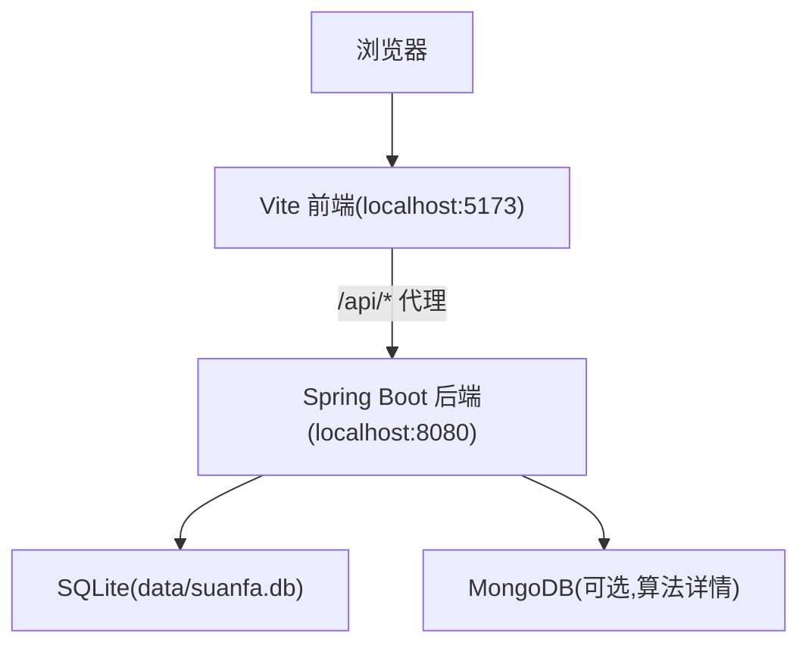

# 快速开始

<cite>
**本文引用的文件**
- [backend/pom.xml](file://backend/pom.xml)
- [backend/src/main/resources/application.yml](file://backend/src/main/resources/application.yml)
- [backend/src/main/resources/schema.sql](file://backend/src/main/resources/schema.sql)
- [backend/src/main/java/com/suanfa/SuanfaApplication.java](file://backend/src/main/java/com/suanfa/SuanfaApplication.java)
- [scripts/dev-backend.sh](file://scripts/dev-backend.sh)
- [suanfa_vue/package.json](file://suanfa_vue/package.json)
- [suanfa_vue/vite.config.js](file://suanfa_vue/vite.config.js)
- [suanfa_vue/src/api/client.js](file://suanfa_vue/src/api/client.js)
</cite>

## 目录
1. [简介](#简介)
2. [项目结构](#项目结构)
3. [环境准备](#环境准备)
4. [数据库与配置](#数据库与配置)
5. [启动后端服务](#启动后端服务)
6. [启动前端服务](#启动前端服务)
7. [验证运行结果](#验证运行结果)
8. [常见问题与故障排除](#常见问题与故障排除)
9. [性能与注意事项](#性能与注意事项)
10. [结论](#结论)

## 简介
本指南面向首次接触该算法学习平台的开发者，目标是在最短时间内完成环境准备、依赖安装、数据库初始化、前后端启动与验证。平台采用 Spring Boot 后端 + Vue 3 前端架构，使用 SQLite 存储关系数据（用户、进度、笔记、评论等），MongoDB 存储算法详情内容，并提供 AI 助教能力（可配置上游模型或降级到本地答疑）。

## 项目结构
- 后端：Spring Boot 应用，提供 REST API、JWT 认证、AI 聊天代理、代码执行沙箱等能力；默认使用 SQLite 作为关系型数据库，自动创建 data 目录并生成 suanfa.db。
- 前端：Vue 3 + Vite 开发服务器，内置 /api 代理转发到后端 8080 端口；具备“后端优先、离线回退”的容错机制，即使无后端也能浏览静态内容。
- 脚本：提供一键重启/启动后端的 shell 脚本，自动加载 .env 环境变量并轮询健康检查。

图表来源
- [suanfa_vue/vite.config.js:10-20](file://suanfa_vue/vite.config.js#L10-L20)
- [backend/src/main/resources/application.yml:4-16](file://backend/src/main/resources/application.yml#L4-L16)
- [backend/src/main/java/com/suanfa/SuanfaApplication.java:13-19](file://backend/src/main/java/com/suanfa/SuanfaApplication.java#L13-L19)

章节来源
- [backend/pom.xml:20-78](file://backend/pom.xml#L20-L78)
- [suanfa_vue/package.json:1-22](file://suanfa_vue/package.json#L1-L22)
- [suanfa_vue/vite.config.js:10-20](file://suanfa_vue/vite.config.js#L10-L20)
- [backend/src/main/resources/application.yml:4-16](file://backend/src/main/resources/application.yml#L4-L16)
- [backend/src/main/java/com/suanfa/SuanfaApplication.java:13-19](file://backend/src/main/java/com/suanfa/SuanfaApplication.java#L13-L19)

## 环境准备
- Java JDK 17+（后端基于 Spring Boot 3.2）
- Maven 3.6+（用于构建和运行后端）
- Node.js 18+（前端基于 Vite 与 Vue 3）
- MongoDB 实例（可选，用于算法详情内容；未配置时功能降级可用）
- SQLite（由驱动自动管理，无需单独安装）

说明
- 后端通过 JDBC 连接 SQLite，并在启动时确保 data 目录存在，自动生成 suanfa.db。
- 前端通过 Vite 开发服务器提供热重载与 /api 代理到后端。

章节来源
- [backend/pom.xml:7-22](file://backend/pom.xml#L7-L22)
- [backend/src/main/java/com/suanfa/SuanfaApplication.java:13-19](file://backend/src/main/java/com/suanfa/SuanfaApplication.java#L13-L19)
- [suanfa_vue/package.json:1-22](file://suanfa_vue/package.json#L1-L22)
- [suanfa_vue/vite.config.js:10-20](file://suanfa_vue/vite.config.js#L10-L20)

## 数据库与配置
- 关系型数据（SQLite）：应用启动时自动执行 schema.sql 建表，包含 algorithms、users、progress、notes、comments、app_settings、training 等表。
- 文档数据（MongoDB）：URI 在 application.yml 中配置，默认指向本地 27017；若不可用，相关功能会降级。
- JWT 与安全：默认使用 dev 密钥，生产环境需通过环境变量覆盖。
- CORS：开发模式允许所有来源；生产建议限制为具体域名。
- AI 助教：支持通过环境变量或页面配置中转站与模型；未配置时返回 503，前端自动降级为本地答疑。

关键配置位置
- 应用端口、数据源、MongoDB URI、SQL 初始化、Jackson 序列化、AI 与代码执行限流等均在 application.yml。
- 数据库表结构与索引定义在 schema.sql。

章节来源
- [backend/src/main/resources/application.yml:1-102](file://backend/src/main/resources/application.yml#L1-L102)
- [backend/src/main/resources/schema.sql:1-77](file://backend/src/main/resources/schema.sql#L1-L77)

## 启动后端服务
推荐方式：使用提供的开发脚本
- 进入 scripts 目录，执行 dev-backend.sh，默认监听 8080 端口；可通过 --port 指定其他端口。
- 脚本会自动加载 backend/.env（如存在），停止旧进程，后台启动并轮询健康接口 /api/ai/status。

手动方式：Maven 直接运行
- 在 backend 目录下执行 mvn spring-boot:run，或通过 IDE 运行 SuanfaApplication.main。
- 确保当前工作目录存在 data 子目录（应用会自动创建）。

启动后验证
- 访问 http://localhost:8080/api/ai/status 查看 AI 状态与健康信息。
- 如需调试日志级别，可在 application.yml 中调整 logging.level。

章节来源
- [scripts/dev-backend.sh:1-46](file://scripts/dev-backend.sh#L1-L46)
- [backend/src/main/resources/application.yml:98-102](file://backend/src/main/resources/application.yml#L98-L102)
- [backend/src/main/java/com/suanfa/SuanfaApplication.java:13-19](file://backend/src/main/java/com/suanfa/SuanfaApplication.java#L13-L19)

## 启动前端服务
安装依赖
- 进入 suanfa_vue 目录，执行 npm install 安装依赖。

启动开发服务器
- 执行 npm run dev，默认监听 5173 端口。
- 前端已配置将 /api 请求代理到 http://localhost:8080，因此无需额外跨域设置。

离线模式
- 即使后端未启动，前端仍可浏览静态内容（算法列表、视频等），API 调用失败时会回退到本地数据。

章节来源
- [suanfa_vue/package.json:6-21](file://suanfa_vue/package.json#L6-L21)
- [suanfa_vue/vite.config.js:10-20](file://suanfa_vue/vite.config.js#L10-L20)
- [suanfa_vue/src/api/client.js:12-28](file://suanfa_vue/src/api/client.js#L12-L28)

## 验证运行结果
- 打开浏览器访问 http://localhost:5173，确认前端页面正常加载。
- 登录/注册：前端调用 /api/auth/login 或 /api/auth/register，成功后获得会话。
- 查看算法列表：前端调用 /api/algorithms，若后端不可用则回退到本地数据。
- 测试 AI 助教：访问 AI 页面，若未配置 AI_API_KEY，将显示本地答疑模式；配置后可进行流式对话。
- 代码执行：在训练页面选择语言并执行代码，后端会根据配置限制超时与频率。

章节来源
- [suanfa_vue/src/api/client.js:49-105](file://suanfa_vue/src/api/client.js#L49-L105)
- [suanfa_vue/src/api/client.js:111-131](file://suanfa_vue/src/api/client.js#L111-L131)
- [suanfa_vue/src/api/client.js:331-347](file://suanfa_vue/src/api/client.js#L331-L347)
- [suanfa_vue/src/api/client.js:360-570](file://suanfa_vue/src/api/client.js#L360-L570)

## 常见问题与故障排除
- 后端无法启动或端口占用
  - 现象：dev-backend.sh 提示启动失败或端口冲突。
  - 处理：检查 8080 是否被占用；使用 --port 切换端口；查看 /tmp/suanfa-backend-*.log 日志。
  - 参考：[scripts/dev-backend.sh:24-45](file://scripts/dev-backend.sh#L24-L45)

- SQLite 数据目录不存在
  - 现象：运行时找不到 data/suanfa.db。
  - 处理：应用会在启动时自动创建 data 目录；也可手动创建。
  - 参考：[backend/src/main/java/com/suanfa/SuanfaApplication.java:13-19](file://backend/src/main/java/com/suanfa/SuanfaApplication.java#L13-L19)

- MongoDB 不可用导致部分功能降级
  - 现象：算法详情内容无法从后端获取。
  - 处理：确保 MongoDB 运行且 URI 正确；或接受降级行为（不影响核心功能）。
  - 参考：[backend/src/main/resources/application.yml:8-16](file://backend/src/main/resources/application.yml#L8-L16)

- AI 助教不可用
  - 现象：AI 页面提示本地答疑模式或 503。
  - 处理：配置 AI_BASE_URL、AI_API_KEY、AI_MODEL 等环境变量；或使用页面管理员功能配置中转站。
  - 参考：[backend/src/main/resources/application.yml:28-49](file://backend/src/main/resources/application.yml#L28-L49)

- 前端无法连接后端
  - 现象：登录后无法保存笔记/评论，或 API 报错。
  - 处理：确认 Vite 代理 target 指向 8080；检查后端是否启动；查看浏览器网络面板错误码。
  - 参考：[suanfa_vue/vite.config.js:10-20](file://suanfa_vue/vite.config.js#L10-L20)
  - 参考：[suanfa_vue/src/api/client.js:30-43](file://suanfa_vue/src/api/client.js#L30-L43)

- 代码执行超时或被限流
  - 现象：提交代码无响应或提示频率限制。
  - 处理：调整 compile-timeout-seconds、run-timeout-seconds、rate-per-minute；检查后端日志。
  - 参考：[backend/src/main/resources/application.yml:92-96](file://backend/src/main/resources/application.yml#L92-L96)

章节来源
- [scripts/dev-backend.sh:24-45](file://scripts/dev-backend.sh#L24-L45)
- [backend/src/main/java/com/suanfa/SuanfaApplication.java:13-19](file://backend/src/main/java/com/suanfa/SuanfaApplication.java#L13-L19)
- [backend/src/main/resources/application.yml:8-16](file://backend/src/main/resources/application.yml#L8-L16)
- [backend/src/main/resources/application.yml:28-49](file://backend/src/main/resources/application.yml#L28-L49)
- [backend/src/main/resources/application.yml:92-96](file://backend/src/main/resources/application.yml#L92-L96)
- [suanfa_vue/vite.config.js:10-20](file://suanfa_vue/vite.config.js#L10-L20)
- [suanfa_vue/src/api/client.js:30-43](file://suanfa_vue/src/api/client.js#L30-L43)

## 性能与注意事项
- 开发阶段建议开启 debug 日志以定位问题，生产环境调整为 info。
- 合理使用 AI 限流与超时参数，避免上游模型频繁请求导致资源耗尽。
- 前端具备“后端优先、离线回退”机制，适合在无后端环境下演示与教学。
- 使用 SQLite 便于本地开发与演示；高并发场景建议迁移至更稳定的关系型数据库。

章节来源
- [backend/src/main/resources/application.yml:98-102](file://backend/src/main/resources/application.yml#L98-L102)
- [backend/src/main/resources/application.yml:28-49](file://backend/src/main/resources/application.yml#L28-L49)
- [suanfa_vue/src/api/client.js:12-28](file://suanfa_vue/src/api/client.js#L12-L28)

## 结论
按照本指南完成环境准备、数据库与配置、前后端启动与验证后，你将拥有一个可运行的算法学习平台。后续可根据需求扩展 AI 中转站、优化性能、替换数据库或部署到生产环境。建议在开发过程中关注日志与错误码，利用前端的离线回退能力快速迭代与演示。