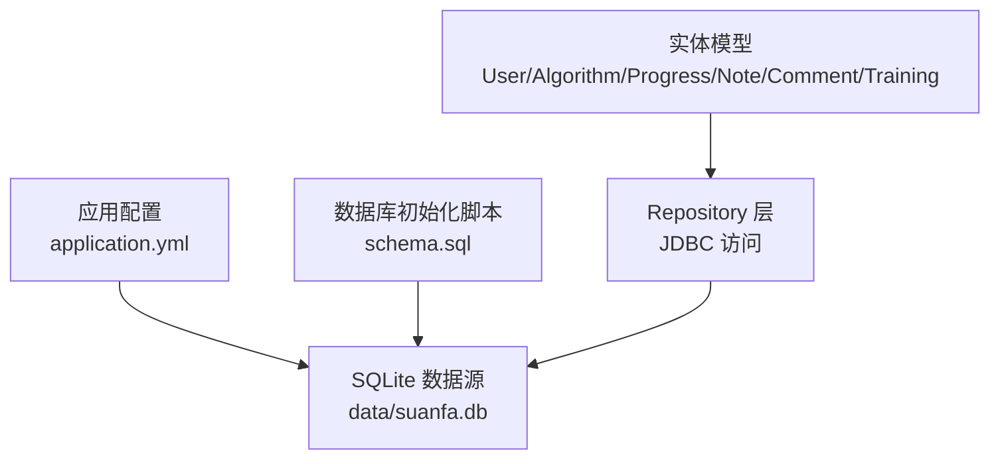
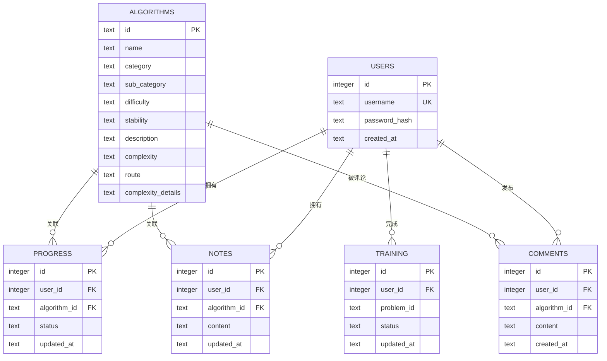
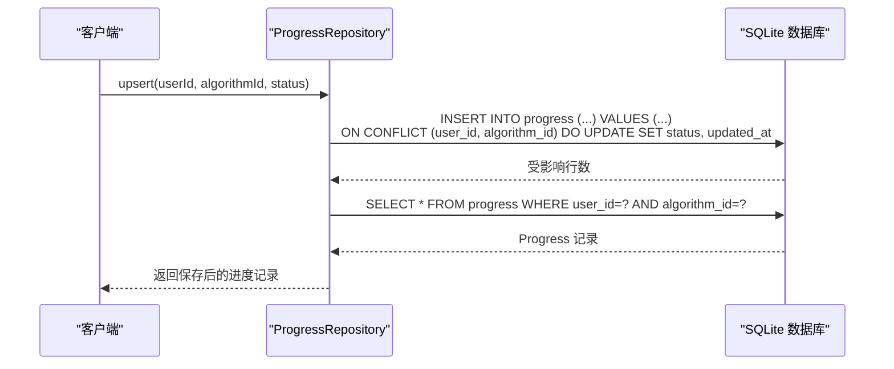
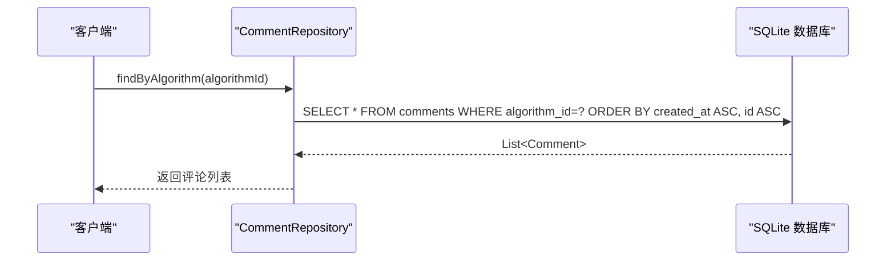
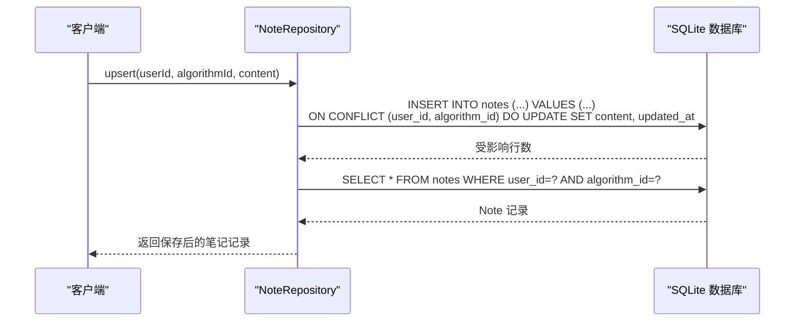
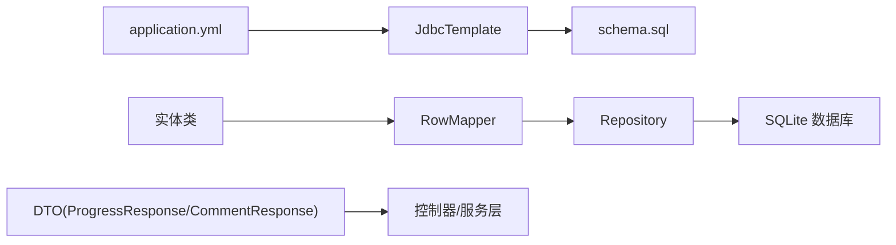

# 关系型数据库设计

<cite>
**本文引用的文件**
- [schema.sql](file://backend/src/main/resources/schema.sql)
- [application.yml](file://backend/src/main/resources/application.yml)
- [User.java](file://backend/src/main/java/com/suanfa/entity/User.java)
- [Algorithm.java](file://backend/src/main/java/com/suanfa/entity/Algorithm.java)
- [Progress.java](file://backend/src/main/java/com/suanfa/entity/Progress.java)
- [Note.java](file://backend/src/main/java/com/suanfa/entity/Note.java)
- [Comment.java](file://backend/src/main/java/com/suanfa/entity/Comment.java)
- [Training.java](file://backend/src/main/java/com/suanfa/entity/Training.java)
- [UserRepository.java](file://backend/src/main/java/com/suanfa/repository/UserRepository.java)
- [AlgorithmRepository.java](file://backend/src/main/java/com/suanfa/repository/AlgorithmRepository.java)
- [ProgressRepository.java](file://backend/src/main/java/com/suanfa/repository/ProgressRepository.java)
- [NoteRepository.java](file://backend/src/main/java/com/suanfa/repository/NoteRepository.java)
- [CommentRepository.java](file://backend/src/main/java/com/suanfa/repository/CommentRepository.java)
- [ProgressResponse.java](file://backend/src/main/java/com/suanfa/dto/ProgressResponse.java)
- [CommentResponse.java](file://backend/src/main/java/com/suanfa/dto/CommentResponse.java)
</cite>

## 目录
1. [简介](#简介)
2. [项目结构](#项目结构)
3. [核心组件](#核心组件)
4. [架构总览](#架构总览)
5. [详细组件分析](#详细组件分析)
6. [依赖分析](#依赖分析)
7. [性能考虑](#性能考虑)
8. [故障排查指南](#故障排查指南)
9. [结论](#结论)
10. [附录](#附录)

## 简介
本文件面向后端开发者，提供算法学习平台基于 SQLite 的关系型数据库设计文档。重点覆盖表结构设计、字段与约束、实体关系映射（用户与进度/笔记/评论、算法与进度）、索引策略、数据完整性与级联删除、查询优化建议与常见查询模式最佳实践。所有说明均基于仓库中的 schema 定义与 Repository 实现进行归纳与解释。

## 项目结构
- 数据库初始化脚本位于 resources/schema.sql，定义了 algorithms、users、progress、notes、comments、app_settings、training 等表及索引。
- 应用配置在 application.yml，指定 SQLite 数据源路径为 data/suanfa.db，并在启动时自动执行 schema.sql。
- 实体类以 Java record 形式映射到各表；Repository 层通过 JdbcTemplate 直接操作 SQL。

图表来源
- [application.yml:4-14](file://backend/src/main/resources/application.yml#L4-L14)
- [schema.sql:1-77](file://backend/src/main/resources/schema.sql#L1-L77)

章节来源
- [application.yml:4-14](file://backend/src/main/resources/application.yml#L4-L14)
- [schema.sql:1-77](file://backend/src/main/resources/schema.sql#L1-L77)

## 核心组件
- 算法元数据：algorithms（id 为主键，语义化标识）
- 用户：users（自增主键，用户名唯一）
- 学习进度：progress（用户×算法唯一，状态机 learning/learned/favorited）
- 学习笔记：notes（用户×算法唯一，Markdown 内容）
- 算法评论：comments（一对多，按时间排序展示）
- 训练刷题记录：training（用户×题目唯一，solving/solved）
- 应用设置：app_settings（key-value 配置，JSON 值）

章节来源
- [schema.sql:5-77](file://backend/src/main/resources/schema.sql#L5-L77)
- [User.java:1-6](file://backend/src/main/java/com/suanfa/entity/User.java#L1-L6)
- [Algorithm.java:1-16](file://backend/src/main/java/com/suanfa/entity/Algorithm.java#L1-L16)
- [Progress.java:1-11](file://backend/src/main/java/com/suanfa/entity/Progress.java#L1-L11)
- [Note.java:1-11](file://backend/src/main/java/com/suanfa/entity/Note.java#L1-L11)
- [Comment.java:1-11](file://backend/src/main/java/com/suanfa/entity/Comment.java#L1-L11)
- [Training.java:1-11](file://backend/src/main/java/com/suanfa/entity/Training.java#L1-L11)

## 架构总览
下图展示了实体间关系与主要外键约束，体现“用户—算法”维度上的多种业务记录类型。

图表来源
- [schema.sql:5-77](file://backend/src/main/resources/schema.sql#L5-L77)

章节来源
- [schema.sql:5-77](file://backend/src/main/resources/schema.sql#L5-L77)

## 详细组件分析

### 表结构与字段定义
- algorithms
  - 主键：id（TEXT，语义化标识）
  - 其他字段：name、category、sub_category、difficulty、stability、description、complexity、route、complexity_details（JSON 字符串）
  - 用途：算法元数据，供前端列表与详情渲染
- users
  - 主键：id（INTEGER AUTOINCREMENT）
  - 唯一约束：username（TEXT UNIQUE）
  - 密码：password_hash（TEXT NOT NULL）
  - 创建时间：created_at（默认当前时间）
- progress
  - 主键：id（INTEGER AUTOINCREMENT）
  - 外键：user_id → users(id) ON DELETE CASCADE；algorithm_id → algorithms(id) ON DELETE CASCADE
  - 唯一性：UNIQUE(user_id, algorithm_id)
  - 状态：status（learning/learned/favorited）
  - 更新时间：updated_at（默认当前时间）
- notes
  - 主键：id（INTEGER AUTOINCREMENT）
  - 外键：user_id → users(id) ON DELETE CASCADE；algorithm_id → algorithms(id) ON DELETE CASCADE
  - 唯一性：UNIQUE(user_id, algorithm_id)
  - 内容：content（TEXT，Markdown，上限 20000 字符）
  - 更新时间：updated_at（默认当前时间）
- comments
  - 主键：id（INTEGER AUTOINCREMENT）
  - 外键：user_id → users(id) ON DELETE CASCADE；algorithm_id → algorithms(id) ON DELETE CASCADE
  - 内容：content（TEXT，上限 2000 字符）
  - 创建时间：created_at（默认当前时间）
  - 索引：idx_comments_algorithm(algorithm_id, created_at)
- training
  - 主键：id（INTEGER AUTOINCREMENT）
  - 外键：user_id → users(id) ON DELETE CASCADE
  - 唯一性：UNIQUE(user_id, problem_id)
  - 状态：status（solving/solved）
  - 更新时间：updated_at（默认当前时间）
- app_settings
  - 主键：key（TEXT）
  - 值：value（TEXT，JSON）
  - 更新时间：updated_at（默认当前时间）

章节来源
- [schema.sql:5-77](file://backend/src/main/resources/schema.sql#L5-L77)

### 实体关系映射
- 用户与进度：一对多（一个用户可有多条进度记录），通过 progress.user_id 关联；同时每个用户对同一算法仅一条进度（UNIQUE(user_id, algorithm_id)）。
- 用户与笔记：一对多（一个用户可对多个算法写笔记），每个用户对同一算法仅一条笔记（UNIQUE(user_id, algorithm_id)）。
- 用户与评论：一对多（一个用户可对同一算法发多条评论），comments 无唯一性约束，允许重复评论。
- 算法与进度：一对多（一个算法可被多个用户标记进度），通过 progress.algorithm_id 关联。
- 算法与笔记：一对多（一个算法可被多个用户写笔记）。
- 算法与评论：一对多（一个算法可被多条评论）。
- 用户与训练：一对多（一个用户可有多条训练记录），对同一问题仅一条记录（UNIQUE(user_id, problem_id)）。

章节来源
- [schema.sql:18-77](file://backend/src/main/resources/schema.sql#L18-L77)
- [Progress.java:1-11](file://backend/src/main/java/com/suanfa/entity/Progress.java#L1-L11)
- [Note.java:1-11](file://backend/src/main/java/com/suanfa/entity/Note.java#L1-L11)
- [Comment.java:1-11](file://backend/src/main/java/com/suanfa/entity/Comment.java#L1-L11)
- [Training.java:1-11](file://backend/src/main/java/com/suanfa/entity/Training.java#L1-L11)

### 索引设计与作用
- comments 复合索引 idx_comments_algorithm(algorithm_id, created_at)
  - 作用：加速“某算法的评论列表”查询并按创建时间排序，避免全表扫描与额外排序开销。
  - 典型查询：SELECT * FROM comments WHERE algorithm_id = ? ORDER BY created_at ASC, id ASC
- 其他潜在索引建议（未在当前 schema 中显式定义）
  - progress.user_id：若频繁按用户查询进度列表，可考虑添加索引以优化排序与过滤。
  - notes.user_id：同理，用于按用户获取笔记列表或去重检查。
  - training.user_id：用于按用户查询训练记录。

章节来源
- [schema.sql:47-59](file://backend/src/main/resources/schema.sql#L47-L59)
- [CommentRepository.java:27-32](file://backend/src/main/java/com/suanfa/repository/CommentRepository.java#L27-L32)

### 数据完整性与级联删除
- 外键约束：progress、notes、comments、training 均通过 user_id 和/或 algorithm_id 建立外键，并设置 ON DELETE CASCADE。
- 级联删除影响：
  - 删除用户：其进度、笔记、评论、训练记录将被自动删除，保证孤儿记录不出现。
  - 删除算法：与该算法相关的进度、笔记、评论将被自动删除。
- 唯一性约束：
  - users.username 唯一，防止重复账号。
  - progress、notes、training 使用复合唯一约束，确保“用户×算法/题目”的唯一性。
- 时间戳一致性：
  - 插入/更新时使用 datetime('now','localtime')，保证时间与用户感知一致（如学习日历按天分组）。

章节来源
- [schema.sql:25-59](file://backend/src/main/resources/schema.sql#L25-L59)
- [ProgressRepository.java:39-49](file://backend/src/main/java/com/suanfa/repository/ProgressRepository.java#L39-L49)
- [NoteRepository.java:34-44](file://backend/src/main/java/com/suanfa/repository/NoteRepository.java#L34-L44)
- [CommentRepository.java:39-47](file://backend/src/main/java/com/suanfa/repository/CommentRepository.java#L39-L47)

### 查询优化与最佳实践
- 按算法查看评论：
  - 使用 WHERE algorithm_id = ? 并结合 ORDER BY created_at ASC, id ASC，利用 idx_comments_algorithm 提升性能。
- 用户进度 upsert：
  - 使用 INSERT ... ON CONFLICT (user_id, algorithm_id) DO UPDATE 实现幂等写入，避免并发冲突。
- 用户笔记 upsert：
  - 同上，使用 ON CONFLICT 更新内容与更新时间，减少分支逻辑。
- 算法列表与分类查询：
  - 使用 ORDER BY category, id 或 ORDER BY id 稳定输出顺序，便于分页与缓存。
- 时间字段：
  - 统一使用 localtime 写入，避免跨时区导致的显示不一致。

章节来源
- [CommentRepository.java:27-32](file://backend/src/main/java/com/suanfa/repository/CommentRepository.java#L27-L32)
- [ProgressRepository.java:39-49](file://backend/src/main/java/com/suanfa/repository/ProgressRepository.java#L39-L49)
- [NoteRepository.java:34-44](file://backend/src/main/java/com/suanfa/repository/NoteRepository.java#L34-L44)
- [AlgorithmRepository.java:32-38](file://backend/src/main/java/com/suanfa/repository/AlgorithmRepository.java#L32-L38)

### 关键流程时序图

#### 进度 UpSert 流程

图表来源
- [ProgressRepository.java:39-49](file://backend/src/main/java/com/suanfa/repository/ProgressRepository.java#L39-L49)

#### 评论列表查询流程

图表来源
- [CommentRepository.java:27-32](file://backend/src/main/java/com/suanfa/repository/CommentRepository.java#L27-L32)

#### 笔记 UpSert 流程

图表来源
- [NoteRepository.java:34-44](file://backend/src/main/java/com/suanfa/repository/NoteRepository.java#L34-L44)

## 依赖分析
- 数据源与初始化
  - application.yml 配置 SQLite 驱动与数据源 URL，并启用 SQL 初始化，启动时加载 schema.sql。
- 实体与 Repository
  - 实体类（record）与表字段一一对应；Repository 通过 RowMapper 将结果集映射为实体对象。
- DTO 与响应
  - ProgressResponse、CommentResponse 等 DTO 用于对外暴露更友好的数据结构（如包含算法名称、用户名等）。

图表来源
- [application.yml:4-14](file://backend/src/main/resources/application.yml#L4-L14)
- [schema.sql:1-77](file://backend/src/main/resources/schema.sql#L1-L77)
- [UserRepository.java:15-54](file://backend/src/main/java/com/suanfa/repository/UserRepository.java#L15-L54)
- [ProgressRepository.java:11-51](file://backend/src/main/java/com/suanfa/repository/ProgressRepository.java#L11-L51)
- [NoteRepository.java:11-50](file://backend/src/main/java/com/suanfa/repository/NoteRepository.java#L11-L50)
- [CommentRepository.java:11-54](file://backend/src/main/java/com/suanfa/repository/CommentRepository.java#L11-L54)
- [ProgressResponse.java:1-11](file://backend/src/main/java/com/suanfa/dto/ProgressResponse.java#L1-L11)
- [CommentResponse.java:1-12](file://backend/src/main/java/com/suanfa/dto/CommentResponse.java#L1-L12)

章节来源
- [application.yml:4-14](file://backend/src/main/resources/application.yml#L4-L14)
- [UserRepository.java:15-54](file://backend/src/main/java/com/suanfa/repository/UserRepository.java#L15-L54)
- [ProgressRepository.java:11-51](file://backend/src/main/java/com/suanfa/repository/ProgressRepository.java#L11-L51)
- [NoteRepository.java:11-50](file://backend/src/main/java/com/suanfa/repository/NoteRepository.java#L11-L50)
- [CommentRepository.java:11-54](file://backend/src/main/java/com/suanfa/repository/CommentRepository.java#L11-L54)
- [ProgressResponse.java:1-11](file://backend/src/main/java/com/suanfa/dto/ProgressResponse.java#L1-L11)
- [CommentResponse.java:1-12](file://backend/src/main/java/com/suanfa/dto/CommentResponse.java#L1-L12)

## 性能考虑
- 索引策略
  - 已定义 comments 复合索引，显著提升按算法查看评论的性能。
  - 建议评估是否为用户维度的常用查询（如 progress.user_id、notes.user_id、training.user_id）添加索引，以减少排序与过滤成本。
- 写入优化
  - 使用 ON CONFLICT 的 upsert 模式，避免先查后写的竞态条件，降低锁竞争与往返次数。
- 时间处理
  - 统一使用 localtime 写入，避免跨时区导致的前端分组错误。
- 查询顺序
  - 对列表接口使用稳定的 ORDER BY，便于分页与缓存命中。

[本节为通用性能建议，不直接分析具体文件]

## 故障排查指南
- 常见问题定位
  - 评论列表慢：确认是否存在 idx_comments_algorithm 索引；检查查询是否正确使用 algorithm_id 过滤与排序。
  - 进度/笔记更新失败：检查 ON CONFLICT 目标列是否与唯一约束一致；确认传入参数类型匹配。
  - 级联删除影响：删除用户或算法前，评估下游依赖；必要时在业务层增加前置校验或软删除。
- 日志与调试
  - 通过 Repository 层的异常抛出（如 IllegalStateException）快速定位 upsert/insert 失败点。
  - 结合 application.yml 的日志级别调整，观察 SQL 执行与异常堆栈。

章节来源
- [CommentRepository.java:39-47](file://backend/src/main/java/com/suanfa/repository/CommentRepository.java#L39-L47)
- [ProgressRepository.java:39-49](file://backend/src/main/java/com/suanfa/repository/ProgressRepository.java#L39-L49)
- [NoteRepository.java:34-44](file://backend/src/main/java/com/suanfa/repository/NoteRepository.java#L34-L44)
- [application.yml:98-102](file://backend/src/main/resources/application.yml#L98-L102)

## 结论
该数据库设计围绕“用户—算法”维度组织学习进度、笔记、评论与训练记录，采用外键与唯一性约束保障数据一致性，并通过 upsert 与索引优化读写性能。对于高并发或大数据量场景，可进一步评估用户维度索引与分页策略。整体设计简洁清晰，适合算法学习平台的当前规模与需求。

[本节为总结性内容，不直接分析具体文件]

## 附录

### 常见查询模式与最佳实践
- 获取某算法的评论列表
  - 使用 WHERE algorithm_id = ? 并 ORDER BY created_at ASC, id ASC，充分利用复合索引。
- 用户进度管理
  - 使用 upsert 实现幂等更新；按 updated_at 倒序展示最近活动。
- 用户笔记管理
  - 使用 upsert 更新内容；按 updated_at 倒序展示最近编辑。
- 算法列表与分类
  - 使用 ORDER BY category, id 或 ORDER BY id 稳定输出；支持分页。
- 训练记录
  - 使用 upsert 更新做题状态；按 updated_at 倒序展示最近练习。

章节来源
- [CommentRepository.java:27-32](file://backend/src/main/java/com/suanfa/repository/CommentRepository.java#L27-L32)
- [ProgressRepository.java:27-49](file://backend/src/main/java/com/suanfa/repository/ProgressRepository.java#L27-L49)
- [NoteRepository.java:27-48](file://backend/src/main/java/com/suanfa/repository/NoteRepository.java#L27-L48)
- [AlgorithmRepository.java:32-38](file://backend/src/main/java/com/suanfa/repository/AlgorithmRepository.java#L32-L38)

### SQL 操作参考（路径指引）
- 表结构定义：参见 schema.sql
- 用户相关操作：参见 UserRepository.java
- 算法相关操作：参见 AlgorithmRepository.java
- 进度相关操作：参见 ProgressRepository.java
- 笔记相关操作：参见 NoteRepository.java
- 评论相关操作：参见 CommentRepository.java
- 配置与初始化：参见 application.yml

章节来源
- [schema.sql:1-77](file://backend/src/main/resources/schema.sql#L1-L77)
- [UserRepository.java:15-54](file://backend/src/main/java/com/suanfa/repository/UserRepository.java#L15-L54)
- [AlgorithmRepository.java:11-72](file://backend/src/main/java/com/suanfa/repository/AlgorithmRepository.java#L11-L72)
- [ProgressRepository.java:11-51](file://backend/src/main/java/com/suanfa/repository/ProgressRepository.java#L11-L51)
- [NoteRepository.java:11-50](file://backend/src/main/java/com/suanfa/repository/NoteRepository.java#L11-L50)
- [CommentRepository.java:11-54](file://backend/src/main/java/com/suanfa/repository/CommentRepository.java#L11-L54)
- [application.yml:4-14](file://backend/src/main/resources/application.yml#L4-L14)