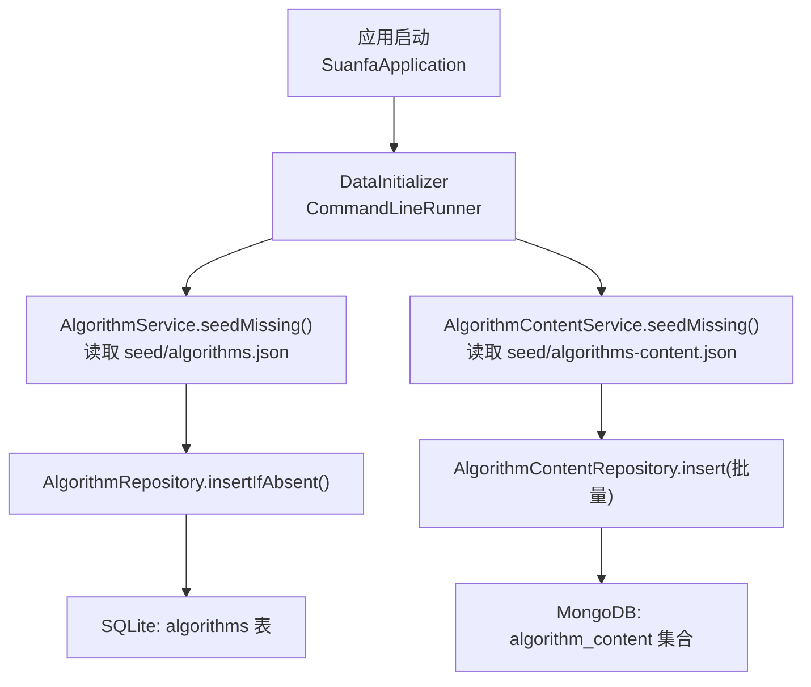
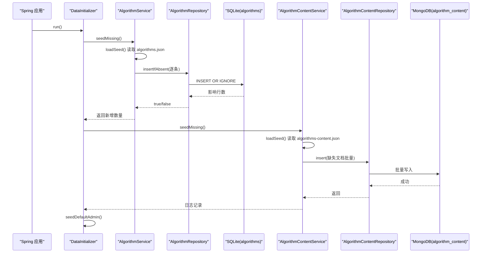
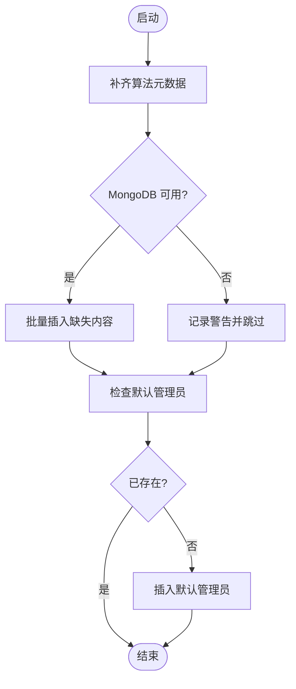
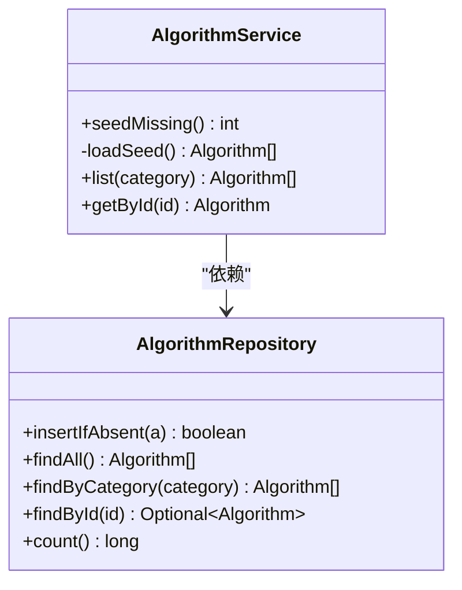
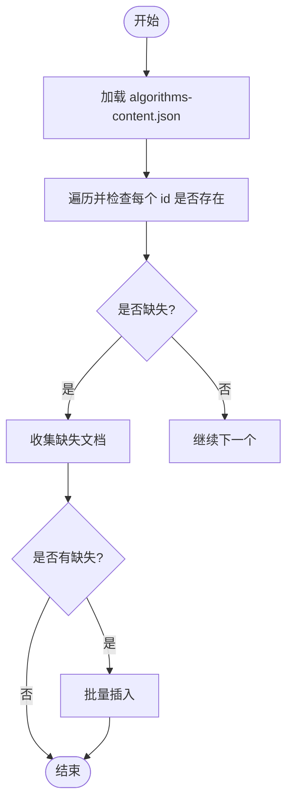
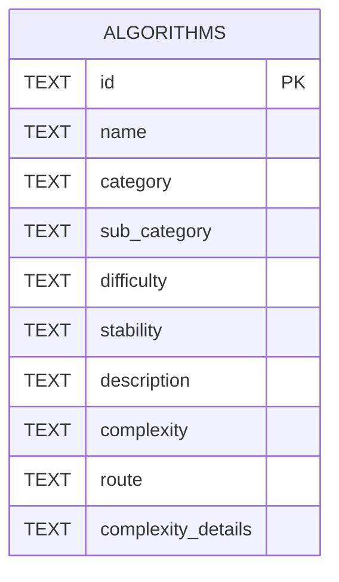
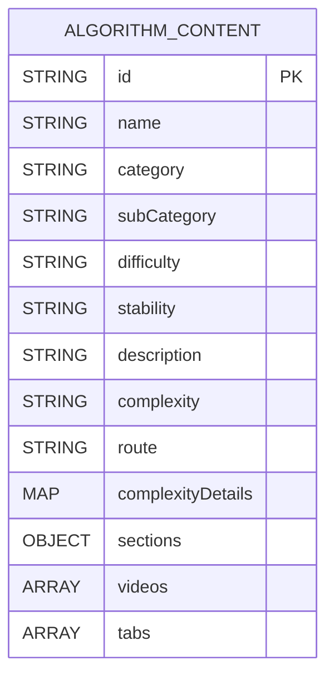
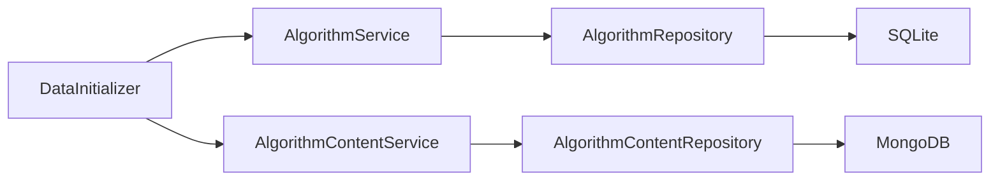

# 数据初始化

<cite>
**本文引用的文件**
- [DataInitializer.java](file://backend/src/main/java/com/suanfa/config/DataInitializer.java)
- [AlgorithmService.java](file://backend/src/main/java/com/suanfa/service/AlgorithmService.java)
- [AlgorithmContentService.java](file://backend/src/main/java/com/suanfa/service/AlgorithmContentService.java)
- [AlgorithmRepository.java](file://backend/src/main/java/com/suanfa/repository/AlgorithmRepository.java)
- [AlgorithmContentRepository.java](file://backend/src/main/java/com/suanfa/repository/AlgorithmContentRepository.java)
- [Algorithm.java](file://backend/src/main/java/com/suanfa/entity/Algorithm.java)
- [AlgorithmContent.java](file://backend/src/main/java/com/suanfa/entity/AlgorithmContent.java)
- [algorithms.json](file://backend/src/main/resources/seed/algorithms.json)
- [algorithms-content.json](file://backend/src/main/resources/seed/algorithms-content.json)
- [application.yml](file://backend/src/main/resources/application.yml)
- [schema.sql](file://backend/src/main/resources/schema.sql)
</cite>

## 目录
1. [简介](#简介)
2. [项目结构](#项目结构)
3. [核心组件](#核心组件)
4. [架构总览](#架构总览)
5. [详细组件分析](#详细组件分析)
6. [依赖关系分析](#依赖关系分析)
7. [性能与优化](#性能与优化)
8. [故障排查指南](#故障排查指南)
9. [结论](#结论)
10. [附录：扩展与维护指南](#附录：扩展与维护指南)

## 简介
本文件面向系统管理员与开发者，说明系统在启动时如何从种子数据加载算法元数据与详细内容，确保数据库与文档集合的一致性。重点覆盖：
- algorithms.json（算法元数据）与 algorithms-content.json（算法详情内容）的数据结构设计
- DataInitializer 的启动流程、幂等导入策略与降级机制
- JSON 解析、数据校验、批量插入的实现与优化
- 新增算法数据的步骤与规范
- 数据版本管理与一致性保障
- 数据库结构变更时的迁移脚本编写指南

## 项目结构
后端采用 Spring Boot，启动时通过 CommandLineRunner 执行数据初始化；算法元数据持久化到 SQLite 表 algorithms，算法详情内容持久化到 MongoDB 集合 algorithm_content。应用配置位于 application.yml，数据库建表语句位于 schema.sql。

图表来源
- [DataInitializer.java:36-46](file://backend/src/main/java/com/suanfa/config/DataInitializer.java#L36-L46)
- [AlgorithmService.java:31-52](file://backend/src/main/java/com/suanfa/service/AlgorithmService.java#L31-L52)
- [AlgorithmContentService.java:32-56](file://backend/src/main/java/com/suanfa/service/AlgorithmContentService.java#L32-L56)
- [AlgorithmRepository.java:55-65](file://backend/src/main/java/com/suanfa/repository/AlgorithmRepository.java#L55-L65)
- [AlgorithmContentRepository.java:1-8](file://backend/src/main/java/com/suanfa/repository/AlgorithmContentRepository.java#L1-L8)

章节来源
- [application.yml:4-16](file://backend/src/main/resources/application.yml#L4-L16)
- [schema.sql:5-16](file://backend/src/main/resources/schema.sql#L5-L16)

## 核心组件
- DataInitializer：应用启动入口，负责按序执行算法元数据补齐、算法内容补齐、默认管理员账号创建。具备幂等性与容错降级。
- AlgorithmService：负责从 classpath 下的 seed/algorithms.json 解析为 Algorithm 列表，并通过 Repository 以“不存在则插入”的方式补齐缺失条目。
- AlgorithmContentService：负责从 seed/algorithms-content.json 解析为 AlgorithmContent 列表，仅对缺失 id 的文档进行批量插入。
- AlgorithmRepository：基于 JdbcTemplate 操作 SQLite 的 algorithms 表，提供 insertIfAbsent 实现幂等插入。
- AlgorithmContentRepository：基于 Spring Data MongoDB 的 MongoRepository，支持批量插入。
- Entity：Algorithm 与 AlgorithmContent 分别对应 SQLite 行结构与 MongoDB 文档结构。

章节来源
- [DataInitializer.java:13-46](file://backend/src/main/java/com/suanfa/config/DataInitializer.java#L13-L46)
- [AlgorithmService.java:13-63](file://backend/src/main/java/com/suanfa/service/AlgorithmService.java#L13-L63)
- [AlgorithmContentService.java:14-65](file://backend/src/main/java/com/suanfa/service/AlgorithmContentService.java#L14-L65)
- [AlgorithmRepository.java:11-72](file://backend/src/main/java/com/suanfa/repository/AlgorithmRepository.java#L11-L72)
- [AlgorithmContentRepository.java:1-8](file://backend/src/main/java/com/suanfa/repository/AlgorithmContentRepository.java#L1-L8)
- [Algorithm.java:1-16](file://backend/src/main/java/com/suanfa/entity/Algorithm.java#L1-L16)
- [AlgorithmContent.java:1-34](file://backend/src/main/java/com/suanfa/entity/AlgorithmContent.java#L1-L34)

## 架构总览
启动阶段的关键调用序列如下：

图表来源
- [DataInitializer.java:36-66](file://backend/src/main/java/com/suanfa/config/DataInitializer.java#L36-L66)
- [AlgorithmService.java:31-52](file://backend/src/main/java/com/suanfa/service/AlgorithmService.java#L31-L52)
- [AlgorithmRepository.java:55-65](file://backend/src/main/java/com/suanfa/repository/AlgorithmRepository.java#L55-L65)
- [AlgorithmContentService.java:32-56](file://backend/src/main/java/com/suanfa/service/AlgorithmContentService.java#L32-L56)
- [AlgorithmContentRepository.java:1-8](file://backend/src/main/java/com/suanfa/repository/AlgorithmContentRepository.java#L1-L8)

## 详细组件分析

### DataInitializer：启动编排与幂等性
- 职责：在应用启动后执行三类任务：
  - 补齐算法元数据（幂等）
  - 补齐算法详情内容（幂等，且对 MongoDB 不可用进行降级处理）
  - 创建默认管理员账号（幂等）
- 关键行为：
  - 调用 AlgorithmService.seedMissing() 并记录新增数量
  - 调用 AlgorithmContentService.seedMissing()，捕获异常并降级跳过（前端可回退到本地数据）
  - 检查默认用户是否存在，不存在则插入加密后的密码

图表来源
- [DataInitializer.java:36-66](file://backend/src/main/java/com/suanfa/config/DataInitializer.java#L36-L66)

章节来源
- [DataInitializer.java:13-66](file://backend/src/main/java/com/suanfa/config/DataInitializer.java#L13-L66)

### AlgorithmService：元数据种子解析与幂等插入
- 解析：从 classpath 下读取 algorithms.json，使用 Jackson 反序列化为 List<Algorithm>
- 幂等插入：遍历种子数据，调用 repository.insertIfAbsent(a)，仅在 id 不存在时插入
- 查询能力：提供按分类查询、按 id 查询、计数等方法

图表来源
- [AlgorithmService.java:13-63](file://backend/src/main/java/com/suanfa/service/AlgorithmService.java#L13-L63)
- [AlgorithmRepository.java:11-72](file://backend/src/main/java/com/suanfa/repository/AlgorithmRepository.java#L11-L72)

章节来源
- [AlgorithmService.java:13-63](file://backend/src/main/java/com/suanfa/service/AlgorithmService.java#L13-L63)
- [AlgorithmRepository.java:11-72](file://backend/src/main/java/com/suanfa/repository/AlgorithmRepository.java#L11-L72)

### AlgorithmContentService：详情内容种子解析与批量插入
- 解析：从 classpath 下读取 algorithms-content.json，反序列化为 List<AlgorithmContent>
- 幂等策略：先收集缺失 id 的文档，再一次性批量插入，减少网络往返
- 降级：若 MongoDB 不可用，上层捕获异常并记录警告，不影响主流程

图表来源
- [AlgorithmContentService.java:32-56](file://backend/src/main/java/com/suanfa/service/AlgorithmContentService.java#L32-L56)

章节来源
- [AlgorithmContentService.java:14-65](file://backend/src/main/java/com/suanfa/service/AlgorithmContentService.java#L14-L65)

### 数据结构设计：algorithms.json 与 algorithms-content.json

#### algorithms.json（算法元数据）
- 存储位置：backend/src/main/resources/seed/algorithms.json
- 目标表：SQLite 的 algorithms 表
- 字段映射（部分关键字段）：
  - id：语义标识符，如 bubble-sort
  - name：算法名称
  - category：大类（sorting/searching/graph/dp/greedy）
  - sub_category：子分类
  - difficulty：难度等级
  - stability：稳定性（排序类适用）
  - description：描述文本
  - complexity：时间复杂度摘要
  - route：前端路由路径
  - complexity_details：JSON 字符串，包含 time[]/space/stability/difficulty/extras 等

图表来源
- [schema.sql:5-16](file://backend/src/main/resources/schema.sql#L5-L16)
- [Algorithm.java:4-14](file://backend/src/main/java/com/suanfa/entity/Algorithm.java#L4-L14)

章节来源
- [algorithms.json:1-471](file://backend/src/main/resources/seed/algorithms.json#L1-L471)
- [schema.sql:5-16](file://backend/src/main/resources/schema.sql#L5-L16)
- [Algorithm.java:1-16](file://backend/src/main/java/com/suanfa/entity/Algorithm.java#L1-L16)

#### algorithms-content.json（算法详情内容）
- 存储位置：backend/src/main/resources/seed/algorithms-content.json
- 目标集合：MongoDB 的 algorithm_content
- 文档结构要点：
  - 基础字段与元数据一致（id/name/category/subCategory/difficulty/stability/description/complexity/route）
  - complexityDetails：对象结构，包含 time[]/space/stability/difficulty/extras
  - sections：对象，包含 basic/advanced/defaultNotes（Markdown 源码）
  - videos：视频条目数组（当前为空数组，预留字段）
  - tabs：详情页标签页数组（如 basic/viz/advanced/notes）

图表来源
- [AlgorithmContent.java:10-33](file://backend/src/main/java/com/suanfa/entity/AlgorithmContent.java#L10-L33)

章节来源
- [algorithms-content.json:1-800](file://backend/src/main/resources/seed/algorithms-content.json#L1-L800)
- [AlgorithmContent.java:1-34](file://backend/src/main/java/com/suanfa/entity/AlgorithmContent.java#L1-L34)

### 数据验证与错误处理
- JSON 解析：使用 Jackson ObjectMapper 将 JSON 反序列化为实体对象；解析失败会抛出异常，由服务层包装为 IllegalStateException
- 幂等保证：
  - SQLite：INSERT OR IGNORE 避免重复插入相同 id
  - MongoDB：先查找 id 是否存在，仅对缺失文档进行批量插入
- 降级策略：当 MongoDB 不可用时，捕获异常并记录警告，不影响主流程；前端可回退到本地数据

章节来源
- [AlgorithmService.java:41-52](file://backend/src/main/java/com/suanfa/service/AlgorithmService.java#L41-L52)
- [AlgorithmContentService.java:45-56](file://backend/src/main/java/com/suanfa/service/AlgorithmContentService.java#L45-L56)
- [DataInitializer.java:48-56](file://backend/src/main/java/com/suanfa/config/DataInitializer.java#L48-L56)

### 批量插入优化策略
- 元数据（SQLite）：逐条 insertIfAbsent，利用数据库级唯一约束与 INSERT OR IGNORE 保证幂等
- 详情内容（MongoDB）：先收集缺失文档，再一次性批量插入，减少网络往返与事务开销
- 建议：对于超大数据集，可考虑分批次提交或引入批处理大小限制，避免单次请求过大

章节来源
- [AlgorithmRepository.java:55-65](file://backend/src/main/java/com/suanfa/repository/AlgorithmRepository.java#L55-L65)
- [AlgorithmContentService.java:32-43](file://backend/src/main/java/com/suanfa/service/AlgorithmContentService.java#L32-L43)

## 依赖关系分析
- DataInitializer 依赖 AlgorithmService、AlgorithmContentService、UserRepository
- AlgorithmService 依赖 AlgorithmRepository 与 Jackson ObjectMapper
- AlgorithmContentService 依赖 AlgorithmContentRepository 与 Jackson ObjectMapper
- 数据存储：SQLite（algorithms 表）、MongoDB（algorithm_content 集合）

图表来源
- [DataInitializer.java:23-33](file://backend/src/main/java/com/suanfa/config/DataInitializer.java#L23-L33)
- [AlgorithmService.java:17-23](file://backend/src/main/java/com/suanfa/service/AlgorithmService.java#L17-L23)
- [AlgorithmContentService.java:18-24](file://backend/src/main/java/com/suanfa/service/AlgorithmContentService.java#L18-L24)

章节来源
- [DataInitializer.java:23-33](file://backend/src/main/java/com/suanfa/config/DataInitializer.java#L23-L33)
- [AlgorithmService.java:17-23](file://backend/src/main/java/com/suanfa/service/AlgorithmService.java#L17-L23)
- [AlgorithmContentService.java:18-24](file://backend/src/main/java/com/suanfa/service/AlgorithmContentService.java#L18-L24)

## 性能与优化
- 幂等插入避免重复计算与写放大
- MongoDB 批量插入减少网络往返
- SQLite 使用 INSERT OR IGNORE 降低冲突成本
- 建议在后续迭代中：
  - 对超大 JSON 文件进行流式解析或分片加载
  - 增加批大小阈值与重试机制
  - 为常用查询字段建立索引（如 category、id）

[本节为通用指导，不直接分析具体文件]

## 故障排查指南
- 无法加载种子数据：检查 classpath 下 seed 目录是否存在，确认文件名与路径正确；Jackson 解析失败会抛出异常
- MongoDB 不可用：DataInitializer 会记录警告并跳过内容导入；检查 MongoDB 连接配置与网络连通性
- 默认管理员未创建：检查 UserRepository 是否存在该用户名；确认密码编码逻辑正常
- 数据不一致：核对 algorithms.json 与 algorithms-content.json 中的 id 是否一一对应；检查数据库中已有数据是否被意外覆盖

章节来源
- [AlgorithmService.java:41-52](file://backend/src/main/java/com/suanfa/service/AlgorithmService.java#L41-L52)
- [AlgorithmContentService.java:45-56](file://backend/src/main/java/com/suanfa/service/AlgorithmContentService.java#L45-L56)
- [DataInitializer.java:48-66](file://backend/src/main/java/com/suanfa/config/DataInitializer.java#L48-L66)

## 结论
系统通过 DataInitializer 在启动时完成幂等的种子数据导入，确保算法元数据与详情内容的一致性。SQLite 与 MongoDB 分别承担结构化元数据与非结构化详情的存储。通过“缺失即补”的策略，新增算法无需清库即可生效；同时提供降级机制，提升系统鲁棒性。

[本节为总结性内容，不直接分析具体文件]

## 附录：扩展与维护指南

### 新增算法的步骤与规范
- 在 algorithms.json 中添加一条元数据记录，确保 id 唯一且与其他字段一致
- 在 algorithms-content.json 中添加对应的详情文档，保持 id 一致，完善 sections、videos、tabs 等字段
- 重启应用，DataInitializer 会自动补齐缺失数据
- 若需更新既有数据：
  - 元数据：如需覆盖，请手动修改 SQLite 或通过管理接口更新
  - 详情内容：MongoDB 中已有文档不会被覆盖，可在数据库中手工修订

章节来源
- [algorithms.json:1-471](file://backend/src/main/resources/seed/algorithms.json#L1-L471)
- [algorithms-content.json:1-800](file://backend/src/main/resources/seed/algorithms-content.json#L1-L800)
- [DataInitializer.java:36-46](file://backend/src/main/java/com/suanfa/config/DataInitializer.java#L36-L46)

### 数据版本管理策略
- 幂等导入：基于 id 的唯一性，新增不会覆盖已有数据
- 变更追踪：建议在业务层维护版本号或更新时间戳，便于审计与回滚
- 一致性校验：定期比对 algorithms.json 与数据库中的元数据，确保无漂移

[本节为通用指导，不直接分析具体文件]

### 数据库结构变更时的迁移脚本编写指南
- 新建或修改表结构：在 schema.sql 中使用 CREATE TABLE IF NOT EXISTS 与 ALTER TABLE 等语句
- 应用启动时自动执行：application.yml 中 spring.sql.init.mode=always 且指定 schema-locations
- 数据迁移：
  - 增量脚本：针对已有环境，编写只增不改的脚本，避免破坏现有数据
  - 幂等性：使用 IF NOT EXISTS、ON CONFLICT DO NOTHING 等策略
  - 回滚方案：保留旧版脚本与备份，必要时恢复

章节来源
- [application.yml:11-14](file://backend/src/main/resources/application.yml#L11-L14)
- [schema.sql:1-77](file://backend/src/main/resources/schema.sql#L1-L77)