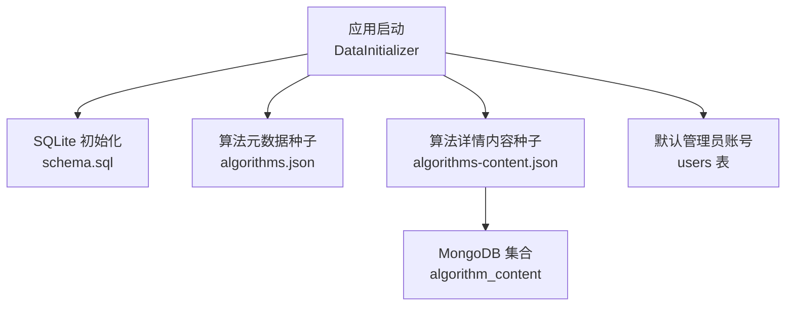
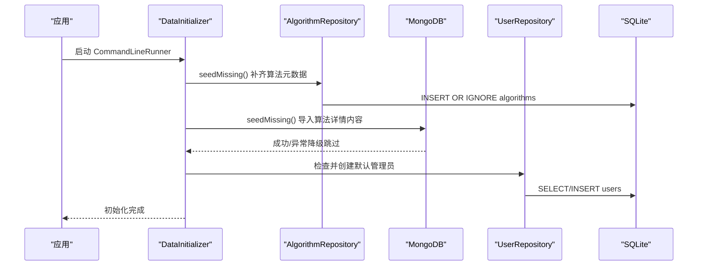
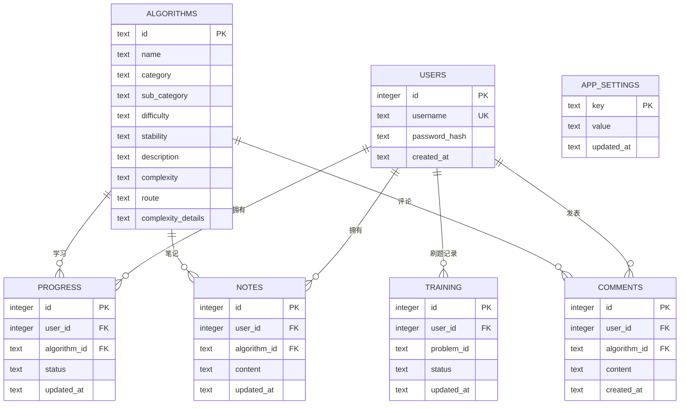
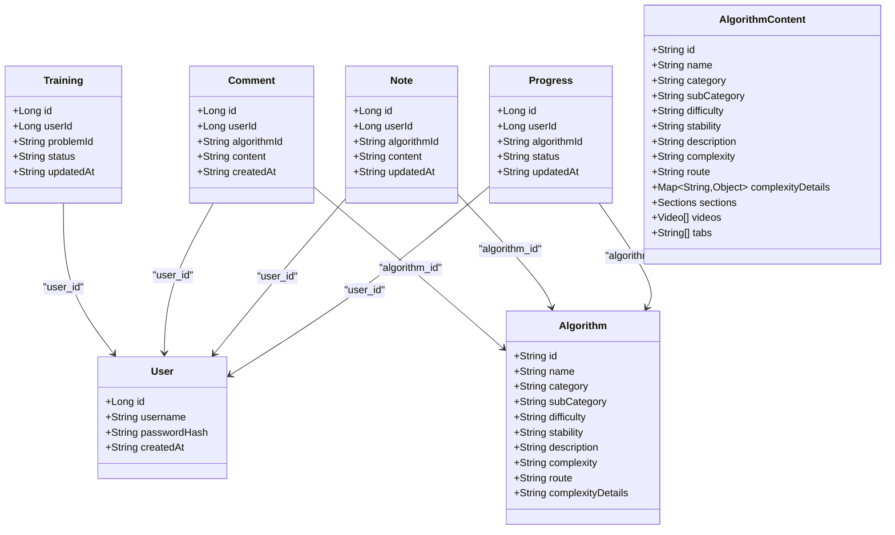
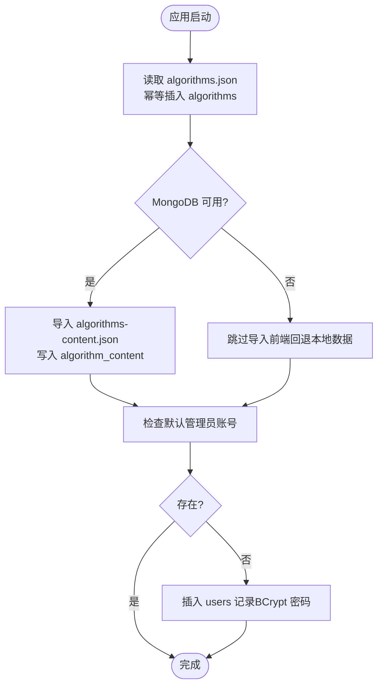
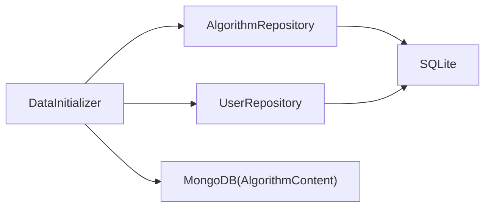

# 数据库设计

<cite>
**本文引用的文件**
- [backend/src/main/resources/schema.sql](file://backend/src/main/resources/schema.sql)
- [backend/src/main/resources/application.yml](file://backend/src/main/resources/application.yml)
- [backend/pom.xml](file://backend/pom.xml)
- [backend/src/main/java/com/suanfa/entity/User.java](file://backend/src/main/java/com/suanfa/entity/User.java)
- [backend/src/main/java/com/suanfa/entity/Algorithm.java](file://backend/src/main/java/com/suanfa/entity/Algorithm.java)
- [backend/src/main/java/com/suanfa/entity/Progress.java](file://backend/src/main/java/com/suanfa/entity/Progress.java)
- [backend/src/main/java/com/suanfa/entity/Note.java](file://backend/src/main/java/com/suanfa/entity/Note.java)
- [backend/src/main/java/com/suanfa/entity/Comment.java](file://backend/src/main/java/com/suanfa/entity/Comment.java)
- [backend/src/main/java/com/suanfa/entity/Training.java](file://backend/src/main/java/com/suanfa/entity/Training.java)
- [backend/src/main/java/com/suanfa/entity/AlgorithmContent.java](file://backend/src/main/java/com/suanfa/entity/AlgorithmContent.java)
- [backend/src/main/java/com/suanfa/repository/UserRepository.java](file://backend/src/main/java/com/suanfa/repository/UserRepository.java)
- [backend/src/main/java/com/suanfa/repository/AlgorithmRepository.java](file://backend/src/main/java/com/suanfa/repository/AlgorithmRepository.java)
- [backend/src/main/java/com/suanfa/config/DataInitializer.java](file://backend/src/main/java/com/suanfa/config/DataInitializer.java)
- [backend/src/main/resources/seed/algorithms.json](file://backend/src/main/resources/seed/algorithms.json)
- [backend/src/main/resources/seed/algorithms-content.json](file://backend/src/main/resources/seed/algorithms-content.json)
</cite>

## 目录
1. [简介](#简介)
2. [项目结构](#项目结构)
3. [核心组件](#核心组件)
4. [架构总览](#架构总览)
5. [详细组件分析](#详细组件分析)
6. [依赖关系分析](#依赖关系分析)
7. [性能考虑](#性能考虑)
8. [故障排查指南](#故障排查指南)
9. [结论](#结论)
10. [附录](#附录)

## 简介
本文件面向数据库管理员与后端开发者，系统化说明算法学习平台的数据层设计。系统采用“SQLite（关系型）+ MongoDB（非关系型）”的混合存储方案：
- SQLite 用于用户、算法元数据、学习进度、笔记、评论、训练记录与应用配置等强一致、结构化数据。
- MongoDB 用于算法详情内容（文档型），支持富文本、视频列表、标签页等灵活结构。

文档涵盖表结构设计、实体映射、主外键与索引、查询优化、数据初始化与种子、JDBC 访问封装、事务与连接池、迁移备份与监控指标等。

## 项目结构
- 关系型数据定义位于 schema.sql；应用通过 Spring Boot JDBC + JdbcTemplate 直接操作 SQLite。
- 非关系型数据模型为 AlgorithmContent，使用 Spring Data MongoDB 进行文档存取。
- 启动时执行数据初始化：补齐算法元数据、导入算法详情内容（MongoDB）、创建默认管理员账号。

图表来源
- [backend/src/main/resources/schema.sql:1-77](file://backend/src/main/resources/schema.sql#L1-L77)
- [backend/src/main/java/com/suanfa/config/DataInitializer.java:13-66](file://backend/src/main/java/com/suanfa/config/DataInitializer.java#L13-L66)
- [backend/src/main/resources/seed/algorithms.json:1-471](file://backend/src/main/resources/seed/algorithms.json#L1-L471)
- [backend/src/main/resources/seed/algorithms-content.json:1-800](file://backend/src/main/resources/seed/algorithms-content.json#L1-L800)

章节来源
- [backend/src/main/resources/schema.sql:1-77](file://backend/src/main/resources/schema.sql#L1-L77)
- [backend/src/main/java/com/suanfa/config/DataInitializer.java:13-66](file://backend/src/main/java/com/suanfa/config/DataInitializer.java#L13-L66)

## 核心组件
- 关系型实体（对应 SQLite 表）
  - 用户 User：id、username、password_hash、created_at
  - 算法 Algorithm：id（语义主键）、name、category、sub_category、difficulty、stability、description、complexity、route、complexity_details（JSON）
  - 进度 Progress：user_id、algorithm_id、status、updated_at（唯一约束 user_id, algorithm_id）
  - 笔记 Note：user_id、algorithm_id、content（Markdown，上限约 20000 字符）、updated_at（唯一约束 user_id, algorithm_id）
  - 评论 Comment：user_id、algorithm_id、content（上限约 2000 字符）、created_at
  - 训练 Training：user_id、problem_id、status、updated_at（唯一约束 user_id, problem_id）
  - 应用设置 AppSettings：key（主键）、value（JSON 文本）、updated_at
- 非关系型实体（对应 MongoDB 文档）
  - AlgorithmContent：id、name、category、sub_category、difficulty、stability、description、complexity、route、complexityDetails（对象）、sections（basic/advanced/defaultNotes）、videos（数组）、tabs（数组）

章节来源
- [backend/src/main/resources/schema.sql:5-76](file://backend/src/main/resources/schema.sql#L5-L76)
- [backend/src/main/java/com/suanfa/entity/User.java:1-6](file://backend/src/main/java/com/suanfa/entity/User.java#L1-L6)
- [backend/src/main/java/com/suanfa/entity/Algorithm.java:1-16](file://backend/src/main/java/com/suanfa/entity/Algorithm.java#L1-L16)
- [backend/src/main/java/com/suanfa/entity/Progress.java:1-11](file://backend/src/main/java/com/suanfa/entity/Progress.java#L1-L11)
- [backend/src/main/java/com/suanfa/entity/Note.java:1-11](file://backend/src/main/java/com/suanfa/entity/Note.java#L1-L11)
- [backend/src/main/java/com/suanfa/entity/Comment.java:1-11](file://backend/src/main/java/com/suanfa/entity/Comment.java#L1-L11)
- [backend/src/main/java/com/suanfa/entity/Training.java:1-11](file://backend/src/main/java/com/suanfa/entity/Training.java#L1-L11)
- [backend/src/main/java/com/suanfa/entity/AlgorithmContent.java:1-34](file://backend/src/main/java/com/suanfa/entity/AlgorithmContent.java#L1-L34)

## 架构总览
系统以 Spring Boot 为框架，JDBC 直连 SQLite，Spring Data MongoDB 访问算法详情内容。启动阶段由 DataInitializer 完成：
- 读取并插入缺失的算法元数据（algorithms 表）
- 尝试导入算法详情内容到 MongoDB（不可用时降级跳过）
- 幂等创建默认管理员账号

图表来源
- [backend/src/main/java/com/suanfa/config/DataInitializer.java:36-66](file://backend/src/main/java/com/suanfa/config/DataInitializer.java#L36-L66)
- [backend/src/main/java/com/suanfa/repository/AlgorithmRepository.java:45-65](file://backend/src/main/java/com/suanfa/repository/AlgorithmRepository.java#L45-L65)
- [backend/src/main/java/com/suanfa/repository/UserRepository.java:30-52](file://backend/src/main/java/com/suanfa/repository/UserRepository.java#L30-L52)

## 详细组件分析

### 关系型数据模型（SQLite）
- 表与字段
  - algorithms：id（TEXT 主键）、name、category、sub_category、difficulty、stability、description、complexity、route、complexity_details（JSON 字符串）
  - users：id（自增主键）、username（UNIQUE）、password_hash、created_at（默认当前时间）
  - progress：id（自增主键）、user_id（FK→users.id ON DELETE CASCADE）、algorithm_id（FK→algorithms.id ON DELETE CASCADE）、status（learning/learned/favorited）、updated_at（默认当前时间），唯一(user_id, algorithm_id)
  - notes：id（自增主键）、user_id（FK→users.id ON DELETE CASCADE）、algorithm_id（FK→algorithms.id ON DELETE CASCADE）、content（Markdown，上限约 20000 字符）、updated_at（默认当前时间），唯一(user_id, algorithm_id)
  - comments：id（自增主键）、user_id（FK→users.id ON DELETE CASCADE）、algorithm_id（FK→algorithms.id ON DELETE CASCADE）、content（上限约 2000 字符）、created_at（默认当前时间）
  - app_settings：key（主键）、value（JSON 文本）、updated_at（默认当前时间）
  - training：id（自增主键）、user_id（FK→users.id ON DELETE CASCADE）、problem_id、status（solving/solved）、updated_at（默认当前时间），唯一(user_id, problem_id)
- 主外键与约束
  - 所有关联表通过外键级联删除，保证用户或算法删除后相关进度/笔记/评论同步清理
  - 多对一关系：progress、notes、comments、training 均指向 users 与 algorithms
  - 业务唯一性：user×algorithm 的进度与笔记唯一；user×problem 的训练状态唯一
- 索引设计
  - comments(algorithm_id, created_at) 复合索引，加速按算法查看评论并按时间排序
  - 建议（可选扩展）：为 users.username 建立唯一索引（已含 UNIQUE 约束即隐式索引）；为 progress.user_id、progress.algorithm_id、notes.user_id、notes.algorithm_id、training.user_id 建立单列索引以提升 JOIN/过滤性能（当前未显式声明，可后续按需添加）
- 查询优化策略
  - 使用 WHERE + ORDER BY 配合索引减少扫描
  - 避免在 content 大字段上全文检索，必要时引入外部搜索引擎
  - 复杂统计（如用户学习进度聚合）建议在应用层分批处理，避免单次大事务

图表来源
- [backend/src/main/resources/schema.sql:5-76](file://backend/src/main/resources/schema.sql#L5-L76)

章节来源
- [backend/src/main/resources/schema.sql:5-76](file://backend/src/main/resources/schema.sql#L5-L76)

### 非关系型数据模型（MongoDB）
- 文档集合：algorithm_content（一算法一文档）
- 字段结构
  - 基础信息：id、name、category、sub_category、difficulty、stability、description、complexity、route
  - 复杂度详情：complexityDetails（对象，包含 time、space、stability、difficulty、extras）
  - 详情页区块：sections.basic、sections.advanced、sections.defaultNotes（Markdown 源码）
  - 视频列表：videos[]（title、author、platform、bvid）
  - 标签页：tabs[]（basic、viz、advanced、notes）
- 设计要点
  - 将富文本与结构化元数据合并在一个文档中，便于一次性加载详情页
  - videos 当前为空数组，预留扩展能力
  - sections.defaultNotes 提供算法默认学习笔记模板

章节来源
- [backend/src/main/java/com/suanfa/entity/AlgorithmContent.java:1-34](file://backend/src/main/java/com/suanfa/entity/AlgorithmContent.java#L1-L34)

### 实体与表映射
- User ↔ users
- Algorithm ↔ algorithms
- Progress ↔ progress
- Note ↔ notes
- Comment ↔ comments
- Training ↔ training
- AlgorithmContent ↔ MongoDB 集合 algorithm_content

图表来源
- [backend/src/main/java/com/suanfa/entity/User.java:1-6](file://backend/src/main/java/com/suanfa/entity/User.java#L1-L6)
- [backend/src/main/java/com/suanfa/entity/Algorithm.java:1-16](file://backend/src/main/java/com/suanfa/entity/Algorithm.java#L1-L16)
- [backend/src/main/java/com/suanfa/entity/Progress.java:1-11](file://backend/src/main/java/com/suanfa/entity/Progress.java#L1-L11)
- [backend/src/main/java/com/suanfa/entity/Note.java:1-11](file://backend/src/main/java/com/suanfa/entity/Note.java#L1-L11)
- [backend/src/main/java/com/suanfa/entity/Comment.java:1-11](file://backend/src/main/java/com/suanfa/entity/Comment.java#L1-L11)
- [backend/src/main/java/com/suanfa/entity/Training.java:1-11](file://backend/src/main/java/com/suanfa/entity/Training.java#L1-L11)
- [backend/src/main/java/com/suanfa/entity/AlgorithmContent.java:1-34](file://backend/src/main/java/com/suanfa/entity/AlgorithmContent.java#L1-L34)

### 数据访问模式（JDBC）
- 使用 JdbcTemplate 直接编写 SQL，RowMapper 将结果映射为实体 record
- 示例封装
  - UserRepository：按用户名/ID 查询用户、插入新用户（返回自增 ID）
  - AlgorithmRepository：列出算法、按分类查询、按 ID 查询、插入算法、幂等插入（INSERT OR IGNORE）、计数
- 事务管理
  - 当前仓库方法未显式声明 @Transactional；对于需要多步写入的场景，应在 Service 层组合多个 Repository 调用并加事务注解，确保原子性
- 连接池配置
  - 当前使用 Spring Boot 默认 DataSource；如需自定义连接池（如 HikariCP），可在 application.yml 中配置 spring.datasource.* 参数（当前仅配置了 SQLite URL 与驱动）

章节来源
- [backend/src/main/java/com/suanfa/repository/UserRepository.java:15-52](file://backend/src/main/java/com/suanfa/repository/UserRepository.java#L15-L52)
- [backend/src/main/java/com/suanfa/repository/AlgorithmRepository.java:11-70](file://backend/src/main/java/com/suanfa/repository/AlgorithmRepository.java#L11-L70)
- [backend/src/main/resources/application.yml:4-16](file://backend/src/main/resources/application.yml#L4-L16)

### 数据初始化与种子数据
- 启动流程
  - 读取 algorithms.json，调用 AlgorithmRepository.insertIfAbsent 幂等补齐算法元数据
  - 读取 algorithms-content.json，尝试导入到 MongoDB 的 algorithm_content 集合；若不可用则降级跳过
  - 检查 users 表中是否存在默认管理员账号，不存在则创建（密码经 BCrypt 加密）
- 种子数据结构
  - algorithms.json：算法元数据清单（id、名称、分类、难度、描述、复杂度、路由、复杂度详情 JSON）
  - algorithms-content.json：算法详情内容（富文本、视频、标签页等）

图表来源
- [backend/src/main/java/com/suanfa/config/DataInitializer.java:36-66](file://backend/src/main/java/com/suanfa/config/DataInitializer.java#L36-L66)
- [backend/src/main/resources/seed/algorithms.json:1-471](file://backend/src/main/resources/seed/algorithms.json#L1-L471)
- [backend/src/main/resources/seed/algorithms-content.json:1-800](file://backend/src/main/resources/seed/algorithms-content.json#L1-L800)

章节来源
- [backend/src/main/java/com/suanfa/config/DataInitializer.java:13-66](file://backend/src/main/java/com/suanfa/config/DataInitializer.java#L13-L66)
- [backend/src/main/resources/seed/algorithms.json:1-471](file://backend/src/main/resources/seed/algorithms.json#L1-L471)
- [backend/src/main/resources/seed/algorithms-content.json:1-800](file://backend/src/main/resources/seed/algorithms-content.json#L1-L800)

## 依赖关系分析
- 技术栈依赖
  - Spring Boot Web、JDBC、SQLite 驱动、MongoDB Starter、Spring Security Crypto（BCrypt）、JWT
- 运行时依赖
  - SQLite 文件路径：data/suanfa.db
  - MongoDB URI：mongodb://127.0.0.1:27017/suanfa
- 模块耦合
  - DataInitializer 依赖 AlgorithmService、AlgorithmContentService、UserRepository
  - Repository 层直接依赖 JdbcTemplate 与实体 record
  - 实体与表/集合一一对应，低耦合高内聚

图表来源
- [backend/src/main/java/com/suanfa/config/DataInitializer.java:23-33](file://backend/src/main/java/com/suanfa/config/DataInitializer.java#L23-L33)
- [backend/src/main/java/com/suanfa/repository/AlgorithmRepository.java:11-30](file://backend/src/main/java/com/suanfa/repository/AlgorithmRepository.java#L11-L30)
- [backend/src/main/java/com/suanfa/repository/UserRepository.java:15-28](file://backend/src/main/java/com/suanfa/repository/UserRepository.java#L15-L28)
- [backend/src/main/resources/application.yml:4-11](file://backend/src/main/resources/application.yml#L4-L11)

章节来源
- [backend/pom.xml:24-77](file://backend/pom.xml#L24-L77)
- [backend/src/main/resources/application.yml:4-11](file://backend/src/main/resources/application.yml#L4-L11)

## 性能考虑
- 索引与查询
  - comments 表已建立 (algorithm_id, created_at) 复合索引，适合按算法查看评论并按时间倒序展示
  - 建议为 users.username、progress.user_id、progress.algorithm_id、notes.user_id、notes.algorithm_id、training.user_id 建立索引（若未来出现高频过滤/JOIN）
- 大字段与分库
  - notes.content 较大，避免全表扫描与不必要的大字段传输；分页与按需加载
  - 算法详情内容使用 MongoDB，减轻 SQLite 压力，提升详情页加载速度
- 事务与并发
  - 当前 SQLite 为单文件数据库，并发写受限；读多写少场景更合适
  - 对关键写操作（如注册、更新进度/笔记）建议在 Service 层加事务，确保一致性
- 连接池
  - 当前使用默认 DataSource；生产环境建议显式配置连接池参数（最大连接数、超时、空闲回收等）

[本节为通用指导，不直接分析具体文件]

## 故障排查指南
- 常见问题定位
  - MongoDB 不可用：DataInitializer 会捕获异常并降级跳过算法详情内容导入，前端回退本地数据；检查 application.yml 中的 mongodb.uri 与网络连通性
  - 默认管理员无法登录：确认 users 表是否已创建 admin 账号，以及密码是否经 BCrypt 编码
  - 算法详情缺失：检查 algorithms-content.json 是否正确导入至 MongoDB；查看日志中“MongoDB 不可用”提示
- 日志与监控
  - 日志级别：root info，com.suanfa debug；可通过调整日志级别获取更详细的 JDBC/MongoDB 交互信息
  - 建议增加慢查询日志（SQLite 层面）与 MongoDB 查询耗时统计，便于定位热点查询

章节来源
- [backend/src/main/java/com/suanfa/config/DataInitializer.java:48-55](file://backend/src/main/java/com/suanfa/config/DataInitializer.java#L48-L55)
- [backend/src/main/resources/application.yml:98-102](file://backend/src/main/resources/application.yml#L98-L102)

## 结论
本项目采用 SQLite + MongoDB 的混合数据层设计，兼顾结构化数据的强一致性与文档数据的灵活性。通过 schema.sql 明确表结构与约束，结合 JdbcTemplate 实现简洁高效的数据访问；DataInitializer 保障启动时的数据完备性。建议在后续演进中补充更多索引、完善事务边界、引入连接池配置与性能监控，以支撑更高并发与更大规模数据。

[本节为总结性内容，不直接分析具体文件]

## 附录

### 表结构参考（SQLite）
- algorithms：算法元数据（id 为主键，complexity_details 为 JSON）
- users：用户（username 唯一，password_hash 存储哈希）
- progress：学习进度（user_id × algorithm_id 唯一）
- notes：学习笔记（user_id × algorithm_id 唯一，content 为大文本）
- comments：算法评论（algorithm_id 复合索引）
- training：刷题记录（user_id × problem_id 唯一）
- app_settings：应用配置（key 为主键，value 为 JSON）

章节来源
- [backend/src/main/resources/schema.sql:5-76](file://backend/src/main/resources/schema.sql#L5-L76)

### 非关系型文档结构（MongoDB）
- 集合：algorithm_content
- 字段：基础信息、复杂度详情（对象）、详情页区块（sections）、视频列表（videos[]）、标签页（tabs[]）

章节来源
- [backend/src/main/java/com/suanfa/entity/AlgorithmContent.java:1-34](file://backend/src/main/java/com/suanfa/entity/AlgorithmContent.java#L1-L34)

### 数据初始化流程（启动时）
- 幂等补齐算法元数据（algorithms 表）
- 幂等导入算法详情内容（MongoDB，不可用时降级）
- 幂等创建默认管理员账号（users 表）

章节来源
- [backend/src/main/java/com/suanfa/config/DataInitializer.java:36-66](file://backend/src/main/java/com/suanfa/config/DataInitializer.java#L36-L66)

### 数据迁移与备份恢复
- 迁移策略
  - 使用 schema.sql 作为版本化建表脚本，配合 Spring sql.init 在启动时执行
  - 新增字段/表时，维护增量迁移脚本或在 schema.sql 中保持向后兼容
- 备份恢复
  - SQLite：直接复制 data/suanfa.db 文件进行备份；恢复时替换文件即可
  - MongoDB：使用 mongodump/mongorestore 或可视化工具导出/导入集合

[本节为通用指导，不直接分析具体文件]

### 连接池与事务建议
- 连接池
  - 当前未显式配置连接池；生产环境建议启用 HikariCP 并设置合理参数（最大连接数、超时、空闲回收）
- 事务
  - 对涉及多表写入的业务（如注册、更新进度/笔记）在 Service 层使用 @Transactional 包裹，确保原子性与一致性

[本节为通用指导，不直接分析具体文件]

### 性能监控指标
- 推荐指标
  - SQLite：慢查询数量、查询耗时分布、锁等待次数
  - MongoDB：查询耗时、集合大小、索引命中率
  - 应用层：接口响应时间、错误率、重试次数
- 采集方式
  - 日志埋点（请求开始/结束时间、SQL 语句、MongoDB 查询）
  - 外部监控（Prometheus + Grafana）接入应用指标

[本节为通用指导，不直接分析具体文件]