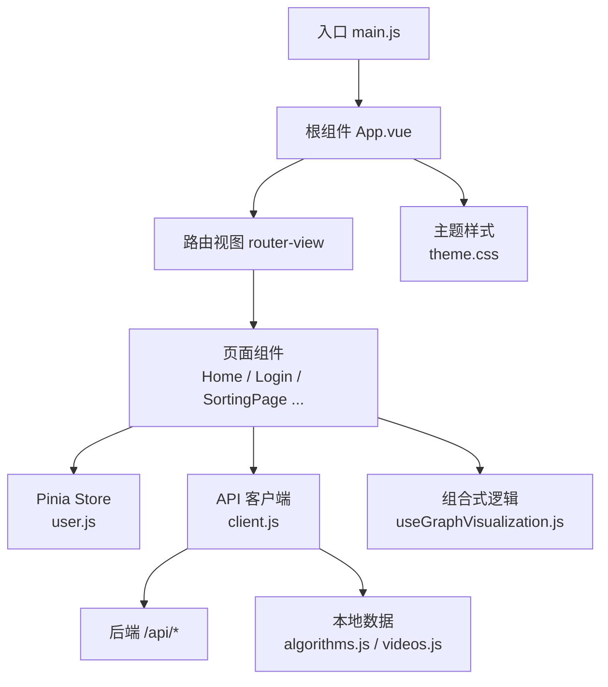
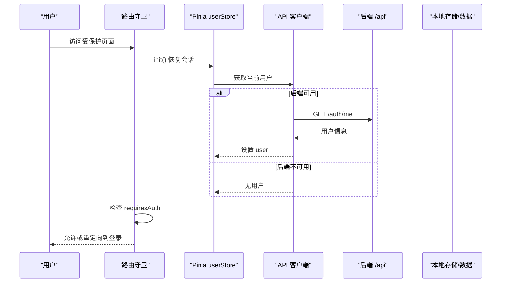
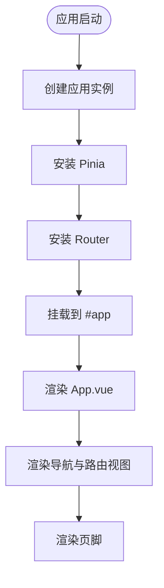
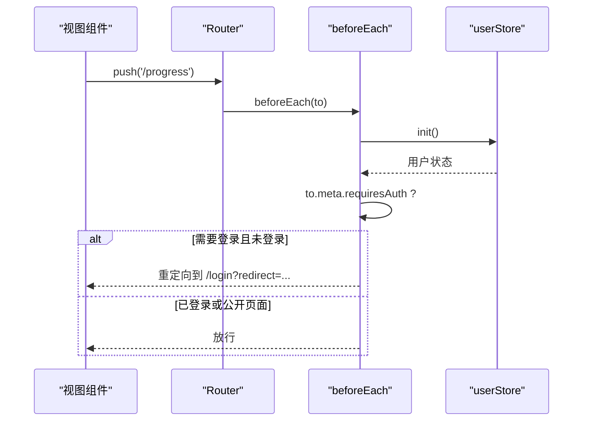
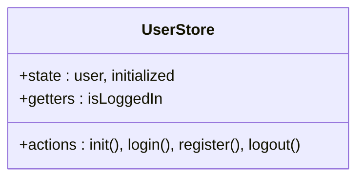
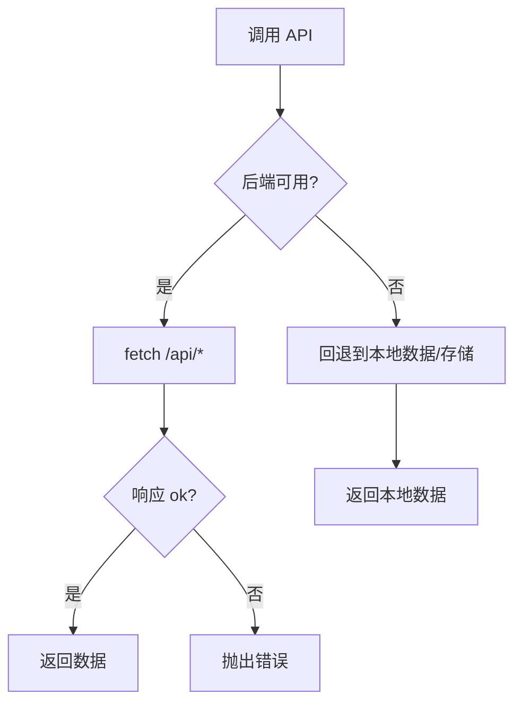
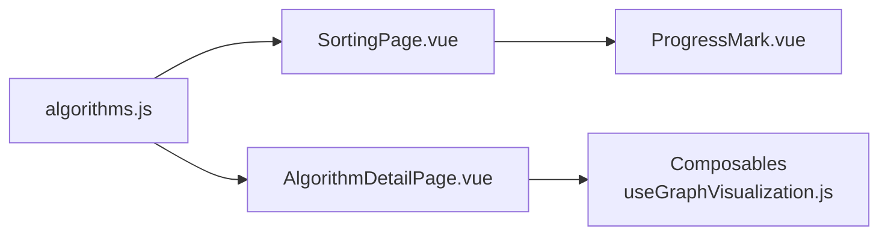
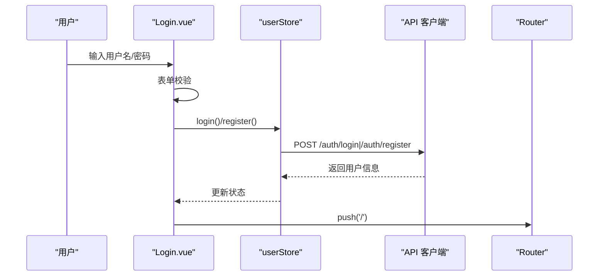
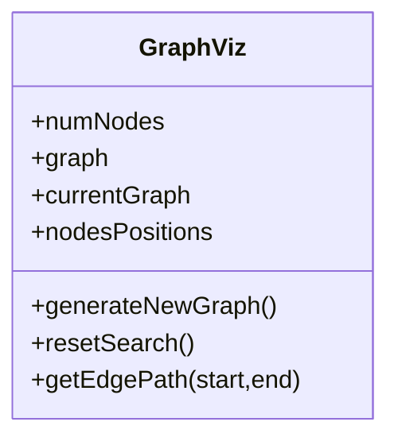

# 前端架构

<cite>
**本文引用的文件**
- [package.json](file://suanfa_vue/package.json)
- [vite.config.js](file://suanfa_vue/vite.config.js)
- [main.js](file://suanfa_vue/src/main.js)
- [App.vue](file://suanfa_vue/src/App.vue)
- [index.js（路由）](file://suanfa_vue/src/router/index.js)
- [user.js（Pinia 状态）](file://suanfa_vue/src/stores/user.js)
- [client.js（API 客户端）](file://suanfa_vue/src/api/client.js)
- [algorithms.js（算法数据源）](file://suanfa_vue/src/data/algorithms.js)
- [Home.vue](file://suanfa_vue/src/components/common/Home.vue)
- [Login.vue](file://suanfa_vue/src/components/common/Login.vue)
- [useGraphVisualization.js（组合式可视化）](file://suanfa_vue/src/composables/useGraphVisualization.js)
- [SortingPage.vue](file://suanfa_vue/src/components/algorithms/sorting_algorithms/SortingPage.vue)
- [theme.css（主题变量）](file://suanfa_vue/src/styles/theme.css)
</cite>

## 目录
1. [简介](#简介)
2. [项目结构](#项目结构)
3. [核心组件](#核心组件)
4. [架构总览](#架构总览)
5. [详细组件分析](#详细组件分析)
6. [依赖关系分析](#依赖关系分析)
7. [性能与构建优化](#性能与构建优化)
8. [安全考虑](#安全考虑)
9. [移动端适配策略](#移动端适配策略)
10. [故障排查指南](#故障排查指南)
11. [结论](#结论)

## 简介
本项目是一个基于 Vue 3 的组合式 API 的前端应用，采用 Pinia 进行状态管理、Vue Router 进行路由管理，使用 Vite 作为构建工具。前端通过统一的 API 客户端与后端交互，具备“后端优先、离线回退”的健壮性设计；同时提供丰富的算法可视化页面、AI 助教、学习日历与训练模块。整体遵循组件化、单一数据源、可维护的主题系统，便于扩展与维护。

## 项目结构
前端位于 suanfa_vue 目录，采用按功能域划分的目录组织方式：
- src/api：统一的后端请求封装与降级策略
- src/stores：Pinia 状态管理（用户态等）
- src/router：路由定义与守卫
- src/components：页面与业务组件，按算法类别与通用组件划分
- src/composables：可复用的组合式逻辑（如可视化脚手架）
- src/data：静态数据与元信息（算法清单、视频等）
- src/styles：全局样式与主题变量
- vite.config.js：Vite 配置（插件、代理、解析扩展名）
- package.json：依赖与脚本



图表来源
- [main.js:1-12](file://suanfa_vue/src/main.js#L1-L12)
- [App.vue:1-134](file://suanfa_vue/src/App.vue#L1-L134)
- [index.js（路由）:1-124](file://suanfa_vue/src/router/index.js#L1-L124)
- [user.js:1-36](file://suanfa_vue/src/stores/user.js#L1-L36)
- [client.js:1-725](file://suanfa_vue/src/api/client.js#L1-L725)
- [algorithms.js:1-808](file://suanfa_vue/src/data/algorithms.js#L1-L808)
- [useGraphVisualization.js:1-148](file://suanfa_vue/src/composables/useGraphVisualization.js#L1-L148)
- [theme.css:1-136](file://suanfa_vue/src/styles/theme.css#L1-L136)

章节来源
- [package.json:1-23](file://suanfa_vue/package.json#L1-L23)
- [vite.config.js:1-22](file://suanfa_vue/vite.config.js#L1-L22)
- [main.js:1-12](file://suanfa_vue/src/main.js#L1-L12)

## 核心组件
- 应用入口与初始化：创建 Vue 实例，注册 Pinia 与 Router，挂载到 #app
- 根布局：顶部导航、动态算法菜单、登录态展示、底部页脚
- 路由与守卫：懒加载页面组件，基于 meta 的认证守卫
- 状态管理：用户登录态、会话恢复、登出
- API 客户端：统一 fetch 封装、后端可用性探测、离线回退（localStorage/本地数据）
- 数据层：算法元数据单一数据源，分类派生数据
- 组合式逻辑：图算法可视化共享脚手架，复用节点布局、边绘制、步骤管理等

章节来源
- [main.js:1-12](file://suanfa_vue/src/main.js#L1-L12)
- [App.vue:1-134](file://suanfa_vue/src/App.vue#L1-L134)
- [index.js（路由）:1-124](file://suanfa_vue/src/router/index.js#L1-L124)
- [user.js:1-36](file://suanfa_vue/src/stores/user.js#L1-L36)
- [client.js:1-725](file://suanfa_vue/src/api/client.js#L1-L725)
- [algorithms.js:1-808](file://suanfa_vue/src/data/algorithms.js#L1-L808)
- [useGraphVisualization.js:1-148](file://suanfa_vue/src/composables/useGraphVisualization.js#L1-L148)

## 架构总览
前端采用“组合式 API + 组件化 + 状态集中 + 数据驱动”的架构模式：
- 组件化：页面级组件与通用组件分离，算法详情页按类别组织，减少重复代码
- 状态管理：Pinia 管理跨页面状态（如用户态），组件内局部状态由 ref/reactive 管理
- 路由管理：Vue Router 懒加载页面，配合 beforeGuard 实现认证控制
- API 交互：统一 client.js 封装，支持后端不可用时的本地回退，保证纯静态部署可用
- 数据源：algorithms.js 为算法元数据的单一数据源，派生出分类、详情页所需信息
- 构建工具：Vite 提供快速开发体验，生产构建优化打包体积与加载性能



图表来源
- [index.js（路由）:109-120](file://suanfa_vue/src/router/index.js#L109-L120)
- [user.js:14-23](file://suanfa_vue/src/stores/user.js#L14-L23)
- [client.js:12-43](file://suanfa_vue/src/api/client.js#L12-L43)

## 详细组件分析

### 应用入口与根布局
- 入口 main.js 创建应用并安装 Pinia 与 Router
- 根组件 App.vue 负责导航、下拉菜单、登录态显示、路由视图渲染与页脚
- 导航项根据 data/algorithms.js 的分类自动派生，新增分类无需修改导航逻辑



图表来源
- [main.js:1-12](file://suanfa_vue/src/main.js#L1-L12)
- [App.vue:1-134](file://suanfa_vue/src/App.vue#L1-L134)

章节来源
- [main.js:1-12](file://suanfa_vue/src/main.js#L1-L12)
- [App.vue:1-134](file://suanfa_vue/src/App.vue#L1-L134)

### 路由与认证守卫
- 路由采用懒加载，降低首屏体积
- 通过 meta.requiresAuth 与 meta.public 控制访问权限
- 路由守卫先恢复会话，再判断是否跳转至登录页



图表来源
- [index.js（路由）:104-120](file://suanfa_vue/src/router/index.js#L104-L120)
- [user.js:14-23](file://suanfa_vue/src/stores/user.js#L14-L23)

章节来源
- [index.js（路由）:1-124](file://suanfa_vue/src/router/index.js#L1-L124)

### 状态管理（Pinia）
- userStore 管理用户对象与会话初始化标志
- getters 暴露 isLoggedIn
- actions 封装登录、注册、登出、会话恢复
- 与 API 客户端解耦，便于测试与替换



图表来源
- [user.js:1-36](file://suanfa_vue/src/stores/user.js#L1-L36)

章节来源
- [user.js:1-36](file://suanfa_vue/src/stores/user.js#L1-L36)

### API 客户端与离线回退
- 统一 request 封装，携带 credentials 与 JSON 头
- checkBackend 懒探测后端可用性，失败缓存短时间避免误判
- 各接口在不可用时回退到 localStorage 或本地数据（algorithms/videos）
- AI 聊天支持 SSE 流式响应，不可用时回退本地答疑



图表来源
- [client.js:12-43](file://suanfa_vue/src/api/client.js#L12-L43)
- [client.js:49-105](file://suanfa_vue/src/api/client.js#L49-L105)
- [client.js:154-186](file://suanfa_vue/src/api/client.js#L154-L186)
- [client.js:223-266](file://suanfa_vue/src/api/client.js#L223-L266)
- [client.js:274-324](file://suanfa_vue/src/api/client.js#L274-L324)
- [client.js:360-570](file://suanfa_vue/src/api/client.js#L360-L570)

章节来源
- [client.js:1-725](file://suanfa_vue/src/api/client.js#L1-L725)

### 数据层与组件通信
- algorithms.js 为单一数据源，导出算法列表与分类派生数据
- 页面组件通过 computed/filter 从数据源派生视图数据（如 SortingPage）
- 组件间通信以 props/emits 为主，复杂状态通过 Pinia 共享
- 可视化逻辑抽取为 composables，供多个 Detail 组件复用



图表来源
- [algorithms.js:777-800](file://suanfa_vue/src/data/algorithms.js#L777-L800)
- [SortingPage.vue:1-97](file://suanfa_vue/src/components/algorithms/sorting_algorithms/SortingPage.vue#L1-L97)
- [useGraphVisualization.js:1-148](file://suanfa_vue/src/composables/useGraphVisualization.js#L1-L148)

章节来源
- [algorithms.js:1-808](file://suanfa_vue/src/data/algorithms.js#L1-L808)
- [SortingPage.vue:1-97](file://suanfa_vue/src/components/algorithms/sorting_algorithms/SortingPage.vue#L1-L97)
- [useGraphVisualization.js:1-148](file://suanfa_vue/src/composables/useGraphVisualization.js#L1-L148)

### 登录流程
- Login.vue 表单校验后调用 userStore.login/register
- 成功后跳转到首页
- 错误时展示提示信息



图表来源
- [Login.vue:16-44](file://suanfa_vue/src/components/common/Login.vue#L16-L44)
- [user.js:24-33](file://suanfa_vue/src/stores/user.js#L24-L33)
- [client.js:111-131](file://suanfa_vue/src/api/client.js#L111-L131)

章节来源
- [Login.vue:1-178](file://suanfa_vue/src/components/common/Login.vue#L1-L178)
- [user.js:1-36](file://suanfa_vue/src/stores/user.js#L1-L36)
- [client.js:111-131](file://suanfa_vue/src/api/client.js#L111-L131)

### 可视化组件（图算法）
- useGraphVisualization 提供节点位置计算、边路径绘制、步骤管理与重置
- 各算法 Detail 组件注入 generateGraph 与 onReset，专注算法专属逻辑
- 提升复用性与一致性，降低重复代码



图表来源
- [useGraphVisualization.js:16-148](file://suanfa_vue/src/composables/useGraphVisualization.js#L16-L148)

章节来源
- [useGraphVisualization.js:1-148](file://suanfa_vue/src/composables/useGraphVisualization.js#L1-L148)

## 依赖关系分析
- 运行时依赖：vue、pinia、vue-router、dompurify、marked
- 开发依赖：@vitejs/plugin-vue、vite
- 构建与开发：vite 提供 dev server、代理、热更新
- 主题系统：CSS 变量集中管理，便于换肤与一致性

```mermaid
graph TB
P["package.json"] --> VUE["vue"]
P --> PINIA["pinia"]
P --> ROUTER["vue-router"]
P --> DOMP["dompurify"]
P --> MARKED["marked"]
P --> VITE["@vitejs/plugin-vue","vite"]
```

图表来源
- [package.json:11-21](file://suanfa_vue/package.json#L11-L21)

章节来源
- [package.json:1-23](file://suanfa_vue/package.json#L1-L23)

## 性能与构建优化
- 路由懒加载：页面组件按需导入，减少首屏包体
- 单数据源：算法元数据集中管理，避免重复请求与冗余渲染
- 后端可用性探测：避免频繁无效请求，失败短时缓存
- 离线回退：localStorage 与本地数据保障基本功能可用
- Vite 配置：
  - 启用 @vitejs/plugin-vue
  - 解析扩展名包含 .vue/.js/.ts
  - dev server 开启 host:true 与 /api 代理到后端
- 建议优化：
  - 图片与媒体资源使用 CDN 与懒加载
  - 大组件进一步拆分与异步加载
  - 使用浏览器缓存与 HTTP 缓存策略
  - 对长列表使用虚拟滚动（如评论、笔记）
  - 监控与埋点评估性能指标（FCP、LCP、TBT）

章节来源
- [vite.config.js:1-22](file://suanfa_vue/vite.config.js#L1-L22)
- [client.js:12-43](file://suanfa_vue/src/api/client.js#L12-L43)

## 安全考虑
- XSS 防护：使用 dompurify 对用户输入进行清理（如评论、笔记内容）
- 认证与会话：
  - 路由守卫限制访问受保护页面
  - 凭据通过 credentials: include 传递 Cookie
  - 登录态恢复在路由守卫中执行，确保一致
- 敏感操作：
  - 代码执行需后端沙箱环境，前端仅做参数传递
  - AI 对话流式响应处理异常与超时
- 建议：
  - 增加 CSRF 防护（后端配合）
  - 对 API 响应进行类型校验
  - 限制上传内容与大小
  - 日志脱敏与错误上报

章节来源
- [client.js:30-43](file://suanfa_vue/src/api/client.js#L30-L43)
- [client.js:111-131](file://suanfa_vue/src/api/client.js#L111-L131)
- [index.js（路由）:109-120](file://suanfa_vue/src/router/index.js#L109-L120)

## 移动端适配策略
- 响应式布局：使用 CSS Grid/Flexbox 与媒体查询，适配窄屏
- 导航与菜单：点击展开/收起，键盘事件支持 Escape 关闭
- 字体与触控：按钮与链接尺寸适合手指操作
- 性能：减少重绘与回流，避免大图与复杂动画
- 建议：
  - 使用 rem/vw 单位提升缩放一致性
  - 针对小屏优化表格与卡片布局
  - 触摸手势与长按反馈
  - 检测设备能力与降级策略

章节来源
- [App.vue:136-494](file://suanfa_vue/src/App.vue#L136-L494)
- [theme.css:1-136](file://suanfa_vue/src/styles/theme.css#L1-L136)

## 故障排查指南
- 后端不可用：
  - 检查 checkBackend 探测逻辑与代理配置
  - 确认 /api 代理目标地址与 CORS
  - 查看 localStorage 回退数据是否正常
- 登录失败：
  - 检查 /auth/login 与 /auth/me 接口
  - 确认 Cookie 与 Session 配置
  - 查看路由守卫是否正确重定向
- 可视化异常：
  - 检查节点数量与边界条件
  - 确认 generateGraph 与 onReset 钩子正确注入
  - 查看错误消息与步骤详情
- AI 对话：
  - 检查 SSE 流式响应与解析器
  - 确认模型配置与速率限制
  - 回退本地答疑是否生效

章节来源
- [client.js:12-43](file://suanfa_vue/src/api/client.js#L12-L43)
- [client.js:469-570](file://suanfa_vue/src/api/client.js#L469-L570)
- [useGraphVisualization.js:104-138](file://suanfa_vue/src/composables/useGraphVisualization.js#L104-L138)

## 结论
该前端架构以 Vue 3 组合式 API 为核心，结合 Pinia 与 Vue Router 形成清晰的状态与路由管理；通过统一 API 客户端实现“后端优先、离线回退”的健壮交互；以单一数据源与组合式逻辑提升可维护性与复用性；Vite 提供高效开发与构建能力。整体设计兼顾性能、安全与可扩展性，为后续功能迭代与团队协作提供了坚实基础。