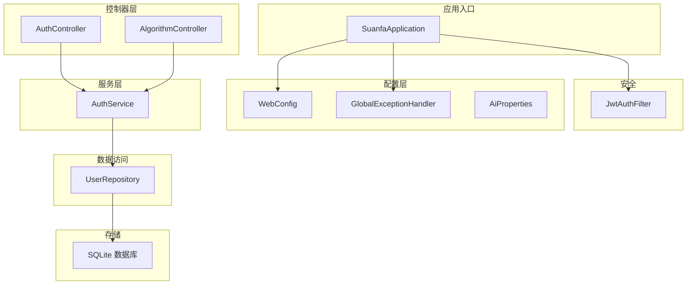
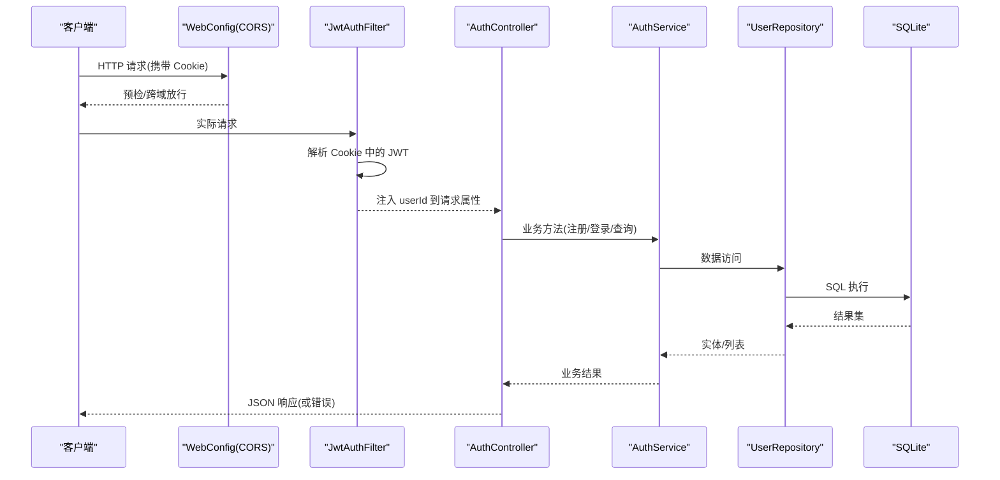
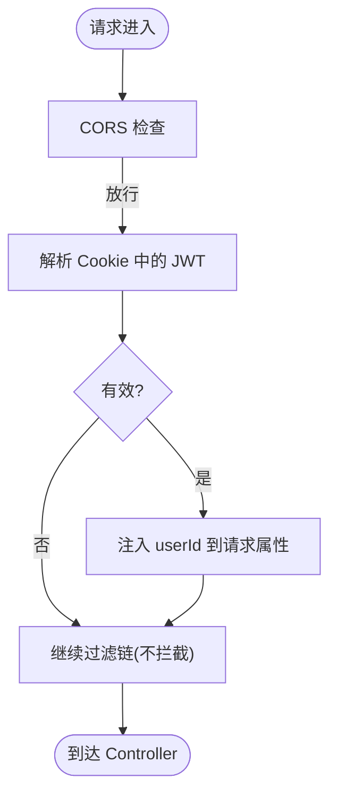
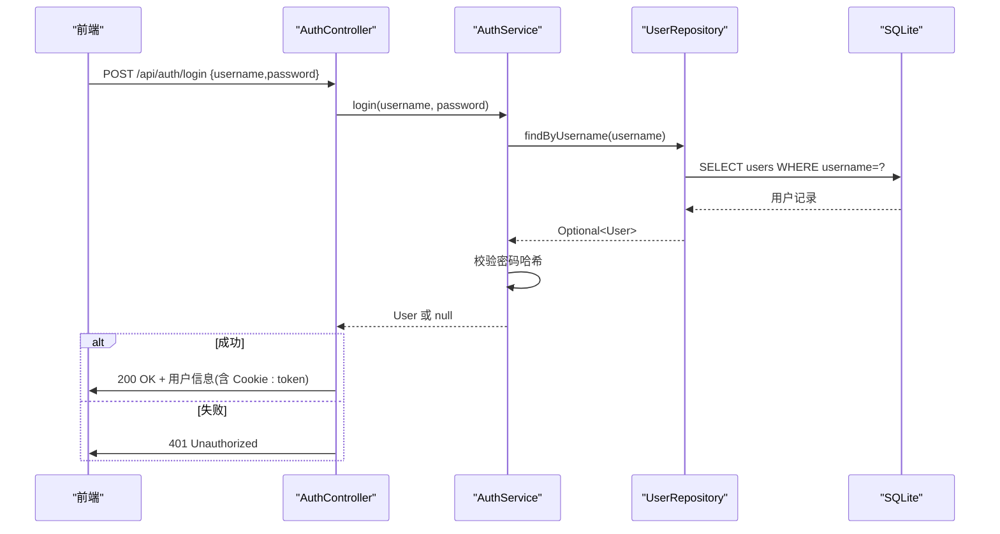
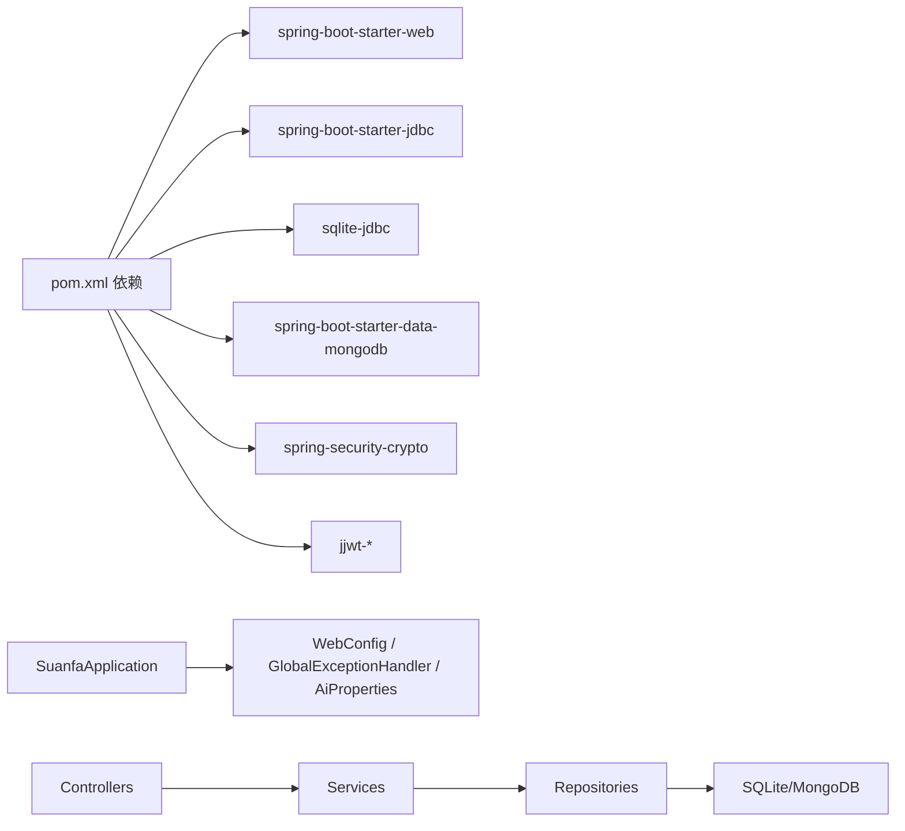
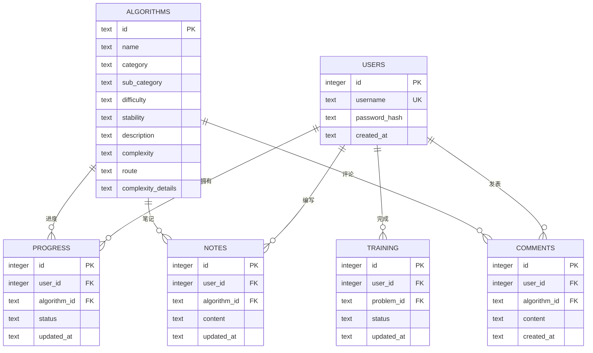

# 后端架构

<cite>
**本文引用的文件**
- [SuanfaApplication.java](file://backend/src/main/java/com/suanfa/SuanfaApplication.java)
- [pom.xml](file://backend/pom.xml)
- [application.yml](file://backend/src/main/resources/application.yml)
- [schema.sql](file://backend/src/main/resources/schema.sql)
- [WebConfig.java](file://backend/src/main/java/com/suanfa/config/WebConfig.java)
- [GlobalExceptionHandler.java](file://backend/src/main/java/com/suanfa/config/GlobalExceptionHandler.java)
- [AiProperties.java](file://backend/src/main/java/com/suanfa/config/AiProperties.java)
- [JwtAuthFilter.java](file://backend/src/main/java/com/suanfa/security/JwtAuthFilter.java)
- [AuthController.java](file://backend/src/main/java/com/suanfa/controller/AuthController.java)
- [AlgorithmController.java](file://backend/src/main/java/com/suanfa/controller/AlgorithmController.java)
- [AuthService.java](file://backend/src/main/java/com/suanfa/service/AuthService.java)
- [UserRepository.java](file://backend/src/main/java/com/suanfa/repository/UserRepository.java)
- [User.java](file://backend/src/main/java/com/suanfa/entity/User.java)
</cite>

## 目录
1. [简介](#简介)
2. [项目结构](#项目结构)
3. [核心组件](#核心组件)
4. [架构总览](#架构总览)
5. [详细组件分析](#详细组件分析)
6. [依赖关系分析](#依赖关系分析)
7. [性能考虑](#性能考虑)
8. [故障排查指南](#故障排查指南)
9. [结论](#结论)
10. [附录](#附录)

## 简介
本文件面向后端开发者，系统化阐述基于 Spring Boot 的后端服务架构设计。文档围绕 MVC 分层（Controller/Service/Repository）、RESTful API 规范、请求处理流程与异常处理机制、配置管理策略（环境变量与配置文件）、数据库连接与事务、缓存策略、安全配置（JWT、CORS）以及全局异常处理等横切关注点展开，并提供可操作的架构图、流程图与最佳实践建议，帮助团队在统一规范下高效协作与演进。

## 项目结构
后端采用典型的 Spring Boot 工程组织方式：
- 启动类负责应用初始化与环境准备
- config 包承载 Web 配置、全局异常、AI 配置属性等横切能力
- controller 提供 REST 接口，接收并返回 JSON
- service 封装业务逻辑，协调 repository 与外部系统
- repository 通过 JdbcTemplate 访问 SQLite 持久化数据
- security 实现 JWT 认证过滤器与服务
- entity/dto 定义领域模型与传输对象
- resources 包含 application.yml、schema.sql 与种子数据

图表来源
- [SuanfaApplication.java:10-19](file://backend/src/main/java/com/suanfa/SuanfaApplication.java#L10-L19)
- [WebConfig.java:13-44](file://backend/src/main/java/com/suanfa/config/WebConfig.java#L13-L44)
- [GlobalExceptionHandler.java:21-68](file://backend/src/main/java/com/suanfa/config/GlobalExceptionHandler.java#L21-L68)
- [JwtAuthFilter.java:19-47](file://backend/src/main/java/com/suanfa/security/JwtAuthFilter.java#L19-L47)
- [AuthController.java:16-71](file://backend/src/main/java/com/suanfa/controller/AuthController.java#L16-L71)
- [AlgorithmController.java:11-30](file://backend/src/main/java/com/suanfa/controller/AlgorithmController.java#L11-L30)
- [AuthService.java:11-51](file://backend/src/main/java/com/suanfa/service/AuthService.java#L11-L51)
- [UserRepository.java:15-52](file://backend/src/main/java/com/suanfa/repository/UserRepository.java#L15-L52)

章节来源
- [SuanfaApplication.java:10-19](file://backend/src/main/java/com/suanfa/SuanfaApplication.java#L10-L19)
- [pom.xml:24-78](file://backend/pom.xml#L24-L78)

## 核心组件
- 启动与初始化：确保数据目录存在，启动 Spring 容器
- Web 配置：注册参数解析器、配置 CORS 白名单与允许凭据
- 全局异常：统一错误响应体，区分 4xx/5xx 并记录日志
- 安全过滤：从 httpOnly Cookie 解析 JWT，注入用户 ID 到请求属性
- 认证控制器：注册、登录、登出、当前用户信息；Token 写入 Cookie
- 算法控制器：按分类列出算法元数据、按 ID 获取详情
- 认证服务：密码哈希校验、用户查找与转换 DTO
- 数据访问：JdbcTemplate 直连 SQLite，RowMapper 映射实体
- 配置属性：AI 相关配置（多中转站、模型、限流、超时等）

章节来源
- [WebConfig.java:13-44](file://backend/src/main/java/com/suanfa/config/WebConfig.java#L13-L44)
- [GlobalExceptionHandler.java:21-68](file://backend/src/main/java/com/suanfa/config/GlobalExceptionHandler.java#L21-L68)
- [JwtAuthFilter.java:19-47](file://backend/src/main/java/com/suanfa/security/JwtAuthFilter.java#L19-L47)
- [AuthController.java:16-93](file://backend/src/main/java/com/suanfa/controller/AuthController.java#L16-L93)
- [AlgorithmController.java:11-30](file://backend/src/main/java/com/suanfa/controller/AlgorithmController.java#L11-L30)
- [AuthService.java:11-51](file://backend/src/main/java/com/suanfa/service/AuthService.java#L11-L51)
- [UserRepository.java:15-52](file://backend/src/main/java/com/suanfa/repository/UserRepository.java#L15-L52)
- [AiProperties.java:25-57](file://backend/src/main/java/com/suanfa/config/AiProperties.java#L25-L57)

## 架构总览
整体采用 MVC 分层 + 横切关注点分离：
- Controller：仅做入参校验、调用 Service、组装响应
- Service：业务编排、规则校验、跨域调用（如 AI 上游）
- Repository：数据访问抽象，使用 JdbcTemplate 操作 SQLite
- Security：基于 JWT 的无状态认证，Cookie 传递 Token
- Config：CORS、全局异常、AI 配置属性集中管理
- 配置中心：application.yml + 环境变量覆盖，支持运行时热更新（AI 设置表）

图表来源
- [WebConfig.java:33-44](file://backend/src/main/java/com/suanfa/config/WebConfig.java#L33-L44)
- [JwtAuthFilter.java:31-47](file://backend/src/main/java/com/suanfa/security/JwtAuthFilter.java#L31-L47)
- [AuthController.java:28-71](file://backend/src/main/java/com/suanfa/controller/AuthController.java#L28-L71)
- [AuthService.java:22-51](file://backend/src/main/java/com/suanfa/service/AuthService.java#L22-L51)
- [UserRepository.java:30-52](file://backend/src/main/java/com/suanfa/repository/UserRepository.java#L30-L52)

## 详细组件分析

### 认证与安全（JWT + CORS）
- CORS 策略：通过 WebConfig 为 /api/** 启用 allowedOriginPatterns，允许带凭据的跨域请求，开发环境默认宽松，生产可通过环境变量收紧
- 认证流程：JwtAuthFilter 从 httpOnly Cookie 中读取 token，解析后把 userId 注入 request attribute；Controller 通过 @RequestAttribute 或自定义参数解析器获取当前用户
- 令牌生命周期：登录成功后由 AuthController 将 token 写入 Cookie，设置 HttpOnly、SameSite 与过期时间；登出时清空 Cookie

图表来源
- [WebConfig.java:33-44](file://backend/src/main/java/com/suanfa/config/WebConfig.java#L33-L44)
- [JwtAuthFilter.java:31-47](file://backend/src/main/java/com/suanfa/security/JwtAuthFilter.java#L31-L47)
- [AuthController.java:73-88](file://backend/src/main/java/com/suanfa/controller/AuthController.java#L73-L88)

章节来源
- [WebConfig.java:13-44](file://backend/src/main/java/com/suanfa/config/WebConfig.java#L13-L44)
- [JwtAuthFilter.java:19-47](file://backend/src/main/java/com/suanfa/security/JwtAuthFilter.java#L19-L47)
- [AuthController.java:16-93](file://backend/src/main/java/com/suanfa/controller/AuthController.java#L16-L93)

### 用户注册与登录（MVC 数据流）
- Controller：暴露 /api/auth/register、/api/auth/login、/api/auth/logout、/api/auth/me
- Service：校验输入、密码哈希比对、用户查找与 DTO 转换
- Repository：通过 JdbcTemplate 执行 SQL，映射 User 实体
- 异常：非法参数抛出 IllegalArgumentException，被全局异常处理器统一转为 400

图表来源
- [AuthController.java:43-52](file://backend/src/main/java/com/suanfa/controller/AuthController.java#L43-L52)
- [AuthService.java:35-43](file://backend/src/main/java/com/suanfa/service/AuthService.java#L35-L43)
- [UserRepository.java:30-33](file://backend/src/main/java/com/suanfa/repository/UserRepository.java#L30-L33)

章节来源
- [AuthController.java:28-71](file://backend/src/main/java/com/suanfa/controller/AuthController.java#L28-L71)
- [AuthService.java:22-51](file://backend/src/main/java/com/suanfa/service/AuthService.java#L22-L51)
- [UserRepository.java:30-52](file://backend/src/main/java/com/suanfa/repository/UserRepository.java#L30-L52)

### 算法元数据接口（RESTful 风格）
- GET /api/algorithms?category=...：按分类筛选算法列表
- GET /api/algorithms/{id}：按 ID 获取算法详情，不存在返回 404
- 遵循资源命名与 HTTP 语义，便于前端路由与缓存

章节来源
- [AlgorithmController.java:11-30](file://backend/src/main/java/com/suanfa/controller/AlgorithmController.java#L11-L30)

### 配置管理策略
- 应用配置：application.yml 集中声明服务器端口、数据源、MongoDB、Jackson 行为、日志级别
- 环境变量覆盖：敏感项（如 JWT secret、AI 基地址与密钥、超时与限流阈值）通过环境变量注入，避免硬编码
- AI 配置：AiProperties 支持单上游与多上游 providers，支持模型级预算、超时、温度、推理档位与可见性控制
- 运行时配置：app_settings 表用于保存 AI 中转站等运行时配置，页面修改后热生效

章节来源
- [application.yml:1-102](file://backend/src/main/resources/application.yml#L1-L102)
- [AiProperties.java:25-57](file://backend/src/main/java/com/suanfa/config/AiProperties.java#L25-L57)
- [schema.sql:60-65](file://backend/src/main/resources/schema.sql#L60-L65)

### 数据库与事务
- 数据源：Spring Boot JDBC + SQLite，驱动由 pom.xml 引入
- 初始化：启动时自动执行 schema.sql 建表
- 访问方式：JdbcTemplate + RowMapper，轻量且可控
- 事务：当前代码未显式使用 @Transactional；如需写操作的事务边界，建议在 Service 层添加事务注解以保障一致性

章节来源
- [pom.xml:31-40](file://backend/pom.xml#L31-L40)
- [application.yml:4-14](file://backend/src/main/resources/application.yml#L4-L14)
- [schema.sql:1-77](file://backend/src/main/resources/schema.sql#L1-L77)
- [UserRepository.java:15-52](file://backend/src/main/java/com/suanfa/repository/UserRepository.java#L15-L52)

### 缓存策略
- 现状：未发现内置缓存实现（如 Redis、Caffeine）
- 建议：对热点只读数据（如算法清单、知识召回片段）增加本地缓存或分布式缓存，结合 TTL 与失效策略提升吞吐

[本节为通用建议，不直接分析具体文件]

### 横切关注点：全局异常处理
- 统一错误体：所有异常最终转换为统一的 JSON 错误响应
- 分类处理：400（参数错误）、404（接口不存在）、405（方法不支持）、500（内部错误）分别处理并记录日志
- 好处：前后端契约清晰，降低联调成本

章节来源
- [GlobalExceptionHandler.java:21-68](file://backend/src/main/java/com/suanfa/config/GlobalExceptionHandler.java#L21-L68)

## 依赖关系分析
- 启动依赖：Spring Boot Starter Web、JDBC、SQLite、MongoDB、Security Crypto、JWT
- 模块耦合：
  - Controller 依赖 Service 与 Security（JWT 过滤器）
  - Service 依赖 Repository 与加密工具
  - Repository 依赖 JdbcTemplate
  - Config 提供横切能力（CORS、异常、AI 配置）
- 外部集成：SQLite 本地文件数据库、可选 MongoDB（用于文档型内容）

图表来源
- [pom.xml:24-78](file://backend/pom.xml#L24-L78)
- [SuanfaApplication.java:10-19](file://backend/src/main/java/com/suanfa/SuanfaApplication.java#L10-L19)
- [WebConfig.java:13-44](file://backend/src/main/java/com/suanfa/config/WebConfig.java#L13-L44)
- [GlobalExceptionHandler.java:21-68](file://backend/src/main/java/com/suanfa/config/GlobalExceptionHandler.java#L21-L68)
- [AiProperties.java:25-57](file://backend/src/main/java/com/suanfa/config/AiProperties.java#L25-L57)

章节来源
- [pom.xml:24-78](file://backend/pom.xml#L24-L78)

## 性能考虑
- 数据库：SQLite 适合单机与中小规模场景；注意并发写入限制，必要时分库或迁移至关系型数据库
- 网络：对外部 AI 上游调用需设置合理超时与重试/降级策略，避免阻塞线程池
- 序列化：Jackson 默认非空字段输出，减少无效负载
- 缓存：对高频只读数据加缓存可降低数据库压力
- 限流：AI 与代码执行已具备每分钟次数限制，可按需扩展为令牌桶/漏桶

[本节为通用建议，不直接分析具体文件]

## 故障排查指南
- 404/405：检查路径与方法是否匹配；全局异常会返回友好提示
- 400：检查请求体格式与必填参数；全局异常会截断过长消息
- 401：确认 Cookie 中 token 是否存在且有效；检查 JWT 解析与过期策略
- 500：查看服务端日志定位根因；必要时开启 debug 级别日志
- 跨域问题：核对 allowedOriginPatterns 与 allowCredentials 配置

章节来源
- [GlobalExceptionHandler.java:26-58](file://backend/src/main/java/com/suanfa/config/GlobalExceptionHandler.java#L26-L58)
- [WebConfig.java:33-44](file://backend/src/main/java/com/suanfa/config/WebConfig.java#L33-L44)
- [JwtAuthFilter.java:31-47](file://backend/src/main/java/com/suanfa/security/JwtAuthFilter.java#L31-L47)

## 结论
本项目采用清晰的 MVC 分层与横切关注点分离，配合 JWT 无状态认证、CORS 灵活配置与全局异常处理，形成了稳定易用的后端基础。通过 application.yml 与环境变量组合的配置策略，兼顾了开发与生产的灵活性。后续可在事务管理、缓存与监控方面进一步增强，以支撑更高并发与更复杂的业务场景。

## 附录
- 数据模型概览（节选）

图表来源
- [schema.sql:5-77](file://backend/src/main/resources/schema.sql#L5-L77)