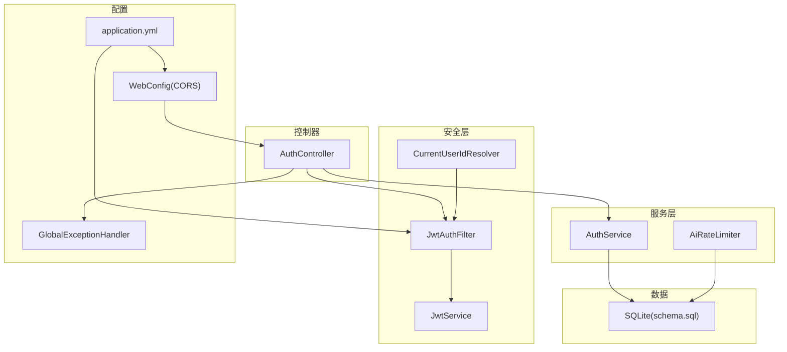
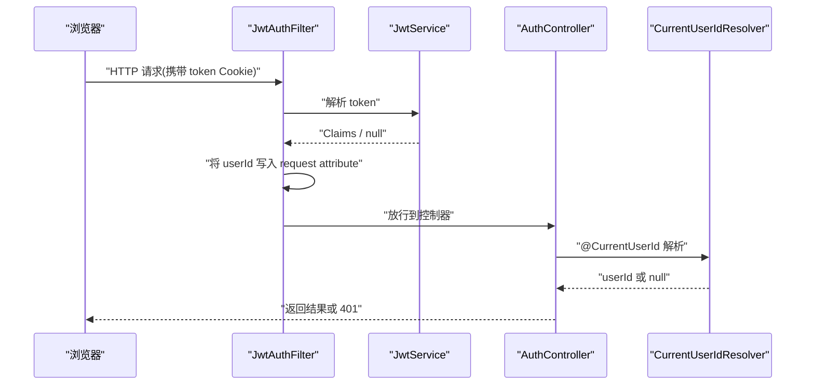
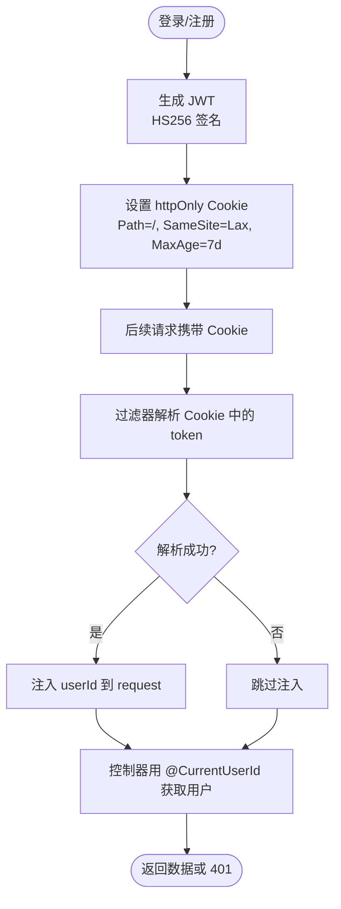
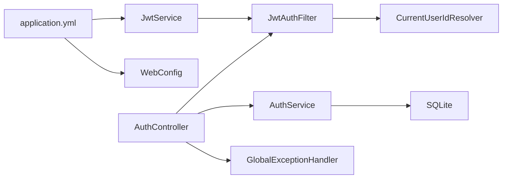

# 安全架构

<cite>
**本文引用的文件**
- [JwtService.java](file://backend/src/main/java/com/suanfa/security/JwtService.java)
- [JwtAuthFilter.java](file://backend/src/main/java/com/suanfa/security/JwtAuthFilter.java)
- [CurrentUserIdResolver.java](file://backend/src/main/java/com/suanfa/security/CurrentUserIdResolver.java)
- [AuthController.java](file://backend/src/main/java/com/suanfa/controller/AuthController.java)
- [AuthService.java](file://backend/src/main/java/com/suanfa/service/AuthService.java)
- [WebConfig.java](file://backend/src/main/java/com/suanfa/config/WebConfig.java)
- [GlobalExceptionHandler.java](file://backend/src/main/java/com/suanfa/config/GlobalExceptionHandler.java)
- [application.yml](file://backend/src/main/resources/application.yml)
- [schema.sql](file://backend/src/main/resources/schema.sql)
- [AiRateLimiter.java](file://backend/src/main/java/com/suanfa/service/AiRateLimiter.java)
</cite>

## 目录
1. [简介](#简介)
2. [项目结构](#项目结构)
3. [核心组件](#核心组件)
4. [架构总览](#架构总览)
5. [详细组件分析](#详细组件分析)
6. [依赖关系分析](#依赖关系分析)
7. [性能与安全权衡](#性能与安全权衡)
8. [故障排查指南](#故障排查指南)
9. [结论](#结论)
10. [附录：安全开发清单](#附录：安全开发清单)

## 简介
本安全架构文档围绕系统的认证、授权、输入校验、防注入、跨域与敏感信息保护、会话管理、密码存储、API限流等关键安全能力进行说明。重点覆盖：
- JWT 令牌生成、验证与刷新（当前实现为基于 Cookie 的无状态会话）
- 基于角色的访问控制（RBAC）现状与扩展建议
- 输入验证与全局异常处理
- SQL 注入防护策略（参数化查询）
- XSS 防护建议（后端输出编码与前端渲染策略）
- CORS 配置与 HTTPS 部署建议
- 会话管理（Cookie 安全属性）、密码加密存储（BCrypt）
- API 限流（按用户滑动窗口）

## 项目结构
后端采用 Spring MVC + SQLite，安全相关代码集中在 security、config、controller、service 包中；配置文件位于 resources/application.yml；数据库表结构定义在 schema.sql。

图表来源
- [JwtAuthFilter.java:1-49](file://backend/src/main/java/com/suanfa/security/JwtAuthFilter.java#L1-L49)
- [JwtService.java:1-56](file://backend/src/main/java/com/suanfa/security/JwtService.java#L1-L56)
- [CurrentUserIdResolver.java:1-28](file://backend/src/main/java/com/suanfa/security/CurrentUserIdResolver.java#L1-L28)
- [AuthController.java:1-94](file://backend/src/main/java/com/suanfa/controller/AuthController.java#L1-L94)
- [AuthService.java:1-53](file://backend/src/main/java/com/suanfa/service/AuthService.java#L1-L53)
- [WebConfig.java:1-46](file://backend/src/main/java/com/suanfa/config/WebConfig.java#L1-L46)
- [GlobalExceptionHandler.java:1-69](file://backend/src/main/java/com/suanfa/config/GlobalExceptionHandler.java#L1-L69)
- [application.yml:1-102](file://backend/src/main/resources/application.yml#L1-L102)
- [schema.sql:1-77](file://backend/src/main/resources/schema.sql#L1-L77)

章节来源
- [JwtAuthFilter.java:1-49](file://backend/src/main/java/com/suanfa/security/JwtAuthFilter.java#L1-L49)
- [JwtService.java:1-56](file://backend/src/main/java/com/suanfa/security/JwtService.java#L1-L56)
- [AuthController.java:1-94](file://backend/src/main/java/com/suanfa/controller/AuthController.java#L1-L94)
- [AuthService.java:1-53](file://backend/src/main/java/com/suanfa/service/AuthService.java#L1-L53)
- [WebConfig.java:1-46](file://backend/src/main/java/com/suanfa/config/WebConfig.java#L1-L46)
- [GlobalExceptionHandler.java:1-69](file://backend/src/main/java/com/suanfa/config/GlobalExceptionHandler.java#L1-L69)
- [application.yml:1-102](file://backend/src/main/resources/application.yml#L1-L102)
- [schema.sql:1-77](file://backend/src/main/resources/schema.sql#L1-L77)

## 核心组件
- JWT 签发与解析：使用 HS256 对称签名，subject 为用户 ID，附带 username 声明，过期时间由配置决定。
- 请求鉴权过滤器：从 httpOnly Cookie 中读取 token 并解析，将 userId 注入 request attribute，供后续参数解析器使用。
- 参数解析器：@CurrentUserId 注解自动注入当前登录用户 ID（未登录时为 null）。
- 认证控制器：提供注册、登录、登出、获取当前用户接口；成功登录后以 httpOnly Cookie 下发 token。
- 认证服务：用户名唯一性校验、密码 BCrypt 加密存储与校验。
- CORS 配置：允许携带凭据的跨域访问，支持通配或白名单域名模式。
- 全局异常处理：统一错误响应体，避免敏感堆栈泄露。
- 应用配置：JWT 密钥、过期时间、CORS 白名单、AI 限流阈值等通过 application.yml 管理。
- 数据库模型：users 表仅保存 password_hash，不暴露明文。

章节来源
- [JwtService.java:1-56](file://backend/src/main/java/com/suanfa/security/JwtService.java#L1-L56)
- [JwtAuthFilter.java:1-49](file://backend/src/main/java/com/suanfa/security/JwtAuthFilter.java#L1-L49)
- [CurrentUserIdResolver.java:1-28](file://backend/src/main/java/com/suanfa/security/CurrentUserIdResolver.java#L1-L28)
- [AuthController.java:1-94](file://backend/src/main/java/com/suanfa/controller/AuthController.java#L1-L94)
- [AuthService.java:1-53](file://backend/src/main/java/com/suanfa/service/AuthService.java#L1-L53)
- [WebConfig.java:1-46](file://backend/src/main/java/com/suanfa/config/WebConfig.java#L1-L46)
- [GlobalExceptionHandler.java:1-69](file://backend/src/main/java/com/suanfa/config/GlobalExceptionHandler.java#L1-L69)
- [application.yml:1-102](file://backend/src/main/resources/application.yml#L1-L102)
- [schema.sql:1-77](file://backend/src/main/resources/schema.sql#L1-L77)

## 架构总览
下图展示一次受保护接口的调用链路：浏览器携带 httpOnly Cookie 发起请求，过滤器解析 JWT 并注入 userId，控制器通过 @CurrentUserId 获取用户身份并进行业务处理。

图表来源
- [JwtAuthFilter.java:1-49](file://backend/src/main/java/com/suanfa/security/JwtAuthFilter.java#L1-L49)
- [JwtService.java:1-56](file://backend/src/main/java/com/suanfa/security/JwtService.java#L1-L56)
- [CurrentUserIdResolver.java:1-28](file://backend/src/main/java/com/suanfa/security/CurrentUserIdResolver.java#L1-L28)
- [AuthController.java:1-94](file://backend/src/main/java/com/suanfa/controller/AuthController.java#L1-L94)

## 详细组件分析

### JWT 认证机制
- 令牌生成：注册/登录成功后，服务端使用 HS256 对包含 subject(userId)、username、签发时间、过期时间的 Claims 进行签名，并以 httpOnly Cookie 形式下发。
- 令牌验证：每次请求经 JwtAuthFilter 从 Cookie 提取 token，调用 JwtService 解析；解析失败或过期则忽略，后续控制器按需校验。
- 会话管理：Cookie 设置 HttpOnly、SameSite=Lax、路径为根路径，默认有效期 7 天；登出时清空 Cookie。
- 刷新流程：当前实现为“登录即签发、过期后重新登录”。如需无感刷新，可引入 refresh token 机制（双令牌），并在过滤器中增加刷新逻辑。

图表来源
- [JwtService.java:1-56](file://backend/src/main/java/com/suanfa/security/JwtService.java#L1-L56)
- [JwtAuthFilter.java:1-49](file://backend/src/main/java/com/suanfa/security/JwtAuthFilter.java#L1-L49)
- [AuthController.java:1-94](file://backend/src/main/java/com/suanfa/controller/AuthController.java#L1-L94)

章节来源
- [JwtService.java:1-56](file://backend/src/main/java/com/suanfa/security/JwtService.java#L1-L56)
- [JwtAuthFilter.java:1-49](file://backend/src/main/java/com/suanfa/security/JwtAuthFilter.java#L1-L49)
- [AuthController.java:1-94](file://backend/src/main/java/com/suanfa/controller/AuthController.java#L1-L94)

### 权限控制（RBAC）现状与建议
- 现状：当前系统未实现角色/权限模型，所有受保护接口均基于“是否已登录”判断（@CurrentUserId 是否为空）。
- 建议：
  - 在 users 表扩展 role 字段或新增 roles 表，建立用户-角色映射。
  - 在控制器方法上添加自定义注解（如 @RequireRole("admin")），结合拦截器或 AOP 进行权限校验。
  - 对敏感操作（如 AI 中转站配置）实施管理员白名单校验（参考配置项 admin-usernames）。

章节来源
- [application.yml:1-102](file://backend/src/main/resources/application.yml#L1-L102)

### 输入验证与全局异常处理
- 输入验证：注册/登录时对用户名非空、密码长度等进行基础校验；缺失参数或格式错误会触发全局异常处理器返回 400。
- 全局异常：统一捕获方法不支持、资源不存在、请求体解析失败等异常，返回结构化错误消息，避免堆栈泄露。
- 建议：
  - 对所有外部输入进行严格校验（类型、长度、范围、白名单）。
  - 对富文本/Markdown 内容做长度限制与危险字符过滤。

章节来源
- [AuthService.java:1-53](file://backend/src/main/java/com/suanfa/service/AuthService.java#L1-L53)
- [GlobalExceptionHandler.java:1-69](file://backend/src/main/java/com/suanfa/config/GlobalExceptionHandler.java#L1-L69)

### SQL 注入防护
- 现状：数据库使用 SQLite，表结构定义于 schema.sql；用户密码以哈希形式存储。
- 防护要点：
  - 所有写操作必须使用参数化查询（预编译语句），禁止字符串拼接 SQL。
  - 对查询条件进行类型转换与边界检查。
  - 最小权限原则：数据库账户仅授予必要权限。
- 建议：在 Repository 层统一封装参数化查询，避免在业务层直接拼接 SQL。

章节来源
- [schema.sql:1-77](file://backend/src/main/resources/schema.sql#L1-L77)

### XSS 攻击防护
- 现状：后端记录笔记与评论为纯文本或 Markdown，未在后端显式进行 HTML 转义。
- 防护要点：
  - 后端输出 JSON 时确保不直接嵌入 HTML；若需渲染 Markdown，应在前端使用安全的 Markdown 解析器并启用 XSS 过滤。
  - 对用户输入进行长度限制与非法字符过滤。
- 建议：在前端渲染前对内容进行清洗，禁用内联脚本与危险协议。

[本节为通用安全建议，不直接分析具体文件]

### CORS 配置与 HTTPS 支持
- CORS：通过 WebConfig 配置允许的源、方法、头，并允许携带凭据；生产环境应收紧 allowed-origins 为显式域名列表。
- HTTPS：当前未内置 TLS 终止；建议在反向代理（Nginx/Ingress）启用 HTTPS，并将 Cookie 设置为 Secure 与 SameSite=None（跨站场景）。
- 建议：生产环境关闭调试日志，限制错误信息泄露。

章节来源
- [WebConfig.java:1-46](file://backend/src/main/java/com/suanfa/config/WebConfig.java#L1-L46)
- [application.yml:1-102](file://backend/src/main/resources/application.yml#L1-L102)

### 会话管理与密码加密存储
- 会话管理：Token 存储在 httpOnly Cookie 中，降低 XSS 窃取风险；登出时清空 Cookie。
- 密码存储：使用 BCryptPasswordEncoder 进行密码哈希，登录时进行匹配校验。
- 建议：
  - 为 Cookie 增加 Secure 标志（HTTPS 环境）。
  - 定期轮换 JWT 密钥，并支持密钥版本兼容。

章节来源
- [AuthController.java:1-94](file://backend/src/main/java/com/suanfa/controller/AuthController.java#L1-L94)
- [AuthService.java:1-53](file://backend/src/main/java/com/suanfa/service/AuthService.java#L1-L53)

### API 限流
- 实现：AiRateLimiter 使用内存中的滑动窗口（每用户每分钟请求数），防止滥用上游 AI 接口。
- 配置：通过 suanfa.ai.rate-per-minute 控制阈值；<=0 表示关闭限流。
- 建议：
  - 对关键接口（登录、注册、AI 对话、代码执行）统一接入限流。
  - 考虑分布式场景下使用 Redis 实现共享限流。

章节来源
- [AiRateLimiter.java:1-78](file://backend/src/main/java/com/suanfa/service/AiRateLimiter.java#L1-L78)
- [application.yml:1-102](file://backend/src/main/resources/application.yml#L1-L102)

## 依赖关系分析
- JwtService 依赖配置中的 secret 与 expiry-days。
- JwtAuthFilter 依赖 JwtService 解析 token，并将 userId 注入 request。
- CurrentUserIdResolver 依赖 JwtAuthFilter 的常量名以读取 userId。
- AuthController 依赖 AuthService 完成注册/登录，依赖 JwtService 签发 token。
- WebConfig 提供 CORS 配置，影响所有 /api/** 接口。
- GlobalExceptionHandler 统一处理异常，影响所有控制器。

图表来源
- [application.yml:1-102](file://backend/src/main/resources/application.yml#L1-L102)
- [JwtService.java:1-56](file://backend/src/main/java/com/suanfa/security/JwtService.java#L1-L56)
- [JwtAuthFilter.java:1-49](file://backend/src/main/java/com/suanfa/security/JwtAuthFilter.java#L1-L49)
- [CurrentUserIdResolver.java:1-28](file://backend/src/main/java/com/suanfa/security/CurrentUserIdResolver.java#L1-L28)
- [AuthController.java:1-94](file://backend/src/main/java/com/suanfa/controller/AuthController.java#L1-L94)
- [AuthService.java:1-53](file://backend/src/main/java/com/suanfa/service/AuthService.java#L1-L53)
- [WebConfig.java:1-46](file://backend/src/main/java/com/suanfa/config/WebConfig.java#L1-L46)
- [GlobalExceptionHandler.java:1-69](file://backend/src/main/java/com/suanfa/config/GlobalExceptionHandler.java#L1-L69)

章节来源
- [application.yml:1-102](file://backend/src/main/resources/application.yml#L1-L102)
- [JwtService.java:1-56](file://backend/src/main/java/com/suanfa/security/JwtService.java#L1-L56)
- [JwtAuthFilter.java:1-49](file://backend/src/main/java/com/suanfa/security/JwtAuthFilter.java#L1-L49)
- [CurrentUserIdResolver.java:1-28](file://backend/src/main/java/com/suanfa/security/CurrentUserIdResolver.java#L1-L28)
- [AuthController.java:1-94](file://backend/src/main/java/com/suanfa/controller/AuthController.java#L1-L94)
- [AuthService.java:1-53](file://backend/src/main/java/com/suanfa/service/AuthService.java#L1-L53)
- [WebConfig.java:1-46](file://backend/src/main/java/com/suanfa/config/WebConfig.java#L1-L46)
- [GlobalExceptionHandler.java:1-69](file://backend/src/main/java/com/suanfa/config/GlobalExceptionHandler.java#L1-L69)

## 性能与安全权衡
- JWT 无状态：优点是无会话存储压力，缺点是撤销困难；可通过短过期+刷新机制平衡。
- 内存限流：简单高效但重启丢失；生产建议使用持久化限流（Redis）。
- CORS 宽松：开发便利但存在安全风险；生产务必收紧来源。
- 全局异常：便于前端处理，但需确保不泄露内部细节。

[本节为通用指导，不直接分析具体文件]

## 故障排查指南
- 401 未登录：检查 Cookie 是否存在且有效；确认过滤器是否正确解析；查看控制器是否要求 @CurrentUserId。
- 405 方法不支持：检查请求方法与路由定义是否一致；参考全局异常处理器的提示。
- 404 接口不存在：检查路由前缀与版本兼容性；参考全局异常处理器的提示。
- 400 请求格式错误：检查请求体结构与字段类型；参考全局异常处理器的提示。
- 限流触发：检查 suanfa.ai.rate-per-minute 配置；必要时提高阈值或优化上游调用。

章节来源
- [GlobalExceptionHandler.java:1-69](file://backend/src/main/java/com/suanfa/config/GlobalExceptionHandler.java#L1-L69)
- [AiRateLimiter.java:1-78](file://backend/src/main/java/com/suanfa/service/AiRateLimiter.java#L1-L78)
- [application.yml:1-102](file://backend/src/main/resources/application.yml#L1-L102)

## 结论
本系统实现了基于 JWT 的无状态认证、httpOnly Cookie 会话管理、BCrypt 密码存储、CORS 跨域控制、全局异常统一处理以及按用户的 API 限流。当前未实现 RBAC，建议后续扩展角色与权限模型，并对敏感接口实施细粒度访问控制。生产环境应强化 CORS 白名单、启用 HTTPS、收紧错误信息输出，并考虑引入刷新令牌与分布式限流以提升安全性与可扩展性。

[本节为总结，不直接分析具体文件]

## 附录：安全开发清单
- 认证与会话
  - 使用强随机密钥与合理过期时间；生产环境通过环境变量注入密钥。
  - Cookie 设置 HttpOnly、Secure（HTTPS）、SameSite；登出时清空 Cookie。
  - 考虑引入 refresh token 以实现无感刷新。
- 授权
  - 扩展 RBAC：用户-角色-权限模型；控制器级权限注解与拦截器。
  - 对敏感操作实施管理员白名单校验。
- 输入与输出
  - 严格校验输入类型、长度、范围；拒绝非法字符。
  - 输出 JSON 时避免直接嵌入 HTML；Markdown 渲染启用 XSS 过滤。
- 数据安全
  - 所有数据库操作使用参数化查询；最小权限原则。
  - 密码使用 BCrypt 存储；定期轮换密钥。
- 网络与配置
  - 生产环境收紧 CORS 白名单；启用 HTTPS。
  - 关闭调试日志；统一错误响应，避免泄露堆栈。
- 可用性
  - 关键接口接入限流；考虑分布式限流与熔断降级。

[本节为通用指导，不直接分析具体文件]