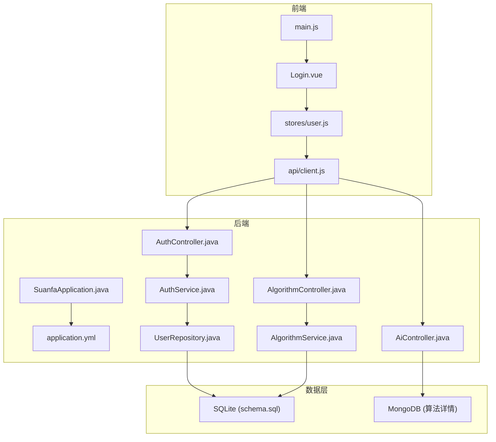
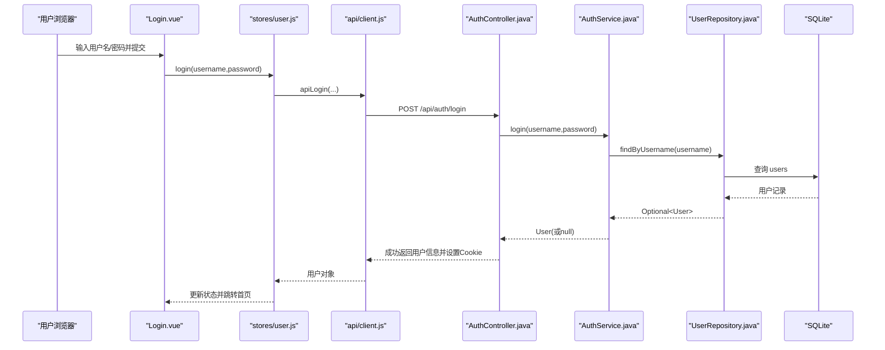
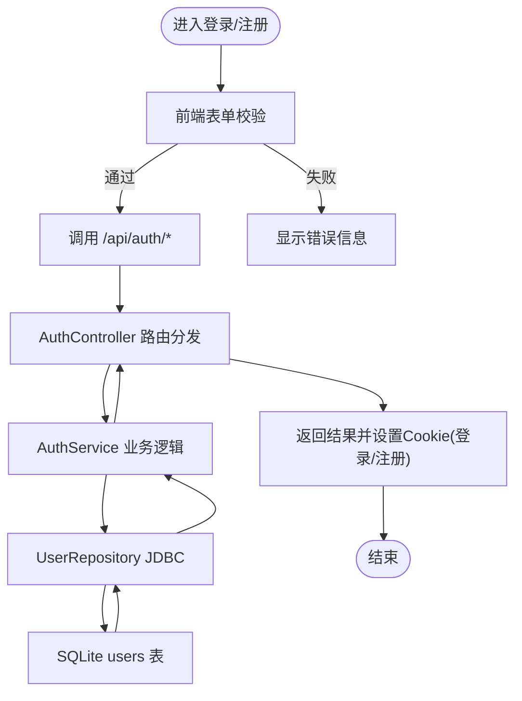
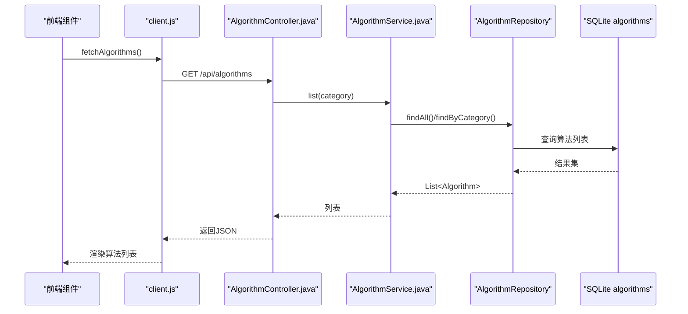
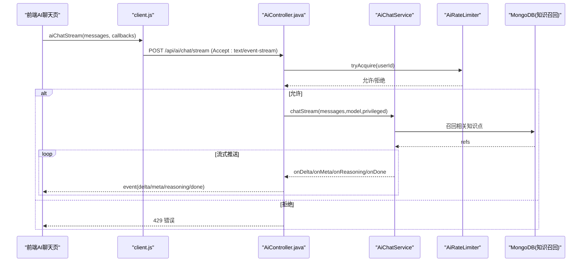
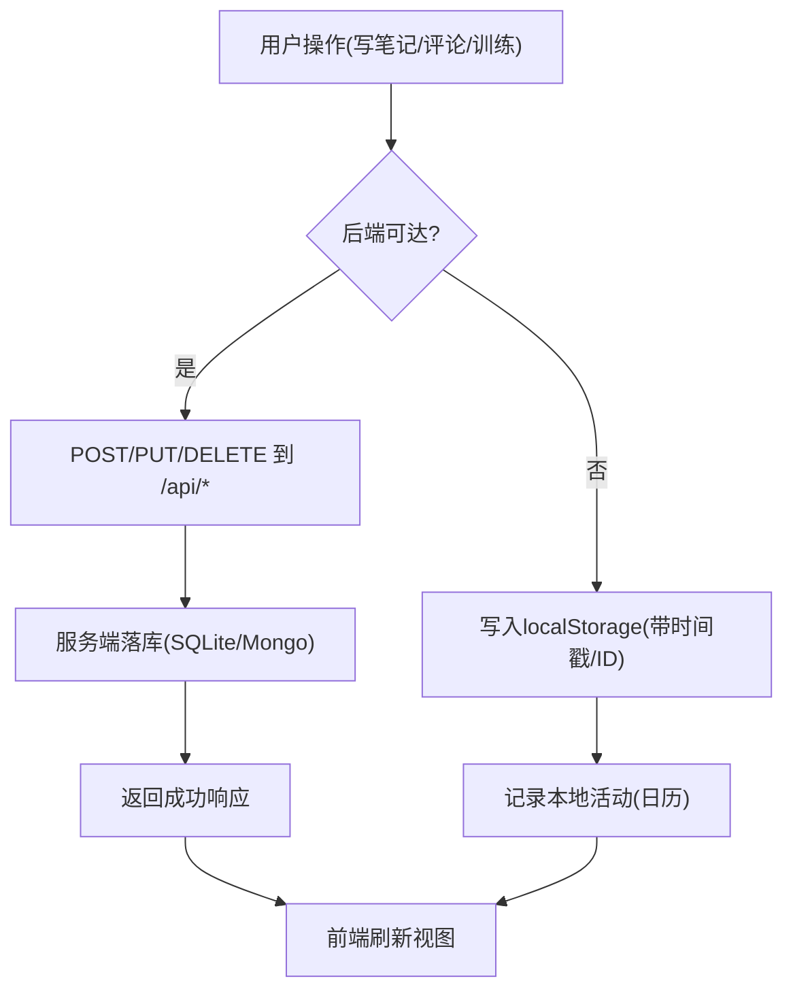
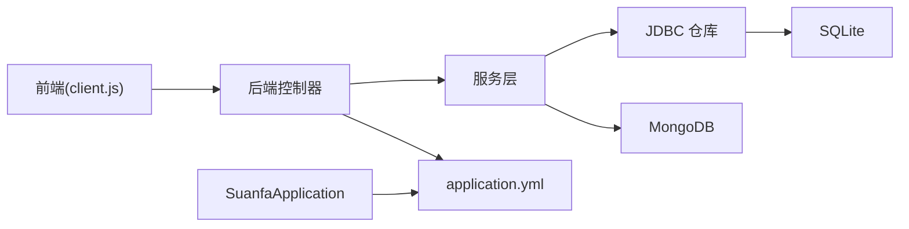

# 数据流设计

<cite>
**本文引用的文件**
- [SuanfaApplication.java](file://backend/src/main/java/com/suanfa/SuanfaApplication.java)
- [application.yml](file://backend/src/main/resources/application.yml)
- [schema.sql](file://backend/src/main/resources/schema.sql)
- [pom.xml](file://backend/pom.xml)
- [client.js](file://suanfa_vue/src/api/client.js)
- [main.js](file://suanfa_vue/src/main.js)
- [Login.vue](file://suanfa_vue/src/components/common/Login.vue)
- [user.js](file://suanfa_vue/src/stores/user.js)
- [AuthController.java](file://backend/src/main/java/com/suanfa/controller/AuthController.java)
- [AlgorithmController.java](file://backend/src/main/java/com/suanfa/controller/AlgorithmController.java)
- [AiController.java](file://backend/src/main/java/com/suanfa/controller/AiController.java)
- [AuthService.java](file://backend/src/main/java/com/suanfa/service/AuthService.java)
- [AlgorithmService.java](file://backend/src/main/java/com/suanfa/service/AlgorithmService.java)
- [UserRepository.java](file://backend/src/main/java/com/suanfa/repository/UserRepository.java)
</cite>

## 目录
1. [简介](#简介)
2. [项目结构](#项目结构)
3. [核心组件](#核心组件)
4. [架构总览](#架构总览)
5. [详细组件分析](#详细组件分析)
6. [依赖关系分析](#依赖关系分析)
7. [性能与一致性考虑](#性能与一致性考虑)
8. [故障排查指南](#故障排查指南)
9. [结论](#结论)

## 简介
本文件面向开发者，系统化梳理从用户请求到数据库的完整数据流转路径，覆盖前端组件、API 客户端、后端控制器、业务服务层、数据访问层及持久化存储。重点说明数据在各环节的校验、转换、错误处理、异步与实时能力（如 SSE 流式）、缓存策略、一致性与并发控制等设计要点，帮助快速定位问题并优化系统。

## 项目结构
- 前端（Vue）：入口 main.js；状态管理 user store；登录页面 Login.vue；统一 API 客户端 client.js（含后端可用性探测、降级本地存储、AI 流式解析）。
- 后端（Spring Boot）：应用启动 SuanfaApplication；配置 application.yml（SQLite、MongoDB、JWT、CORS、AI 中转站等）；多控制器（认证、算法、AI）；服务层（认证、算法、AI 聊天/限流/设置）；JDBC 仓库（SQLite）；MongoDB 用于算法详情内容。
- 数据层：SQLite 定义 schema.sql；MongoDB 文档型存储算法详情内容。

**图表来源**
- [SuanfaApplication.java:10-20](file://backend/src/main/java/com/suanfa/SuanfaApplication.java#L10-L20)
- [application.yml:4-16](file://backend/src/main/resources/application.yml#L4-L16)
- [client.js:10-43](file://suanfa_vue/src/api/client.js#L10-L43)
- [AuthController.java:15-71](file://backend/src/main/java/com/suanfa/controller/AuthController.java#L15-L71)
- [AlgorithmController.java:10-30](file://backend/src/main/java/com/suanfa/controller/AlgorithmController.java#L10-L30)
- [AiController.java:49-106](file://backend/src/main/java/com/suanfa/controller/AiController.java#L49-L106)
- [schema.sql:5-76](file://backend/src/main/resources/schema.sql#L5-L76)

**章节来源**
- [SuanfaApplication.java:10-20](file://backend/src/main/java/com/suanfa/SuanfaApplication.java#L10-L20)
- [application.yml:4-16](file://backend/src/main/resources/application.yml#L4-L16)
- [schema.sql:5-76](file://backend/src/main/resources/schema.sql#L5-L76)

## 核心组件
- 前端 API 客户端：统一封装 fetch，自动携带 Cookie，失败时回退本地存储；提供算法元数据、笔记、评论、训练记录、AI 对话等接口调用。
- 认证控制器与服务：注册/登录/登出/当前用户，JWT 通过 httpOnly Cookie 传递；密码 BCrypt 加密；服务层负责参数校验与用户查找。
- 算法控制器与服务：提供算法列表与详情查询；启动时从种子 JSON 导入缺失数据。
- AI 控制器：一次性与流式（SSE）两种模式；限流、鉴权、模型选择与降级；上游模型发现与管理员配置。
- 数据访问层：JdbcTemplate 直接操作 SQLite；MongoDB 用于算法详情文档。

**章节来源**
- [client.js:10-43](file://suanfa_vue/src/api/client.js#L10-L43)
- [AuthController.java:15-71](file://backend/src/main/java/com/suanfa/controller/AuthController.java#L15-L71)
- [AuthService.java:22-51](file://backend/src/main/java/com/suanfa/service/AuthService.java#L22-L51)
- [AlgorithmController.java:21-30](file://backend/src/main/java/com/suanfa/controller/AlgorithmController.java#L21-L30)
- [AlgorithmService.java:31-62](file://backend/src/main/java/com/suanfa/service/AlgorithmService.java#L31-L62)
- [AiController.java:83-106](file://backend/src/main/java/com/suanfa/controller/AiController.java#L83-L106)
- [UserRepository.java:30-52](file://backend/src/main/java/com/suanfa/repository/UserRepository.java#L30-L52)

## 架构总览
整体采用前后端分离架构：前端通过统一客户端发起 HTTP 请求，后端以 REST 暴露接口；认证使用 JWT + httpOnly Cookie；数据持久化采用 SQLite（结构化数据）+ MongoDB（文档型内容）；AI 能力通过 SSE 流式返回增量文本，支持降级到本地答疑。

**图表来源**
- [Login.vue:16-39](file://suanfa_vue/src/components/common/Login.vue#L16-L39)
- [user.js:24-26](file://suanfa_vue/src/stores/user.js#L24-L26)
- [client.js:118-123](file://suanfa_vue/src/api/client.js#L118-L123)
- [AuthController.java:43-51](file://backend/src/main/java/com/suanfa/controller/AuthController.java#L43-L51)
- [AuthService.java:35-43](file://backend/src/main/java/com/suanfa/service/AuthService.java#L35-L43)
- [UserRepository.java:30-33](file://backend/src/main/java/com/suanfa/repository/UserRepository.java#L30-L33)
- [schema.sql:18-23](file://backend/src/main/resources/schema.sql#L18-L23)

## 详细组件分析

### 认证数据流（注册/登录/登出/当前用户）
- 前端：Login.vue 进行基础校验后调用 user store；store 调用 client.js 的认证方法；成功后由后端设置 httpOnly Cookie。
- 后端：AuthController 接收请求，委托 AuthService 完成校验与用户获取；UserRepository 通过 JdbcTemplate 读写 SQLite。
- 数据转换：前端提交 JSON；后端 DTO 映射为实体；响应中不包含敏感字段（如密码哈希）。
- 错误处理：非法参数返回 400；未找到用户返回 401；重复用户名返回 409。

**图表来源**
- [Login.vue:16-39](file://suanfa_vue/src/components/common/Login.vue#L16-L39)
- [user.js:24-33](file://suanfa_vue/src/stores/user.js#L24-L33)
- [client.js:111-131](file://suanfa_vue/src/api/client.js#L111-L131)
- [AuthController.java:28-71](file://backend/src/main/java/com/suanfa/controller/AuthController.java#L28-L71)
- [AuthService.java:22-51](file://backend/src/main/java/com/suanfa/service/AuthService.java#L22-L51)
- [UserRepository.java:30-52](file://backend/src/main/java/com/suanfa/repository/UserRepository.java#L30-L52)
- [schema.sql:18-23](file://backend/src/main/resources/schema.sql#L18-L23)

**章节来源**
- [Login.vue:16-39](file://suanfa_vue/src/components/common/Login.vue#L16-L39)
- [user.js:14-33](file://suanfa_vue/src/stores/user.js#L14-L33)
- [client.js:111-131](file://suanfa_vue/src/api/client.js#L111-L131)
- [AuthController.java:28-71](file://backend/src/main/java/com/suanfa/controller/AuthController.java#L28-L71)
- [AuthService.java:22-51](file://backend/src/main/java/com/suanfa/service/AuthService.java#L22-L51)
- [UserRepository.java:30-52](file://backend/src/main/java/com/suanfa/repository/UserRepository.java#L30-L52)
- [schema.sql:18-23](file://backend/src/main/resources/schema.sql#L18-L23)

### 算法元数据读取流程（列表/详情）
- 前端：client.js 优先请求后端 /api/algorithms，失败则回退本地 algorithms.js。
- 后端：AlgorithmController 将请求委派给 AlgorithmService；服务层可启动时从 seed JSON 导入缺失数据；Repository 查询 SQLite。
- 数据格式：列表返回算法实体集合；详情按 id 查询。

**图表来源**
- [client.js:49-61](file://suanfa_vue/src/api/client.js#L49-L61)
- [AlgorithmController.java:21-30](file://backend/src/main/java/com/suanfa/controller/AlgorithmController.java#L21-L30)
- [AlgorithmService.java:31-62](file://backend/src/main/java/com/suanfa/service/AlgorithmService.java#L31-L62)
- [schema.sql:5-16](file://backend/src/main/resources/schema.sql#L5-L16)

**章节来源**
- [client.js:49-61](file://suanfa_vue/src/api/client.js#L49-L61)
- [AlgorithmController.java:21-30](file://backend/src/main/java/com/suanfa/controller/AlgorithmController.java#L21-L30)
- [AlgorithmService.java:31-62](file://backend/src/main/java/com/suanfa/service/AlgorithmService.java#L31-L62)
- [schema.sql:5-16](file://backend/src/main/resources/schema.sql#L5-L16)

### AI 助教对话（一次性与流式）
- 前端：client.js 先探测后端可用性；优先走 /api/ai/chat/stream（SSE），解析事件流（meta/delta/reasoning/done/error）；不可用时降级本地答疑。
- 后端：AiController 提供 /chat 与 /chat/stream；鉴权、限流、模型权限校验；流式在独立线程池执行，避免阻塞；上游不可用或无输出时退还额度。
- 数据：消息历史裁剪（最多若干轮）；引用（refs）来自知识库召回；模型选择支持默认与降级链。

**图表来源**
- [client.js:469-552](file://suanfa_vue/src/api/client.js#L469-L552)
- [AiController.java:224-313](file://backend/src/main/java/com/suanfa/controller/AiController.java#L224-L313)
- [application.yml:28-49](file://backend/src/main/resources/application.yml#L28-L49)

**章节来源**
- [client.js:469-552](file://suanfa_vue/src/api/client.js#L469-L552)
- [AiController.java:83-106](file://backend/src/main/java/com/suanfa/controller/AiController.java#L83-L106)
- [AiController.java:224-313](file://backend/src/main/java/com/suanfa/controller/AiController.java#L224-L313)
- [application.yml:28-49](file://backend/src/main/resources/application.yml#L28-L49)

### 笔记/评论/训练记录的读写与离线回退
- 前端：client.js 对笔记、评论、训练记录均实现“后端优先，失败回退 localStorage”的策略；活动记录用于学习日历。
- 后端：对应控制器与仓库（未在已读文件中展开），但前端已预留标准 REST 路径。
- 数据一致性：离线写入仅存本地；恢复网络后可同步至后端（由上层组件决定合并策略）。

**图表来源**
- [client.js:154-186](file://suanfa_vue/src/api/client.js#L154-L186)
- [client.js:223-266](file://suanfa_vue/src/api/client.js#L223-L266)
- [client.js:274-324](file://suanfa_vue/src/api/client.js#L274-L324)
- [schema.sql:36-76](file://backend/src/main/resources/schema.sql#L36-L76)

**章节来源**
- [client.js:154-186](file://suanfa_vue/src/api/client.js#L154-L186)
- [client.js:223-266](file://suanfa_vue/src/api/client.js#L223-L266)
- [client.js:274-324](file://suanfa_vue/src/api/client.js#L274-L324)
- [schema.sql:36-76](file://backend/src/main/resources/schema.sql#L36-L76)

## 依赖关系分析
- 前端依赖：Pinia（状态）、Vue Router（路由）、统一 API 客户端。
- 后端依赖：Spring Web、JDBC（SQLite）、MongoDB、Spring Security Crypto（BCrypt）、JWT。
- 运行时配置：application.yml 指定端口、数据源、MongoDB URI、Jackson 序列化、JWT/CORS/AI 等开关。
- 启动行为：SuanfaApplication 确保 data 目录存在；AlgorithmService 启动时幂等导入种子数据。

**图表来源**
- [pom.xml:24-77](file://backend/pom.xml#L24-L77)
- [application.yml:4-16](file://backend/src/main/resources/application.yml#L4-L16)
- [SuanfaApplication.java:13-19](file://backend/src/main/java/com/suanfa/SuanfaApplication.java#L13-L19)
- [AlgorithmService.java:31-52](file://backend/src/main/java/com/suanfa/service/AlgorithmService.java#L31-L52)

**章节来源**
- [pom.xml:24-77](file://backend/pom.xml#L24-L77)
- [application.yml:4-16](file://backend/src/main/resources/application.yml#L4-L16)
- [SuanfaApplication.java:13-19](file://backend/src/main/java/com/suanfa/SuanfaApplication.java#L13-L19)
- [AlgorithmService.java:31-52](file://backend/src/main/java/com/suanfa/service/AlgorithmService.java#L31-L52)

## 性能与一致性考虑
- 异步与实时
  - AI 流式：SSE 分片推送 delta/meta/reasoning/done，减少首屏等待；独立线程池承载长连接，满负载直接 503 而非排队。
  - 前端 SSE 解析：按空行分隔事件块，跨 chunk 安全拼接。
- 缓存策略
  - 后端可用性探测：HEAD 探测结果缓存，负向缓存 TTL 30s，避免后端重启窗口期频繁失败。
  - 离线回退：笔记、评论、训练记录在不可达时写入 localStorage，保障功能可用。
- 限流与熔断
  - AI 每分钟次数限制；上游不可用或无输出时退还额度，防止误扣。
  - 模型降级链：主模型不可用时自动切换到备用模型。
- 一致性
  - SQLite 单文件事务性保证；唯一约束（users.username、progress/training 联合唯一）避免重复。
  - 种子导入幂等：只插入缺失项，无需清库。
- 并发控制
  - AI 流式线程池小且队列直连，过载即拒绝，保护上游与自身资源。
  - 会话与会话恢复：应用启动初始化用户状态（/auth/me），避免无效请求。

[本节为通用指导，不直接分析具体文件]

## 故障排查指南
- 认证失败
  - 现象：401/409；检查用户名/密码、Cookie 是否设置、/auth/me 是否可获取用户。
  - 定位：AuthController、AuthService、UserRepository。
- AI 不可用
  - 现象：403/404/503；检查环境变量 AI_API_KEY、base-url、模型可见性；前端会降级本地答疑。
  - 定位：AiController 的 guard 与 stream 处理、application.yml 的 AI 配置。
- 数据不一致
  - 现象：离线写入与后端不同步；确认网络恢复后是否触发同步逻辑（由上层组件决定）。
  - 定位：client.js 的离线回退分支与后端对应接口。
- 性能问题
  - 现象：AI 流卡顿或 503；检查线程池是否满载、上游是否超时；必要时调整 timeout/max-tokens。
  - 定位：AiController 线程池与 AiProperties。

**章节来源**
- [AuthController.java:28-71](file://backend/src/main/java/com/suanfa/controller/AuthController.java#L28-L71)
- [AiController.java:323-348](file://backend/src/main/java/com/suanfa/controller/AiController.java#L323-L348)
- [application.yml:28-49](file://backend/src/main/resources/application.yml#L28-L49)
- [client.js:12-28](file://suanfa_vue/src/api/client.js#L12-L28)
- [client.js:469-552](file://suanfa_vue/src/api/client.js#L469-L552)

## 结论
本系统通过清晰的分层与职责划分，实现了从前端到数据库的端到端数据流。关键特性包括：
- 前端“后端优先、离线回退”的健壮策略，保障无后端场景可用。
- 后端以 REST 暴露能力，结合 JWT 与 httpOnly Cookie 的安全会话机制。
- AI 能力采用 SSE 流式与多级降级，配合限流与熔断，提升用户体验与稳定性。
- 数据层采用 SQLite 与 MongoDB 混合存储，满足结构化与文档型数据的差异化需求。
- 通过幂等种子导入、唯一约束与事务性，保障数据一致性与可维护性。

以上设计为开发者提供了明确的数据流向视图，便于理解、调试与进一步优化。