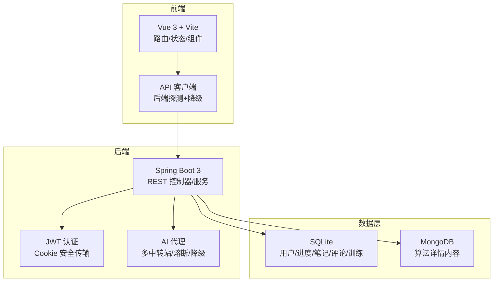
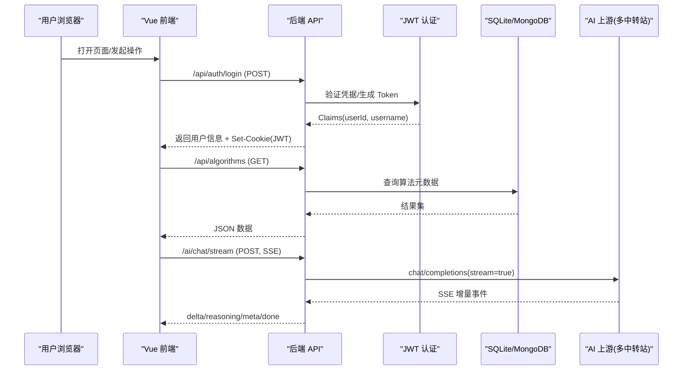
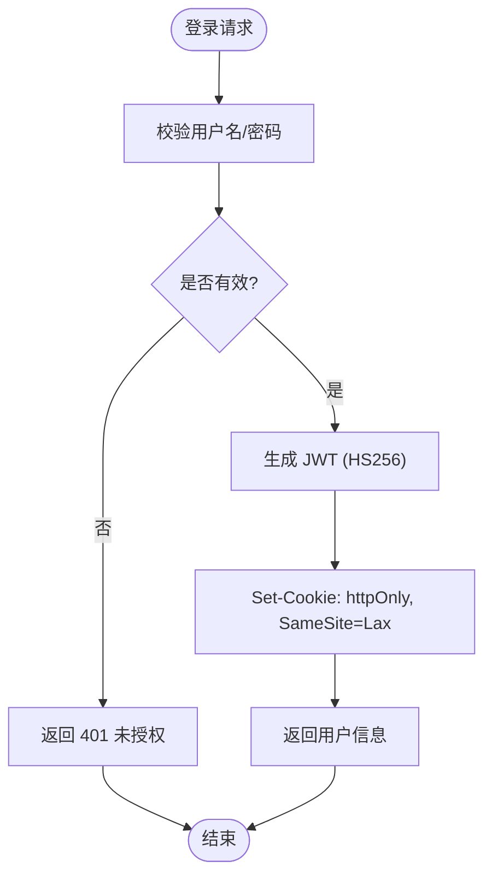
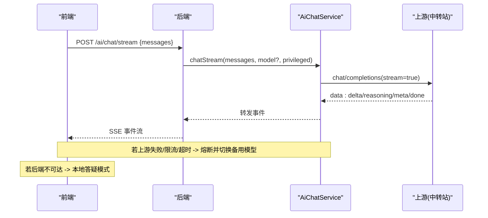
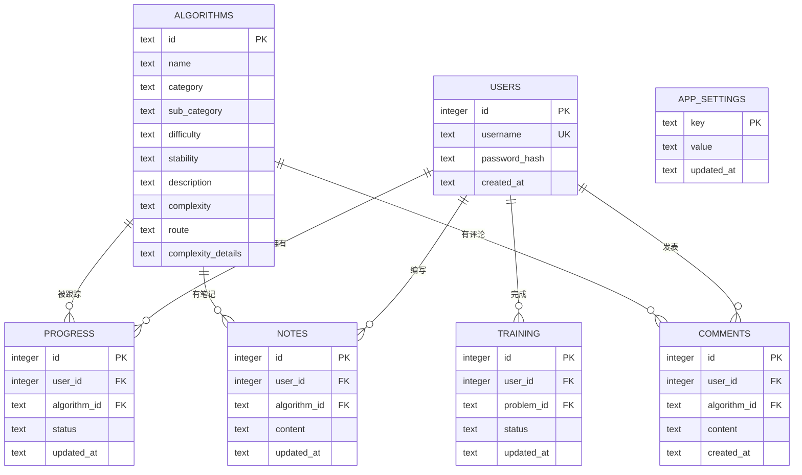
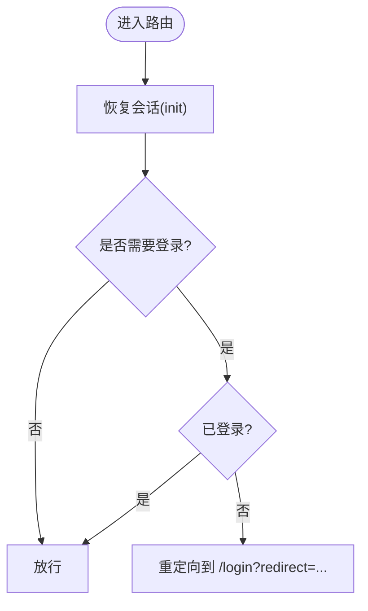
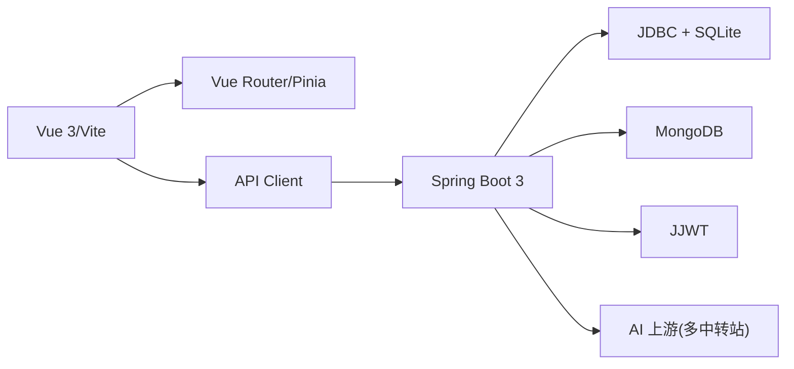

# 架构概览

<cite>
**本文引用的文件**
- [backend/pom.xml](file://backend/pom.xml)
- [backend/src/main/resources/application.yml](file://backend/src/main/resources/application.yml)
- [backend/src/main/java/com/suanfa/SuanfaApplication.java](file://backend/src/main/java/com/suanfa/SuanfaApplication.java)
- [backend/src/main/java/com/suanfa/config/WebConfig.java](file://backend/src/main/java/com/suanfa/config/WebConfig.java)
- [backend/src/main/java/com/suanfa/security/JwtService.java](file://backend/src/main/java/com/suanfa/security/JwtService.java)
- [backend/src/main/java/com/suanfa/controller/AuthController.java](file://backend/src/main/java/com/suanfa/controller/AuthController.java)
- [backend/src/main/java/com/suanfa/service/AiChatService.java](file://backend/src/main/java/com/suanfa/service/AiChatService.java)
- [backend/src/main/resources/schema.sql](file://backend/src/main/resources/schema.sql)
- [suanfa_vue/package.json](file://suanfa_vue/package.json)
- [suanfa_vue/src/main.js](file://suanfa_vue/src/main.js)
- [suanfa_vue/src/router/index.js](file://suanfa_vue/src/router/index.js)
- [suanfa_vue/src/api/client.js](file://suanfa_vue/src/api/client.js)
- [suanfa_vue/src/components/common/Home.vue](file://suanfa_vue/src/components/common/Home.vue)
</cite>

## 目录
1. [简介](#简介)
2. [项目结构](#项目结构)
3. [核心组件](#核心组件)
4. [架构总览](#架构总览)
5. [详细组件分析](#详细组件分析)
6. [依赖分析](#依赖分析)
7. [性能考虑](#性能考虑)
8. [故障排查指南](#故障排查指南)
9. [结论](#结论)
10. [附录](#附录)

## 简介
本系统是一个面向初学者的算法学习平台，采用前后端分离架构：前端基于 Vue 3 + Vite，提供交互式可视化、笔记、评论、训练与 AI 助教；后端基于 Spring Boot 3（Java 17），提供 REST API、JWT 认证、SQLite 持久化与 MongoDB 文档存储，并集成多中转站 AI 能力。系统强调“后端优先、离线降级”的鲁棒性设计，确保在无后端或网络异常时仍可基本可用。

## 项目结构
- 后端 backend
  - 启动入口与配置：SuanfaApplication、application.yml、schema.sql
  - Web 与安全：WebConfig（CORS/参数解析）、JwtService（JWT 签发与解析）、AuthController（登录注册）
  - 业务服务：AiChatService（AI 流式对话、模型熔断与降级）、其他领域 Service/Controller/Repository/Entity/DTO
  - 数据层：JDBC + SQLite（关系型数据）、MongoDB（算法详情内容）
- 前端 suanfa_vue
  - 应用初始化：main.js、router/index.js（路由与鉴权守卫）
  - API 客户端：api/client.js（统一请求封装、后端探测与本地降级）
  - 页面与组件：Home.vue 等页面组件、算法分类与可视化组件
  - 构建与依赖：package.json（Vue 3、Pinia、Router、Vite）

**图表来源**
- [backend/src/main/java/com/suanfa/SuanfaApplication.java:10-20](file://backend/src/main/java/com/suanfa/SuanfaApplication.java#L10-L20)
- [backend/src/main/java/com/suanfa/config/WebConfig.java:33-44](file://backend/src/main/java/com/suanfa/config/WebConfig.java#L33-L44)
- [backend/src/main/java/com/suanfa/security/JwtService.java:28-54](file://backend/src/main/java/com/suanfa/security/JwtService.java#L28-L54)
- [backend/src/main/resources/application.yml:4-16](file://backend/src/main/resources/application.yml#L4-L16)
- [suanfa_vue/src/api/client.js:10-28](file://suanfa_vue/src/api/client.js#L10-L28)

**章节来源**
- [backend/pom.xml:24-78](file://backend/pom.xml#L24-L78)
- [suanfa_vue/package.json:11-21](file://suanfa_vue/package.json#L11-L21)
- [backend/src/main/resources/application.yml:1-16](file://backend/src/main/resources/application.yml#L1-L16)

## 核心组件
- 认证与会话
  - JWTService：HS256 签名，subject=userId，携带 username，支持过期时间控制
  - AuthController：注册/登录/登出/当前用户，Token 通过 httpOnly Cookie 下发
  - WebConfig：CORS 白名单与跨域凭据允许，自定义参数解析器注入当前用户 ID
- 数据访问
  - SQLite：用户、进度、笔记、评论、训练与应用设置等关系型数据
  - MongoDB：算法详情内容（sections/tabs/videos）
- AI 助教
  - AiChatService：OpenAI 兼容 SSE 流式对话，多中转站、模型熔断与自动降级、知识增强（站内资料召回）
- 前端
  - API 客户端：后端可用性探测、失败回退到本地数据（localStorage/静态资源）
  - 路由与守卫：按 meta.requiresAuth 进行登录态校验与跳转

**章节来源**
- [backend/src/main/java/com/suanfa/security/JwtService.java:14-54](file://backend/src/main/java/com/suanfa/security/JwtService.java#L14-L54)
- [backend/src/main/java/com/suanfa/controller/AuthController.java:15-93](file://backend/src/main/java/com/suanfa/controller/AuthController.java#L15-L93)
- [backend/src/main/java/com/suanfa/config/WebConfig.java:13-44](file://backend/src/main/java/com/suanfa/config/WebConfig.java#L13-L44)
- [backend/src/main/resources/schema.sql:5-76](file://backend/src/main/resources/schema.sql#L5-L76)
- [backend/src/main/java/com/suanfa/service/AiChatService.java:30-47](file://backend/src/main/java/com/suanfa/service/AiChatService.java#L30-L47)
- [suanfa_vue/src/api/client.js:10-28](file://suanfa_vue/src/api/client.js#L10-L28)

## 架构总览
系统遵循清晰的分层与职责划分：
- 表现层（前端）：Vue 3 + Router + Pinia，负责交互、可视化与状态管理
- 接口层（后端 Controller）：RESTful API，处理认证、算法内容、学习进度、评论、训练、AI 聊天等
- 服务层（Service）：业务编排，如 AI 流式对话、限流、熔断、知识增强
- 数据层（Repository/DAO）：JdbcTemplate + JDBC 直连 SQLite，MongoDB 文档存取
- 外部依赖：OpenAI 兼容上游（可多中转站）、可选本地推理服务

**图表来源**
- [backend/src/main/java/com/suanfa/controller/AuthController.java:28-71](file://backend/src/main/java/com/suanfa/controller/AuthController.java#L28-L71)
- [backend/src/main/java/com/suanfa/security/JwtService.java:28-54](file://backend/src/main/java/com/suanfa/security/JwtService.java#L28-L54)
- [backend/src/main/java/com/suanfa/service/AiChatService.java:574-636](file://backend/src/main/java/com/suanfa/service/AiChatService.java#L574-L636)
- [suanfa_vue/src/api/client.js:469-552](file://suanfa_vue/src/api/client.js#L469-L552)

## 详细组件分析

### 认证与安全流程
- 登录注册：AuthController 调用 AuthService（由依赖注入），成功则通过 JwtService 生成 JWT，并以 httpOnly Cookie 下发
- 会话校验：WebConfig 注册参数解析器，将 userId 注入到请求上下文；后续受保护接口通过过滤器/注解校验
- CORS：开发环境默认宽松，生产可通过环境变量收紧为显式域名

**图表来源**
- [backend/src/main/java/com/suanfa/controller/AuthController.java:28-80](file://backend/src/main/java/com/suanfa/controller/AuthController.java#L28-L80)
- [backend/src/main/java/com/suanfa/security/JwtService.java:28-54](file://backend/src/main/java/com/suanfa/security/JwtService.java#L28-L54)
- [backend/src/main/java/com/suanfa/config/WebConfig.java:33-44](file://backend/src/main/java/com/suanfa/config/WebConfig.java#L33-L44)

**章节来源**
- [backend/src/main/java/com/suanfa/controller/AuthController.java:15-93](file://backend/src/main/java/com/suanfa/controller/AuthController.java#L15-L93)
- [backend/src/main/java/com/suanfa/security/JwtService.java:14-54](file://backend/src/main/java/com/suanfa/security/JwtService.java#L14-L54)
- [backend/src/main/java/com/suanfa/config/WebConfig.java:13-44](file://backend/src/main/java/com/suanfa/config/WebConfig.java#L13-L44)

### AI 助教（流式对话与降级）
- 能力探测：前端先探测后端可用性，不可用直接走本地答疑
- 流式对话：后端以 SSE 推送增量文本、思考过程、引用与完成事件；支持多中转站与模型熔断/降级
- 本地降级：当后端不可达/未配置 AI_KEY/上游不可用时，使用站内资料检索与模板生成答案

**图表来源**
- [backend/src/main/java/com/suanfa/service/AiChatService.java:574-636](file://backend/src/main/java/com/suanfa/service/AiChatService.java#L574-L636)
- [backend/src/main/java/com/suanfa/service/AiChatService.java:672-730](file://backend/src/main/java/com/suanfa/service/AiChatService.java#L672-L730)
- [suanfa_vue/src/api/client.js:469-552](file://suanfa_vue/src/api/client.js#L469-L552)

**章节来源**
- [backend/src/main/java/com/suanfa/service/AiChatService.java:30-47](file://backend/src/main/java/com/suanfa/service/AiChatService.java#L30-L47)
- [backend/src/main/java/com/suanfa/service/AiChatService.java:574-636](file://backend/src/main/java/com/suanfa/service/AiChatService.java#L574-L636)
- [suanfa_vue/src/api/client.js:360-570](file://suanfa_vue/src/api/client.js#L360-L570)

### 数据模型与持久化
- SQLite 表：algorithms、users、progress、notes、comments、app_settings、training
- MongoDB：算法详情内容（sections/tabs/videos）
- 初始化：应用启动时根据 schema.sql 建表，确保数据目录存在

**图表来源**
- [backend/src/main/resources/schema.sql:5-76](file://backend/src/main/resources/schema.sql#L5-L76)

**章节来源**
- [backend/src/main/resources/schema.sql:1-77](file://backend/src/main/resources/schema.sql#L1-L77)
- [backend/src/main/java/com/suanfa/SuanfaApplication.java:13-20](file://backend/src/main/java/com/suanfa/SuanfaApplication.java#L13-L20)

### 前端路由与鉴权
- 路由定义：首页、关于、登录、进度、日历、训练、AI、算法分类与详情页
- 路由守卫：进入需要认证的页面时检查登录态，未登录重定向至登录页并保留目标路径

**图表来源**
- [suanfa_vue/src/router/index.js:109-120](file://suanfa_vue/src/router/index.js#L109-L120)

**章节来源**
- [suanfa_vue/src/router/index.js:21-100](file://suanfa_vue/src/router/index.js#L21-L100)
- [suanfa_vue/src/router/index.js:109-120](file://suanfa_vue/src/router/index.js#L109-L120)

## 依赖分析
- 后端技术栈
  - Spring Boot 3 + Web Starter：提供 REST、容器、自动装配
  - JDBC + SQLite：轻量级关系数据库，避免 ORM 方言问题
  - MongoDB：存储算法详情文档
  - Spring Security Crypto：BCrypt 密码哈希
  - JJWT：JWT 签发与解析
- 前端技术栈
  - Vue 3 + Vite：现代前端框架与构建工具
  - Vue Router：SPA 路由
  - Pinia：状态管理
  - marked + dompurify：Markdown 渲染与 XSS 防护
- 外部依赖
  - OpenAI 兼容上游（可多中转站），支持本地 Ollama/llama.cpp 兜底
  - 代码执行沙箱（可选，用于在线编译运行）

**图表来源**
- [backend/pom.xml:24-78](file://backend/pom.xml#L24-L78)
- [suanfa_vue/package.json:11-21](file://suanfa_vue/package.json#L11-L21)
- [backend/src/main/resources/application.yml:4-16](file://backend/src/main/resources/application.yml#L4-L16)

**章节来源**
- [backend/pom.xml:24-78](file://backend/pom.xml#L24-L78)
- [suanfa_vue/package.json:11-21](file://suanfa_vue/package.json#L11-L21)
- [backend/src/main/resources/application.yml:18-97](file://backend/src/main/resources/application.yml#L18-L97)

## 性能考虑
- 前端
  - 懒加载路由与组件，减少首屏体积
  - 后端不可用时的本地缓存（localStorage）与静态数据降级，提升可用性
- 后端
  - SQLite 适合中小规模数据，读写简单高效
  - AI 上游调用采用 SSE 流式传输，降低首包延迟；具备熔断与降级机制，避免雪崩
  - 连接超时与请求超时可控，防止长尾阻塞
- 网络
  - CORS 在生产环境应严格限制来源，减少不必要预检
  - Cookie 使用 httpOnly + SameSite，兼顾安全与跨域

[本节为通用指导，不直接分析具体文件]

## 故障排查指南
- 登录失败
  - 检查用户名/密码是否正确；确认后端是否返回 401；查看 Cookie 是否设置成功
  - 参考：[AuthController 登录逻辑:43-52](file://backend/src/main/java/com/suanfa/controller/AuthController.java#L43-L52)、[JwtService 解析:40-54](file://backend/src/main/java/com/suanfa/security/JwtService.java#L40-L54)
- 跨域错误
  - 检查 allowed-origins 配置；开发环境默认全开，生产需显式域名
  - 参考：[WebConfig CORS:33-44](file://backend/src/main/java/com/suanfa/config/WebConfig.java#L33-L44)
- AI 不可用
  - 检查 AI_BASE_URL/AI_API_KEY 是否配置；查看上游 /models 是否可达；关注熔断与降级日志
  - 参考：[AiChatService 配置与熔断:574-636](file://backend/src/main/java/com/suanfa/service/AiChatService.java#L574-L636)、[前端降级逻辑:360-570](file://suanfa_vue/src/api/client.js#L360-L570)
- 数据未持久化
  - 确认 SQLite 数据目录是否存在；检查 schema.sql 是否执行；核对外键约束
  - 参考：[SuanfaApplication 数据目录创建:13-20](file://backend/src/main/java/com/suanfa/SuanfaApplication.java#L13-L20)、[schema.sql 建表:5-76](file://backend/src/main/resources/schema.sql#L5-L76)

**章节来源**
- [backend/src/main/java/com/suanfa/controller/AuthController.java:43-80](file://backend/src/main/java/com/suanfa/controller/AuthController.java#L43-L80)
- [backend/src/main/java/com/suanfa/security/JwtService.java:40-54](file://backend/src/main/java/com/suanfa/security/JwtService.java#L40-L54)
- [backend/src/main/java/com/suanfa/config/WebConfig.java:33-44](file://backend/src/main/java/com/suanfa/config/WebConfig.java#L33-L44)
- [backend/src/main/java/com/suanfa/service/AiChatService.java:574-636](file://backend/src/main/java/com/suanfa/service/AiChatService.java#L574-L636)
- [suanfa_vue/src/api/client.js:360-570](file://suanfa_vue/src/api/client.js#L360-L570)
- [backend/src/main/java/com/suanfa/SuanfaApplication.java:13-20](file://backend/src/main/java/com/suanfa/SuanfaApplication.java#L13-L20)
- [backend/src/main/resources/schema.sql:5-76](file://backend/src/main/resources/schema.sql#L5-L76)

## 结论
本项目采用成熟稳定的技术栈与清晰的层次化架构：前端 Vue 3 提供流畅交互与可视化，后端 Spring Boot 提供稳健的 REST API、安全认证与可扩展的 AI 能力。通过“后端优先、离线降级”的策略，系统在弱网或无后端环境下仍能提供基础功能。SQLite 与 MongoDB 的组合满足结构化与非结构化数据的存储需求。AI 助教的流式响应、多中转站与熔断降级机制，显著提升了用户体验与系统韧性。整体设计便于扩展与维护，适合持续迭代与规模化部署。

[本节为总结性内容，不直接分析具体文件]

## 附录
- 关键入口与配置
  - 后端启动：[SuanfaApplication:10-20](file://backend/src/main/java/com/suanfa/SuanfaApplication.java#L10-L20)
  - 应用配置：[application.yml:1-102](file://backend/src/main/resources/application.yml#L1-L102)
  - 数据库初始化：[schema.sql:1-77](file://backend/src/main/resources/schema.sql#L1-L77)
- 前端入口与路由
  - 应用初始化：[main.js:1-12](file://suanfa_vue/src/main.js#L1-L12)
  - 路由与守卫：[router/index.js:21-124](file://suanfa_vue/src/router/index.js#L21-L124)
  - API 客户端：[client.js:1-725](file://suanfa_vue/src/api/client.js#L1-L725)
- 首页示例
  - 首页组件：[Home.vue:1-200](file://suanfa_vue/src/components/common/Home.vue#L1-L200)

[本节为索引与导航，不直接分析具体文件]