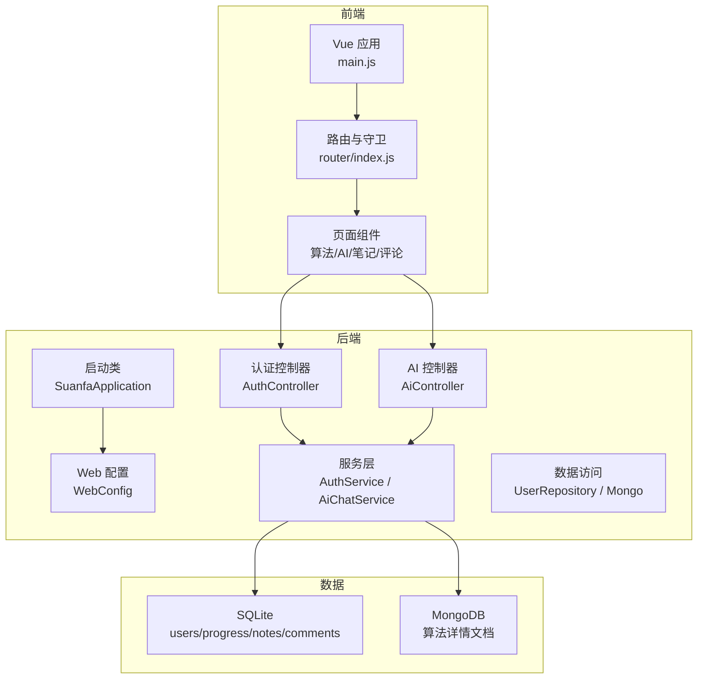
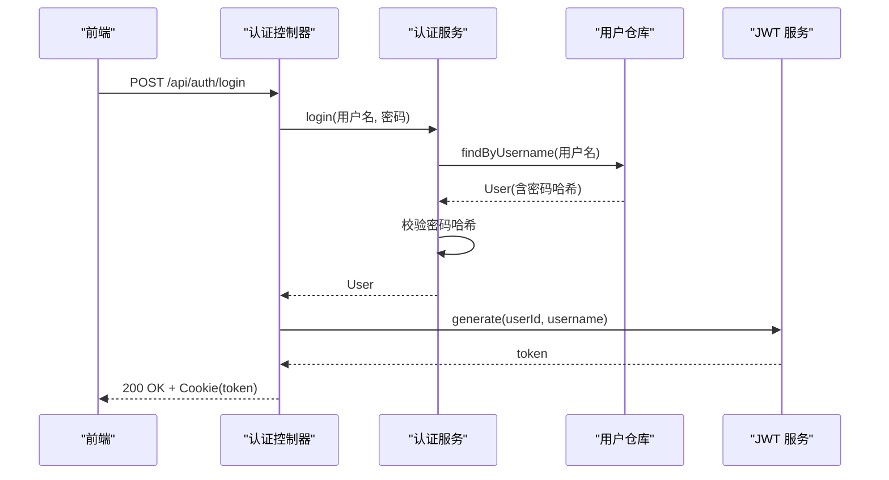
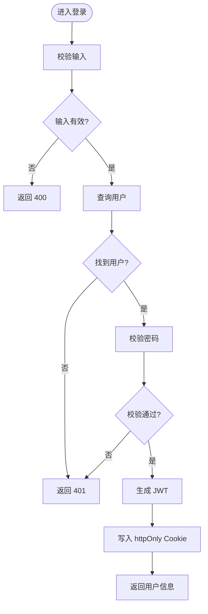
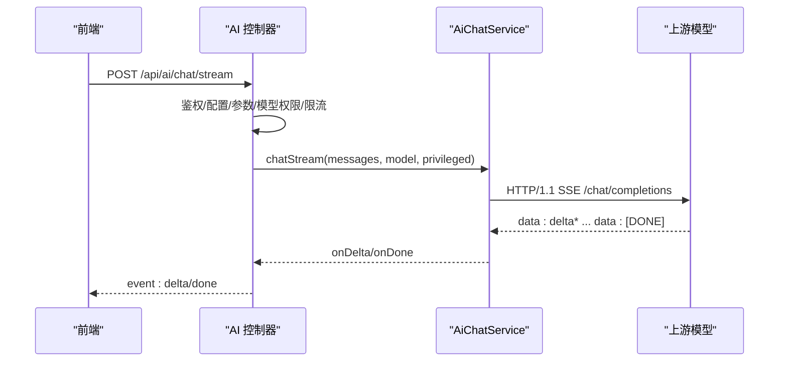
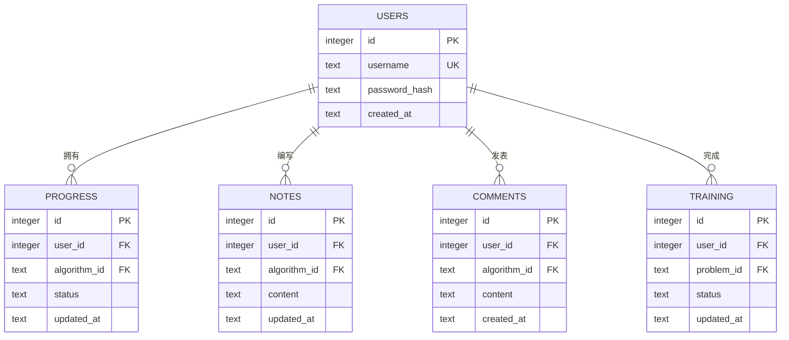
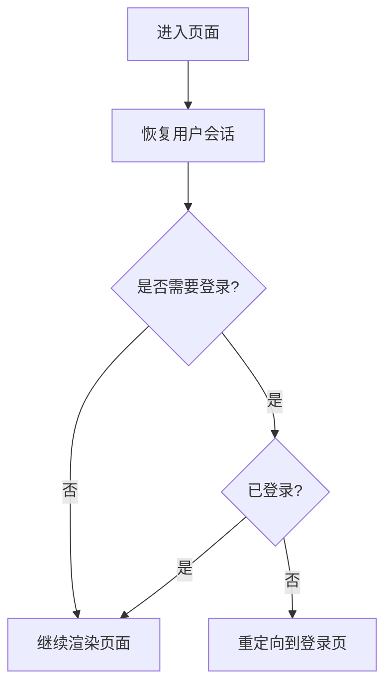
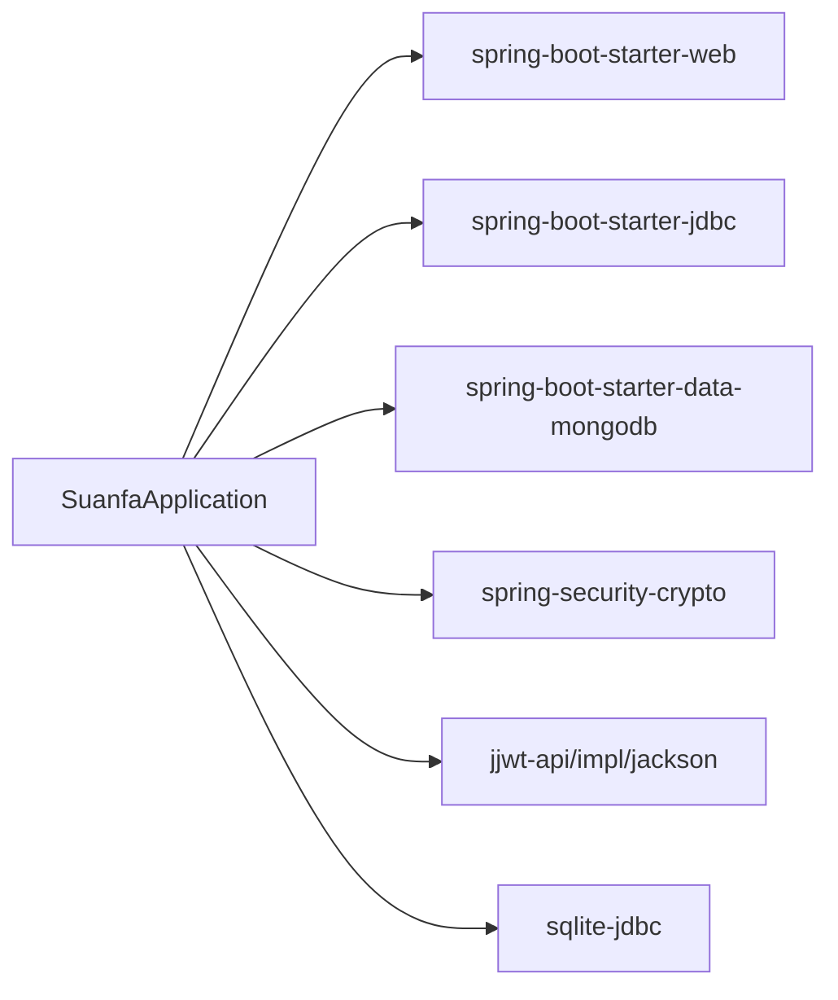
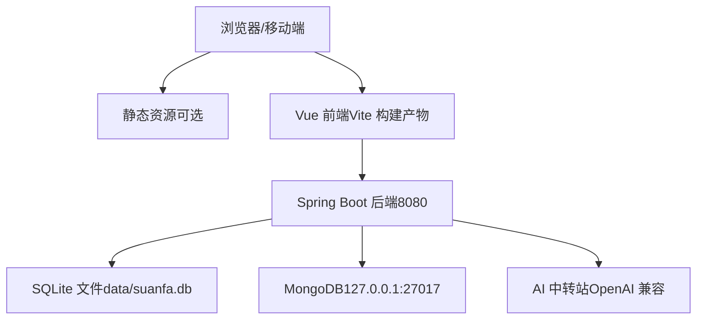

# 系统架构

<cite>
**本文引用的文件**
- [SuanfaApplication.java](file://backend/src/main/java/com/suanfa/SuanfaApplication.java)
- [pom.xml](file://backend/pom.xml)
- [application.yml](file://backend/src/main/resources/application.yml)
- [WebConfig.java](file://backend/src/main/java/com/suanfa/config/WebConfig.java)
- [AuthController.java](file://backend/src/main/java/com/suanfa/controller/AuthController.java)
- [AiController.java](file://backend/src/main/java/com/suanfa/controller/AiController.java)
- [JwtService.java](file://backend/src/main/java/com/suanfa/security/JwtService.java)
- [AuthService.java](file://backend/src/main/java/com/suanfa/service/AuthService.java)
- [UserRepository.java](file://backend/src/main/java/com/suanfa/repository/UserRepository.java)
- [User.java](file://backend/src/main/java/com/suanfa/entity/User.java)
- [schema.sql](file://backend/src/main/resources/schema.sql)
- [AiChatService.java](file://backend/src/main/java/com/suanfa/service/AiChatService.java)
- [main.js](file://suanfa_vue/src/main.js)
- [package.json](file://suanfa_vue/package.json)
- [router/index.js](file://suanfa_vue/src/router/index.js)
</cite>

## 目录
1. [简介](#简介)
2. [项目结构](#项目结构)
3. [核心组件](#核心组件)
4. [架构总览](#架构总览)
5. [详细组件分析](#详细组件分析)
6. [依赖关系分析](#依赖关系分析)
7. [性能考量](#性能考量)
8. [故障排查指南](#故障排查指南)
9. [结论](#结论)
10. [附录](#附录)

## 简介
本系统为“算法学习平台”，采用前后端分离架构：前端基于 Vue 3 + Vite，后端基于 Spring Boot（Java 17），数据层使用 SQLite（关系型）与 MongoDB（文档型）。系统提供用户认证、算法内容浏览与可视化、学习笔记/评论/进度管理、代码执行沙箱以及 AI 助教对话（多模型、流式响应、限流与熔断降级）。AI 服务通过统一代理适配 OpenAI 兼容的 chat/completions 接口，支持多中转站与多模型配置，具备自动降级与熔断能力。

## 项目结构
- 后端（Spring Boot）
  - 启动入口：应用初始化并保证 SQLite 数据目录存在
  - Web 配置：CORS、自定义参数解析器（当前用户 ID）
  - 控制器：认证、AI 聊天、算法内容、笔记、评论、进度、训练等
  - 服务：业务编排（认证、AI 聊天、知识召回、限流、设置）
  - 安全：JWT 签发/解析、过滤器（在后续扩展中可接入）
  - 数据：JDBC 访问 SQLite；MongoDB 用于算法详情文档
  - 配置：application.yml 集中管理端口、数据库、AI、跨域、日志等
- 前端（Vue 3）
  - 入口：创建应用、挂载 Pinia 与路由
  - 路由：页面级路由与守卫（登录态恢复与鉴权）
  - 组件：算法分类页、详情页、AI 聊天、笔记、评论、进度等
  - 构建：Vite 开发/构建/预览脚本

**图表来源**
- [SuanfaApplication.java:10-20](file://backend/src/main/java/com/suanfa/SuanfaApplication.java#L10-L20)
- [WebConfig.java:13-44](file://backend/src/main/java/com/suanfa/config/WebConfig.java#L13-L44)
- [AuthController.java:15-71](file://backend/src/main/java/com/suanfa/controller/AuthController.java#L15-L71)
- [AiController.java:49-118](file://backend/src/main/java/com/suanfa/controller/AiController.java#L49-L118)
- [AiChatService.java:48-105](file://backend/src/main/java/com/suanfa/service/AiChatService.java#L48-L105)
- [UserRepository.java:15-52](file://backend/src/main/java/com/suanfa/repository/UserRepository.java#L15-L52)
- [application.yml:4-16](file://backend/src/main/resources/application.yml#L4-L16)

**章节来源**
- [SuanfaApplication.java:10-20](file://backend/src/main/java/com/suanfa/SuanfaApplication.java#L10-L20)
- [application.yml:1-16](file://backend/src/main/resources/application.yml#L1-L16)
- [main.js:1-12](file://suanfa_vue/src/main.js#L1-L12)
- [package.json:1-23](file://suanfa_vue/package.json#L1-L23)

## 核心组件
- 认证与安全
  - AuthController：注册/登录/登出/当前用户，JWT 以 httpOnly Cookie 下发
  - JwtService：HS256 签名，subject=userId，claim=username，过期时间可配
  - WebConfig：CORS 白名单与凭据允许，注入当前用户 ID 解析器
- AI 助教
  - AiController：状态查询、模型清单、一次性/流式对话、上游模型发现（管理员）
  - AiChatService：多中转站/多模型合并、SSE 流式调用上游、错误诊断、熔断与降级、知识增强（RAG）
  - 限流：按用户每分钟请求次数限制，异常时退款额度
- 数据层
  - UserRepository：SQLite users 表增删查
  - schema.sql：algorithms/users/progress/notes/comments/app_settings/training 等表定义
  - MongoDB：算法详情文档存储（由配置启用）

**章节来源**
- [AuthController.java:15-94](file://backend/src/main/java/com/suanfa/controller/AuthController.java#L15-L94)
- [JwtService.java:14-56](file://backend/src/main/java/com/suanfa/security/JwtService.java#L14-L56)
- [WebConfig.java:13-44](file://backend/src/main/java/com/suanfa/config/WebConfig.java#L13-L44)
- [AiController.java:49-118](file://backend/src/main/java/com/suanfa/controller/AiController.java#L49-L118)
- [AiChatService.java:48-105](file://backend/src/main/java/com/suanfa/service/AiChatService.java#L48-L105)
- [UserRepository.java:15-52](file://backend/src/main/java/com/suanfa/repository/UserRepository.java#L15-L52)
- [schema.sql:5-77](file://backend/src/main/resources/schema.sql#L5-L77)

## 架构总览
系统采用分层与职责清晰的前后端分离架构：
- 前端：Vue Router 管理页面与路由守卫，Pinia 管理用户会话，组件负责交互与展示
- 后端：RESTful API 暴露认证、AI、内容、笔记、评论、进度、训练等能力；服务层编排业务逻辑；数据层通过 JDBC/MongoDB 持久化
- 安全：JWT 无状态认证，Cookie 传输 Token；CORS 策略控制跨域；管理员白名单控制 AI 配置可见性
- AI 集成：统一代理 OpenAI 兼容接口，支持多中转站、多模型、SSE 流式、熔断与降级、知识增强

**图表来源**
- [AuthController.java:43-52](file://backend/src/main/java/com/suanfa/controller/AuthController.java#L43-L52)
- [AuthService.java:35-43](file://backend/src/main/java/com/suanfa/service/AuthService.java#L35-L43)
- [UserRepository.java:30-33](file://backend/src/main/java/com/suanfa/repository/UserRepository.java#L30-L33)
- [JwtService.java:28-37](file://backend/src/main/java/com/suanfa/security/JwtService.java#L28-L37)

## 详细组件分析

### 认证与会话流程
- 注册：校验用户名与密码长度，查重后写入 users 表，返回用户信息并下发 JWT Cookie
- 登录：校验用户名与密码，成功后下发 JWT Cookie
- 登出：清空 Cookie
- 当前用户：从请求属性读取已解析的 userId，未登录返回 401

**图表来源**
- [AuthController.java:28-52](file://backend/src/main/java/com/suanfa/controller/AuthController.java#L28-L52)
- [AuthService.java:22-43](file://backend/src/main/java/com/suanfa/service/AuthService.java#L22-L43)
- [JwtService.java:28-37](file://backend/src/main/java/com/suanfa/security/JwtService.java#L28-L37)

**章节来源**
- [AuthController.java:15-94](file://backend/src/main/java/com/suanfa/controller/AuthController.java#L15-L94)
- [AuthService.java:10-53](file://backend/src/main/java/com/suanfa/service/AuthService.java#L10-L53)
- [JwtService.java:14-56](file://backend/src/main/java/com/suanfa/security/JwtService.java#L14-L56)
- [UserRepository.java:15-52](file://backend/src/main/java/com/suanfa/repository/UserRepository.java#L15-L52)

### AI 助教（多模型、流式、限流与熔断）
- 能力
  - 状态与模型清单：根据登录身份裁剪可见模型；管理员可获取上游真实模型列表
  - 一次性对话：内部仍走 SSE，聚合结果返回
  - 流式对话：SSE 推送 meta/delta/reasoning/done/error
  - 限流：按用户每分钟次数限制，异常时退款
  - 熔断与降级：失败模型短期冷却，自动切换备用模型
  - 知识增强：将站内算法清单与命中摘录注入 system prompt
- 关键流程

**图表来源**
- [AiController.java:224-254](file://backend/src/main/java/com/suanfa/controller/AiController.java#L224-L254)
- [AiChatService.java:574-636](file://backend/src/main/java/com/suanfa/service/AiChatService.java#L574-L636)
- [AiChatService.java:672-730](file://backend/src/main/java/com/suanfa/service/AiChatService.java#L672-L730)

**章节来源**
- [AiController.java:49-118](file://backend/src/main/java/com/suanfa/controller/AiController.java#L49-L118)
- [AiController.java:199-222](file://backend/src/main/java/com/suanfa/controller/AiController.java#L199-L222)
- [AiController.java:224-313](file://backend/src/main/java/com/suanfa/controller/AiController.java#L224-L313)
- [AiChatService.java:48-105](file://backend/src/main/java/com/suanfa/service/AiChatService.java#L48-L105)
- [AiChatService.java:574-636](file://backend/src/main/java/com/suanfa/service/AiChatService.java#L574-L636)
- [AiChatService.java:672-730](file://backend/src/main/java/com/suanfa/service/AiChatService.java#L672-L730)

### 数据模型与持久化
- SQLite 表
  - algorithms：算法元数据（id/name/category/route/complexity 等）
  - users：用户（username/password_hash/created_at）
  - progress：学习进度（user_id, algorithm_id, status）
  - notes：学习笔记（user_id, algorithm_id, content）
  - comments：算法评论（user_id, algorithm_id, content）
  - app_settings：运行时配置（如 AI 中转站 providers）
  - training：刷题记录（user_id, problem_id, status）
- MongoDB：算法详情文档（由配置启用）

**图表来源**
- [schema.sql:5-77](file://backend/src/main/resources/schema.sql#L5-L77)

**章节来源**
- [schema.sql:5-77](file://backend/src/main/resources/schema.sql#L5-L77)

### 前端路由与会话恢复
- 路由：首页、关于、登录、进度、日历、训练、AI 聊天、算法分类与详情页
- 守卫：在进入需要登录的页面时，先恢复会话（从 Cookie/Store），再判断是否跳转登录

**图表来源**
- [router/index.js:109-120](file://suanfa_vue/src/router/index.js#L109-L120)

**章节来源**
- [router/index.js:1-124](file://suanfa_vue/src/router/index.js#L1-L124)

## 依赖关系分析
- 外部依赖
  - Spring Boot Web、JDBC、MongoDB Starter
  - SQLite JDBC 驱动
  - Spring Security Crypto（BCrypt）
  - JJWT（JWT 库）
- 运行时配置
  - 端口、SQLite 路径、MongoDB URI、SQL 初始化模式
  - JWT 密钥与过期天数、CORS 白名单
  - AI 中转站 base-url/api-key/model、超时/温度/限流、知识增强开关、管理员白名单
  - 代码执行超时与限流

**图表来源**
- [pom.xml:24-78](file://backend/pom.xml#L24-L78)
- [application.yml:4-16](file://backend/src/main/resources/application.yml#L4-L16)

**章节来源**
- [pom.xml:24-78](file://backend/pom.xml#L24-L78)
- [application.yml:18-97](file://backend/src/main/resources/application.yml#L18-L97)

## 性能考量
- 流式对话线程池：小且队列直连（SynchronousQueue），满则快速失败（503），避免堆积
- 上游超时与连接超时：HTTP 客户端设置连接超时，SSE 流内按 deadline 检查超时
- 限流：按用户每分钟请求次数限制，异常时退款，防止滥用
- 熔断：失败模型短期冷却，自动跳过，提高整体可用性
- 缓存/降级：未配置 AI 时前端降级为本地答疑模式
- CORS：生产环境建议收紧 allowed-origins，减少不必要预检

[本节为通用指导，不直接分析具体文件]

## 故障排查指南
- 认证问题
  - 401：检查 Cookie 是否存在且有效；确认 JWT 密钥与过期时间配置
  - 403：检查当前用户是否为管理员（AI 配置相关接口）
- AI 服务不可用
  - 503：检查 AI_BASE_URL/AI_API_KEY 或 providers 配置；查看上游 /models 是否可达
  - 429：上游额度用尽，触发熔断；等待冷却或更换备用模型
  - 超时：调整 timeout-seconds/max-tokens；检查网络与上游负载
- 限流提示
  - 429：每分钟提问过多，稍后再试；必要时提升 rate-per-minute
- 数据层
  - SQLite 路径：确保 data 目录存在；检查 schema.sql 是否成功初始化
  - MongoDB：检查 uri 连通性与集合读写

**章节来源**
- [AiController.java:323-348](file://backend/src/main/java/com/suanfa/controller/AiController.java#L323-L348)
- [AiChatService.java:574-636](file://backend/src/main/java/com/suanfa/service/AiChatService.java#L574-L636)
- [application.yml:18-97](file://backend/src/main/resources/application.yml#L18-L97)
- [schema.sql:5-77](file://backend/src/main/resources/schema.sql#L5-L77)

## 结论
本系统以清晰的层次划分与职责边界实现了一个可扩展的算法学习平台：前端专注交互与可视化，后端通过 REST API 提供认证、内容、学习与 AI 能力；数据层兼顾结构化与文档型存储。AI 子系统通过统一代理与多模型/多中转站设计，结合限流、熔断与降级，保障高可用与良好体验。开发者可在现有分层基础上，便捷扩展新的算法模块、功能页面与 AI 能力。

## 附录
- 部署拓扑（概念图）

[本图为概念示意，不映射具体源码文件]