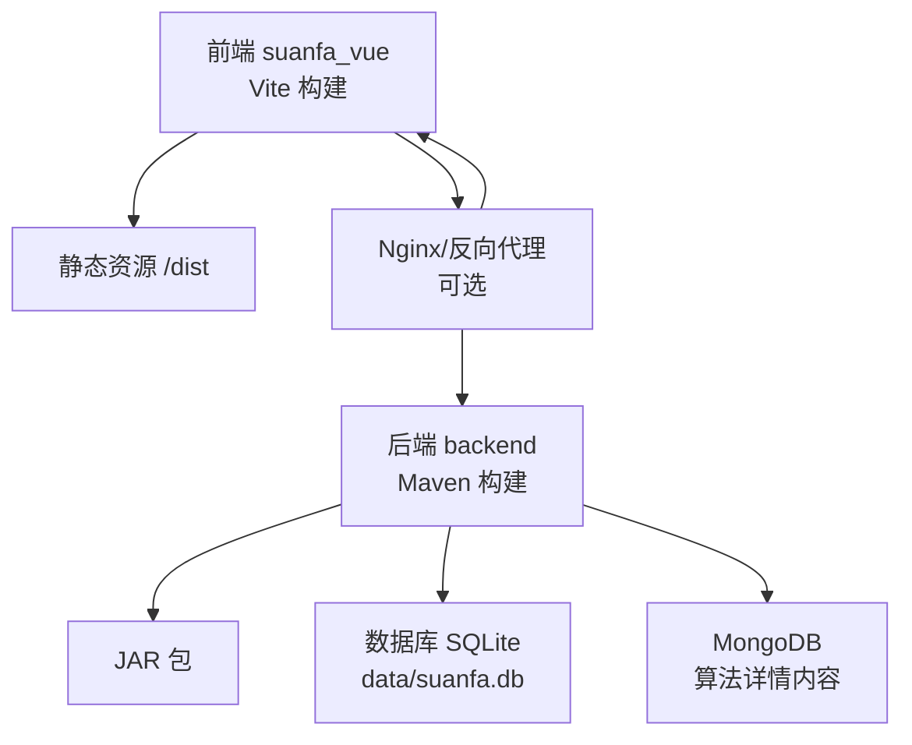
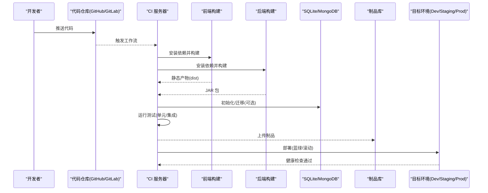
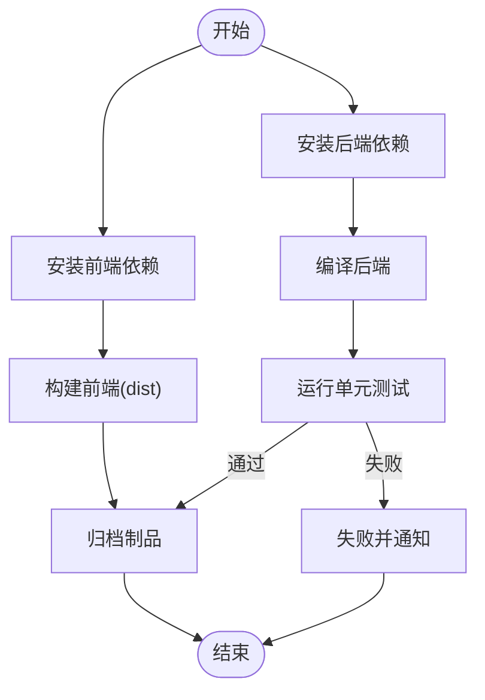
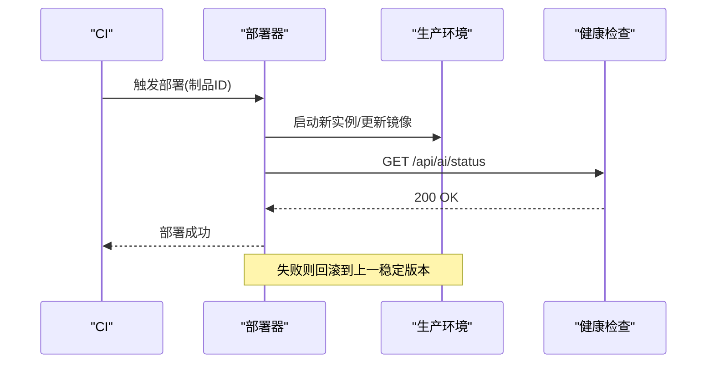
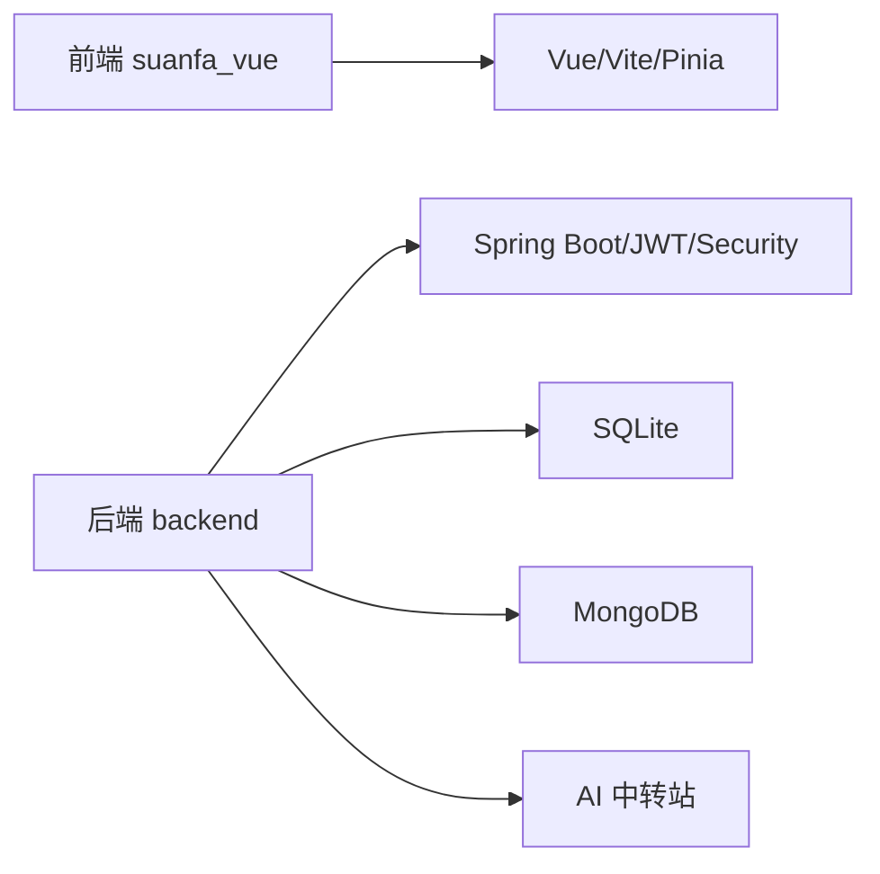

# CI/CD流水线

<cite>
**本文引用的文件**
- [backend/pom.xml](file://backend/pom.xml)
- [backend/src/main/resources/application.yml](file://backend/src/main/resources/application.yml)
- [scripts/dev-backend.sh](file://scripts/dev-backend.sh)
- [suanfa_vue/package.json](file://suanfa_vue/package.json)
- [architecture-analysis.md](file://architecture-analysis.md)
</cite>

## 目录
1. [简介](#简介)
2. [项目结构](#项目结构)
3. [核心组件](#核心组件)
4. [架构总览](#架构总览)
5. [详细组件分析](#详细组件分析)
6. [依赖关系分析](#依赖关系分析)
7. [性能与构建优化](#性能与构建优化)
8. [故障排查指南](#故障排查指南)
9. [结论](#结论)
10. [附录](#附录)

## 简介
本文件为“算法可视化网站”的CI/CD流水线设计文档，覆盖持续集成（代码检查、单元测试、集成测试）、持续部署（多环境发布）、分支与版本管理、构建优化（并行、缓存、产物管理）、错误处理与通知、回滚策略，以及GitHub Actions/Jenkins等工具的集成示例与最佳实践。该仓库包含前端Vue应用与后端Spring Boot服务，当前未内置自动化CI/CD配置文件，本文基于现有构建脚本与配置给出可落地的流水线方案。

## 项目结构
- 前端：suanfa_vue（Vite + Vue 3）
- 后端：backend（Spring Boot + Maven，SQLite + MongoDB）
- 脚本：scripts（开发辅助脚本）
- 文档：architecture-analysis.md（架构说明）

**图示来源**
- [suanfa_vue/package.json:6-9](file://suanfa_vue/package.json#L6-L9)
- [backend/pom.xml:80-87](file://backend/pom.xml#L80-L87)
- [backend/src/main/resources/application.yml:4-16](file://backend/src/main/resources/application.yml#L4-L16)

**章节来源**
- [suanfa_vue/package.json:1-23](file://suanfa_vue/package.json#L1-L23)
- [backend/pom.xml:1-89](file://backend/pom.xml#L1-L89)
- [backend/src/main/resources/application.yml:1-102](file://backend/src/main/resources/application.yml#L1-L102)

## 核心组件
- 前端构建：使用 Vite 进行开发与构建，输出静态资源用于部署。
- 后端构建：使用 Maven 与 Spring Boot 插件打包可执行 JAR。
- 启动与就绪检测：提供开发脚本自动加载环境变量并轮询健康接口。
- 数据层：SQLite 作为本地/轻量数据库；MongoDB 存储算法详情内容。
- 配置管理：application.yml 集中配置端口、数据源、AI 能力、CORS、日志级别等。

**章节来源**
- [suanfa_vue/package.json:6-9](file://suanfa_vue/package.json#L6-L9)
- [backend/pom.xml:20-22](file://backend/pom.xml#L20-L22)
- [backend/pom.xml:80-87](file://backend/pom.xml#L80-L87)
- [scripts/dev-backend.sh:15-45](file://scripts/dev-backend.sh#L15-L45)
- [backend/src/main/resources/application.yml:4-16](file://backend/src/main/resources/application.yml#L4-L16)

## 架构总览
下图展示从代码提交到构建、测试、部署的整体流程，涵盖前后端并行构建、测试阶段、制品归档与多环境发布。

[此图为概念性流程图，不直接映射具体源码文件]

## 详细组件分析

### 持续集成（CI）流水线
- 触发条件：push/PR 至受保护分支（如 main、develop）。
- 并行阶段：
  - 前端：安装依赖、代码检查（可选 ESLint/Prettier）、构建静态资源。
  - 后端：安装依赖、编译、运行单元测试、生成覆盖率报告。
- 测试策略：
  - 单元测试：后端使用 Spring Test 框架；前端可使用 Vitest（若引入）。
  - 集成测试：启动内存或临时数据库（SQLite），校验关键API路径。
- 质量门禁：
  - 构建失败、测试失败、覆盖率低于阈值则阻断合并。
- 制品归档：
  - 前端 dist 目录、后端 JAR 包，供后续部署阶段使用。

[此图为概念性流程图，不直接映射具体源码文件]

### 持续部署（CD）流水线
- 环境划分：
  - 开发环境：每次 push 自动部署，便于快速验证。
  - 预发/灰度环境：合并到 main 后部署，用于回归与验收。
  - 生产环境：打 tag 或指定分支后手动/自动发布。
- 部署方式：
  - 后端：java -jar 或容器化（Docker）+ 编排（K8s/Docker Compose）。
  - 前端：将 dist 放置到 Nginx/Apache 或对象存储+CDN。
- 健康检查：
  - 调用后端健康接口（如 /api/ai/status）确认服务就绪。
- 回滚策略：
  - 保留上一版本制品，失败时一键回滚。
  - 支持蓝绿/滚动发布，降低停机时间。

**图示来源**
- [scripts/dev-backend.sh:36-45](file://scripts/dev-backend.sh#L36-L45)

**章节来源**
- [scripts/dev-backend.sh:15-45](file://scripts/dev-backend.sh#L15-L45)

### 分支策略与版本管理
- 分支模型：
  - main：生产可用分支，仅接受经过测试的变更。
  - develop：集成开发分支，日常迭代。
  - feature/*：功能分支，完成后合并至 develop。
  - hotfix/*：紧急修复，合并至 main 与 develop。
- 版本标签：
  - 使用语义化版本（MAJOR.MINOR.PATCH），打 tag 触发生产发布。
- 发布流程：
  - 合并至 main → 构建 → 预发验证 → 打 tag → 生产发布。

[本节为通用策略说明，不直接引用具体文件]

### 构建优化策略
- 并行执行：
  - 前后端构建并行，测试阶段按模块并行。
- 缓存机制：
  - 前端：缓存 node_modules 与 Vite 缓存目录。
  - 后端：缓存 Maven 依赖目录（~/.m2/repository）。
- 增量构建：
  - 前端：利用 Vite 增量编译。
  - 后端：仅编译变更模块（多模块项目适用）。
- 产物管理：
  - 统一制品命名规范（含版本号、commit hash）。
  - 清理旧制品，控制存储空间。

[本节为通用优化建议，不直接引用具体文件]

### 错误处理与通知机制
- 错误分类：
  - 构建失败：依赖缺失、语法错误、编译失败。
  - 测试失败：断言失败、超时、数据库连接失败。
  - 部署失败：端口占用、权限不足、健康检查失败。
- 处理策略：
  - 记录详细日志，定位问题根因。
  - 失败时发送通知（邮件、企业微信、Slack）。
  - 自动回滚到上一稳定版本。
- 监控告警：
  - 服务可用性监控（心跳/健康检查）。
  - 错误率与延迟阈值告警。

[本节为通用运维建议，不直接引用具体文件]

### GitHub Actions 集成示例
- 工作流文件：.github/workflows/ci-cd.yml
- 关键步骤：
  - 设置 Node.js 与 Java 环境。
  - 缓存依赖目录。
  - 并行执行前端与后端构建。
  - 运行测试与覆盖率检查。
  - 上传制品并部署到目标环境。

[本节为工具集成示例，不直接引用具体文件]

### Jenkins 集成示例
- Pipeline 脚本：Jenkinsfile
- 关键阶段：
  - checkout、build-frontend、build-backend、test、package、deploy。
  - 使用共享库封装通用逻辑。
  - 参数化构建与人工审批节点。

[本节为工具集成示例，不直接引用具体文件]

## 依赖关系分析
- 前端依赖：Vue 3、Vite、Pinia、Vue Router 等。
- 后端依赖：Spring Boot、JDBC、SQLite、MongoDB、JWT、Security 等。
- 外部服务：AI 中转站（OpenAI 兼容接口）、MongoDB。

**图示来源**
- [suanfa_vue/package.json:11-21](file://suanfa_vue/package.json#L11-L21)
- [backend/pom.xml:24-78](file://backend/pom.xml#L24-L78)
- [backend/src/main/resources/application.yml:4-16](file://backend/src/main/resources/application.yml#L4-L16)

**章节来源**
- [suanfa_vue/package.json:11-21](file://suanfa_vue/package.json#L11-L21)
- [backend/pom.xml:24-78](file://backend/pom.xml#L24-L78)
- [backend/src/main/resources/application.yml:4-16](file://backend/src/main/resources/application.yml#L4-L16)

## 性能与构建优化
- 并行化：前后端构建与测试并行执行，缩短整体耗时。
- 缓存：复用依赖与构建缓存，减少重复下载与编译。
- 增量：利用 Vite 与 Maven 增量能力，提升二次构建速度。
- 产物瘦身：前端启用压缩与 Tree Shaking，后端移除无用依赖。
- 资源优化：图片与静态资源 CDN 加速，HTTP/2 与缓存头优化。

[本节为通用性能建议，不直接引用具体文件]

## 故障排查指南
- 常见问题：
  - 依赖安装失败：检查网络与镜像源。
  - 构建失败：查看编译日志与错误堆栈。
  - 测试失败：复现用例并检查数据库连接。
  - 部署失败：检查端口、权限与健康接口。
- 诊断工具：
  - 后端日志：/tmp/suanfa-backend-*.log
  - 健康检查：curl http://localhost:8080/api/ai/status
- 回滚操作：
  - 恢复上一版本制品并重启服务。
  - 数据库回滚（如有迁移脚本）。

**章节来源**
- [scripts/dev-backend.sh:30-45](file://scripts/dev-backend.sh#L30-L45)

## 结论
本流水线方案基于现有前端与后端构建配置，提供了完整的CI/CD实践路径。通过并行构建、缓存优化、严格的质量门禁与稳健的部署回滚策略，确保代码变更快速、安全地交付到各环境。建议逐步引入自动化测试与监控告警，进一步提升交付效率与系统稳定性。

[本节为总结性内容，不直接引用具体文件]

## 附录
- 环境变量管理：敏感信息（如 JWT secret、AI API Key）通过环境变量注入，避免硬编码。
- 配置优先级：运行时配置 > 环境变量 > application.yml 默认值。
- 参考文档：architecture-analysis.md 中关于后端化与数据层的规划。

**章节来源**
- [backend/src/main/resources/application.yml:18-50](file://backend/src/main/resources/application.yml#L18-L50)
- [architecture-analysis.md:265-333](file://architecture-analysis.md#L265-L333)