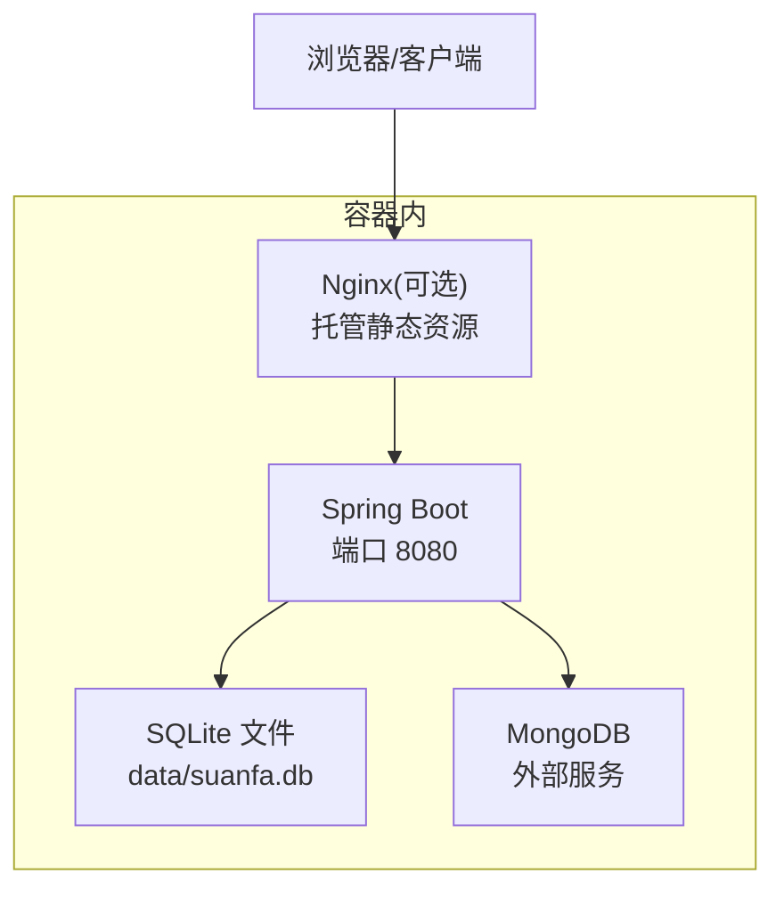
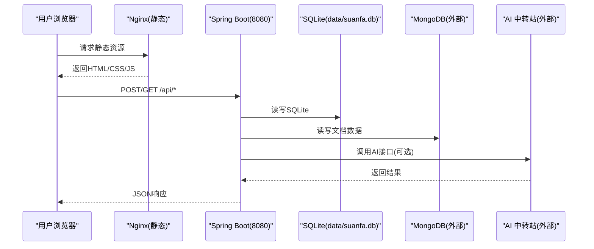
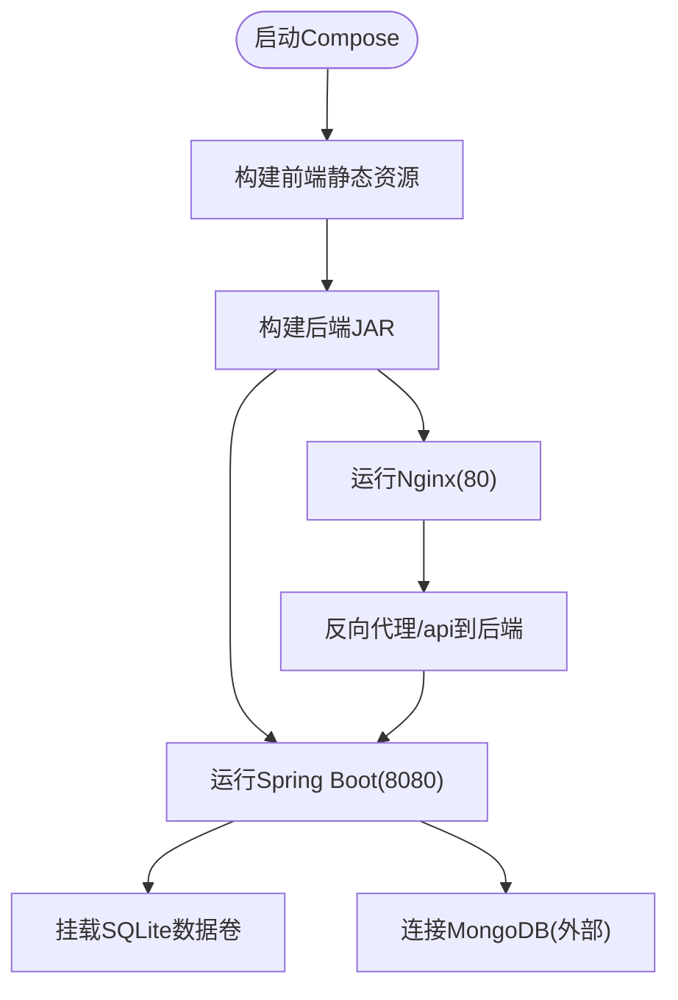
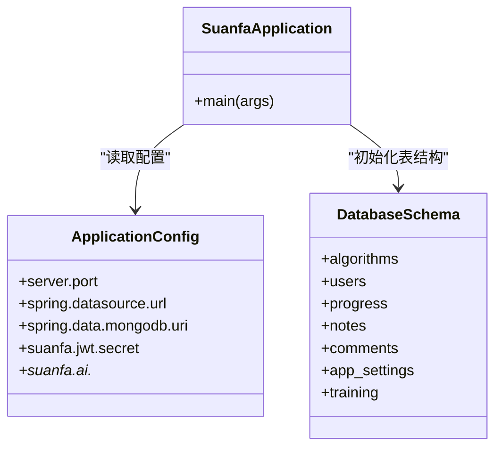

# Docker容器化部署

<cite>
**本文引用的文件**
- [backend/pom.xml](file://backend/pom.xml)
- [backend/src/main/resources/application.yml](file://backend/src/main/resources/application.yml)
- [backend/src/main/java/com/suanfa/SuanfaApplication.java](file://backend/src/main/java/com/suanfa/SuanfaApplication.java)
- [backend/src/main/resources/schema.sql](file://backend/src/main/resources/schema.sql)
- [suanfa_vue/package.json](file://suanfa_vue/package.json)
- [suanfa_vue/vite.config.js](file://suanfa_vue/vite.config.js)
- [scripts/dev-backend.sh](file://scripts/dev-backend.sh)
</cite>

## 目录
1. [简介](#简介)
2. [项目结构](#项目结构)
3. [核心组件](#核心组件)
4. [架构总览](#架构总览)
5. [详细组件分析](#详细组件分析)
6. [依赖关系分析](#依赖关系分析)
7. [性能考量](#性能考量)
8. [故障排查指南](#故障排查指南)
9. [结论](#结论)
10. [附录](#附录)

## 简介
本文件面向生产与运维团队，提供该算法可视化学习平台的完整Docker容器化方案。内容覆盖：
- 多阶段镜像构建（前端静态资源与后端服务分离）
- 镜像分层策略与依赖缓存优化
- 容器编排与服务通信、网络配置、数据持久化
- 环境变量管理、敏感信息保护与配置注入
- 健康检查、日志收集与监控集成
- Docker Compose 示例与最佳实践
- 生产环境部署建议与性能优化

## 项目结构
该项目包含前后端两套工程：
- 后端：Spring Boot 应用，使用 SQLite 作为本地数据库，MongoDB 存储文档型数据；通过 JWT 实现认证；支持 AI 助教能力（OpenAI 兼容接口）。
- 前端：Vue 3 + Vite 构建的静态站点，开发时通过代理访问后端 API。

**图表来源**
- [backend/src/main/resources/application.yml:1-16](file://backend/src/main/resources/application.yml#L1-L16)
- [backend/src/main/java/com/suanfa/SuanfaApplication.java:13-19](file://backend/src/main/java/com/suanfa/SuanfaApplication.java#L13-L19)
- [backend/src/main/resources/schema.sql:1-16](file://backend/src/main/resources/schema.sql#L1-L16)

**章节来源**
- [backend/pom.xml:1-89](file://backend/pom.xml#L1-L89)
- [backend/src/main/resources/application.yml:1-102](file://backend/src/main/resources/application.yml#L1-L102)
- [suanfa_vue/package.json:1-23](file://suanfa_vue/package.json#L1-L23)
- [suanfa_vue/vite.config.js:1-22](file://suanfa_vue/vite.config.js#L1-L22)

## 核心组件
- 后端服务（Spring Boot）
  - 启动入口确保 data 目录存在，便于 SQLite 文件写入。
  - 配置项涵盖服务器端口、SQLite 路径、MongoDB URI、Jackson 行为、JWT、CORS、AI 中转站、代码执行超时与限流等。
  - 依赖包括 Web、JDBC、SQLite、MongoDB、Security、JWT。
- 前端应用（Vue + Vite）
  - 构建产物为静态资源，可通过 Nginx 或反向代理提供服务。
  - 开发模式通过 Vite 代理 /api 到后端 8080 端口。
- 数据层
  - SQLite 文件位于 data/suanfa.db，需持久化挂载。
  - MongoDB 以外部服务形式连接，URI 可配置。

**章节来源**
- [backend/src/main/java/com/suanfa/SuanfaApplication.java:13-19](file://backend/src/main/java/com/suanfa/SuanfaApplication.java#L13-L19)
- [backend/src/main/resources/application.yml:1-102](file://backend/src/main/resources/application.yml#L1-L102)
- [backend/pom.xml:24-78](file://backend/pom.xml#L24-L78)
- [suanfa_vue/vite.config.js:10-20](file://suanfa_vue/vite.config.js#L10-L20)

## 架构总览
下图展示容器内外的关键交互：前端静态资源由 Nginx 托管，API 请求转发至 Spring Boot；后端读写 SQLite 文件并连接外部 MongoDB；AI 能力通过环境变量指向 OpenAI 兼容服务。

**图表来源**
- [backend/src/main/resources/application.yml:1-16](file://backend/src/main/resources/application.yml#L1-L16)
- [backend/src/main/resources/application.yml:18-50](file://backend/src/main/resources/application.yml#L18-L50)
- [backend/src/main/java/com/suanfa/SuanfaApplication.java:13-19](file://backend/src/main/java/com/suanfa/SuanfaApplication.java#L13-L19)

## 详细组件分析

### 后端镜像构建（多阶段）
- 阶段一：构建后端包
  - 基于 JDK 基础镜像，安装 Maven，拉取依赖并打包 Spring Boot 应用。
  - 利用 Maven 离线模式减少网络波动影响。
- 阶段二：运行镜像
  - 基于精简运行时镜像（如 JRE），仅拷贝 jar 与必要资源。
  - 暴露 8080 端口，设置健康检查与健康探针。
  - 通过环境变量注入敏感信息与运行时配置。

优化要点
- 依赖缓存：将 pom.xml 与依赖下载步骤前置，充分利用 Docker 层缓存。
- 分层策略：将源码与依赖解耦，避免每次变更触发全量重建。
- 安全加固：非 root 用户运行、最小化镜像体积、关闭调试输出。

**章节来源**
- [backend/pom.xml:80-87](file://backend/pom.xml#L80-L87)
- [backend/src/main/resources/application.yml:1-16](file://backend/src/main/resources/application.yml#L1-L16)

### 前端镜像构建（多阶段）
- 阶段一：构建静态资源
  - 基于 Node 镜像，安装依赖并执行构建命令，产出 dist 目录。
- 阶段二：托管静态资源
  - 基于 Nginx 镜像，拷贝 dist 目录，配置反向代理 /api 到后端服务。
  - 暴露 80 端口，启用 gzip 压缩与缓存头。

优化要点
- 依赖缓存：先复制 package.json 与 lock 文件，再安装依赖，最后复制源码。
- 构建缓存：利用 npm/yarn 缓存目录提升重复构建速度。
- 产物瘦身：移除不必要的注释与源映射（生产环境）。

**章节来源**
- [suanfa_vue/package.json:6-21](file://suanfa_vue/package.json#L6-L21)
- [suanfa_vue/vite.config.js:10-20](file://suanfa_vue/vite.config.js#L10-L20)

### 容器编排与服务通信
- 服务定义
  - backend：Spring Boot 服务，端口 8080，挂载 SQLite 数据卷。
  - frontend：Nginx 服务，端口 80，反向代理 /api 到 backend。
  - mongodb：外部或同集群 MongoDB 服务，URI 通过环境变量注入。
- 网络配置
  - 使用默认桥接网络，服务间通过服务名通信。
  - 如需跨主机，可使用 overlay 网络或 Kubernetes Service。
- 数据持久化
  - SQLite 文件 data/suanfa.db 必须挂载到宿主机或云盘，避免容器重启丢失。
  - MongoDB 数据由外部实例负责持久化。

**图表来源**
- [backend/src/main/resources/application.yml:1-16](file://backend/src/main/resources/application.yml#L1-L16)
- [backend/src/main/java/com/suanfa/SuanfaApplication.java:13-19](file://backend/src/main/java/com/suanfa/SuanfaApplication.java#L13-L19)

**章节来源**
- [backend/src/main/resources/application.yml:1-16](file://backend/src/main/resources/application.yml#L1-L16)
- [backend/src/main/resources/schema.sql:1-16](file://backend/src/main/resources/schema.sql#L1-L16)

### 环境变量管理与配置注入
- 后端配置
  - 服务器端口、SQLite 路径、MongoDB URI、JWT 密钥、CORS 白名单、AI 中转站地址与密钥、代码执行超时与限流等均可通过环境变量覆盖。
  - 敏感信息（如 JWT secret、AI API Key）应通过环境变量或密钥管理服务注入，禁止硬编码。
- 前端配置
  - 构建期变量通过 Vite 配置注入；运行期通过 Nginx 反向代理统一对外暴露。
- 配置优先级
  - 页面配置（运行时保存）优先于环境变量；环境变量优先于配置文件默认值。

**章节来源**
- [backend/src/main/resources/application.yml:18-50](file://backend/src/main/resources/application.yml#L18-L50)
- [backend/src/main/resources/application.yml:92-102](file://backend/src/main/resources/application.yml#L92-L102)

### 健康检查、日志与监控
- 健康检查
  - 后端提供 /api/ai/status 等接口用于就绪探测；可在编排层配置 liveness/readiness 探针。
  - 启动脚本在开发环境中轮询该接口确认服务就绪。
- 日志收集
  - 后端日志输出到标准输出，便于容器日志系统采集。
  - 建议接入集中式日志平台（如 ELK/Loki）进行聚合与分析。
- 监控集成
  - 可暴露指标端点（如 Micrometer），对接 Prometheus 与 Grafana。
  - 对 AI 调用、代码执行等关键路径添加埋点与告警。

**章节来源**
- [scripts/dev-backend.sh:30-44](file://scripts/dev-backend.sh#L30-L44)
- [backend/src/main/resources/application.yml:98-102](file://backend/src/main/resources/application.yml#L98-L102)

### 生产环境最佳实践
- 镜像安全
  - 使用最小化运行时镜像，定期更新基础镜像补丁。
  - 扫描镜像漏洞，限制镜像仓库访问权限。
- 资源限制
  - 为容器设置 CPU/内存限制，防止资源争用。
  - 合理配置 JVM 参数（堆大小、GC 策略）。
- 高可用
  - 多副本部署，配合负载均衡与健康检查。
  - 数据层独立部署，避免单点故障。
- 灰度发布
  - 蓝绿或金丝雀发布，逐步放量，快速回滚。
- 备份与恢复
  - 定期备份 SQLite 文件与 MongoDB 数据。
  - 制定灾难恢复流程与演练计划。

[本节为通用指导，不直接分析具体文件]

## 依赖关系分析
后端依赖关系如下：
- Spring Boot 应用依赖 Web、JDBC、SQLite、MongoDB、Security、JWT。
- 启动时创建 data 目录，确保 SQLite 可写。
- 配置加载顺序：配置文件 → 环境变量 → 运行时页面配置（热生效）。

**图表来源**
- [backend/src/main/java/com/suanfa/SuanfaApplication.java:13-19](file://backend/src/main/java/com/suanfa/SuanfaApplication.java#L13-L19)
- [backend/src/main/resources/application.yml:1-16](file://backend/src/main/resources/application.yml#L1-L16)
- [backend/src/main/resources/schema.sql:1-77](file://backend/src/main/resources/schema.sql#L1-L77)

**章节来源**
- [backend/pom.xml:24-78](file://backend/pom.xml#L24-L78)
- [backend/src/main/resources/schema.sql:1-77](file://backend/src/main/resources/schema.sql#L1-L77)

## 性能考量
- 构建优化
  - 前端：依赖安装与构建分离，利用缓存目录；生产构建禁用 sourcemap。
  - 后端：Maven 离线模式，依赖层与源码层分离。
- 运行时优化
  - 启用 Gzip/Brotli 压缩，静态资源缓存。
  - 调整 JVM 堆大小与 GC 参数，匹配容器资源限制。
  - 合理设置 AI 调用超时与重试策略，避免雪崩。
- 数据层优化
  - SQLite 文件落盘到高性能磁盘；必要时迁移到 PostgreSQL。
  - MongoDB 索引优化与连接池调优。

[本节为通用指导，不直接分析具体文件]

## 故障排查指南
- 启动失败
  - 检查 data 目录是否存在且可写；确认 SQLite 驱动与 JDBC URL 正确。
  - 查看后端日志定位异常堆栈。
- 无法连接 MongoDB
  - 校验 MongoDB URI 与网络连通性；检查鉴权与防火墙规则。
- AI 接口不可用
  - 校验环境变量中的 base-url 与 api-key；检查上游服务状态。
- 前端无法访问后端
  - 确认 Nginx 反向代理配置与后端端口；检查 CORS 设置。

**章节来源**
- [backend/src/main/java/com/suanfa/SuanfaApplication.java:13-19](file://backend/src/main/java/com/suanfa/SuanfaApplication.java#L13-L19)
- [backend/src/main/resources/application.yml:1-16](file://backend/src/main/resources/application.yml#L1-L16)
- [backend/src/main/resources/application.yml:18-50](file://backend/src/main/resources/application.yml#L18-L50)
- [scripts/dev-backend.sh:30-44](file://scripts/dev-backend.sh#L30-L44)

## 结论
本项目采用前后端分离架构，后端基于 Spring Boot，前端基于 Vue + Vite。通过多阶段镜像构建、合理的分层策略与环境变量管理，可实现安全、可维护的容器化部署。结合健康检查、日志与监控，能够保障生产环境的稳定运行。建议在资源受限环境下持续优化镜像体积与运行时性能，并建立完善的备份与回滚机制。

[本节为总结性内容，不直接分析具体文件]

## 附录

### Docker Compose 示例（概念性说明）
- 服务定义
  - frontend：Nginx 容器，暴露 80 端口，反向代理 /api 到 backend。
  - backend：Spring Boot 容器，暴露 8080 端口，挂载 SQLite 数据卷。
  - mongodb：外部服务或通过 compose 引入，配置 URI。
- 环境变量
  - 通过 .env 文件或 secrets 管理敏感信息。
  - 后端配置项通过环境变量覆盖默认值。
- 数据卷
  - 将 SQLite 数据目录挂载到宿主机或云盘，确保数据持久化。

[本节为概念性说明，不直接映射到具体文件]

### 环境变量清单（参考）
- 后端
  - SERVER_PORT：服务端口（默认 8080）
  - SPRING_DATASOURCE_URL：SQLite 连接串
  - SPRING_DATA_MONGODB_URI：MongoDB 连接串
  - SUANFA_JWT_SECRET：JWT 密钥（生产必须替换）
  - SUANFA_AI_BASE_URL、SUANFA_AI_API_KEY、SUANFA_AI_MODEL 等：AI 相关配置
  - SUANFA_CODE_COMPILE_TIMEOUT_SECONDS、SUANFA_CODE_RUN_TIMEOUT_SECONDS：代码执行超时
- 前端
  - 构建期变量通过 Vite 配置注入；运行期通过 Nginx 代理统一对外。

**章节来源**
- [backend/src/main/resources/application.yml:1-16](file://backend/src/main/resources/application.yml#L1-L16)
- [backend/src/main/resources/application.yml:18-50](file://backend/src/main/resources/application.yml#L18-L50)
- [backend/src/main/resources/application.yml:92-102](file://backend/src/main/resources/application.yml#L92-L102)