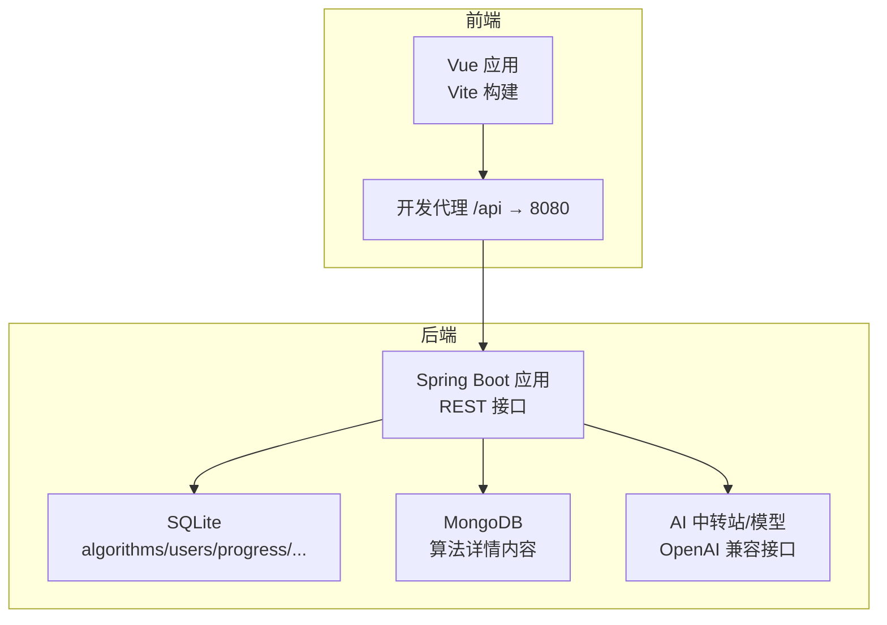
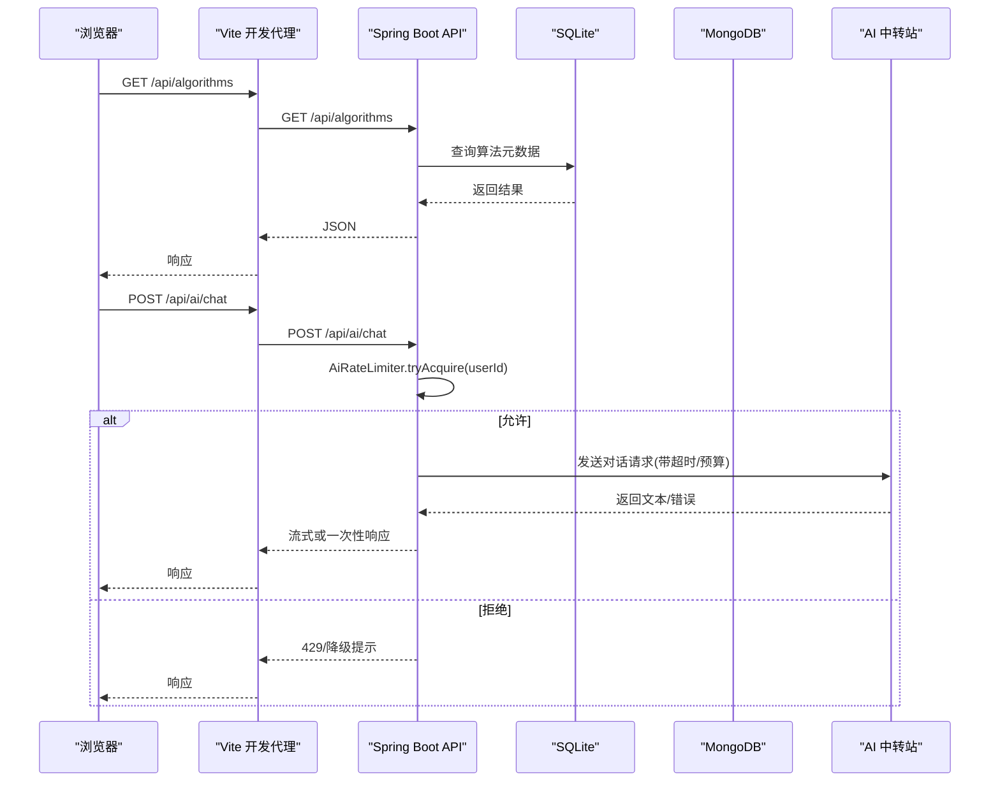
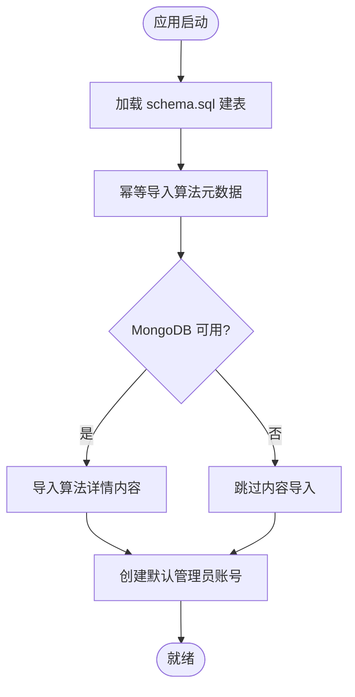
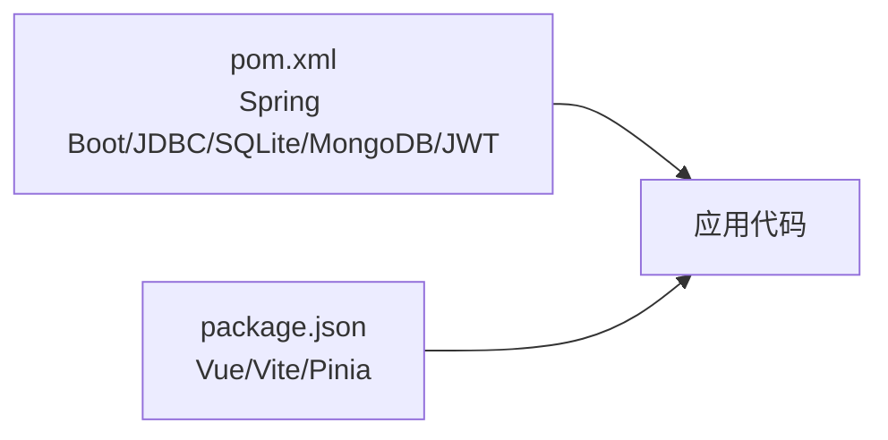

# 性能调优配置

<cite>
**本文引用的文件**
- [application.yml](file://backend/src/main/resources/application.yml)
- [pom.xml](file://backend/pom.xml)
- [WebConfig.java](file://backend/src/main/java/com/suanfa/config/WebConfig.java)
- [AiProperties.java](file://backend/src/main/java/com/suanfa/config/AiProperties.java)
- [AiRateLimiter.java](file://backend/src/main/java/com/suanfa/service/AiRateLimiter.java)
- [CodeExecuteService.java](file://backend/src/main/java/com/suanfa/service/CodeExecuteService.java)
- [schema.sql](file://backend/src/main/resources/schema.sql)
- [vite.config.js](file://suanfa_vue/vite.config.js)
- [package.json](file://suanfa_vue/package.json)
</cite>

## 目录
1. [简介](#简介)
2. [项目结构](#项目结构)
3. [核心组件](#核心组件)
4. [架构总览](#架构总览)
5. [详细组件分析](#详细组件分析)
6. [依赖关系分析](#依赖关系分析)
7. [性能考虑](#性能考虑)
8. [故障排查指南](#故障排查指南)
9. [结论](#结论)
10. [附录](#附录)

## 简介
本文件面向“算法可视化学习网站”的后端（Spring Boot + SQLite/MongoDB）与前端（Vue 3 + Vite），聚焦生产可用的性能调优策略。内容覆盖：数据库连接与初始化、AI 调用限流与超时、代码执行沙箱资源限制、前后端网络与缓存、构建产物优化、以及可落地的监控与排障建议。所有建议均基于仓库现有实现与配置，便于直接落地。

## 项目结构
- 后端位于 backend/，使用 Spring Boot 3.2、Java 17；数据层为 SQLite（JDBC）+ MongoDB（文档型内容）；提供 REST API、JWT 认证、AI 助教能力与代码执行服务。
- 前端位于 suanfa_vue/，使用 Vue 3 + Vite；开发期通过代理转发 /api 到后端；构建产物用于静态部署。

图表来源
- [application.yml:1-16](file://backend/src/main/resources/application.yml#L1-L16)
- [vite.config.js:10-19](file://suanfa_vue/vite.config.js#L10-L19)

章节来源
- [application.yml:1-16](file://backend/src/main/resources/application.yml#L1-L16)
- [vite.config.js:10-19](file://suanfa_vue/vite.config.js#L10-L19)

## 核心组件
- 应用配置与服务器端口：统一在 application.yml 中管理，包含数据源、MongoDB、Jackson 行为等。
- Web 跨域与参数解析：WebConfig 注册用户 ID 解析器并配置 CORS。
- AI 能力：AiProperties 集中承载多上游/多模型配置；AiRateLimiter 提供按用户的滑动窗口限流；AiController 内嵌线程池隔离流式请求。
- 代码执行：CodeExecuteService 定义各语言编译/运行命令与资源上限，配合超时控制。
- 数据层：schema.sql 定义 SQLite 表结构与索引；DataInitializer 启动时幂等导入种子数据。

章节来源
- [application.yml:1-102](file://backend/src/main/resources/application.yml#L1-L102)
- [WebConfig.java:13-45](file://backend/src/main/java/com/suanfa/config/WebConfig.java#L13-L45)
- [AiProperties.java:29-56](file://backend/src/main/java/com/suanfa/config/AiProperties.java#L29-L56)
- [AiRateLimiter.java:11-77](file://backend/src/main/java/com/suanfa/service/AiRateLimiter.java#L11-L77)
- [CodeExecuteService.java:36-69](file://backend/src/main/java/com/suanfa/service/CodeExecuteService.java#L36-L69)
- [schema.sql:1-77](file://backend/src/main/resources/schema.sql#L1-L77)

## 架构总览
下图展示一次典型请求从前端到后端的链路，包括数据库访问、AI 调用与限流保护。

图表来源
- [application.yml:4-16](file://backend/src/main/resources/application.yml#L4-L16)
- [AiRateLimiter.java:23-53](file://backend/src/main/java/com/suanfa/service/AiRateLimiter.java#L23-L53)

## 详细组件分析

### 数据库与连接相关
- 数据源与初始化
  - SQLite 作为主库，JDBC 直连；应用启动时通过 schema.sql 建表，并通过 DataInitializer 幂等导入算法元数据与默认管理员账号。
  - MongoDB 用于存储算法详情内容，不可用时降级跳过，前端可回退本地数据。
- 连接数与并发
  - SQLite 为单进程文件数据库，适合单机小体量场景；高并发写会受限，读多写少场景更合适。
  - 若未来迁移至 PostgreSQL/MySQL，建议引入 HikariCP 连接池并设置合理的最大连接数、连接超时与空闲回收策略。
- 超时与事务
  - 当前未显式配置 JDBC 超时；建议在迁移到关系型数据库时设置连接超时、查询超时，并结合业务设置合理的事务边界。
- 索引与查询
  - comments 表已建立 (algorithm_id, created_at) 复合索引，利于按算法维度分页查看评论。
  - 其他高频查询建议根据实际 SQL 增加必要索引（如 users.username、progress.user_id）。

图表来源
- [schema.sql:1-77](file://backend/src/main/resources/schema.sql#L1-L77)
- [application.yml:4-16](file://backend/src/main/resources/application.yml#L4-L16)

章节来源
- [schema.sql:1-77](file://backend/src/main/resources/schema.sql#L1-L77)
- [application.yml:4-16](file://backend/src/main/resources/application.yml#L4-L16)

### 缓存策略
- 现状
  - 后端未集成 Redis 或内存缓存框架；AI 知识召回在内存中维护 volatile 列表以减少重复计算。
- 建议
  - 热点数据（如算法元数据、分类列表）可引入 Redis 缓存，设置合理 TTL 与失效策略（时间过期 + 主动刷新）。
  - 对 AI 知识召回结果可加短 TTL 的本地缓存，避免频繁 IO。
  - 前端可使用浏览器缓存与 Service Worker 缓存静态资源；API 响应可协商 ETag/Last-Modified。

章节来源
- [AiKnowledgeService.java:83-111](file://backend/src/main/java/com/suanfa/service/AiKnowledgeService.java#L83-L111)

### 静态资源与前端优化
- 开发期代理
  - Vite 将 /api 请求代理到后端 8080，便于联调。
- 构建与产物
  - 使用 Vite 构建，按需拆分 chunk；历史删除冗余依赖（如 xlsx）显著减小产物体积。
- CDN 与浏览器缓存
  - 生产部署建议将静态资源托管至 CDN，开启长缓存与版本化文件名；后端可配置反向代理的 Cache-Control。
- 前端缓存
  - 非敏感数据可在 localStorage 做轻量缓存（如笔记、活动记录）；注意容量与清理策略。

章节来源
- [vite.config.js:10-19](file://suanfa_vue/vite.config.js#L10-L19)
- [package.json:1-23](file://suanfa_vue/package.json#L1-L23)

### API 响应优化
- 跨域与安全
  - WebConfig 针对 /api/** 启用 allowedOriginPatterns 并允许携带凭证，maxAge 预检缓存。
- 限流与降级
  - AI 聊天接口采用按用户的滑动窗口限流，防止滥用；结合上游超时与降级链保证可用性。
- 异步与线程隔离
  - 流式 AI 请求使用独立线程池（SynchronousQueue），满则快速失败，避免阻塞通用线程池。
- 分页与过滤
  - 评论接口利用复合索引支持按算法维度分页；其他列表接口建议增加服务端分页与过滤参数。

章节来源
- [WebConfig.java:33-44](file://backend/src/main/java/com/suanfa/config/WebConfig.java#L33-L44)
- [AiRateLimiter.java:23-53](file://backend/src/main/java/com/suanfa/service/AiRateLimiter.java#L23-L53)
- [AiController.java:57-81](file://backend/src/main/java/com/suanfa/controller/AiController.java#L57-L81)

### JVM 与 Spring Boot 优化
- 运行时
  - Java 17 + Spring Boot 3.2；容器化部署时建议设置 -XX:+UseContainerSupport 与堆大小限制。
  - 日志级别可通过 application.yml 调整，生产建议 root 为 info，仅关键包 debug。
- 外部化配置
  - 通过环境变量注入敏感信息（如 JWT secret、AI 凭据），避免硬编码。
- 构建与打包
  - 使用 spring-boot-maven-plugin 打包；生产环境建议开启分层构建以加速冷启动。

章节来源
- [pom.xml:20-22](file://backend/pom.xml#L20-L22)
- [application.yml:19-50](file://backend/src/main/resources/application.yml#L19-L50)
- [application.yml:98-102](file://backend/src/main/resources/application.yml#L98-L102)

### 代码执行沙箱与资源限制
- 语言与命令
  - 为 C/C++/Java/Go/Node/Python 分别定义编译与运行命令，Java 运行指定堆大小与垃圾收集器。
- 资源上限
  - 输出字节上限、输入字符上限、C/C++ 虚存限制，防止恶意程序耗尽资源。
- 超时控制
  - 编译与运行超时由配置项控制，避免长时间占用线程。

章节来源
- [CodeExecuteService.java:36-69](file://backend/src/main/java/com/suanfa/service/CodeExecuteService.java#L36-L69)
- [application.yml:92-96](file://backend/src/main/resources/application.yml#L92-L96)

## 依赖关系分析
- 后端依赖
  - Spring Boot Web、JDBC、SQLite、MongoDB、Security Crypto、JWT 等。
- 前端依赖
  - Vue、Vue Router、Pinia、DOMPurify、Marked 等。
- 构建工具
  - Maven（后端）、Vite（前端）。

图表来源
- [pom.xml:24-78](file://backend/pom.xml#L24-L78)
- [package.json:11-21](file://suanfa_vue/package.json#L11-L21)

章节来源
- [pom.xml:24-78](file://backend/pom.xml#L24-L78)
- [package.json:11-21](file://suanfa_vue/package.json#L11-L21)

## 性能考虑
- 数据库
  - SQLite 适合低并发读多写少；如需高并发写入，迁移至 PostgreSQL/MySQL 并引入连接池与慢查询日志。
  - 为高频查询字段添加索引（如 users.username、progress.user_id）。
- 缓存
  - 引入 Redis 缓存热点数据；对 AI 知识召回结果加短期本地缓存。
  - 前端对静态资源启用强缓存与版本化；对 API 响应使用 ETag/Last-Modified。
- 网络与压缩
  - 生产网关/CDN 开启 Gzip/Brotli；减少首屏体积与传输耗时。
- 异步与限流
  - 保持 AI 流式请求的线程池隔离；完善限流与熔断策略，避免雪崩。
- 构建与部署
  - 使用分层构建与容器镜像缓存；生产关闭调试日志，仅保留必要指标。

[本节为通用指导，不直接分析具体文件]

## 故障排查指南
- 启动与数据
  - 检查 schema.sql 是否成功执行；确认 DataInitializer 是否完成种子导入与默认账号创建。
- 连接问题
  - 若 MongoDB 不可用，后端应降级并记录警告；前端可回退本地数据。
- 限流与超时
  - AI 接口被限流时，检查 rate-per-minute 配置；上游超时与降级链需合理设置。
- 代码执行异常
  - 检查编译/运行超时配置与资源限制；查看 stdout/stderr 输出上限是否触发。
- 跨域与认证
  - 确认 WebConfig 的 allowedOriginPatterns 与 allowCredentials 设置；检查 Cookie 与 Token 传递。

章节来源
- [schema.sql:1-77](file://backend/src/main/resources/schema.sql#L1-L77)
- [application.yml:4-16](file://backend/src/main/resources/application.yml#L4-L16)
- [application.yml:19-50](file://backend/src/main/resources/application.yml#L19-L50)
- [application.yml:92-96](file://backend/src/main/resources/application.yml#L92-L96)
- [WebConfig.java:33-44](file://backend/src/main/java/com/suanfa/config/WebConfig.java#L33-L44)

## 结论
本项目在后端与前端均已具备基础的性能保障机制：SQLite + 幂等初始化、AI 限流与超时、代码执行资源限制、Vite 构建与代理。为进一步提升性能与稳定性，建议引入 Redis 缓存、完善数据库索引与连接池配置、在生产环境启用压缩与 CDN，并建立完善的监控与告警体系。

[本节为总结性内容，不直接分析具体文件]

## 附录
- 关键配置位置速查
  - 服务器端口与数据源：application.yml
  - 跨域与参数解析：WebConfig.java
  - AI 限流与超时：AiRateLimiter.java、application.yml
  - 代码执行资源限制：CodeExecuteService.java、application.yml
  - 数据库表结构与索引：schema.sql
  - 前端代理与构建：vite.config.js、package.json

[本节为索引性内容，不直接分析具体文件]