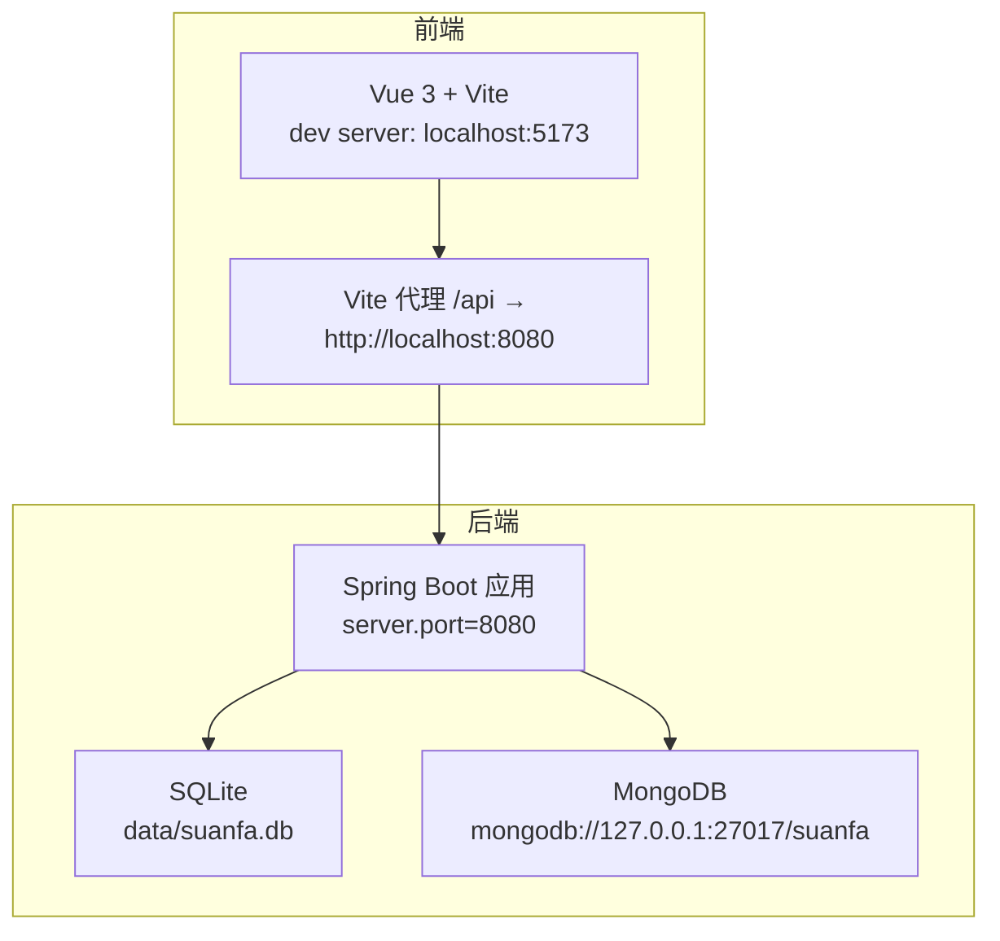
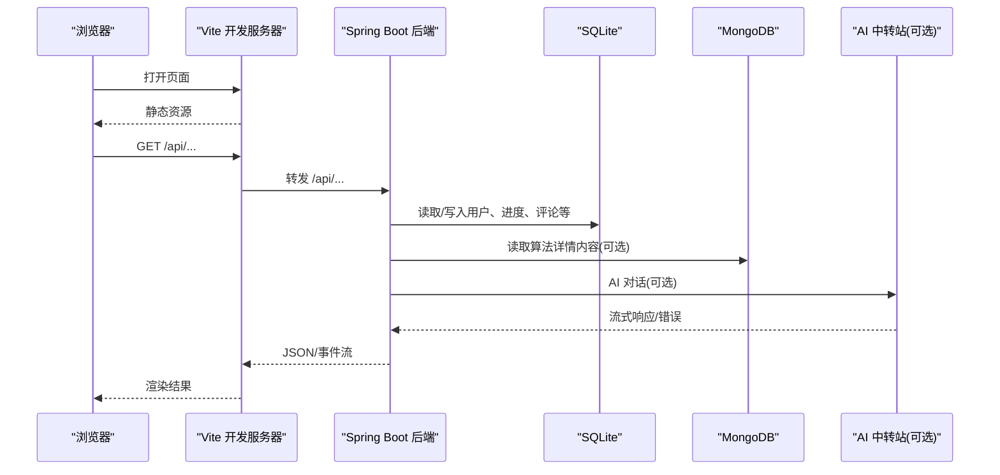
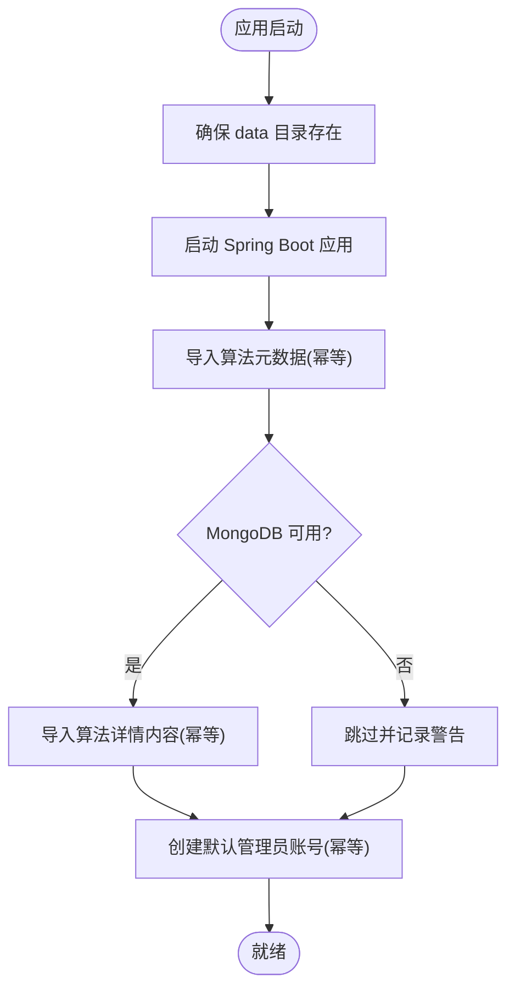
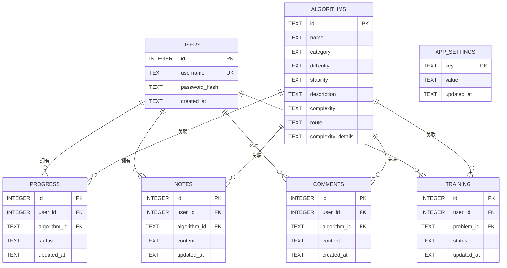

# 环境搭建

<cite>
**本文引用的文件**
- [backend/pom.xml](file://backend/pom.xml)
- [backend/src/main/resources/application.yml](file://backend/src/main/resources/application.yml)
- [backend/src/main/resources/schema.sql](file://backend/src/main/resources/schema.sql)
- [backend/src/main/java/com/suanfa/SuanfaApplication.java](file://backend/src/main/java/com/suanfa/SuanfaApplication.java)
- [backend/src/main/java/com/suanfa/config/DataInitializer.java](file://backend/src/main/java/com/suanfa/config/DataInitializer.java)
- [scripts/dev-backend.sh](file://scripts/dev-backend.sh)
- [suanfa_vue/package.json](file://suanfa_vue/package.json)
- [suanfa_vue/vite.config.js](file://suanfa_vue/vite.config.js)
- [suanfa_vue/src/api/client.js](file://suanfa_vue/src/api/client.js)
</cite>

## 目录
1. [简介](#简介)
2. [项目结构](#项目结构)
3. [核心组件](#核心组件)
4. [架构总览](#架构总览)
5. [详细组件分析](#详细组件分析)
6. [依赖分析](#依赖分析)
7. [性能考虑](#性能考虑)
8. [故障排除指南](#故障排除指南)
9. [结论](#结论)
10. [附录](#附录)

## 简介
本指南面向首次参与项目的开发者，提供从零开始的完整开发环境搭建说明。内容涵盖：
- 必需运行时与工具版本（Java、Node.js、Maven）
- 后端依赖管理（Maven 与 Spring Boot）
- 前端依赖管理（npm + Vite）
- 数据库初始化（SQLite 与 MongoDB）
- 环境变量与配置文件说明
- 前后端服务启动流程、端口配置与联调方式
- 常见问题排查与环境检查清单

## 项目结构
本项目采用前后端分离：
- 后端：Spring Boot 应用，负责用户认证、学习进度、算法元数据服务、AI 助教等能力；默认使用 SQLite 存储关系型数据，可选连接 MongoDB 存储算法详情文档。
- 前端：Vue 3 + Vite 单页应用，开发时通过代理将 /api 请求转发到后端；具备“后端不可达时降级为本地数据”的容错机制。

图表来源
- [suanfa_vue/vite.config.js:10-20](file://suanfa_vue/vite.config.js#L10-L20)
- [backend/src/main/resources/application.yml:1-16](file://backend/src/main/resources/application.yml#L1-L16)

章节来源
- [backend/src/main/resources/application.yml:1-16](file://backend/src/main/resources/application.yml#L1-L16)
- [suanfa_vue/vite.config.js:10-20](file://suanfa_vue/vite.config.js#L10-L20)

## 核心组件
- 后端入口与数据目录准备：确保 data 目录存在并创建 SQLite 数据库文件。
- 数据库初始化：启动时自动执行 schema.sql 建表；导入算法元数据种子；尝试导入 MongoDB 算法内容种子（不可用时降级）。
- 环境变量与配置：application.yml 定义默认值，支持通过 .env 或系统环境变量覆盖（如 AI_BASE_URL、AI_API_KEY 等）。
- 前端代理与降级：开发服务器将 /api 代理至后端；当后端不可用时，前端回退到本地静态数据，保证离线可用。

章节来源
- [backend/src/main/java/com/suanfa/SuanfaApplication.java:13-19](file://backend/src/main/java/com/suanfa/SuanfaApplication.java#L13-L19)
- [backend/src/main/resources/schema.sql:1-77](file://backend/src/main/resources/schema.sql#L1-L77)
- [backend/src/main/java/com/suanfa/config/DataInitializer.java:36-66](file://backend/src/main/java/com/suanfa/config/DataInitializer.java#L36-L66)
- [backend/src/main/resources/application.yml:18-97](file://backend/src/main/resources/application.yml#L18-L97)
- [suanfa_vue/src/api/client.js:10-28](file://suanfa_vue/src/api/client.js#L10-L28)

## 架构总览
下图展示了开发环境下的端到端调用链：浏览器访问前端开发服务器，/api 请求被 Vite 代理到后端；后端读写 SQLite 与可选的 MongoDB；AI 功能可对接外部中转站（OpenAI 兼容接口），未配置时降级为本地答疑。

图表来源
- [suanfa_vue/vite.config.js:10-20](file://suanfa_vue/vite.config.js#L10-L20)
- [backend/src/main/resources/application.yml:4-16](file://backend/src/main/resources/application.yml#L4-L16)
- [backend/src/main/resources/application.yml:28-49](file://backend/src/main/resources/application.yml#L28-L49)

## 详细组件分析

### 后端启动与数据初始化
- 启动入口会确保 data 目录存在，随后启动 Spring Boot 应用。
- 应用启动后执行 CommandLineRunner：
  - 幂等导入算法元数据（SQLite）
  - 尝试导入算法详情内容（MongoDB），失败则跳过并记录警告
  - 幂等创建默认管理员账号（用户名/密码见实现）

图表来源
- [backend/src/main/java/com/suanfa/SuanfaApplication.java:13-19](file://backend/src/main/java/com/suanfa/SuanfaApplication.java#L13-L19)
- [backend/src/main/java/com/suanfa/config/DataInitializer.java:36-66](file://backend/src/main/java/com/suanfa/config/DataInitializer.java#L36-L66)

章节来源
- [backend/src/main/java/com/suanfa/SuanfaApplication.java:13-19](file://backend/src/main/java/com/suanfa/SuanfaApplication.java#L13-L19)
- [backend/src/main/java/com/suanfa/config/DataInitializer.java:36-66](file://backend/src/main/java/com/suanfa/config/DataInitializer.java#L36-L66)

### 数据库与初始化脚本
- SQLite：
  - 驱动与连接在配置中声明，数据文件位于 data/suanfa.db
  - 启动时自动执行 schema.sql 建表（algorithms、users、progress、notes、comments、app_settings、training）
- MongoDB：
  - 连接字符串在配置中声明，用于存储算法详情文档
  - 若不可用，数据初始化会跳过并降级，不影响基础功能

图表来源
- [backend/src/main/resources/schema.sql:5-77](file://backend/src/main/resources/schema.sql#L5-L77)

章节来源
- [backend/src/main/resources/schema.sql:1-77](file://backend/src/main/resources/schema.sql#L1-L77)
- [backend/src/main/resources/application.yml:4-16](file://backend/src/main/resources/application.yml#L4-L16)

### 环境变量与配置
- 应用端口：默认 8080
- 数据库：
  - SQLite：jdbc:sqlite:data/suanfa.db
  - MongoDB：mongodb://127.0.0.1:27017/suanfa
- JWT 与安全：
  - 默认密钥仅用于本地开发，生产需通过环境变量覆盖
  - Cookie 过期天数可配置
- CORS：
  - 开发默认允许所有来源，生产建议显式配置域名
- AI 助教：
  - base-url、api-key、model、fallback-models、timeout、max-tokens、temperature、rate-per-minute、admin-usernames 等均可通过环境变量覆盖
  - 支持多中转站 providers-json 配置，优先级高于 yml
- 代码工作台：
  - 编译/运行超时秒数、每分钟运行次数限制

章节来源
- [backend/src/main/resources/application.yml:1-16](file://backend/src/main/resources/application.yml#L1-L16)
- [backend/src/main/resources/application.yml:18-97](file://backend/src/main/resources/application.yml#L18-L97)

### 前端开发与代理
- 包管理与脚本：
  - 使用 npm 安装依赖
  - 开发命令：vite
  - 构建命令：vite build
- 开发服务器：
  - 监听所有网卡，便于局域网调试
  - /api 请求代理到 http://localhost:8080（后端）
- 后端可用性探测与降级：
  - 前端会探测后端是否可用，失败时回退到本地数据，保证离线可用

章节来源
- [suanfa_vue/package.json:6-21](file://suanfa_vue/package.json#L6-L21)
- [suanfa_vue/vite.config.js:10-20](file://suanfa_vue/vite.config.js#L10-L20)
- [suanfa_vue/src/api/client.js:10-28](file://suanfa_vue/src/api/client.js#L10-L28)

## 依赖分析
- 后端依赖（Maven）：
  - Spring Boot 3.2（父工程）
  - spring-boot-starter-web（Web/REST）
  - spring-boot-starter-jdbc + sqlite-jdbc（SQLite 驱动）
  - spring-boot-starter-data-mongodb（MongoDB 支持）
  - spring-security-crypto（BCrypt 密码哈希）
  - jjwt（JWT 库）
- 前端依赖（npm）：
  - Vue 3、Vue Router、Pinia
  - marked、dompurify（Markdown 与安全渲染）
  - Vite 及 @vitejs/plugin-vue

章节来源
- [backend/pom.xml:20-78](file://backend/pom.xml#L20-L78)
- [suanfa_vue/package.json:11-21](file://suanfa_vue/package.json#L11-L21)

## 性能考虑
- 开发阶段：
  - 使用 Vite 热更新提升前端迭代效率
  - 使用 Maven spring-boot:run 快速重启后端
- 数据层：
  - SQLite 适合学习与演示场景，无需额外数据库服务
  - MongoDB 可选，用于算法详情文档；不可用时不影响基础功能
- 网络层：
  - 前端对后端进行可用性探测，避免长时间等待导致体验下降
  - AI 功能支持限流与降级，保障稳定性

[本节为通用指导，不直接引用具体文件]

## 故障排除指南
- 无法启动后端
  - 确认已安装 Java 17 与 Maven
  - 检查 backend/data 目录是否存在（应用会自动创建）
  - 查看脚本生成的日志文件路径（默认 /tmp/suanfa-backend-*.log）
- 数据库相关
  - SQLite：确认 application.yml 中的 JDBC URL 指向 data/suanfa.db
  - MongoDB：确认服务已启动且 URI 正确；不可用时数据初始化会跳过
- 前端无法访问后端 API
  - 确认 Vite 代理目标为 http://localhost:8080
  - 确认后端已在 8080 端口启动并可访问
- AI 功能不可用
  - 检查环境变量 AI_BASE_URL、AI_API_KEY、AI_MODEL 等
  - 未配置时将降级为本地答疑模式
- 默认账号登录
  - 首次启动会创建默认管理员账号（用户名/密码见 DataInitializer）

章节来源
- [scripts/dev-backend.sh:15-45](file://scripts/dev-backend.sh#L15-L45)
- [backend/src/main/java/com/suanfa/SuanfaApplication.java:13-19](file://backend/src/main/java/com/suanfa/SuanfaApplication.java#L13-L19)
- [backend/src/main/resources/application.yml:4-16](file://backend/src/main/resources/application.yml#L4-L16)
- [backend/src/main/java/com/suanfa/config/DataInitializer.java:19-22](file://backend/src/main/java/com/suanfa/config/DataInitializer.java#L19-L22)
- [backend/src/main/resources/application.yml:28-49](file://backend/src/main/resources/application.yml#L28-L49)

## 结论
按照本指南完成环境搭建后，你将获得：
- 可运行的后端服务（默认 8080 端口）
- 可联调的前端开发服务器（默认 5173 端口，/api 代理到后端）
- SQLite 数据库自动初始化与默认管理员账号
- 可选的 MongoDB 连接与算法详情内容导入
- 可配置的 AI 助教能力（支持环境变量与多中转站）

## 附录

### 环境检查清单
- 已安装 Java 17
- 已安装 Maven
- 已安装 Node.js（推荐 LTS）
- 已安装 npm
- 后端：
  - 能执行 mvn spring-boot:run
  - 端口 8080 可访问
  - SQLite 数据文件 data/suanfa.db 已生成
  - 默认管理员账号已创建
- 前端：
  - 能执行 npm install
  - 能执行 npm run dev
  - 能访问 http://localhost:5173
  - /api 请求能代理到后端
- 可选：
  - MongoDB 已启动并能连接
  - AI 中转站已配置并可测试

### 常见环境问题与解决方案
- 端口冲突
  - 修改后端端口：通过脚本参数 --port 或 JVM 参数覆盖 server.port
  - 修改前端端口：调整 vite.config.server.port（如需）
- 跨域问题
  - 开发环境默认允许所有来源；生产请设置允许的域名
- 后端不可达导致前端异常
  - 前端会自动降级到本地数据；检查后端是否启动成功
- AI 功能报错
  - 检查环境变量 AI_BASE_URL、AI_API_KEY、AI_MODEL
  - 未配置时自动降级为本地答疑

章节来源
- [scripts/dev-backend.sh:1-45](file://scripts/dev-backend.sh#L1-L45)
- [backend/src/main/resources/application.yml:1-16](file://backend/src/main/resources/application.yml#L1-L16)
- [backend/src/main/resources/application.yml:18-97](file://backend/src/main/resources/application.yml#L18-L97)
- [suanfa_vue/vite.config.js:10-20](file://suanfa_vue/vite.config.js#L10-L20)
- [suanfa_vue/src/api/client.js:10-28](file://suanfa_vue/src/api/client.js#L10-L28)