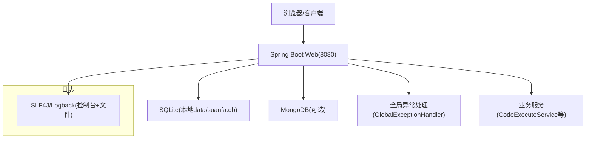
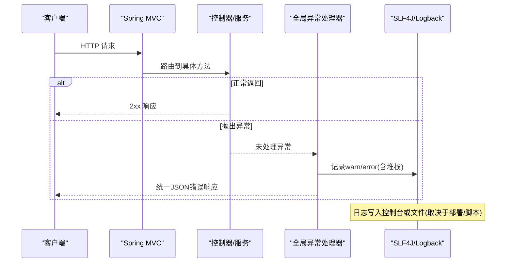
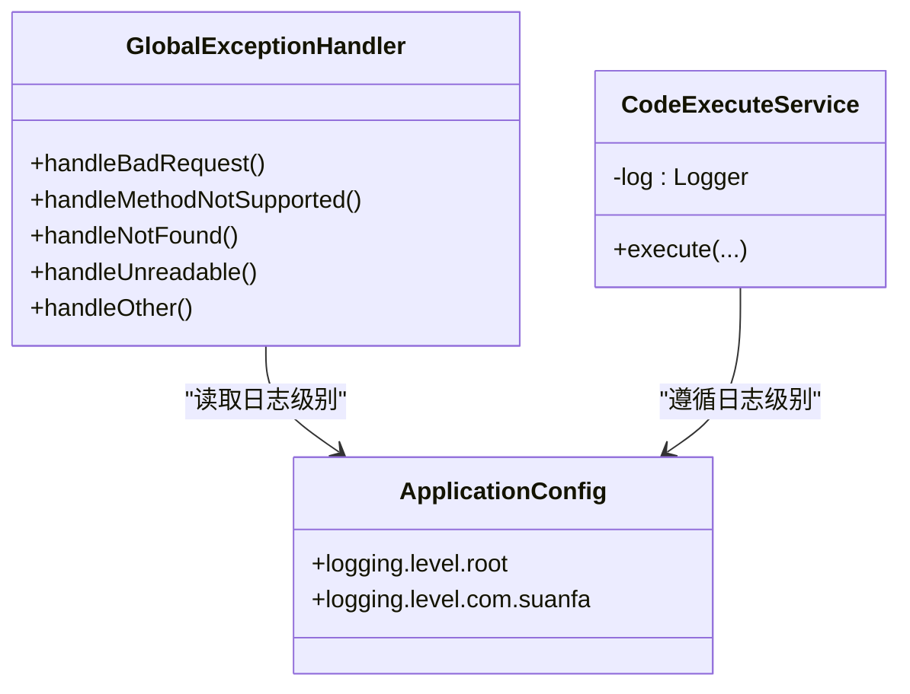

# 监控与日志

<cite>
**本文引用的文件**
- [application.yml](file://backend/src/main/resources/application.yml)
- [pom.xml](file://backend/pom.xml)
- [GlobalExceptionHandler.java](file://backend/src/main/java/com/suanfa/config/GlobalExceptionHandler.java)
- [CodeExecuteService.java](file://backend/src/main/java/com/suanfa/service/CodeExecuteService.java)
- [SuanfaApplication.java](file://backend/src/main/java/com/suanfa/SuanfaApplication.java)
- [dev-backend.sh](file://scripts/dev-backend.sh)
</cite>

## 目录
1. [简介](#简介)
2. [项目结构](#项目结构)
3. [核心组件](#核心组件)
4. [架构总览](#架构总览)
5. [详细组件分析](#详细组件分析)
6. [依赖关系分析](#依赖关系分析)
7. [性能考量](#性能考量)
8. [故障排查指南](#故障排查指南)
9. [结论](#结论)
10. [附录](#附录)

## 简介
本章节面向“可观测性”（监控、日志、错误追踪、告警）的落地现状与改进建议。当前后端基于 Spring Boot 3.2，默认使用 SLF4J + Logback 输出日志；未启用 Actuator 指标与健康检查端点；未集成 Prometheus/Grafana；前端暂无集中式日志采集。文档将基于仓库现有配置与代码进行说明，并给出在最小改动前提下增强可观测性的实践路径。

## 项目结构
- 后端：Spring Boot 应用，配置文件位于 resources/application.yml，包含服务器端口、数据源、Jackson 序列化以及 logging 级别设置。
- 前端：Vue 工程，logs 目录为空，无内置日志收集逻辑。
- 脚本：提供开发启动脚本，将日志重定向到 /tmp 下的日志文件，便于本地调试。

图表来源
- [application.yml:1-102](file://backend/src/main/resources/application.yml#L1-L102)
- [pom.xml:24-78](file://backend/pom.xml#L24-L78)
- [GlobalExceptionHandler.java:1-69](file://backend/src/main/java/com/suanfa/config/GlobalExceptionHandler.java#L1-L69)
- [CodeExecuteService.java:36-47](file://backend/src/main/java/com/suanfa/service/CodeExecuteService.java#L36-L47)

章节来源
- [application.yml:1-102](file://backend/src/main/resources/application.yml#L1-L102)
- [pom.xml:24-78](file://backend/pom.xml#L24-L78)

## 核心组件
- 日志框架：SLF4J + Logback（由 spring-boot-starter-web 引入），通过 application.yml 的 logging.level 控制根日志与应用包日志级别。
- 全局异常处理：统一捕获并返回结构化 JSON 错误响应，同时记录 warn/error 日志，便于问题定位。
- 业务服务日志：关键路径（如代码执行）使用 Logger 记录警告与结果，包含超时、进程信号等上下文信息。
- 启动与运行：主类确保数据目录存在后启动应用；开发脚本将标准输出/错误重定向到文件，便于查看启动与运行时日志。

章节来源
- [application.yml:98-102](file://backend/src/main/resources/application.yml#L98-L102)
- [GlobalExceptionHandler.java:21-69](file://backend/src/main/java/com/suanfa/config/GlobalExceptionHandler.java#L21-L69)
- [CodeExecuteService.java:36-47](file://backend/src/main/java/com/suanfa/service/CodeExecuteService.java#L36-L47)
- [SuanfaApplication.java:10-20](file://backend/src/main/java/com/suanfa/SuanfaApplication.java#L10-L20)
- [dev-backend.sh:1-45](file://scripts/dev-backend.sh#L1-L45)

## 架构总览
当前可观测性以“应用内日志”为主，缺少统一的指标暴露与健康检查端点。下图展示请求从进入 Web 层到异常处理的链路，以及日志输出位置。

图表来源
- [GlobalExceptionHandler.java:21-69](file://backend/src/main/java/com/suanfa/config/GlobalExceptionHandler.java#L21-L69)
- [application.yml:98-102](file://backend/src/main/resources/application.yml#L98-L102)

## 详细组件分析

### 日志配置与级别
- 日志级别：
  - 根日志级别设置为 info。
  - 应用包 com.suanfa 设置为 debug，便于开发期定位问题。
- 日志格式与轮转：
  - 当前未显式配置 logback-spring.xml，因此使用 Spring Boot 默认格式与输出策略（控制台输出）。
  - 生产环境可通过添加 logback 配置文件实现按天轮转、文件大小限制、保留天数等策略。
- 环境变量覆盖：
  - 可通过 logging.level.root 与 logging.level.com.suanfa 环境变量动态调整级别，无需重启。

章节来源
- [application.yml:98-102](file://backend/src/main/resources/application.yml#L98-L102)

### 应用监控（指标与健康检查）
- 指标暴露：
  - 当前 pom.xml 未引入 spring-boot-starter-actuator，因此没有 /actuator/metrics、/actuator/prometheus 等端点。
  - 如需对接 Prometheus，需引入 actuator 依赖并暴露相应端点。
- 健康检查：
  - 未自定义健康检查端点；若接入数据库/外部服务，可在后续增加自定义 HealthIndicator。
- 现状替代方案：
  - 开发阶段通过脚本启动并将日志输出到文件，结合 curl 探测接口可用性作为简易健康检查。

章节来源
- [pom.xml:24-78](file://backend/pom.xml#L24-L78)
- [dev-backend.sh:29-45](file://scripts/dev-backend.sh#L29-L45)

### 错误追踪与调试信息
- 统一异常处理：
  - 针对 404、405、参数解析失败等常见路由/参数异常，返回明确状态码与提示消息，避免被兜底 500 掩盖。
  - 对未知异常记录 error 日志并返回通用错误消息，保护敏感信息。
- 业务异常日志：
  - 代码执行服务在超时、进程被信号终止等场景下记录 warn 日志，并附带退出码与提示信息，便于定位执行环境问题。
- 调试建议：
  - 开发期保持 com.suanfa 为 debug，生产期回退至 info，配合结构化日志与必要上下文字段（如用户ID、请求ID）提升排障效率。

章节来源
- [GlobalExceptionHandler.java:21-69](file://backend/src/main/java/com/suanfa/config/GlobalExceptionHandler.java#L21-L69)
- [CodeExecuteService.java:162-191](file://backend/src/main/java/com/suanfa/service/CodeExecuteService.java#L162-L191)

### 告警配置
- 当前仓库未包含告警规则或通知机制（如邮件、企业微信、钉钉等）。
- 建议路线：
  - 先引入 Actuator 暴露指标与健康状态。
  - 将指标接入 Prometheus，并在 Grafana 中定义阈值告警规则。
  - 通过 Alertmanager 或第三方通知渠道发送告警。

[本节为概念性建议，不直接分析具体文件]

### 与 Prometheus/Grafana 的集成
- 现状：未引入 actuator 依赖，也未暴露 /actuator/prometheus。
- 集成步骤（建议）：
  - 引入 spring-boot-starter-actuator，暴露 metrics 与 prometheus 端点。
  - 部署 Prometheus 抓取 /actuator/prometheus。
  - 部署 Grafana 连接 Prometheus，创建仪表盘与告警规则。
  - 在生产环境开启健康检查端点，并结合外部探针进行可用性监控。

[本节为概念性建议，不直接分析具体文件]

## 依赖关系分析
- 日志与异常：
  - GlobalExceptionHandler 依赖 SLF4J Logger 记录异常上下文。
  - CodeExecuteService 同样使用 Logger 记录执行过程与异常。
- 配置与启动：
  - application.yml 控制日志级别与基础服务配置。
  - SuanfaApplication 负责初始化数据目录并启动应用。
  - dev-backend.sh 将日志重定向到文件，便于本地观察。

图表来源
- [GlobalExceptionHandler.java:1-69](file://backend/src/main/java/com/suanfa/config/GlobalExceptionHandler.java#L1-L69)
- [CodeExecuteService.java:36-47](file://backend/src/main/java/com/suanfa/service/CodeExecuteService.java#L36-L47)
- [application.yml:98-102](file://backend/src/main/resources/application.yml#L98-L102)

章节来源
- [GlobalExceptionHandler.java:1-69](file://backend/src/main/java/com/suanfa/config/GlobalExceptionHandler.java#L1-L69)
- [CodeExecuteService.java:36-47](file://backend/src/main/java/com/suanfa/service/CodeExecuteService.java#L36-L47)
- [application.yml:98-102](file://backend/src/main/resources/application.yml#L98-L102)

## 性能考量
- 日志级别：
  - 生产环境建议将 com.suanfa 回退至 info，减少 I/O 开销。
- 日志落盘：
  - 当前默认控制台输出；生产建议使用文件输出并按天轮转，避免磁盘写满。
- 指标采集：
  - 引入 Actuator 后，注意采样频率与指标数量，避免对高吞吐接口造成额外压力。
- 外部依赖：
  - MongoDB 与 SQLite 的连接池与超时参数会影响整体性能，建议在后续版本中根据负载调优。

[本节为通用指导，不直接分析具体文件]

## 故障排查指南
- 启动失败：
  - 查看脚本输出的日志文件（/tmp/suanfa-backend-*.log），确认端口占用、数据目录权限等问题。
- 接口报错：
  - 优先检查全局异常处理器返回的状态码与消息；必要时将 com.suanfa 临时设为 debug 获取更详细日志。
- 代码执行异常：
  - 关注 CodeExecuteService 中的 warn 日志，包括超时、进程被信号终止等信息，结合系统资源使用情况排查。
- 健康检查：
  - 当前无 /actuator/health；可用 curl 探测关键接口作为简易健康检查。

章节来源
- [dev-backend.sh:29-45](file://scripts/dev-backend.sh#L29-L45)
- [GlobalExceptionHandler.java:21-69](file://backend/src/main/java/com/suanfa/config/GlobalExceptionHandler.java#L21-L69)
- [CodeExecuteService.java:162-191](file://backend/src/main/java/com/suanfa/service/CodeExecuteService.java#L162-L191)

## 结论
当前系统具备基础的日志能力与统一异常处理，适合开发与测试阶段的快速排障。生产环境建议：
- 完善日志轮转与归档策略（logback 配置）。
- 引入 Actuator 暴露指标与健康检查端点，对接 Prometheus/Grafana。
- 建立告警规则与通知机制，形成闭环的可观测体系。
- 在前端侧补充必要的错误上报与性能埋点，提升端到端可观测性。

[本节为总结性内容，不直接分析具体文件]

## 附录
- 日志级别调整：
  - 通过 application.yml 或环境变量修改 logging.level.root 与 logging.level.com.suanfa。
- 开发期日志查看：
  - 使用 scripts/dev-backend.sh 启动，日志输出到 /tmp/suanfa-backend-*.log。
- 扩展方向：
  - 添加 logback-spring.xml 实现日志轮转。
  - 引入 spring-boot-starter-actuator 暴露 /actuator/metrics 与 /actuator/prometheus。
  - 在 Grafana 中创建仪表盘与告警规则，结合 Alertmanager 发送通知。

[本节为操作指引，不直接分析具体文件]