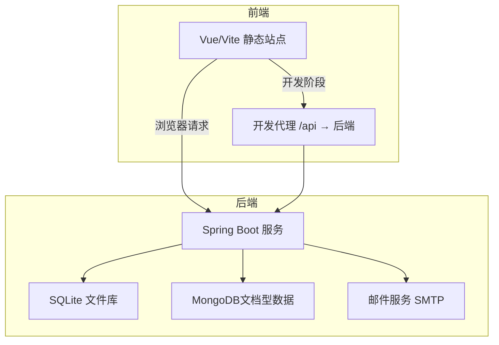
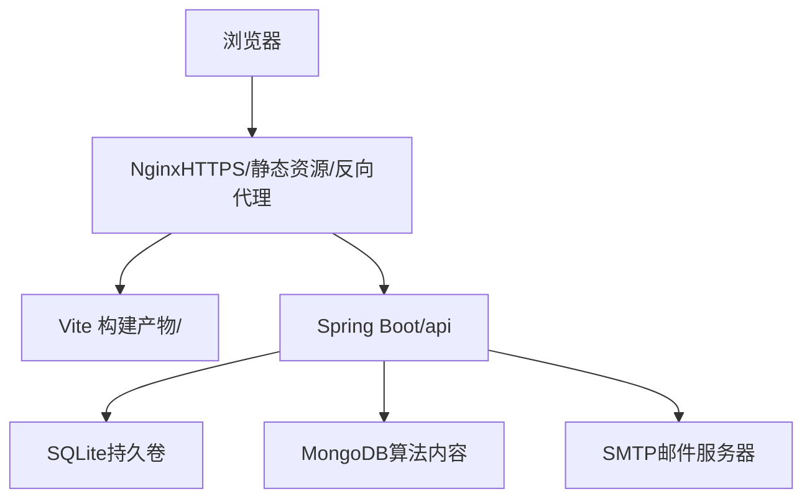
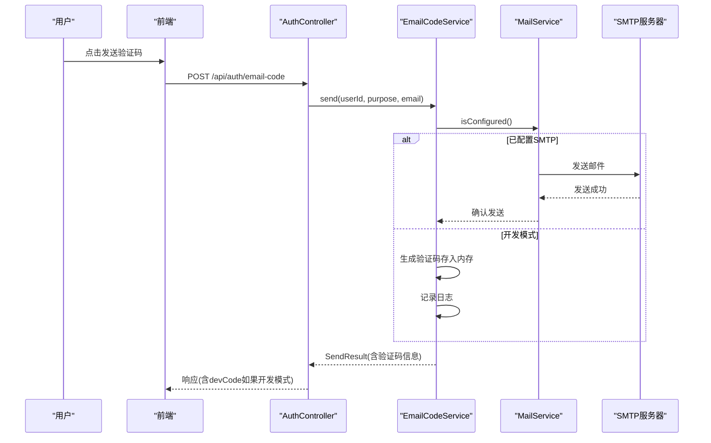
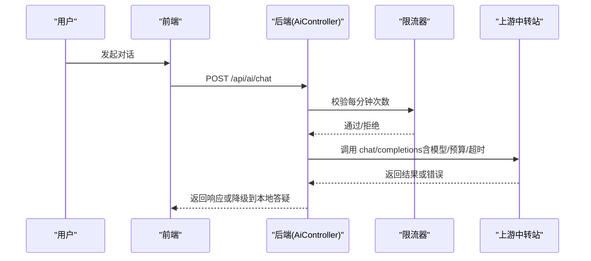
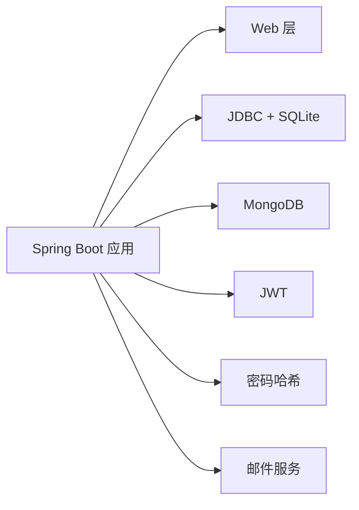

# 部署与配置

<cite>
**本文引用的文件**
- [backend/pom.xml](file://backend/pom.xml)
- [backend/src/main/resources/application.yml](file://backend/src/main/resources/application.yml)
- [backend/src/main/resources/schema.sql](file://backend/src/main/resources/schema.sql)
- [backend/src/main/java/com/suanfa/config/GlobalExceptionHandler.java](file://backend/src/main/java/com/suanfa/config/GlobalExceptionHandler.java)
- [backend/src/main/java/com/suanfa/config/AiProperties.java](file://backend/src/main/java/com/suanfa/config/AiProperties.java)
- [backend/src/main/java/com/suanfa/config/MailProperties.java](file://backend/src/main/java/com/suanfa/config/MailProperties.java)
- [backend/src/main/java/com/suanfa/service/MailService.java](file://backend/src/main/java/com/suanfa/service/MailService.java)
- [backend/src/main/java/com/suanfa/service/EmailCodeService.java](file://backend/src/main/java/com/suanfa/service/EmailCodeService.java)
- [backend/src/main/java/com/suanfa/controller/AuthController.java](file://backend/src/main/java/com/suanfa/controller/AuthController.java)
- [backend/src/main/java/com/suanfa/controller/AiController.java](file://backend/src/main/java/com/suanfa/controller/AiController.java)
- [suanfa_vue/package.json](file://suanfa_vue/package.json)
- [suanfa_vue/vite.config.js](file://suanfa_vue/vite.config.js)
- [scripts/dev-backend.sh](file://scripts/dev-backend.sh)
</cite>

## 更新摘要
**变更内容**
- 新增邮件服务器配置章节，详细说明SMTP设置、SSL/TLS选项、超时配置和开发模式切换
- 更新环境配置部分，增加邮件相关环境变量说明
- 完善生产部署清单，包含邮件服务配置要求
- 增强故障排除指南，涵盖邮件发送问题的排查方法

## 目录
1. [简介](#简介)
2. [项目结构](#项目结构)
3. [核心组件](#核心组件)
4. [架构总览](#架构总览)
5. [详细组件分析](#详细组件分析)
6. [依赖分析](#依赖分析)
7. [性能考虑](#性能考虑)
8. [故障排除指南](#故障排除指南)
9. [结论](#结论)
10. [附录](#附录)

## 简介
本文件面向运维与交付团队，提供生产环境部署与配置的完整参考。内容覆盖：
- 环境与差异化配置管理（开发、测试、生产）
- Docker 容器化与镜像构建建议、环境变量注入策略
- CI/CD 流水线设计（自动化构建、测试、部署）
- 性能调优（数据库连接池、缓存策略、静态资源优化）
- 监控日志、错误追踪、性能分析工具集成
- 故障排除与运维最佳实践

本项目后端基于 Spring Boot 3 + SQLite/MongoDB，前端为 Vite + Vue 3；默认通过 Vite 代理联调后端，生产环境通常将前端静态产物交由 Nginx 等反向代理托管，后端以独立进程运行。**新增邮件验证码功能**，支持修改密码时的邮箱验证流程。

## 项目结构
- 后端模块 backend：Spring Boot 应用，包含控制器、配置、数据模型与初始化脚本
- 前端模块 suanfa_vue：Vite 构建的静态站点，开发时通过 proxy 转发 /api 到后端
- 脚本 scripts：本地开发辅助脚本（如一键启动后端并健康检查）

**图表来源**
- [suanfa_vue/vite.config.js:10-20](file://suanfa_vue/vite.config.js#L10-L20)
- [backend/src/main/resources/application.yml:4-16](file://backend/src/main/resources/application.yml#L4-L16)

**章节来源**
- [suanfa_vue/vite.config.js:10-20](file://suanfa_vue/vite.config.js#L10-L20)
- [backend/src/main/resources/application.yml:4-16](file://backend/src/main/resources/application.yml#L4-L16)

## 核心组件
- 后端运行时与依赖：Spring Boot 3、JDBC + SQLite、MongoDB、JWT、安全加密、**邮件服务**
- 配置中心：application.yml + 环境变量（AI 相关关键参数通过环境变量注入）
- 数据层：SQLite 用于关系型数据（用户、进度、笔记、评论、训练记录），MongoDB 用于算法详情内容
- **邮件服务**：基于 JavaMailSenderImpl 的 SMTP 客户端，支持 SSL/TLS 加密连接
- 异常处理：全局统一 JSON 错误响应，避免 4xx/5xx 被吞掉
- AI 能力：OpenAI 兼容中转站、多上游/降级链、限流、管理员白名单、页面热配置

**章节来源**
- [backend/pom.xml:24-78](file://backend/pom.xml#L24-L78)
- [backend/src/main/resources/application.yml:18-96](file://backend/src/main/resources/application.yml#L18-L96)
- [backend/src/main/resources/schema.sql:5-76](file://backend/src/main/resources/schema.sql#L5-L76)
- [backend/src/main/java/com/suanfa/config/GlobalExceptionHandler.java:21-68](file://backend/src/main/java/com/suanfa/config/GlobalExceptionHandler.java#L21-L68)
- [backend/src/main/java/com/suanfa/config/AiProperties.java:29-56](file://backend/src/main/java/com/suanfa/config/AiProperties.java#L29-L56)
- [backend/src/main/java/com/suanfa/config/MailProperties.java:1-158](file://backend/src/main/java/com/suanfa/config/MailProperties.java#L1-L158)

## 架构总览
生产部署推荐拓扑：
- 前端静态资源由 Nginx/Caddy 托管，开启 Gzip/Brotli、长缓存与 HTTP/2
- 后端以单进程或容器化方式运行，监听固定端口，暴露 /api
- 数据库 SQLite 使用持久卷挂载；MongoDB 使用外部实例或容器
- **邮件服务**：配置 SMTP 服务器用于发送验证码邮件
- 可选：在 Nginx 层做 HTTPS、CORS、限流、访问日志

[此图为概念性架构图，不直接映射具体源码文件]

## 详细组件分析

### 环境配置与环境变量
- 后端配置文件 application.yml 定义了服务器端口、数据源、MongoDB URI、SQL 初始化模式、Jackson 行为以及 AI 相关配置项
- 敏感与易变参数通过环境变量注入（例如 AI_BASE_URL、AI_API_KEY、AI_MODEL、AI_FALLBACK_MODELS、AI_TIMEOUT_SECONDS、AI_MAX_TOKENS、AI_TEMPERATURE、AI_KNOWLEDGE、AI_RATE_PER_MINUTE、AI_ADMIN_USERNAMES、CODE_COMPILE_TIMEOUT、CODE_RUN_TIMEOUT、CODE_RATE_PER_MINUTE）
- **邮件服务环境变量**：MAIL_HOST、MAIL_PORT、MAIL_USERNAME、MAIL_PASSWORD、MAIL_FROM、MAIL_SSL、MAIL_TIMEOUT_SECONDS、MAIL_CODE_TTL、MAIL_RESEND_COOLDOWN、MAIL_MAX_ATTEMPTS、MAIL_DEV_ECHO_CODE
- 生产环境必须覆盖 JWT secret 与 CORS allowed-origins，禁止使用开发默认值

建议的环境分层策略：
- 开发：本地 .env 或命令行参数注入，允许宽松 CORS，可启用 dev-echo-code 方便调试
- 测试：CI 中注入测试用 AI 中转站地址与令牌，限制速率，禁用邮件发送
- 生产：严格限定 allowed-origins、强密钥、最小权限、关闭调试日志级别，**配置真实 SMTP 服务**

**章节来源**
- [backend/src/main/resources/application.yml:1-16](file://backend/src/main/resources/application.yml#L1-L16)
- [backend/src/main/resources/application.yml:18-96](file://backend/src/main/resources/application.yml#L18-L96)
- [backend/src/main/resources/application.yml:28-45](file://backend/src/main/resources/application.yml#L28-L45)

### 邮件服务配置
**新增** 邮件验证码功能用于修改密码场景，支持完整的 SMTP 配置和多种连接模式：

#### 基础配置
- **host**: SMTP 服务器地址（留空 = 不接入 SMTP，进入开发模式）
- **port**: SMTP 端口（默认 465，QQ/163 常用）
- **username**: 登录账号（多数服务商就是发件邮箱本身）
- **password**: 登录密码/授权码（QQ、163 等要填「SMTP 授权码」而不是登录密码）
- **from**: 发件人（留空则取 username）

#### 安全连接选项
- **ssl**: true = 隐式 SSL（常见 465）；false = 明文 + STARTTLS（常见 25/587）
- **starttls**: 明文连接时是否启用 STARTTLS（ssl=false 才生效）
- **timeout-seconds**: 连接超时时间（秒），默认 10 秒

#### 验证码控制
- **code-ttl-seconds**: 验证码有效期（秒），默认 600 秒（10分钟）
- **resend-cooldown-seconds**: 同一用户+邮箱的重发间隔（秒），默认 60 秒
- **max-attempts**: 单个验证码最多校验尝试次数，超过即作废，默认 5 次
- **dev-echo-code**: 未配置 SMTP 时把验证码随接口响应回传前端（仅本地开发便利；生产务必置 false）

#### 开发模式特性
当 host 为空时，系统自动进入开发模式：
- 验证码只写进日志，不真正发送邮件
- 配合 dev-echo-code=true，可将验证码随响应返回前端
- 便于本地无需真实邮箱也能跑通「修改密码 → 邮箱验证码」整条链路

**章节来源**
- [backend/src/main/resources/application.yml:28-45](file://backend/src/main/resources/application.yml#L28-L45)
- [backend/src/main/java/com/suanfa/config/MailProperties.java:17-44](file://backend/src/main/java/com/suanfa/config/MailProperties.java#L17-L44)
- [backend/src/main/java/com/suanfa/service/MailService.java:15-36](file://backend/src/main/java/com/suanfa/service/MailService.java#L15-L36)

### 数据库与初始化
- SQLite 作为内置数据库，路径由 datasource.url 指定，配合 schema.sql 自动建表
- MongoDB 用于存储算法详情等文档型数据，URI 通过配置注入
- 应用设置表 app_settings 支持运行时配置（如 AI 中转站 providers），保存即热生效

生产注意事项：
- 将 SQLite 数据目录挂载为持久卷，避免容器重建丢失数据
- 定期备份 SQLite 与 MongoDB
- 若并发写入增长，可评估迁移至 PostgreSQL/MySQL

**章节来源**
- [backend/src/main/resources/application.yml:4-14](file://backend/src/main/resources/application.yml#L4-L14)
- [backend/src/main/resources/schema.sql:5-76](file://backend/src/main/resources/schema.sql#L5-L76)

### 安全与认证
- JWT 签名密钥需在生产环境通过环境变量强制覆盖
- CORS 在生产应显式配置允许的域名，避免通配符
- 管理员白名单可通过 AI_ADMIN_USERNAMES 控制页面级配置权限
- **邮件验证码安全**：验证码保存在进程内内存中，重启后失效，防止重放攻击

**章节来源**
- [backend/src/main/resources/application.yml:18-49](file://backend/src/main/resources/application.yml#L18-L49)
- [backend/src/main/java/com/suanfa/service/EmailCodeService.java:15-24](file://backend/src/main/java/com/suanfa/service/EmailCodeService.java#L15-L24)

### 邮件验证码工作流程
**新增** 邮件验证码功能的工作流程：

**图表来源**
- [backend/src/main/java/com/suanfa/controller/AuthController.java:87-116](file://backend/src/main/java/com/suanfa/controller/AuthController.java#L87-L116)
- [backend/src/main/java/com/suanfa/service/EmailCodeService.java:86-104](file://backend/src/main/java/com/suanfa/service/EmailCodeService.java#L86-L104)
- [backend/src/main/java/com/suanfa/service/MailService.java:43-82](file://backend/src/main/java/com/suanfa/service/MailService.java#L43-L82)

**章节来源**
- [backend/src/main/java/com/suanfa/controller/AuthController.java:87-142](file://backend/src/main/java/com/suanfa/controller/AuthController.java#L87-L142)
- [backend/src/main/java/com/suanfa/service/EmailCodeService.java:15-175](file://backend/src/main/java/com/suanfa/service/EmailCodeService.java#L15-L175)
- [backend/src/main/java/com/suanfa/service/MailService.java:15-109](file://backend/src/main/java/com/suanfa/service/MailService.java#L15-L109)

### AI 助教与中转站
- 支持 OpenAI 兼容接口，可配置主模型与降级链（fallback-models）
- 支持多中转站 providers-json，优先级高于旧写法
- 限流 rate-per-minute、超时 timeout-seconds、最大 token max-tokens、温度 temperature
- 管理员可在页面修改中转站配置并热生效，无需重启

**图表来源**
- [backend/src/main/java/com/suanfa/controller/AiController.java:57-81](file://backend/src/main/java/com/suanfa/controller/AiController.java#L57-L81)
- [backend/src/main/resources/application.yml:28-49](file://backend/src/main/resources/application.yml#L28-L49)
- [backend/src/main/java/com/suanfa/config/AiProperties.java:29-56](file://backend/src/main/java/com/suanfa/config/AiProperties.java#L29-L56)

**章节来源**
- [backend/src/main/resources/application.yml:28-96](file://backend/src/main/resources/application.yml#L28-L96)
- [backend/src/main/java/com/suanfa/config/AiProperties.java:29-56](file://backend/src/main/java/com/suanfa/config/AiProperties.java#L29-L56)
- [backend/src/main/java/com/suanfa/controller/AiController.java:57-81](file://backend/src/main/java/com/suanfa/controller/AiController.java#L57-L81)

### 前端开发与代理
- 开发阶段通过 vite.config.js 将 /api 代理到 http://localhost:8080
- 生产环境不再需要该代理，静态资源由 Nginx 托管，API 走后端域名

**章节来源**
- [suanfa_vue/vite.config.js:10-20](file://suanfa_vue/vite.config.js#L10-L20)

### 本地开发脚本
- scripts/dev-backend.sh 自动加载 backend/.env，启动 Spring Boot 并轮询健康端点 /api/ai/status，便于快速验证 AI 配置

**章节来源**
- [scripts/dev-backend.sh:1-46](file://scripts/dev-backend.sh#L1-L46)

## 依赖分析
后端依赖概览：
- Web：spring-boot-starter-web
- 数据：spring-boot-starter-jdbc + sqlite-jdbc；spring-boot-starter-data-mongodb
- **邮件：spring-boot-starter-mail（用于邮箱验证码功能）**
- 安全：spring-security-crypto
- 认证：jjwt 系列

**图表来源**
- [backend/pom.xml:24-78](file://backend/pom.xml#L24-L78)

**章节来源**
- [backend/pom.xml:24-78](file://backend/pom.xml#L24-L78)

## 性能考虑
- 数据库连接池
  - 当前使用 JDBC + SQLite，适合低并发场景；若并发提升，建议切换至 PostgreSQL/MySQL 并配置 HikariCP 连接池大小、超时与空闲回收
  - SQLite 写锁粒度较大，高并发写入需评估分库或迁移
- 缓存策略
  - 对热点只读数据（如算法元数据、公共配置）可引入 Redis/内存缓存，减少下游压力
  - **邮件验证码缓存**：验证码存储在进程内 ConcurrentHashMap 中，重启后失效，避免持久化带来的安全风险
  - 前端静态资源启用 CDN 与长缓存
- 静态资源优化
  - 构建产物开启压缩（Gzip/Brotli）、拆分 chunk、Tree-shaking
  - Nginx 开启 HTTP/2、合理设置 Cache-Control
- 线程与超时
  - AI 流式接口使用专用线程池，注意在高并发下队列满会快速失败而非排队，避免雪崩
  - 合理设置 AI 超时与最大 token，防止慢请求拖垮线程
  - **邮件发送超时**：配置合理的 timeout-seconds，避免 SMTP 连接阻塞影响用户体验

[本节为通用性能建议，不直接分析具体代码文件]

## 故障排除指南
- 全局异常处理
  - 方法不支持（405）、接口不存在（404）、请求体解析失败（400）均返回明确状态码与消息，避免被兜底 500 掩盖
- 常见排查步骤
  - 确认后端端口与 CORS 配置是否匹配前端域名
  - 检查 AI 中转站连通性与令牌，必要时使用页面「测试连接」功能
  - 查看后端日志输出位置（开发脚本默认输出到 /tmp/suanfa-backend-<port>.log）
  - 确认 SQLite 数据目录可写且未被占用
- **邮件服务故障排查**
  - 检查 SMTP 服务器地址、端口、用户名、密码是否正确
  - 确认 SSL/TLS 配置与 SMTP 服务器要求匹配（465端口通常用SSL，25/587端口用STARTTLS）
  - 查看邮件发送失败的详细日志，包含目标邮箱、SMTP服务器、错误信息
  - 开发模式下检查 dev-echo-code 配置，确认验证码是否正确返回
  - 验证码冷却时间检查：确保 resend-cooldown-seconds 设置合理
- 日志级别
  - 默认 root 为 info，com.suanfa 包 debug；生产建议收紧为 warn/error 并集中采集

**章节来源**
- [backend/src/main/java/com/suanfa/config/GlobalExceptionHandler.java:21-68](file://backend/src/main/java/com/suanfa/config/GlobalExceptionHandler.java#L21-L68)
- [backend/src/main/resources/application.yml:98-102](file://backend/src/main/resources/application.yml#L98-L102)
- [scripts/dev-backend.sh:29-45](file://scripts/dev-backend.sh#L29-L45)
- [backend/src/main/java/com/suanfa/service/MailService.java:77-81](file://backend/src/main/java/com/suanfa/service/MailService.java#L77-L81)

## 结论
本项目具备清晰的后端配置与可扩展的 AI 能力，适合以「前后端分离 + 反向代理」的方式部署生产。通过环境变量实现敏感与易变配置解耦，结合 SQLite/MongoDB 的数据分层满足学习与内容展示需求。**新增的邮件验证码功能**为修改密码提供了安全的身份验证机制，支持灵活的 SMTP 配置和开发模式。建议在流量增长时逐步引入连接池、缓存与更健壮的数据库方案，并完善监控与告警体系。

[本节为总结性内容，不直接分析具体代码文件]

## 附录

### 生产部署清单（建议）
- 镜像构建
  - 后端：基于官方 JDK 镜像，复制编译产物，暴露端口，设置环境变量
  - 前端：vite build 生成静态资源，放入 Nginx 镜像
- 容器编排
  - 使用 docker-compose 或 Kubernetes 编排：Nginx、后端、MongoDB、（可选）Redis
  - 将 SQLite 数据目录挂载为持久卷
- 环境变量管理
  - 通过平台 Secret/ConfigMap 注入敏感信息（JWT secret、AI 令牌、**邮件服务凭据**等）
  - 区分 dev/test/prod 的 AI_BASE_URL、AI_API_KEY、AI_MODEL、AI_FALLBACK_MODELS、AI_TIMEOUT_SECONDS、AI_MAX_TOKENS、AI_TEMPERATURE、AI_KNOWLEDGE、AI_RATE_PER_MINUTE、AI_ADMIN_USERNAMES、CODE_COMPILE_TIMEOUT、CODE_RUN_TIMEOUT、CODE_RATE_PER_MINUTE
  - **邮件服务环境变量**：MAIL_HOST、MAIL_PORT、MAIL_USERNAME、MAIL_PASSWORD、MAIL_FROM、MAIL_SSL、MAIL_TIMEOUT_SECONDS、MAIL_CODE_TTL、MAIL_RESEND_COOLDOWN、MAIL_MAX_ATTEMPTS、MAIL_DEV_ECHO_CODE
- CI/CD 流水线
  - 触发条件：push/PR
  - 步骤：安装依赖 → 单元测试 → 构建前端 → 构建后端镜像 → 推送镜像 → 部署到目标环境（灰度/蓝绿）
  - 质量门禁：代码扫描、依赖漏洞扫描、冒烟测试
- 监控与日志
  - 接入结构化日志收集（如 ELK/Loki），统一采集后端与应用日志
  - 指标采集：JVM 指标、HTTP 请求量/延迟/错误率、AI 上游调用成功率、**邮件发送成功率**
  - 告警：错误率突增、AI 上游不可用、数据库连接失败、磁盘空间不足、**邮件服务连接失败**
- 备份与恢复
  - 定时备份 SQLite 与 MongoDB
  - 制定回滚策略与演练计划
- **邮件服务配置示例**
  - QQ邮箱：host=smtp.qq.com, port=465, ssl=true, password=授权码
  - 163邮箱：host=smtp.163.com, port=465, ssl=true, password=授权码
  - Gmail：host=smtp.gmail.com, port=465, ssl=true, password=应用专用密码
  - 企业邮箱：根据供应商文档配置相应参数

[本节为通用运维建议，不直接分析具体代码文件]