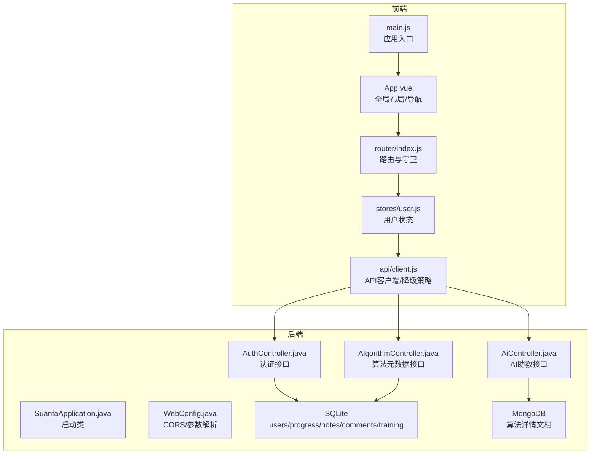
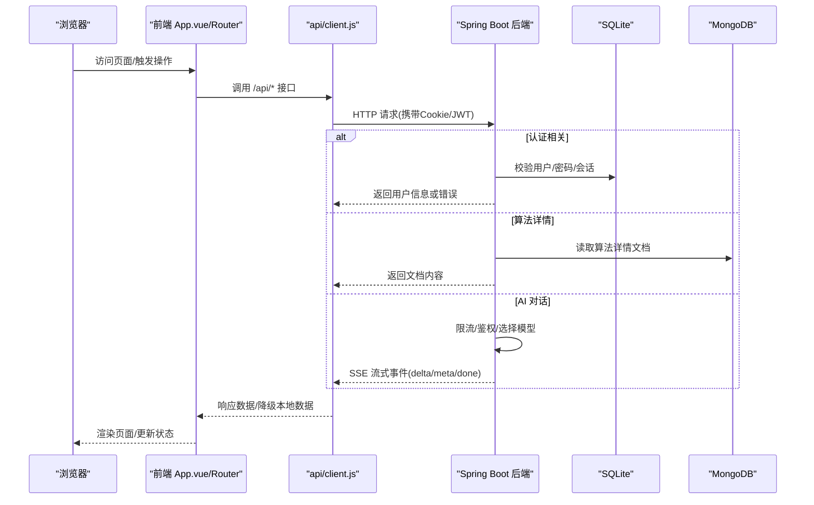
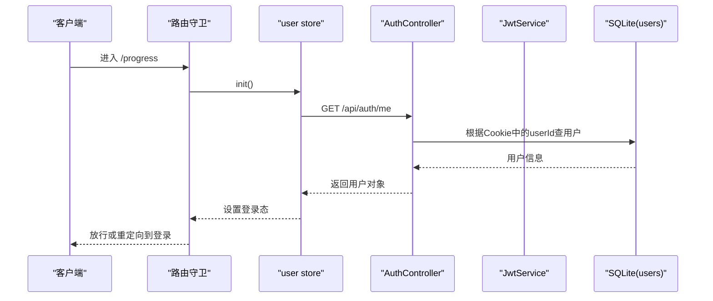
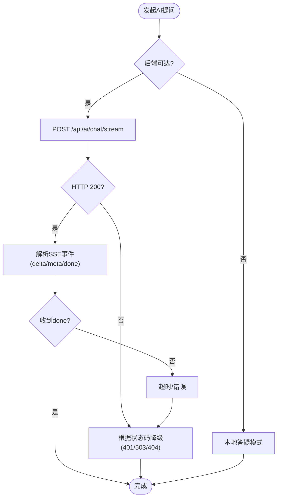
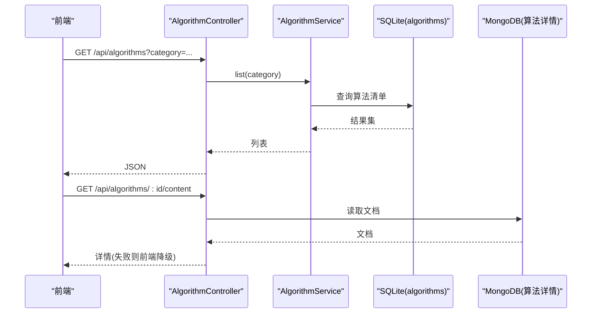
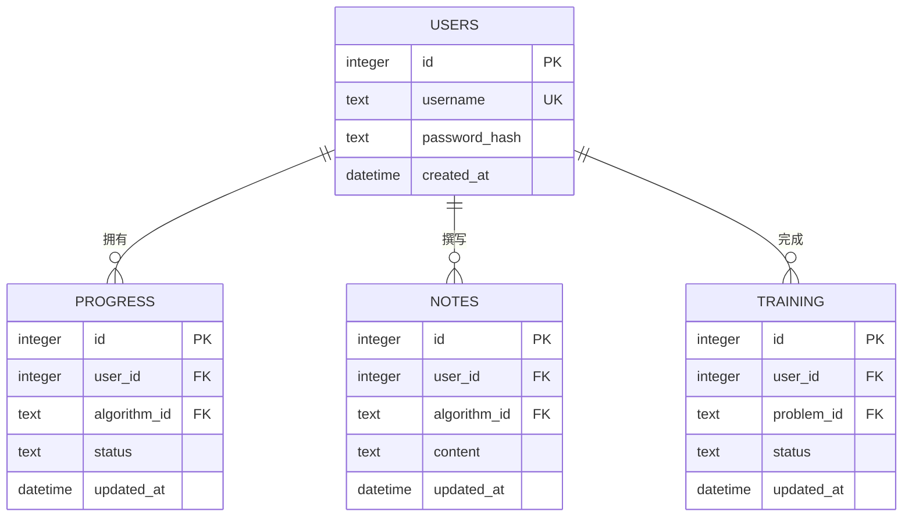
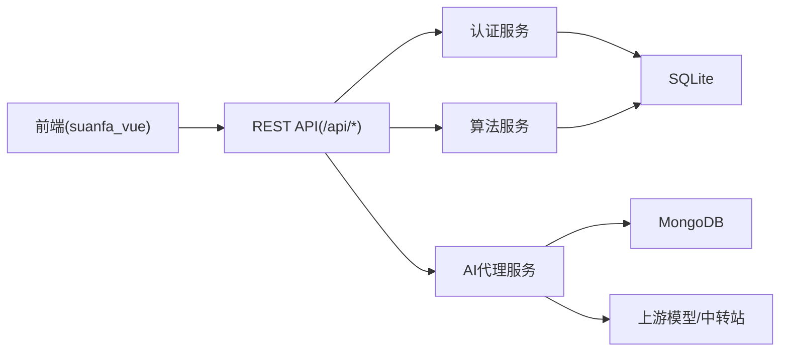

# 项目概述

<cite>
**本文引用的文件**
- [backend/pom.xml](file://backend/pom.xml)
- [backend/src/main/resources/application.yml](file://backend/src/main/resources/application.yml)
- [backend/src/main/java/com/suanfa/SuanfaApplication.java](file://backend/src/main/java/com/suanfa/SuanfaApplication.java)
- [backend/src/main/java/com/suanfa/config/WebConfig.java](file://backend/src/main/java/com/suanfa/config/WebConfig.java)
- [backend/src/main/resources/schema.sql](file://backend/src/main/resources/schema.sql)
- [backend/src/main/java/com/suanfa/controller/AuthController.java](file://backend/src/main/java/com/suanfa/controller/AuthController.java)
- [backend/src/main/java/com/suanfa/controller/AiController.java](file://backend/src/main/java/com/suanfa/controller/AiController.java)
- [backend/src/main/java/com/suanfa/controller/AlgorithmController.java](file://backend/src/main/java/com/suanfa/controller/AlgorithmController.java)
- [suanfa_vue/package.json](file://suanfa_vue/package.json)
- [suanfa_vue/src/main.js](file://suanfa_vue/src/main.js)
- [suanfa_vue/src/App.vue](file://suanfa_vue/src/App.vue)
- [suanfa_vue/src/router/index.js](file://suanfa_vue/src/router/index.js)
- [suanfa_vue/src/stores/user.js](file://suanfa_vue/src/stores/user.js)
- [suanfa_vue/src/api/client.js](file://suanfa_vue/src/api/client.js)
</cite>

## 目录
1. [简介](#简介)
2. [项目结构](#项目结构)
3. [核心组件](#核心组件)
4. [架构总览](#架构总览)
5. [详细组件分析](#详细组件分析)
6. [依赖关系分析](#依赖关系分析)
7. [性能与可扩展性](#性能与可扩展性)
8. [故障排查指南](#故障排查指南)
9. [结论](#结论)
10. [附录：快速开始](#附录：快速开始)

## 简介
本项目是一个面向算法学习的“可视化学习 + AI智能助教 + 用户进度跟踪”的全栈应用。前端采用 Vue 3 + Vite，提供丰富的算法分类、可视化演示、代码运行与训练；后端基于 Spring Boot 提供 REST API，使用 SQLite 存储用户、进度、笔记等结构化数据，使用 MongoDB 存储算法详情文档型内容；同时集成 AI 助教能力（OpenAI 兼容接口），支持流式对话、限流、降级与管理员配置中转站。整体采用前后端分离架构，通过统一的 /api 网关交互，具备离线回退能力，便于在缺少后端时仍可浏览与学习。

## 项目结构
- 后端 backend：Spring Boot 工程，包含控制器、服务、安全、配置、数据库初始化脚本与资源。
- 前端 suanfa_vue：Vue 3 + Vite 单页应用，按功能模块组织页面与组件，集中路由与状态管理。
- 根目录 scripts：开发辅助脚本（如后端启动、导入视频、Mock OpenAI 等）。

图表来源
- [suanfa_vue/src/main.js:1-12](file://suanfa_vue/src/main.js#L1-L12)
- [suanfa_vue/src/App.vue:1-120](file://suanfa_vue/src/App.vue#L1-L120)
- [suanfa_vue/src/router/index.js:1-124](file://suanfa_vue/src/router/index.js#L1-L124)
- [suanfa_vue/src/stores/user.js:1-36](file://suanfa_vue/src/stores/user.js#L1-L36)
- [suanfa_vue/src/api/client.js:1-120](file://suanfa_vue/src/api/client.js#L1-L120)
- [backend/src/main/java/com/suanfa/SuanfaApplication.java:1-22](file://backend/src/main/java/com/suanfa/SuanfaApplication.java#L1-L22)
- [backend/src/main/java/com/suanfa/config/WebConfig.java:1-46](file://backend/src/main/java/com/suanfa/config/WebConfig.java#L1-L46)
- [backend/src/main/java/com/suanfa/controller/AuthController.java:1-94](file://backend/src/main/java/com/suanfa/controller/AuthController.java#L1-L94)
- [backend/src/main/java/com/suanfa/controller/AiController.java:1-120](file://backend/src/main/java/com/suanfa/controller/AiController.java#L1-L120)
- [backend/src/main/java/com/suanfa/controller/AlgorithmController.java:1-32](file://backend/src/main/java/com/suanfa/controller/AlgorithmController.java#L1-L32)

章节来源
- [backend/pom.xml:1-89](file://backend/pom.xml#L1-L89)
- [backend/src/main/resources/application.yml:1-102](file://backend/src/main/resources/application.yml#L1-L102)
- [backend/src/main/resources/schema.sql:1-77](file://backend/src/main/resources/schema.sql#L1-L77)
- [suanfa_vue/package.json:1-23](file://suanfa_vue/package.json#L1-L23)

## 核心组件
- 认证与会话：基于 JWT + httpOnly Cookie，提供注册、登录、登出与当前用户查询。
- 算法元数据与详情：算法清单与详情分别由 SQLite 与 MongoDB 承载，前端优先请求后端，失败自动降级到本地数据。
- AI 助教：统一代理上游模型/中转站，支持一次性与 SSE 流式对话、限流、熔断与降级；管理员可在线配置多中转站与模型可见性。
- 学习进度与笔记：记录用户对算法的学习状态、评论、笔记与刷题进度，支持离线回退到 localStorage。
- 代码工作台：后端提供编译/执行沙箱能力，前端按需调用。

章节来源
- [backend/src/main/java/com/suanfa/controller/AuthController.java:1-94](file://backend/src/main/java/com/suanfa/controller/AuthController.java#L1-L94)
- [backend/src/main/java/com/suanfa/controller/AiController.java:1-375](file://backend/src/main/java/com/suanfa/controller/AiController.java#L1-L375)
- [backend/src/main/java/com/suanfa/controller/AlgorithmController.java:1-32](file://backend/src/main/java/com/suanfa/controller/AlgorithmController.java#L1-L32)
- [backend/src/main/resources/schema.sql:1-77](file://backend/src/main/resources/schema.sql#L1-L77)
- [suanfa_vue/src/api/client.js:1-725](file://suanfa_vue/src/api/client.js#L1-L725)

## 架构总览
系统采用前后端分离的 RESTful 架构：
- 前端：Vue 3 + Vite，Pinia 状态管理，vue-router 路由控制，组件化页面与可视化实现。
- 后端：Spring Boot 3.2，JDBC + SQLite 用于强一致的用户与进度数据；MongoDB 用于算法详情文档；JWT 鉴权；SSE 流式输出；全局异常处理与 CORS 配置。
- 数据层：SQLite 负责结构化表（用户、进度、笔记、评论、训练）；MongoDB 负责算法详情文档（sections/tabs/videos）。
- 集成点：/api 统一网关，前端通过 api/client.js 发起请求并实现“后端优先、本地兜底”的降级策略。

图表来源
- [suanfa_vue/src/App.vue:1-120](file://suanfa_vue/src/App.vue#L1-L120)
- [suanfa_vue/src/router/index.js:1-124](file://suanfa_vue/src/router/index.js#L1-L124)
- [suanfa_vue/src/api/client.js:1-120](file://suanfa_vue/src/api/client.js#L1-L120)
- [backend/src/main/java/com/suanfa/controller/AuthController.java:1-94](file://backend/src/main/java/com/suanfa/controller/AuthController.java#L1-L94)
- [backend/src/main/java/com/suanfa/controller/AiController.java:1-120](file://backend/src/main/java/com/suanfa/controller/AiController.java#L1-L120)
- [backend/src/main/resources/schema.sql:1-77](file://backend/src/main/resources/schema.sql#L1-L77)

## 详细组件分析

### 认证与会话流程
- 注册/登录：后端生成 JWT 并通过 httpOnly Cookie 下发；前端通过 Pinia store 维护登录态。
- 会话恢复：路由守卫在进入受保护页面前先恢复会话，未登录则重定向至登录页。
- 跨域：后端开启 CORS，允许 credentials 与指定来源模式。

图表来源
- [suanfa_vue/src/router/index.js:100-124](file://suanfa_vue/src/router/index.js#L100-L124)
- [suanfa_vue/src/stores/user.js:1-36](file://suanfa_vue/src/stores/user.js#L1-L36)
- [backend/src/main/java/com/suanfa/controller/AuthController.java:1-94](file://backend/src/main/java/com/suanfa/controller/AuthController.java#L1-L94)
- [backend/src/main/resources/schema.sql:18-23](file://backend/src/main/resources/schema.sql#L18-L23)

章节来源
- [backend/src/main/java/com/suanfa/controller/AuthController.java:1-94](file://backend/src/main/java/com/suanfa/controller/AuthController.java#L1-L94)
- [backend/src/main/java/com/suanfa/config/WebConfig.java:1-46](file://backend/src/main/java/com/suanfa/config/WebConfig.java#L1-L46)
- [suanfa_vue/src/router/index.js:1-124](file://suanfa_vue/src/router/index.js#L1-L124)
- [suanfa_vue/src/stores/user.js:1-36](file://suanfa_vue/src/stores/user.js#L1-L36)

### AI 助教（流式对话与降级）
- 能力探测：/api/ai/status 返回是否已配置、可用模型清单、默认模型与限流策略。
- 对话接口：/api/ai/chat 一次性返回；/api/ai/chat/stream 使用 SSE 推送 delta/meta/reasoning/done/error。
- 限流与降级：按用户每分钟次数限制；上游不可用或未产生任何输出时退还额度；前端在无后端或 503 时降级为本地答疑。
- 管理员能力：可查看/测试上游真实模型、在线配置多中转站与模型可见性。

图表来源
- [backend/src/main/java/com/suanfa/controller/AiController.java:83-118](file://backend/src/main/java/com/suanfa/controller/AiController.java#L83-L118)
- [backend/src/main/java/com/suanfa/controller/AiController.java:199-313](file://backend/src/main/java/com/suanfa/controller/AiController.java#L199-L313)
- [suanfa_vue/src/api/client.js:350-570](file://suanfa_vue/src/api/client.js#L350-L570)

章节来源
- [backend/src/main/java/com/suanfa/controller/AiController.java:1-375](file://backend/src/main/java/com/suanfa/controller/AiController.java#L1-L375)
- [backend/src/main/resources/application.yml:18-96](file://backend/src/main/resources/application.yml#L18-L96)
- [suanfa_vue/src/api/client.js:350-725](file://suanfa_vue/src/api/client.js#L350-L725)

### 算法元数据与详情
- 元数据：/api/algorithms 提供分类列表与单项查询，数据来自 SQLite algorithms 表。
- 详情：/api/algorithms/:id/content 从 MongoDB 获取文档型详情（sections/tabs/videos），前端在失败时回退到本地 data 数据。

图表来源
- [backend/src/main/java/com/suanfa/controller/AlgorithmController.java:1-32](file://backend/src/main/java/com/suanfa/controller/AlgorithmController.java#L1-L32)
- [backend/src/main/resources/schema.sql:5-16](file://backend/src/main/resources/schema.sql#L5-L16)
- [backend/src/main/resources/application.yml:8-10](file://backend/src/main/resources/application.yml#L8-L10)
- [suanfa_vue/src/api/client.js:49-105](file://suanfa_vue/src/api/client.js#L49-L105)

章节来源
- [backend/src/main/java/com/suanfa/controller/AlgorithmController.java:1-32](file://backend/src/main/java/com/suanfa/controller/AlgorithmController.java#L1-L32)
- [backend/src/main/resources/schema.sql:1-77](file://backend/src/main/resources/schema.sql#L1-L77)
- [backend/src/main/resources/application.yml:8-10](file://backend/src/main/resources/application.yml#L8-L10)
- [suanfa_vue/src/api/client.js:49-105](file://suanfa_vue/src/api/client.js#L49-L105)

### 学习进度、笔记与训练
- 进度：记录每个用户对每个算法的状态（学习中/已掌握/收藏），支持更新与查询。
- 笔记：Markdown 内容，支持保存、删除；后端不可用时落盘 localStorage。
- 训练：刷题完成状态持久化；同样支持离线回退。

图表来源
- [backend/src/main/resources/schema.sql:18-77](file://backend/src/main/resources/schema.sql#L18-L77)
- [suanfa_vue/src/api/client.js:137-324](file://suanfa_vue/src/api/client.js#L137-L324)

章节来源
- [backend/src/main/resources/schema.sql:18-77](file://backend/src/main/resources/schema.sql#L18-L77)
- [suanfa_vue/src/api/client.js:137-324](file://suanfa_vue/src/api/client.js#L137-L324)

## 依赖关系分析
- 技术栈选择原因
  - Spring Boot：生态成熟、内嵌服务器、易于集成 JDBC/MongoDB/JWT/SSE。
  - Vue 3 + Vite：现代前端工具链，组件化、组合式 API、热更新快。
  - SQLite：轻量、零配置、适合单机/小规模部署与快速迭代。
  - MongoDB：灵活文档模型，适合算法详情（sections/tabs/videos）的多变结构。
- 耦合与内聚
  - 控制器按领域划分（认证、AI、算法、进度、笔记、训练），职责清晰。
  - 前端通过统一 client.js 抽象网络层，降低业务组件对后端的直接耦合。
- 外部依赖
  - 上游 AI 模型/中转站：通过环境变量与运行时配置注入，支持多 provider 与降级链。
  - 数据库驱动：sqlite-jdbc、spring-data-mongodb。

图表来源
- [backend/pom.xml:24-78](file://backend/pom.xml#L24-L78)
- [backend/src/main/resources/application.yml:4-16](file://backend/src/main/resources/application.yml#L4-L16)
- [suanfa_vue/package.json:11-21](file://suanfa_vue/package.json#L11-L21)

章节来源
- [backend/pom.xml:1-89](file://backend/pom.xml#L1-L89)
- [backend/src/main/resources/application.yml:1-102](file://backend/src/main/resources/application.yml#L1-L102)
- [suanfa_vue/package.json:1-23](file://suanfa_vue/package.json#L1-L23)

## 性能与可扩展性
- 并发与流式：AI 流式对话使用独立线程池与 SynchronousQueue，避免队列堆积导致雪崩；SSE 关闭中间件缓冲以提升实时性。
- 限流与熔断：按用户维度限制每分钟提问次数；上游不可用或无输出时退还额度，防止误扣。
- 缓存与降级：前端对后端可用性进行短期缓存探测；关键数据（算法详情、笔记、评论、训练）均实现本地回退，提升鲁棒性。
- 扩展点：多中转站/多模型通过 providers-json 与环境变量动态注入；管理员可在页面热更新配置，无需重启。

[本节为通用指导，不直接分析具体文件]

## 故障排查指南
- 无法连接后端
  - 现象：前端提示“无法连接后端”，自动降级本地答疑。
  - 排查：确认后端端口、CORS 配置、网络连通；检查 api/client.js 的 checkBackend 逻辑。
- 登录失败或会话丢失
  - 现象：进入受保护页面被重定向到登录页。
  - 排查：确认 Cookie SameSite、HttpOnly 设置；检查 /api/auth/me 返回；查看 WebConfig CORS 与 allowed-origins。
- AI 助教不可用
  - 现象：/api/ai/status 返回 configured=false 或 loginRequired=true。
  - 排查：检查 AI_BASE_URL、AI_API_KEY、AI_MODEL 等环境变量；管理员可通过 /api/ai/upstream-models 校对上游模型；确认 AiProperties 与 providers 配置。
- 数据不一致
  - 现象：进度/笔记/训练未同步。
  - 排查：确认 SQLite 表结构与外键约束；检查前端 localStorage 键名与后端字段映射。

章节来源
- [backend/src/main/java/com/suanfa/config/WebConfig.java:1-46](file://backend/src/main/java/com/suanfa/config/WebConfig.java#L1-L46)
- [backend/src/main/java/com/suanfa/controller/AiController.java:83-140](file://backend/src/main/java/com/suanfa/controller/AiController.java#L83-L140)
- [backend/src/main/resources/application.yml:18-96](file://backend/src/main/resources/application.yml#L18-L96)
- [suanfa_vue/src/api/client.js:12-28](file://suanfa_vue/src/api/client.js#L12-L28)

## 结论
本项目以“可视化学习 + AI 助教 + 进度跟踪”为核心价值，通过前后端分离与多数据源组合，兼顾了学习体验与工程可维护性。SQLite 保障基础数据的强一致与便捷部署，MongoDB 支撑灵活的算法详情文档，AI 能力通过统一代理与降级机制确保在不同环境下可用。前端“后端优先、本地兜底”的设计使系统在离线场景下仍能提供完整学习体验。

[本节为总结性内容，不直接分析具体文件]

## 附录：快速开始
- 环境准备
  - Java 17+、Node.js 18+、MongoDB 本地实例。
- 启动后端
  - 确保 data 目录存在（启动类会自动创建），配置文件 application.yml 中已设置 SQLite 路径与 MongoDB URI。
  - 运行 Spring Boot 主类 SuanfaApplication，服务默认监听 8080 端口。
- 启动前端
  - 安装依赖后运行 dev 脚本，Vite 开发服务器将提供热重载。
- 验证
  - 访问首页与算法分类页面；尝试登录与查看进度；打开 AI 助教页面测试对话。

章节来源
- [backend/src/main/java/com/suanfa/SuanfaApplication.java:10-20](file://backend/src/main/java/com/suanfa/SuanfaApplication.java#L10-L20)
- [backend/src/main/resources/application.yml:1-16](file://backend/src/main/resources/application.yml#L1-L16)
- [suanfa_vue/package.json:6-10](file://suanfa_vue/package.json#L6-L10)
- [suanfa_vue/src/main.js:1-12](file://suanfa_vue/src/main.js#L1-L12)